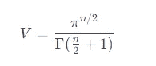

# 高维数据的惊人行为

> 原文：[`towardsdatascience.com/the-surprising-behavior-of-data-in-higher-dimensions-1c49bca9bbee?source=collection_archive---------1-----------------------#2023-12-15`](https://towardsdatascience.com/the-surprising-behavior-of-data-in-higher-dimensions-1c49bca9bbee?source=collection_archive---------1-----------------------#2023-12-15)

## 探索高维数据的惊人世界：机遇与挑战

[](https://medium.com/@salih.salih?source=post_page-----1c49bca9bbee--------------------------------)[](https://towardsdatascience.com/?source=post_page-----1c49bca9bbee--------------------------------) [Salih Salih](https://medium.com/@salih.salih?source=post_page-----1c49bca9bbee--------------------------------)

·

[关注](https://medium.com/m/signin?actionUrl=https%3A%2F%2Fmedium.com%2F_%2Fsubscribe%2Fuser%2F2037cbb08e24&operation=register&redirect=https%3A%2F%2Ftowardsdatascience.com%2Fthe-surprising-behavior-of-data-in-higher-dimensions-1c49bca9bbee&user=Salih+Salih&userId=2037cbb08e24&source=post_page-2037cbb08e24----1c49bca9bbee---------------------post_header-----------) 发表在 [Towards Data Science](https://towardsdatascience.com/?source=post_page-----1c49bca9bbee--------------------------------) ·9 分钟阅读·2023 年 12 月 15 日[](https://medium.com/m/signin?actionUrl=https%3A%2F%2Fmedium.com%2F_%2Fvote%2Ftowards-data-science%2F1c49bca9bbee&operation=register&redirect=https%3A%2F%2Ftowardsdatascience.com%2Fthe-surprising-behavior-of-data-in-higher-dimensions-1c49bca9bbee&user=Salih+Salih&userId=2037cbb08e24&source=-----1c49bca9bbee---------------------clap_footer-----------)

--

[](https://medium.com/m/signin?actionUrl=https%3A%2F%2Fmedium.com%2F_%2Fbookmark%2Fp%2F1c49bca9bbee&operation=register&redirect=https%3A%2F%2Ftowardsdatascience.com%2Fthe-surprising-behavior-of-data-in-higher-dimensions-1c49bca9bbee&source=-----1c49bca9bbee---------------------bookmark_footer-----------)

摄影：Guillermo Ferla，来源于 Unsplash

著名物理学家**理查德·费曼**曾说过：“我可以肯定地说，没有人理解量子力学。”在他的采访 “[与理查德·费曼一起想象的乐趣](https://youtu.be/P1ww1IXRfTA)” 中，他谈到了原子和亚原子粒子级别的奇怪行为，并指出这些行为经常违背我们的常识。有趣的是，我们在高维数据级别也可以注意到类似的行为。它并不像量子力学那样，但在从低维到高维的过渡中，我们会发现类似的惊奇和美丽——混合着一些/很多挑战。

在本文及未来的文章中，我希望提供一些关于这个迷人主题的见解。我的目标是激发兴趣，并鼓励那些对高维数据世界不熟悉的人进行学习。

> 高维数据，或在数据分析和机器学习中提到的高维数据，通常指的是具有大量变量、特征或属性的数据集。每一个变量、特征或属性都代表了我们数据中的一个不同的“维度”。

首先，让我们检查一些基本的例子，这些例子突出了从低维空间到高维空间时出现的区别。

## **高维空间中的体积集中**

首先，让我们探索高维空间中的体积集中概念。考虑在一个边长范围从 0 到 1 的超立方体内生成随机点。当维度增加时，这些点落在这个超立方体中间区域的可能性有多大？


图片由作者提供

在上面的图像中，假设 x 是一个小值，比如 0.1。我们旨在确定点随机落在这个中间区域（而不是边缘）时，随着维度的增加，概率是如何变化的。

1.  一维空间（直线）

想象一个从 0 到 1 的线段。中间部分在 0.1 和 0.9 之间，随机点落在这里的机会就是这个中间段的长度除以总长度，即 0.8。

2\. 二维空间（方形）

现在，设想一个边长范围从 0 到 1 的正方形。中间区域是一个边长从 0.1 到 0.9 的小正方形。概率计算涉及比较这个小正方形的面积与总面积，从而得到 0.64 的概率。

3\. 三维空间（立方体）

对于一个每条边长为 1 的立方体，中间区域是一个边长从 0.1 到 0.9 的较小立方体。这里，概率是这个小立方体的体积除以总的体积，结果为 0.512。

4\. 高维（超立方体）

在一个 n 维的超立方体中，随着维度的增加，中间区域的‘体积’会急剧缩小。例如，在 4 维中，概率是 0.4096；在 5 维中，它变为 0.32768；而在 10 维中，它降至大约 0.10737。

这个想法的概括从考虑边长为小距离 x 开始，如上图所示。对于一条线，点落在中间区域的概率是 1–2x。对于一个正方形，它是(1–2x)*(1–2x)，因为一个点必须落在两个维度的中间。

这种模式在 n 维中继续，其中落在中间区域的概率为(1–2x)^n，在高维中变得非常小。

注意这里我们通过将每边长度简化为 1 来进行简化。

## 在超立方体内刻画一个超球体

为了进一步说明体积集中概念，我用 python 进行了一次简单的模拟，在模拟中我们在超立方体内刻画一个超球体，然后比较超球体与超立方体的体积比，随着维度的增加。

什么是超立方体？

想象一个正方形。现在，把它膨胀成一个立方体。这是从 2D 到 3D 的跳跃。现在，发挥想象力跳到第四维及更高维度——这就是超立方体的出现。超立方体本质上是扩展到更高维度的立方体。它是一个各边相等的形状，在我们的模拟中，我们考虑边长为 2 的超立方体。它的体积公式是什么？就是 2^*n（2 的 n 次方）*对于 n 维超立方体。

那么超球体呢？

超球体是球体的高维等效体，当你将 2D 圆扩展到 3D（形成一个球体），然后继续扩展到更高维度时，就会出现超球体。重点？它的体积计算并不那么简单。它涉及到π（是的，就是那个著名的 3.14159…）和 Gamma 函数，这类似于阶乘的“增强版”。简而言之，半径为 1 的超球体在`n`维空间中的体积是：



Gamma 函数Γ(*n*)将阶乘函数扩展到实数和复数。对于正整数*n*，Γ(n)=(n−1)!，对于非整数值，它是数值计算的。

要使用 python 计算这个比例，我们可以使用以下代码：

```py
import math
import matplotlib.pyplot as plt

def hypersphere_volume(dim):
    """ Calculate the volume of a hypersphere with radius 1 in 'dim' dimensions. """
    return math.pi ** (dim / 2) / math.gamma(dim / 2 + 1)

def hypercube_volume(dim):
    """ Calculate the volume of a hypercube with side length 2 in 'dim' dimensions. """
    return 2 ** dim

# Number of dimensions to consider
max_dim = 20

# Lists to hold volumes and dimension values
dimensions = range(1, max_dim + 1)
sphere_volumes = [hypersphere_volume(dim) for dim in dimensions]
cube_volumes = [hypercube_volume(dim) for dim in dimensions]
ratios = [sphere_volumes[i] / cube_volumes[i] for i in range(max_dim)]

# Plotting the results
plt.figure(figsize=(10, 6))
plt.plot(dimensions, ratios, marker='o')
plt.xlabel('Number of Dimensions')
plt.ylabel('Ratio of Volumes (Hypersphere/Hypercube)')
plt.title('Volume Concentration in Higher Dimensions')
plt.grid(True)
plt.show()
```

上述代码的输出是以下图表：


作者提供的图片

我们可以清楚地看到，随着维度的增加，比例迅速下降，剩余的体积集中在超立方体的角落。

这些例子表明，在更高维度中，中间区域的体积成为总体积的一个越来越小的部分，突显了高维空间的反直觉特性。

> 问：这种体积集中现象对机器学习算法的性能有哪些影响？

**论文和 DVD 实验**

考虑这样一个实验：你试图通过一个有正方形孔的纸张塞入 DVD。起初，看似不可能，因为正方形的对角线比 DVD 的直径小。然而，折叠纸张可以让 DVD 通过。

纸张的折叠，一个小但有效的空间维度调整，是谜题的关键。在这个实验中可以找到一个有趣的类比，用于理解高维景观的复杂性。

当纸张首次展开时，它形成了一个二维平面。由于设定的尺寸，方孔似乎过于狭窄，无法让 DVD 通过。

这种假设情境与我们在三维环境中的日常体验一致，其中长度、宽度和高度是尺寸和距离的测量单位。但当我们开始折叠纸张时，我们增加了另一个维度。这个折叠动作完全改变了孔和 DVD 的空间连接。

在这个新的三维环境中，距离的概念在二维中是如此不灵活和明确，但在三维中变得更加灵活和不直观。纸张被折叠，这有效地改变了纸张边缘生成的角度和环绕孔的点之间的距离。

这种新三维形式中的孔可以容纳 DVD，展示了引入第三维度如何使在二维空间中看似绝望的任务变得可行。

Weiwei Lin 等人进行的一项引人入胜的研究中全面解释了这一实验所涉及的数学原理。

[## 通过应用机制和机器的玩具启发的切纸图案及其运动性能](https://ms.copernicus.org/articles/12/933/2021/?source=post_page-----1c49bca9bbee--------------------------------)

### 摘要。通过在纸上设置简单的折痕并沿这些折痕折叠，折纸可以形成各种形状…

[ms.copernicus.org](https://ms.copernicus.org/articles/12/933/2021/?source=post_page-----1c49bca9bbee--------------------------------)

你还可以观看由“The Action Lab”制作的这段美丽视频，它直观地展示了这个想法：

一个圆盘通过一个较小的方孔

这种视角的转变具有重要意义，尤其是在数学、物理学和机器学习领域。这个想法在像支持向量机（SVM）这样的机器学习方法中得到了体现。

**支持向量机（SVM）及其核技巧**

支持向量机（SVM）中的核技巧展示了类似的想法。在 SVM 中，我们经常遇到不可线性分离的数据。核技巧通过将数据转换到更高维空间来克服这个问题，类似于折叠纸张改变了其空间属性。（实际上，SVM 并不会将数据实际转换到更高维度，因为这在计算上代价昂贵。相反，它们使用核技巧计算数据点之间的关系，就好像它们处于更高维度一样。）

简而言之，SVM 通常在较低维度中找到一个分隔线（或超平面）。但对于非线性数据，这是不可能的。核技巧就像折叠纸张一样，添加了维度，使找到一个适合的超平面变得更加容易。

核心技巧不仅仅是改变维度，它还简化了复杂问题。这确实是一个很好的例子，说明高维思维如何为在低维度中看似不可能的问题提供解决方案。

```py
import numpy as np
import matplotlib.pyplot as plt
from sklearn.svm import SVC

# Here I manullay entered a data that is not linearly seperable in 1D
x = np.array([1,2,3,4,5,6,7,8,9,11,12,13,14,15,16,17,18,19,20,21,23,24,25,26,27,28,29,30]).reshape(-1, 1)  # Replace YOUR_X_VALUES with your data
y = np.array([1,1,1,1,1,1,1,1,1,0,0,0,0,0,0,0,0,0,0,0,1,1,1,1,1,1,1,1])                 # Replace YOUR_Y_VALUES with your class labels

# Non-linear transformation to 2D, (squaring)
def transform_to_2d(X):
    return np.c_[X, X**2]

# Transforming data to 2D
X_transformed = transform_to_2d(x)

# Fitting SVM with a linear kernel in the transformed 2D space
svm = SVC(kernel='linear')
svm.fit(X_transformed, y)

fig, axes = plt.subplots(1, 2, figsize=(12, 5))

# 1D data plot
axes[0].scatter(x, np.zeros_like(x), c=y, cmap='bwr', edgecolors='k')
axes[0].set_title('Original 1D Data')
axes[0].set_xlabel('Feature')
axes[0].set_yticks([])

# 2D transformed data plot
axes[1].scatter(X_transformed[:, 0], X_transformed[:, 1], c=y, cmap='bwr', edgecolors='k')
axes[1].set_title('Transformed 2D Data')
axes[1].set_xlabel('Original Feature')
axes[1].set_ylabel('Transformed Feature (X²)')

# Plotting the decision boundary in 2D
ax = axes[1]
xlim = ax.get_xlim()
ylim = ax.get_ylim()

xx = np.linspace(xlim[0], xlim[1], 30)
yy = np.linspace(ylim[0], ylim[1], 30)
YY, XX = np.meshgrid(yy, xx)
xy = np.vstack([XX.ravel(), YY.ravel()]).T

# Getting the separating hyperplane
Z = svm.decision_function(xy).reshape(XX.shape)

# Plotting decision boundary and margins
ax.contour(XX, YY, Z, colors='k', levels=[-1, 0, 1], alpha=0.5,
           linestyles=['--', '-', '--'])

plt.tight_layout()
plt.show()
```

上述代码的结果是以下图表：


作者提供的图片

很明显，最初在左侧数据是非线性可分的，但在 2D 中变得可分。正如右侧图表所示，这种转换有效地解决了我们的问题。这不是很神奇吗？

**总结**

在这篇文章中，我们探讨了有关高维数据世界的一些想法。我们展示了进入高维度如何极大地改变我们的视角和处理问题的方法，从体积集中开始，接着是纸张和 DVD 实验的实际例子，最后是 SVM 中的核心技巧。

在接下来的文章中，我们将讨论“维度诅咒”，即在高维空间中导航所面临的困难和复杂性。我们将探讨这如何影响机器学习和数据分析，以及缓解其影响的策略。

感谢你阅读到这里！非常感谢你抽出时间阅读这篇文章，希望你觉得这个话题很有趣。如果有任何建议或可能的修改，请随时分享！
