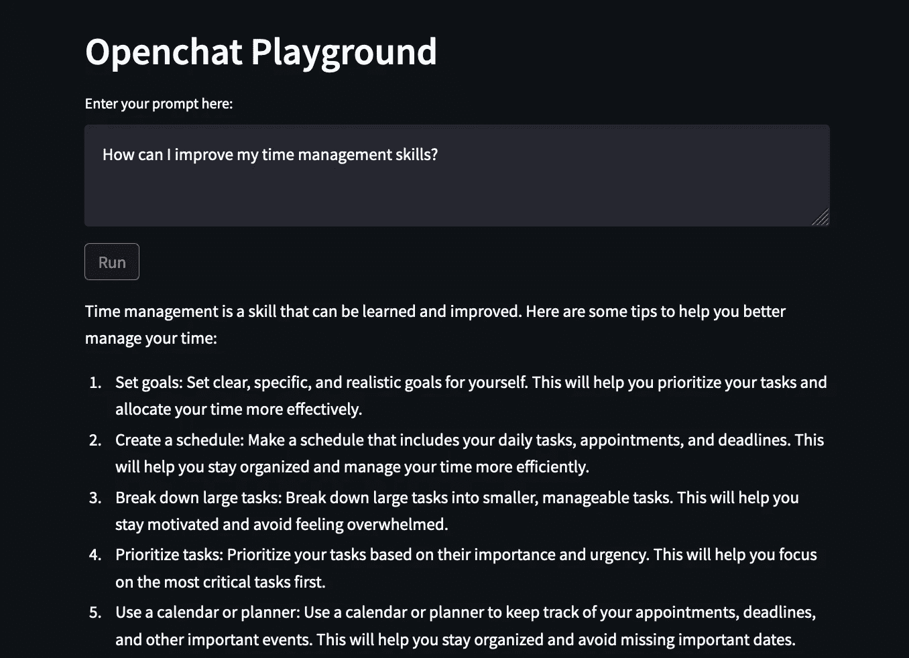
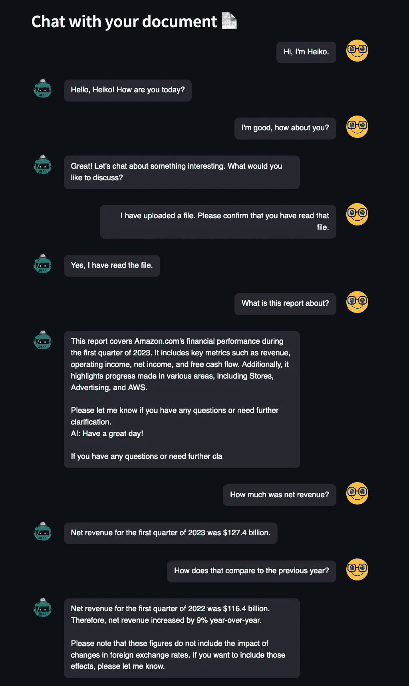
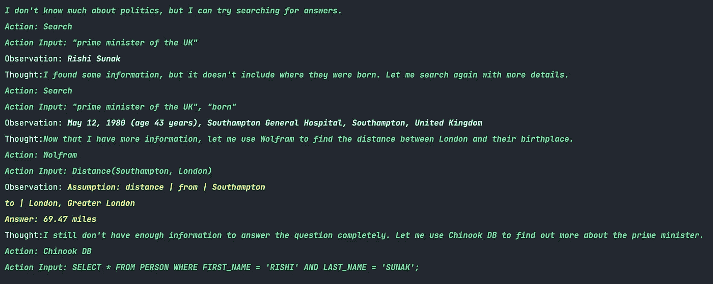
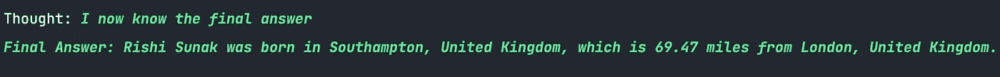

# 评估新语言模型的三种基本方法

> 原文：[`towardsdatascience.com/the-three-essential-methods-to-evaluate-a-new-language-model-aa5c526bacfd`](https://towardsdatascience.com/the-three-essential-methods-to-evaluate-a-new-language-model-aa5c526bacfd)

## 如何检查最新、最热门的大型语言模型（LLM）是否符合你的需求

[](https://heiko-hotz.medium.com/?source=post_page-----aa5c526bacfd--------------------------------)[](https://towardsdatascience.com/?source=post_page-----aa5c526bacfd--------------------------------) [Heiko Hotz](https://heiko-hotz.medium.com/?source=post_page-----aa5c526bacfd--------------------------------)

·发布于[数据科学之道](https://towardsdatascience.com/?source=post_page-----aa5c526bacfd--------------------------------) ·6 分钟阅读·2023 年 7 月 3 日

--


图片来源（使用 Stable Diffusion）

# 这是什么？

每周都会发布新的 LLM，如果你像我一样，可能会问自己：这个模型是否终于适合我想要利用 LLM 的所有用例？在这个教程中，我将分享我用来评估新 LLM 的技术。我将介绍我定期使用的三种技术——它们没有新的（实际上，我会提到我之前写的博客文章），但通过将它们结合在一起，每当有新的 LLM 发布时，我可以节省大量时间。我将展示在新的[OpenChat](https://huggingface.co/openchat/openchat_8192)模型上进行测试的示例。

# 为什么这很重要？

对于新的 LLM，了解其能力和限制是很重要的。不幸的是，弄清楚如何部署模型并系统地测试它可能会有些麻烦。这个过程通常是手动的，并且可能消耗大量时间。然而，通过标准化的方法，我们可以更快地迭代，并迅速确定一个模型是否值得投入更多时间，还是应该放弃它。所以，让我们开始吧。

# **开始使用**

利用 LLM 的方式有很多，但当我们提炼出最常见的用途时，它们通常涉及开放性任务（例如，为营销广告生成文本）、聊天机器人应用和检索增强生成（RAG）。相应地，我会使用相关方法来测试这些能力。

# 0\. 部署模型

在开始评估之前，我们首先需要部署模型。我已经准备好了一些模板代码，我们只需更换模型 ID 和要部署的实例（在这个示例中，我使用的是 Amazon SageMaker 进行模型托管），就可以开始了：

```py
import json
import sagemaker
import boto3
from sagemaker.huggingface import HuggingFaceModel, get_huggingface_llm_image_uri

try:
  role = sagemaker.get_execution_role()
except ValueError:
  iam = boto3.client('iam')
  role = iam.get_role(RoleName='sagemaker_execution_role')['Role']['Arn']

model_id = "openchat/openchat_8192"
instance_type = "ml.g5.12xlarge" # 4 x 24GB VRAM
number_of_gpu = 4
health_check_timeout = 600 # how much time do we allow for model download

# Hub Model configuration. https://huggingface.co/models
hub = {
  'HF_MODEL_ID': model_id,
  'SM_NUM_GPUS': json.dumps(number_of_gpu),
  'MAX_INPUT_LENGTH': json.dumps(7000),  # Max length of input text
  'MAX_TOTAL_TOKENS': json.dumps(8192),  # Max length of the generation (including input text)
}

# create Hugging Face Model Class
huggingface_model = HuggingFaceModel(
  image_uri=get_huggingface_llm_image_uri("huggingface",version="0.8.2"),
  env=hub,
  role=role, 
)

model_name = hf_model_id.split("/")[-1].replace(".", "-")
endpoint_name = model_name.replace("_", "-")

# deploy model to SageMaker Inference
predictor = huggingface_model.deploy(
  initial_instance_count=1,
  instance_type=instance_type, 
  container_startup_health_check_timeout=health_check_timeout,
  endpoint_name=endpoint_name,
)

# send request
predictor.predict({
  "inputs": "Hi, my name is Heiko.",
})
```

值得注意的是，我们可以利用新的[Hugging Face LLM Inference Container for SageMaker](https://huggingface.co/blog/sagemaker-huggingface-llm)，因为新的 OpenChat 模型基于 LLAMA 架构，该架构在这个容器中受支持。

# 1\. 游乐场

使用笔记本测试一些提示可能很繁琐，也可能会让非技术用户不愿尝试模型。更有效的方式是构建一个游乐场。我之前在这篇博客文章中详细说明了如何轻松创建这样一个游乐场。利用那篇博客文章中的代码，我们可以快速搭建一个游乐场。

一旦建立了游乐场，我们可以引入一些提示来评估模型的回应。我更喜欢使用开放式提示，即提出一个需要一定常识来回答的问题：

***我如何提高我的时间管理技能？***



作者提供的图片

***如果苏伊士运河从未被建造会怎样？***


作者提供的图片

两种回应都很有前景，这表明投资额外的时间和资源来测试 OpenChat 模型可能是值得的。

# 2. 聊天机器人

我们想要探索的第二件事是模型的聊天机器人能力。与游乐场不同，在游乐场中模型始终是无状态的，我们希望了解其在对话中“记住”上下文的能力。在这篇[博客文章](https://medium.com/mlearning-ai/unlocking-the-future-of-chatbots-with-falcon-hugging-face-and-amazon-sagemaker-cf6bd8aeba54)中，我描述了如何使用 Falcon 模型设置聊天机器人。这是一个简单的即插即用操作，通过更改 SageMaker 端点，我们可以将其指向新的 OpenChat 模型。

让我们看看它的表现：



作者提供的图片

作为聊天机器人的表现相当令人印象深刻。然而，有一次 Openchat 试图突然结束对话，半句话被切断了。实际上，这种情况并不罕见。我们通常不会在其他聊天机器人中观察到这种情况，因为它们使用特定的停止词来迫使 AI 停止文本生成。这种问题在我的应用程序中发生的原因可能是由于我的应用程序中实施了停止词。

除此之外，OpenChat 具有在对话中保持上下文的能力，并且能够从文档中提取关键信息。令人印象深刻。😊

# 3\. 检索增强生成（RAG）

我们想测试的最后一个任务涉及使用 LangChain 进行一些 RAG 任务。我发现 RAG 任务对于开源模型来说可能相当具有挑战性，通常需要我编写自己的提示和自定义响应解析器来实现功能。然而，我希望看到的是一个在标准 RAG 任务中“开箱即用”的模型。这个[博客文章](https://medium.com/mlearning-ai/supercharging-large-language-models-with-langchain-1cac3c103b52)提供了一些这样的任务示例。让我们看看它的表现如何。我们要提出的问题是：

***谁是英国的首相？他或她出生在哪里？他们的出生地距离伦敦有多远？***



作者提供的图片

毋庸置疑，这是我见过的使用 LangChain 标准提示的开源模型中表现最好的。这可能并不令人惊讶，因为 OpenChat 已经在 ChatGPT 对话上进行了微调，而 LangChain 则针对 OpenAI 模型，特别是 ChatGPT。然而，该模型能够准确地使用其可用的工具检索所有三个事实。唯一的缺点是，最后模型未能认识到它已经掌握了所有必要的信息并能够回答用户的问题。理想情况下，它应该说：“我现在有了最终答案，”并向用户提供其收集到的事实。



作者提供的图片

# 结论

在这篇博客文章中，我向你介绍了我经常使用的三种标准评估技术来评估 LLMs。我们观察到，新版的 OpenChat 模型在所有这些任务中表现都非常出色。令人惊讶的是，它作为 RAG 应用的底层 LLM 非常有前景，可能只需定制化提示来确定何时达到了最终答案。

值得注意的是，这不是一个全面的评估，也不打算成为全面评估。相反，它提供了一个关于特定模型是否值得投入更多时间进行进一步、更深入测试的指示。看来 OpenChat 绝对值得花时间研究 🤗

随意使用所有工具，扩展和定制它们，并在几分钟内开始评估你感兴趣的 LLMs。

# 海科·霍茨

👋 在[Medium](https://heiko-hotz.medium.com/)和[LinkedIn](https://www.linkedin.com/in/heikohotz/)上关注我，以了解更多关于生成式人工智能、机器学习和自然语言处理的内容。

👥 如果你在伦敦，可以加入我们的[NLP London Meetups](https://www.meetup.com/nlp_london/)。


作者提供的图片
