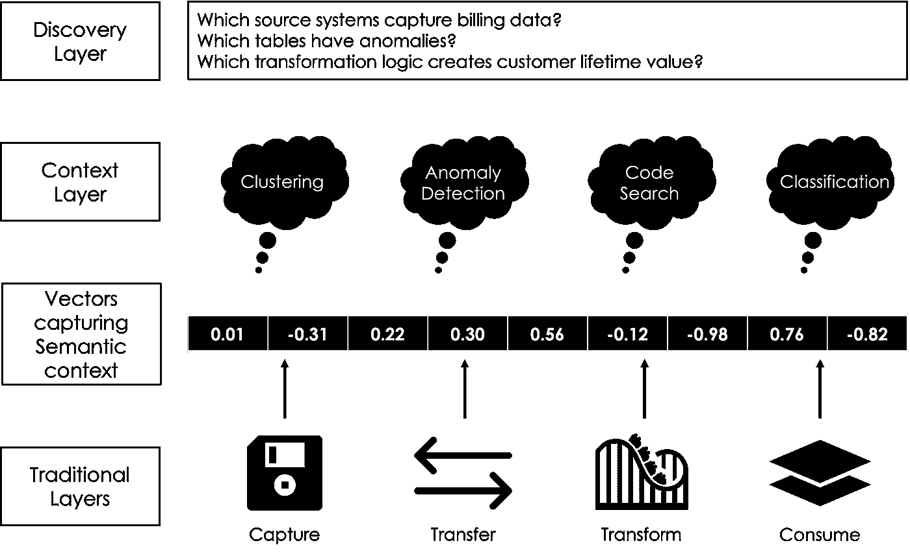

# 三大数据架构趋势（以及 LLMs 将如何影响它们）

> 原文：[`towardsdatascience.com/the-top-3-data-architecture-trends-and-how-llms-will-influence-them-ac60ae4e2fc8`](https://towardsdatascience.com/the-top-3-data-architecture-trends-and-how-llms-will-influence-them-ac60ae4e2fc8)

## 拥抱数据架构的下一个时代：揭示三大趋势及 LLM 的影响力

 [Hanzala Qureshi](https://hanzalaqureshi.medium.com/?source=post_page-----ac60ae4e2fc8--------------------------------)

·发布于[Towards Data Science](https://towardsdatascience.com/?source=post_page-----ac60ae4e2fc8--------------------------------) ·5 分钟阅读·2023 年 6 月 28 日

--

图片来源：[Google DeepMind](https://unsplash.com/fr/@deepmind?utm_source=medium&utm_medium=referral) 在[Unsplash](https://unsplash.com/?utm_source=medium&utm_medium=referral)

我去年发布了一篇关于数据架构趋势的[文章](https://medium.com/towards-data-science/top-5-data-architecture-trends-and-what-they-mean-for-you-ef7c07bfa755)。

这是在大型语言模型（LLMs）成为热门并影响大多数行业之前。Gartner 报告称，“[*风险投资公司在过去三年中已向生成式 AI 解决方案投资超过 17 亿美元。*](https://www.gartner.com/en/articles/beyond-chatgpt-the-future-of-generative-ai-for-enterprises)” 毫无疑问，LLMs 将影响数据架构的大多数领域。

记住这一点，让我们探讨三种架构趋势以及 LLMs 将如何影响它们。

## 1\. 使用副驾驶进行成本优化

我非常喜欢能够帮助最终用户高效完成任务的副驾驶。

作为[Grammarly](https://twitter.com/Grammarly?s=20)的常规用户，我非常欣赏它在加快任何书面内容编辑过程中的帮助。同样，副驾驶将成为我们大多数工作的主要角色，包括数据架构。

数据架构师的日常工作包括数据模型设计、制定标准和实施治理结构。像[微软](https://blogs.microsoft.com/blog/2023/03/16/introducing-microsoft-365-copilot-your-copilot-for-work/)这样的协助工具可以帮助完成邮件中的句子，并根据规范文档创建公告。类似地，数据架构师的协助工具可以仅基于用户需求，通过理解你的设计限制来完成[实体关系图](https://soft-builder.com/ai-powered-er-diagrams-generation/)（ERD）。协助工具可以与架构师一起工作，帮助加速他们的日常工作流程。

如果生产力开始飞速增长，企业开始寻找优化成本的方式也就不足为奇了。一些估计表明，成千上万，甚至[数百万的工作将受到影响。](https://www.euronews.com/next/2023/03/23/openai-says-80-of-workers-could-see-their-jobs-impacted-by-ai-these-are-the-jobs-most-affe)

*例如，管理顾问一直在通过寻找效率来帮助组织进行重组和减少开销。同样，协助工具的实施将会减少对人力资源的依赖，因为更多的任务会依赖于人工智能的完成。任务包括撰写设计文档、按照批准的模式创建数据架构图、创建数据模型及相关的 SQL 查询、审计 SQL 以符合批准的标准等。*

协助工具将带来效率和成本节约！

## 2\. 背景驱动的分析

我们可能已经解决了云存储问题，但我们仍需要解决背景问题。

数据本身只是一系列文本/数字；当你为其添加背景时，价值才会显现。而“数据背景”是一个[数十亿美元的行业。](https://www.globenewswire.com/en/news-release/2022/08/16/2499432/0/en/With-9-1-CAGR-Enterprise-Data-Management-Market-Size-Worth-USD-130-6-Billion-by-2028-Global-Industry-Trends-Share-Value-Analysis-Forecast-Report-by-Facts-Factors.html)

数据背景包括业务或技术元数据、治理或隐私需求，以及可访问性或安全性要求。尽管预计到 2028 年这一行业将翻一番，但我想知道这一增长有多少会被大型语言模型（LLMs）所占据。例如，使用[语义嵌入和向量数据库，](https://platform.openai.com/docs/guides/embeddings/what-are-embeddings)组织将能够快速对数据进行背景化，而无需实施大量的数据背景工具。如果我能通过嵌入检测异常，是否还需要一个全面的治理框架？这进一步强调了由于 LLMs 而进行成本优化的第 1 点。

将 AI（故意的双关语！）嵌入数据管道、转换和血统中，可以帮助建立上下文。这个上下文可以用于回答最终用户的分析或监管需求问题。例如，这些数据是否包含个人信息？如果包含，则从特定的分析用例中过滤掉。

图片由作者提供

*这张图片说明了上下文层如何捕获信息，就像传统的数据目录一样，只不过它利用了 LLMs 的强大功能，大幅减少了人工干预。*

上下文使数据有价值；使用 LLMs 可以更快地实现这一点。

## 3\. 启动数据架构生态系统

我们厌倦了孤立且分散的架构。

在这种架构中，治理工具未能与数据湖集成，源系统的设计未考虑分析需求，或者存在多个信息源。

生态系统需要反映像苹果这样的消费公司所提供的产品。一个关键产品与各种支持的可组合产品，这些产品单独有用，但共同创建了一个令人惊叹的生态系统。例如，一个数据产品市场（iPhone）展示了来自数据可观察性框架（Watch）的信息，并由单一访问方法（Face ID）进行治理。数据架构将位于一个集成不再是弱点的生态系统中。这将是一个颠覆性的改变。

生态系统还将减少不同来源之间的信息冗余风险（就像你的 iMessages 在所有设备间同步）。已有一些[初创公司](https://techcrunch.com/2020/09/17/narrator-raises-6-2m-for-a-new-approach-to-data-modelling-that-replaces-star-schema/)正利用 OBT（One Big Table）等概念来进行革命性的改进。生态系统还意味着数据定义；标准被设定一次并传播到每个区域，降低了复制成本。

*例如，一个客户交易表格捕获了来自 CRM 系统的信息；默认情况下，CRM 系统设计用于捕获分析所需的强制字段[1]。一旦数据传输，它会经过一系列的数据质量检查，以确保其适用性[2]。数据转换后，回溯信息会被捕获，以确保数据没有丢失[3]。在使用之前，它会被分类到个人数据桶中，并设置适当的治理措施[4]。所有这些过程本身都很重要；然而，当数据最终被产品化时，它们会显得更为强大，你可以在数据集中可视化[1] — [4]，进而信任这些数据。*

## 结论

好像现代数据堆栈已经有了自己的炒作，现在我们还得应对 GenAI 的炒作。看看这些趋势在接下来的 12 到 18 个月如何发展将会很有趣。我预计已经在基础设施上进行投资的公司将会利用这些趋势，而那些没有投资数据质量或治理的公司将会持续滞后。

所有这些趋势的根本要求是**良好的数据**。没有良好的数据，你无法进行副驾驶、添加背景或拥有有效的数据架构。这是最难以实现的事情之一，但因此也带来了最大的投资回报。

你想发现自己在组织中的数据和人工智能能力如何，以及哪些方面可以改进吗？通过参加这个免费的数据精通指数（DMI）评估来了解。 [点击这里访问评分卡评估，提升你的数据策略。](https://datamasteryindex.scoreapp.com/)

或者，扫描二维码以访问评估
