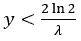

# 两个信封问题

> 原文：[`towardsdatascience.com/the-two-envelopes-problem-896f16e938b7?source=collection_archive---------3-----------------------#2023-09-08`](https://towardsdatascience.com/the-two-envelopes-problem-896f16e938b7?source=collection_archive---------3-----------------------#2023-09-08)

## 悖论系列 #1

## 时间和因果关系如何从随机性中出现

 [Gabriel de Longeaux](https://gdelongeaux.medium.com/?source=post_page-----896f16e938b7--------------------------------)

·

[关注](https://medium.com/m/signin?actionUrl=https%3A%2F%2Fmedium.com%2F_%2Fsubscribe%2Fuser%2F99542e924b20&operation=register&redirect=https%3A%2F%2Ftowardsdatascience.com%2Fthe-two-envelopes-problem-896f16e938b7&user=Gabriel+de+Longeaux&userId=99542e924b20&source=post_page-99542e924b20----896f16e938b7---------------------post_header-----------) 发表在 [Towards Data Science](https://towardsdatascience.com/?source=post_page-----896f16e938b7--------------------------------) · 13 分钟阅读 · 2023 年 9 月 8 日 

--

*两个信封问题，通过直观但错误的贝叶斯概率估计来做出悖论和不一致的决策，当试图确定最佳行动方案时出现。修正数学错误是简单的，但不仅仅如此：首先，通过略微修改问题，我们可以使其无法决定——这是语言模糊性而非数学形式主义的一个例子；其次，在比较几种可能的解决方案时，我们可以观察到时间在数学世界中的出现，这在理论上允许我们测试因果假设。*

# 两个信封问题（TEP）

想象一下，我在桌子上给你展示两个看似相同的信封，告诉你（没有撒谎）这两个信封中都有钱，其中一个是另一个的两倍，并提议你选择一个信封，保留其中的钱。

由 Midjourney 生成的图像

一旦你选择了一个信封，在你打开之前，我会问你是否想修改你的选择，换成另一个信封。

你会怎么做？

你可能会告诉我，换信封是没有意义的，因为无论选择哪个信封，情况都是一样的。然而，你应该注意到你选择了一个未知金额 x，另一个信封中的金额 y 可以是 2x 或 x/2，概率相等，这意味着期望金额 y 是 2x (1/2) + x/2 (1/2) = 5x/4，这大于 x。所以，也许你还是应该换信封？

显然，你也可以根据 y 来计算期望的数量 x，因为 x 有一半的概率是 2y 或 y/2，你会发现期望的数量 x 是 5y/4，这大于 y。

那么这个计算有什么问题？哪个信封更有可能包含比另一个信封更多的金额呢？

# 推理中的数学缺陷

我们可以任意地将一个信封标记为“X”，另一个标记为“Y”。现在让我们正确计算在我们知道金额 y 在 Y 信封中的情况下，X 信封中的金额的条件期望。

在已观察到的 y 值下 X 的金额的期望，记作 E[X|Y = y]，显然取决于观察到的特定金额 y：即使对于所有可能的 y 值，X 中的金额 x 可以是 y/2 或 2y，每次的概率是 1/2，但这并不意味着对于特定的 y 值也是这样。例如，如果 y 是“非常小”（在稍后会澄清的意义上），x 更有可能大于 y，而如果 y 是“非常大”，x 更有可能小于 y：对于所有可能的 y 值，概率可以被平衡，使得 X 有一半的时间是 Y 的一半，另一半时间是 Y 的两倍，但这并不意味着 P(X = y/2|Y = y) = 1/2 且 P(X = 2y|Y = y) = 1/2，只是 P(X = Y/2) = P(X = 2Y) = 1/2。

因此，我们将尝试正确计算 E[X|Y = y]，但首先我们需要澄清将这两个信封放在桌子上，并标记为“X”和“Y”的过程。我们假设我们用一个随机金额 U 填充了第一个信封，用金额 2U 填充了第二个信封。然后我们将它们混合，并随机地将其中一个信封命名为 X，而将另一个命名为 Y。我们可以将这个命名过程表示如下：我们抽取一个二进制数 Z（有一半的概率是 0 或 1）。如果 Z = 0，X 就是包含 U 的信封；否则（如果 Z = 1），X 就是包含 2U 的信封。

现在我们可以看到，对于那个被要求选择但不知道 U 和 Z 随机数的外部观察者，信封中的金额如下：

我们可以验证 P(X = 2Y) = P(U + ZU = 4U - 2ZU) = P(3U - 3ZU = 0) = P(U=ZU) = P(Z = 1) = 1/2（对于 P(X = Y/2) 也是如此）。

现在我们可以正确计算 E[X|Y = y] = E[3U-Y|Y = y] = E[3U|Y = y] - E[Y|Y = y] = 3E[U|Y = y] — y。

我们仍然需要计算 E[U|Y = y]，为此我们需要知道 P(U=u|Y=y)，它（根据贝叶斯定理）与 P(Y=y|U=u)P(U=u) 成比例。

为了计算 P(Y = y|U)，我们回顾一下 Y 要么是 U，要么是 2U，这意味着 U 取值为 u 时，u 的值要么是 y，要么是 y/2：

+   当 y 不是 u 或 u/2 时，Y = y 的概率为 0：P(Y = y|U = u) = 0

+   当 y 是 u 时，Y = y 的概率是 1/2（Z = 1）：P(Y = y|U = u) = 1/2

+   当 y 是 u/2 时，Y = y 的概率是 1/2（Z = 0）：P(Y = y|U = u) = 1/2

使用数学形式化：

其中：

所有这些可以总结为：

然后我们需要知道 P(U = u)。我们只能做一个假设，例如 U 在正实数上服从指数分布（参数 λ>0）：

最终，P(U = u|Y = y) 与以下内容成比例：

换句话说：

现在我们拥有所有计算 E[X|Y = y] = 3E[U|Y = y] — y 所需的内容，其值为：

总结一下，我们现在知道：

这与最初的 5y/4 有很大不同！

x 的期望值（严格）大于 y 若且唯若：

或者换句话说，若且唯若：

（这是指数分布中位数的两倍，从中抽取的金额）。

因此，我们可以更好地理解我们之前推理中的错误。尽管设计上 X 在所有可能值 y 的平均值中有一半的时间是 y 的两倍，一半的时间是 y 的一半，但对于特定的 y 值，概率并不是一半一半：如果 y 相对于 U 值的选择方式“很大”，则信封 X 包含较小金额的概率更高；如果 y 相对“很小”，则信封 X 包含较大金额的机会则更多。在这里，“大”和“小”之间的界限只是指数分布中位数的两倍。

X 或 Y 的选择是对称的，因为 E[Y|X = x] = E[3U — X|X = x] = 3E[U|X=x] - x，从这里所有之前的计算仍然适用，*变动之下*。

似乎悖论已解决，但我认为实际上两个信封问题可能是不可决定的，这意味着我们不能真正知道问题是否对称，或者是否应该偏好一个信封而不是另一个。

# 一个不可决定的问题

现在假设桌上有两个看似相同的信封，除了它们已经被标记为“X”和“Y”之外。现在告诉我们，信封 X 包含 Y 中金额的一半或两倍，每种可能性的概率各为一半。对称性同样适用于信封 Y。现在要求你选择一个信封：你应该选择哪个？

基于之前的例子，似乎显而易见，我们可以随意选择其中一个。然而，这个想法是错误的！这完全取决于我们的假设，换句话说，这完全取决于问题的（统计）表示。

在这里，关键是当我们被要求选择一个信封时，这些信封已经被标记。选择信封中的金额和标记它们的过程是什么？如果它们像之前研究的例子那样被随机标记，我会同意选择其中一个或另一个在统计上是等效的。

但让我们假设 X 的金额是从正实数上的指数分布中选择的（参数 λ>0），类似于在之前的例子中对 U 所做的处理。那么信封 Y 的金额仅仅是随机选择为 Y 中金额的一半或两倍（均匀概率）：Y = HX，其中 H 取值 1/2 或 2，每次各有一半的概率（H 与 X 独立）。

现在我们来计算 Y 的值的累积分布：P(Y < y) = P(HX < y) = P(HX < y |H = 1/2) P(H = 1/2) + P(HX < y |H = 2) P(H = 2)

= P(X/2 < y) (1/2) + P(2X < y) (1/2) = (1/2) P(X < 2y) + (1/2) P(X < y/2)

= (1/2) F(2y) + (1/2) F(y/2)，其中 F 是 X 的累积分布函数（指数分布）

对于非负值 y。

通过对 Y = y 求导，我们得到：

这是两个指数分布的概率密度函数的平均值，一个参数为 λ/2，另一个参数为 2λ，这意味着信封 Y 中的平均值是 2/λ 和 1/(2λ) 的平均值：

这超过了 X 的平均值，指数随机变量 λ 的均值为 1/λ（对于那些只关心期望值计算的人，E[Y] = E[HX] = E[H] E[X]，因为 H 和 X 是独立的，因此 E[Y] = [(1/2)(1/2) + 2(1/2)] E[X] = (5/4)E[X]）。

结论是，在这种情况下，如果我们只关心均值来做决定，那么我们应该系统地选择信封 Y。

然而，我们也可以假设，代替 Y = HX，我们有 X=HY，其中 Y 的量来自参数为 λ 的指数分布，在这种情况下，我们应选择信封 X。

我们对生成桌上两个信封的过程了解不够，无法在没有额外假设的情况下决定我们应该选择哪个信封。

这就是所有的说法吗？不，最有趣的部分还在后面。从我们到目前为止所做的工作可以看出，生成信封情况的物理过程必须用随机变量来建模。

但在物理过程中，时间是存在的：例如，我们为 X 选择一个量，然后从中推导出放入 Y 中的量，或者反之；统计模型能够重现这一点，如果选择 X 的量在 Y 之前或之后，会得出不同的结论。换句话说，我们的统计模型能够在数学上重现时间的物理现实。

# 时间和因果关系从随机性中产生

常有人说，数学只能证明相关性，而不能证明因果关系。在这方面，计量经济学中的因果性分析不过是相关性分析，只要涉及数学。人类的思维决定了一个事件是另一个事件的结果，这基于两个事件之间的相关性和时间：后发生的事件只能是结果，而不是原因。

因为时间不是数学概念而是物理概念，数学似乎无力独立于任何人类对现象先后发生的输入来建立因果关系（因此被称为原因）和第二个现象（因此被称为结果）。但真的是这样吗？时间的概念源于不可逆性的概念：当一个物体从左到右移动时，这不是由于时间的变化，因为物体可以回到原来的位置；而当一个物体在衰老时，这是一种由于时间流逝而发生的变化，因为这一过程是不可逆的。时间是世界状态的不可逆变化。

在物理学中，不可逆性被视为无序度增加的结果，正式称为熵：正因为构成物体的分子变得更加无序，物体才永远无法恢复到其初始状态，因此这些变化不仅被看作是在时间中发生的，还因为时间的存在。虽然状态的变化足以说明时间的流逝，但物理上的不可逆性使得时间只能朝一个方向流动，从而使我们能够区分原因和结果。

不过多涉及细节，只有一个老化物体的宏观状态是不可逆的：在微观层面，从理论物理学的观点来看，分子和粒子可以以类似于过去状态的方式重新排列。因此，物理不可逆性不可以仅仅通过不可逆的数学函数来建模，因为这种特性将不存在。相反，随机变量在宏观上是不可逆的，但在微观上是可逆的：例如，如果 Y = HX，并不意味着 X = Y/H（从宏观角度看是不可逆的），然而对于 Y、H 和 X 的任何值，y = hx 和 x = y/h（从微观角度看是可逆的）。两个信封悖论特别令人困惑，因为在其表述中一切似乎都是对称的（如果 x 是 y 的一半或两倍，则意味着 y 是 x 的两倍或一半），而这仅在“微观”层面上是正确的。

那么，物理熵与随机变量之间的联系如何帮助因果关系的研究呢？

让我们再次考虑最后一个例子，其中有两个预先标记的信封 X 和 Y，并且假设我们知道 Y = HX 或 X = HY，这意味着 Y 要么是 X 的结果，要么反之。我们可以通过对 X 和 Y 进行大量观察来测试每种假设，以识别这两个随机变量的概率密度，一个将具有“更具熵性”的密度（“更具熵性”是指在一些特定的数学关系下需要测试的）因为它将基于另一个随机变量的密度，但被随机变量 H（其密度假设为已知）“扰乱”。

现在让我们考虑更常见的问题。通常，线性回归被用于量化几个变量之间的因果关系。例如，Y = αX，其中我们假设 Y 是 X 的结果，我们希望量化因果系数 α。然而，这并不能证明 X 到 Y 的因果关系，它只是允许我们在假设为真的情况下量化 X 和 Y 之间的假定关系。

在这样一个简单的例子中，假设 Y 等于 αX，数学上不可能确定因果关系，因为这等于说 X = Y/α。然而，如果系数 α 被认为是更一般过程 A 的一个历史值，则可以比较 Y、A 和 X 的分布，并查看哪一个更符合 Y = AX 或 X = Y/A。另一个例子是研究关系 Z = X + Y（Z 由 X 和 Y 造成），与其他可能性如 Y = Z - X（Y 由 X 和 Z 造成）进行比较：比较 X、Y 和 Z 的分布将为因果关系问题提供答案。

尽管这样的考虑非常理论化，并不会直接在现实生活中证明其有用，因为准确估计随机变量的分布可能代价高昂、复杂或不可行，但我们可以设想使用聚合体来进行因果分析。例如，在我们需要在 Y = HX 和 X = HY 之间做出选择的情况下，我们已经看到在第一种情况下 E[Y] > E[X]，而在第二种情况下 E[X] > E[Y]。在面对线性关系时，我们可能需要在 X = Y + Z、Y = X - Z 和 Z = X - Y 之间进行测试，但此时期望值并不有用（除非我们取对数，例如 exp(X)=exp(Y)exp(Z)），因为 E[X] 在所有情况下都等于 E[Y] + E[Z]，但关系 Var(X) = Var(Y) + Var(Z) + 2Cov(Y, Z) 仅在第一种情况下成立。

这些技术可以提供有关因果关系的有用指示，并帮助测试假设。但更重要的是，难道不是很美妙吗？我们世界中的物理时间在数学世界中从随机性的概念中出现。

# 结论

从分析一个著名的统计“悖论”——两个信封问题开始，我们认识到，这个悖论的出现不仅是因为问题的简单解法存在数学缺陷，还因为人类语言中的一些模糊性使得两个随机变量函数（HX 和 X/H）看起来等价。

更深入地挖掘发现，涉及随机变量的方程在一般情况下（宏观视角）是不可“逆转”的，但在考虑随机变量的实际实现（微观视角）时是“可逆”的。

这时，提出一个随机变量样本空间Ω与物理系统的相空间之间的类比的机会，从而观察到“物理熵”在统计世界中的出现，以及不可逆性和时间的出现。

最终，在经过我们的晦涩计算后，我们能够得出关于测试因果假设的方法结论，这些方法超越了简单的相关分析。这一切都源于两个信封！
