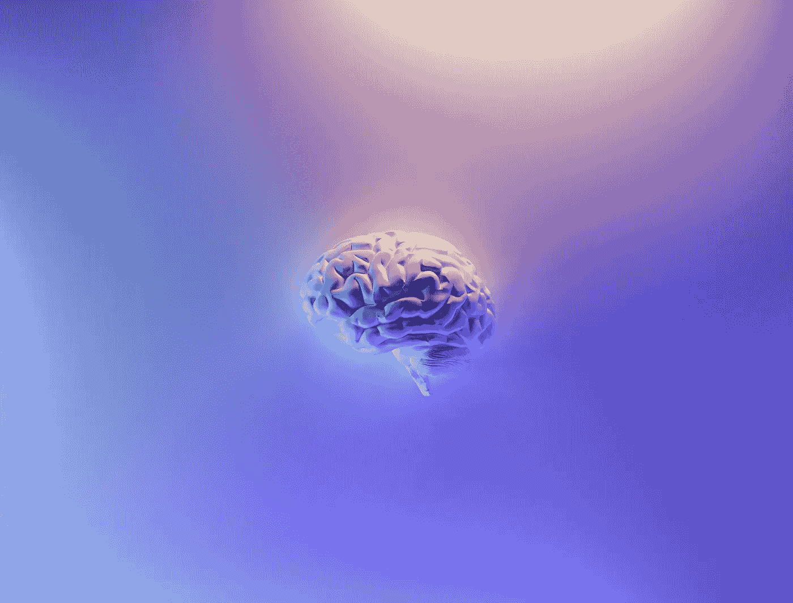

# **nnU-Net 终极指南**

> 原文：[`towardsdatascience.com/the-ultimate-guide-to-nnu-net-for-state-of-the-art-image-segmentation-6dda7f44b935?source=collection_archive---------4-----------------------#2023-08-02`](https://towardsdatascience.com/the-ultimate-guide-to-nnu-net-for-state-of-the-art-image-segmentation-6dda7f44b935?source=collection_archive---------4-----------------------#2023-08-02)

## 理解最先进的 nnU-Net 所需了解的一切，以及如何将其应用于自己的数据集。

 [François Porcher](https://medium.com/@francoisporcher?source=post_page-----6dda7f44b935--------------------------------)

·

[关注](https://medium.com/m/signin?actionUrl=https%3A%2F%2Fmedium.com%2F_%2Fsubscribe%2Fuser%2F8e8e73046f53&operation=register&redirect=https%3A%2F%2Ftowardsdatascience.com%2Fthe-ultimate-guide-to-nnu-net-for-state-of-the-art-image-segmentation-6dda7f44b935&user=Fran%C3%A7ois+Porcher&userId=8e8e73046f53&source=post_page-8e8e73046f53----6dda7f44b935---------------------post_header-----------) 发表在 [Towards Data Science](https://towardsdatascience.com/?source=post_page-----6dda7f44b935--------------------------------) · 13 分钟阅读 · 2023 年 8 月 2 日

--

Neuroimaging，作者 Milak Fakurian，来自 Unsplash，[链接](https://unsplash.com/photos/58Z17lnVS4U)

在剑桥大学进行深度学习和神经科学的研究实习期间，我大量使用了 nnU-Net，它在语义图像分割中是一个极其强大的基准。

然而，我曾经在完全理解模型及其训练方法时遇到了一些困难，并且在网上没有找到太多帮助。现在我对它已经很熟悉了，我创建了这个教程来帮助你，无论是为了更好地理解这个模型背后的内容，还是为了如何在你自己的数据集中使用它。

在本指南中，你将：

1.  制作 nnU-Net 关键贡献的简要概述。

1.  学习如何将 nnU-Net 应用于你自己的数据集。

所有代码都可以在这个 [Google Collab 笔记本](https://colab.research.google.com/drive/1h6scef1i258x0abxT_FcSI_QBN9Eh_9e?usp=sharing) 上找到

> 这项工作耗费了我大量的时间和精力。如果你觉得这些内容有价值，请考虑关注我，以增加它的可见度，并帮助支持更多此类教程的创作！

# …的简要历史
