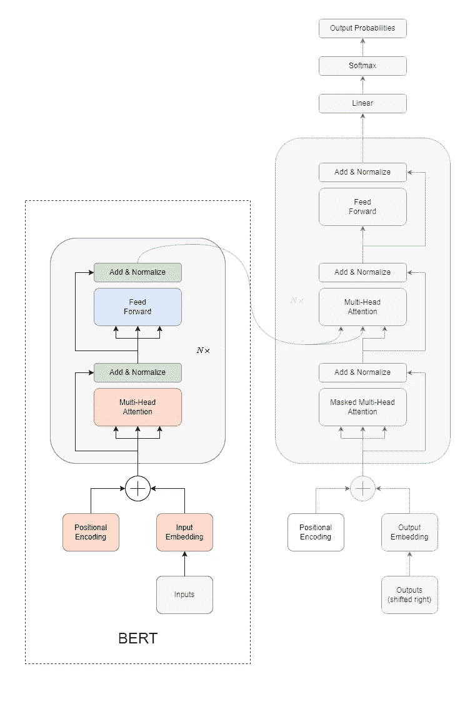
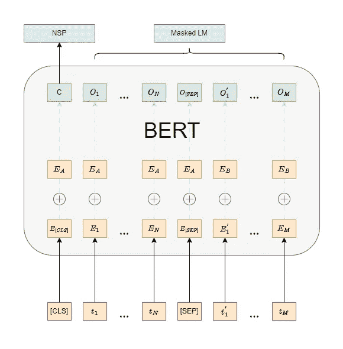
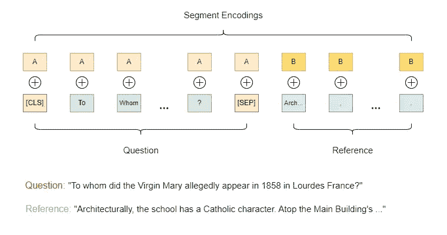
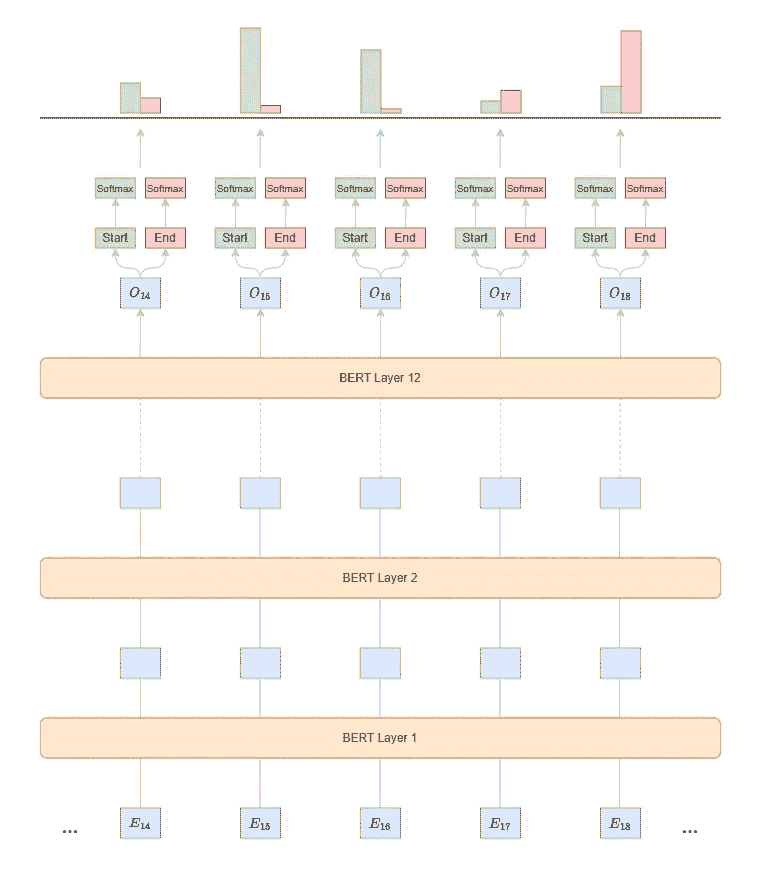

# 从零开始训练 BERT 的终极指南：介绍

> 原文：[`towardsdatascience.com/the-ultimate-guide-to-training-bert-from-scratch-introduction-b048682c795f`](https://towardsdatascience.com/the-ultimate-guide-to-training-bert-from-scratch-introduction-b048682c795f)

## 揭开 BERT 的神秘面纱：定义以及改变 NLP 领域的模型的各种应用。

[](https://dpoulopoulos.medium.com/?source=post_page-----b048682c795f--------------------------------)[](https://towardsdatascience.com/?source=post_page-----b048682c795f--------------------------------) [Dimitris Poulopoulos](https://dpoulopoulos.medium.com/?source=post_page-----b048682c795f--------------------------------)

·发表于 [Towards Data Science](https://towardsdatascience.com/?source=post_page-----b048682c795f--------------------------------) ·10 分钟阅读·2023 年 9 月 2 日

--


照片由 [Ryan Wallace](https://unsplash.com/@accrualbowtie?utm_source=medium&utm_medium=referral) 提供，来源于 [Unsplash](https://unsplash.com/?utm_source=medium&utm_medium=referral)

> 第二部分和第三部分现已上线。

几周前，我使用检索增强生成（RAG）训练并部署了我自己的问答系统。目标是将这种系统应用于我的学习笔记，并创建一个代理来帮助我连接点滴。LangChain 在这些特定类型的应用中真正表现出色：

由于系统的质量令我惊叹不已，我迫不及待地深入了解其背后的魔法。RAG 流水线的一个特点是能够筛选大量信息，并找到与用户查询最相关的上下文。听起来很复杂，但从一个简单而强大的过程开始：将句子编码成信息密集的向量。

创建这些句子嵌入的最流行免费方法就是 SBERT，这是一种建立在传奇 BERT 编码器之上的[句子变换器](https://www.sbert.net/)。最后，这也带我们进入了本系列的主要主题：理解 BERT 的迷人世界。它是什么？你可以用它做什么？还有一个百万美元的问题：如何从零开始训练你自己的 BERT 模型？

我们将从揭示 BERT 实际上是什么开始，深入探讨其目标和广泛应用，然后转到具体细节——如准备数据集、掌握分词、理解关键指标，最后是训练和评估模型的方方面面。

本系列将非常详细且技术性强，包含代码片段以及 GitHub 仓库的链接。到最后，我相信你将更深入地理解为什么 BERT 被视为 NLP 领域的传奇模型。因此，如果你和我一样兴奋，拿起一个 colab Notebook，和我们一起深入了解吧！

> [学习率](https://www.dimpo.me/newsletter?utm_source=medium&utm_medium=article&utm_campaign=bert-intro) 是一份针对对机器学习和 MLOps 世界感到好奇的人的新闻通讯。如果你想了解更多这样的主题，可以 [点击这里](https://www.dimpo.me/newsletter?utm_source=medium&utm_medium=article&utm_campaign=bert-intro) 订阅。你会在每个月的最后一个星期天收到我的更新和对最新 MLOps 新闻和文章的想法！

# 定义

BERT，即双向编码器表示模型，是 Google 于 2018 年开发的一种革命性自然语言处理（NLP）模型（Michael Rupe，[Google BERT 更新如何改变关键词研究](https://www.t3seo.com/how-the-google-bert-update-changed-keyword-research/)）。它的引入标志着该领域的重大进步，为各种 NLP 任务设定了新的最先进基准。对许多人来说，这被视为该领域的 ImageNet 时刻。

BERT 在大量数据上进行预训练，目标是理解语言是什么以及文档中的上下文意义是什么。因此，这个预训练模型可以针对特定任务如问答或情感分析进行微调。

到目前为止，一切顺利，但理论太多也无济于事。因此，让我们在下一节中简要回顾一下 BERT 的架构，然后更详细地看看如何预训练这样的模型，更重要的是，如何将其用于实际应用，以问答用例为具体例子。

# 框架

BERT 的架构基于 Transformer 模型，这在深度学习的 NLP 任务中具有特别的影响力。Transformer 模型本身由编码器-解码器堆栈组成，但 BERT 只使用编码器：



Bert 架构 — 图片由作者提供

让我们看看架构中每个彩色块代表的含义：

+   **输入嵌入：** 输入标记（单词或子词）被转换为嵌入，然后输入到模型中。BERT 将标记嵌入和位置嵌入结合作为输入。

+   **位置编码：** 由于 BERT 和基础 Transformer 架构没有内建的词序感（如 LSTM 等递归模型），它们引入位置编码来提供有关词在序列中位置的信息。在原始的 Transformer 论文中，位置编码是预先固定的；然而，如今，更常见的是在训练过程中学习这些编码。

+   **注意力机制：** Transformer 架构中的主要创新之一是“自注意力机制”，它使模型能够根据给定词的上下文来加权句子中不同词的相对重要性，从而捕捉上下文。这对 BERT 的双向性至关重要。

+   **前馈神经网络：** 每个 Transformer 块包含一个前馈神经网络，它在每个位置上独立操作。

+   **层归一化与残差连接：** 模型中的每个子层（如自注意力或前馈神经网络）包括一个残差连接，然后是层归一化。这有助于通过减轻梯度消失问题来训练深层网络。

+   **多个堆叠：** BERT 的深度是其定义特征之一。BERT 的“基础”版本使用 12 层堆叠的 Transformer 编码器，而“大型”版本使用 24 层。

既然我们在缓存中有了心理图像，让我们进一步探讨如何训练这样的模型。

# 上学

我们通常将 BERT 的训练分为两个阶段：第一阶段——称为预训练——目标是教会模型语言是什么以及上下文如何改变词语的意义。在第二阶段——称为微调——我们使模型执行一些实际有用的任务。

让我们分别探讨这两个阶段，使用具体的示例和视觉效果。

# 预训练

在预训练中，BERT 试图同时解决两个任务：i) 掩码语言模型（MLM 或“完形填空”测试）和 ii) 下一句预测（NSP）。

> 词汇 [cloze](https://en.wiktionary.org/wiki/cloze) 源自 [格式塔理论](https://en.wikipedia.org/wiki/Gestalt_psychology) 中的闭合（“格式塔心理学”）。

在第一个范式中，句子中的随机词被替换为 `[MASK]` 标记，BERT 尝试从上下文中预测原始词。这不同于传统语言模型，它们预测序列中的词。这对 BERT 至关重要，因为它试图利用左右两个方向的信息对序列中的每个词进行编码，因此称为“双向”。

对于第二个任务，BERT 接受两句话，判断第二句话是否跟在第一句话之后。这帮助 BERT 理解跨句子的上下文。此外，这里是段嵌入变得关键的地方，因为它们使模型能够区分这两句话。一对输入到 BERT 的句子将被分配不同的段嵌入，以指示模型每个词元属于哪个句子。

BERT 如何同时学习这两个任务？以下图示将会澄清所有问题：



BERT 预训练 — 作者提供的图像

首先，我们在序列中添加两个特殊标记：`[CLS]`标记——用于分类——和`[SEP]`标记，用于分隔两个句子。接下来，我们将序列通过 BERT，并为每个标记获得一个上下文化的表示（即嵌入）。如果你仔细观察，你会看到两个新的嵌入：`E_A`和`E_B`。这两个新的嵌入是在训练过程中学习的，用于通知 BERT 示例中存在两个独立的序列。我们将在微调阶段进一步了解这些嵌入的作用。

这里是最终部分：首先，我们获取`[CLS]`标记的嵌入，将其通过一个新的线性层，输出两个单元，用于将其分类为正标签（句子相关）或负标签。请查看 HuggingFace `transformers`库的源代码：[GitHub](https://github.com/huggingface/transformers/blob/07998ef39926b76d3f6667025535d0859eed61c3/src/transformers/models/bert/modeling_bert.py#L716)。

```py
class BertOnlyNSPHead(nn.Module):
    def __init__(self, config):
        super().__init__()
        self.seq_relationship = nn.Linear(config.hidden_size, 2)

    def forward(self, pooled_output):
        seq_relationship_score = self.seq_relationship(pooled_output)
        return seq_relationship_score
```

首先，我们检查模型在 Masked ML 任务中的预测形状。经过一些变换后，每个标记的预测为词汇表中的每个单词提供一个分数。因此，如果我们假设词汇表中有 50,000 个单词，则第一个输出的形状将是`[1, 50,000]`。我们可以在[代码](https://github.com/huggingface/transformers/blob/07998ef39926b76d3f6667025535d0859eed61c3/src/transformers/models/bert/modeling_bert.py#L706)中查看。

```py
class BertPredictionHeadTransform(nn.Module):
    def __init__(self, config):
        super().__init__()
        self.dense = nn.Linear(config.hidden_size, config.hidden_size)
        if isinstance(config.hidden_act, str):
            self.transform_act_fn = ACT2FN[config.hidden_act]
        else:
            self.transform_act_fn = config.hidden_act
        self.LayerNorm = nn.LayerNorm(config.hidden_size, eps=config.layer_norm_eps)

    def forward(self, hidden_states: torch.Tensor) -> torch.Tensor:
        hidden_states = self.dense(hidden_states)
        hidden_states = self.transform_act_fn(hidden_states)
        hidden_states = self.LayerNorm(hidden_states)
        return hidden_states

class BertLMPredictionHead(nn.Module):
    def __init__(self, config):
        super().__init__()
        self.transform = BertPredictionHeadTransform(config)

        # The output weights are the same as the input embeddings, but there is
        # an output-only bias for each token.
        self.decoder = nn.Linear(config.hidden_size, config.vocab_size, bias=False)

        self.bias = nn.Parameter(torch.zeros(config.vocab_size))

        # Need a link between the two variables so that the bias is correctly resized with `resize_token_embeddings`
        self.decoder.bias = self.bias

    def forward(self, hidden_states):
        hidden_states = self.transform(hidden_states)
        hidden_states = self.decoder(hidden_states)
        return hidden_states

class BertOnlyMLMHead(nn.Module):
    def __init__(self, config):
        super().__init__()
        self.predictions = BertLMPredictionHead(config)

    def forward(self, sequence_output: torch.Tensor) -> torch.Tensor:
        prediction_scores = self.predictions(sequence_output)
        return prediction_scores
```

最后，为了计算总损失，我们使用交叉熵分别计算每个任务的损失，然后将它们[加在一起](https://github.com/huggingface/transformers/blob/07998ef39926b76d3f6667025535d0859eed61c3/src/transformers/models/bert/modeling_bert.py#L1142)。

```py
if labels is not None and next_sentence_label is not None:
    loss_fct = CrossEntropyLoss()
    masked_lm_loss = loss_fct(prediction_scores.view(-1, self.config.vocab_size), labels.view(-1))
    next_sentence_loss = loss_fct(seq_relationship_score.view(-1, 2), next_sentence_label.view(-1))
    total_loss = masked_lm_loss + next_sentence_loss
```

在最后一部分，我们来看一下如何微调 BERT 以生成问答模型。

# 毕业

预训练完成后，我们可以使用较小的标注数据集对 BERT 进行特定任务的专业化。例如，我们详细查看 Q&A 任务：

微调 BERT 以处理问答（Q&A）任务，如[斯坦福问答数据集（SQuAD）](https://rajpurkar.github.io/SQuAD-explorer/explore/1.1/dev/Super_Bowl_50.html)，涉及调整模型以预测给定问题在段落中的答案的开始和结束位置。

让我们逐步了解如何对 BERT 进行微调以处理这些任务。

## 数据集准备

数据集中每个项目通常会包含一个问题、一个段落（或参考），以及答案在段落中的开始和结束位置作为标签。

我们使用 BERT 的分词器将问题和段落分词，将问题与段落分隔开，使用`[SEP]`特殊标记，并使用`[CLS]`特殊标记开始输入序列。

最后，我们创建了一个新数组，将问题标记为段`A`，参考标记为段`B`。我们将利用这些信息在稍后添加学到的段嵌入。



BERT 问答数据集准备 — 作者图片

## 模型修改

尽管预训练的 BERT 模型可以输出序列中每个 token 的上下文嵌入，但对于问答任务，你需要从这些嵌入中推导出开始和结束位置的预测。

为此，我们在 BERT 顶部添加了一个全连接层，具有两个输出节点：一个用于预测答案的开始位置，另一个用于预测答案在[passage](https://github.com/huggingface/transformers/blob/c385de24414e4ec6125ee14c46c128bfe70ecb66/src/transformers/models/bert/modeling_bert.py#L1803)中的结束位置。

```py
class BertForQuestionAnswering(BertPreTrainedModel):
    def __init__(self, config):
        super().__init__(config)
        self.num_labels = config.num_labels

        self.bert = BertModel(config, add_pooling_layer=False)
        self.qa_outputs = nn.Linear(config.hidden_size, config.num_labels)
```

## 训练

对于文章中的每个 token，模型将输出一个分数，指示该 token 成为答案起点的可能性，另一个分数指示其成为答案终点的可能性。



BERT 问答预测 — 作者图片

在上图中，模型似乎预测答案以 token `15`开始，因为模型将最高概率分配给该输出，并以 token `18`结束，原因相同。

我们在整个序列上使用 SoftMax 函数，以获得开始和结束位置的概率分布，[损失](https://github.com/huggingface/transformers/blob/c385de24414e4ec6125ee14c46c128bfe70ecb66/src/transformers/models/bert/modeling_bert.py#L1875)通过预测和正确的开始及结束位置之间的交叉熵来计算。

```py
loss_fct = CrossEntropyLoss(ignore_index=ignored_index)
start_loss = loss_fct(start_logits, start_positions)
end_loss = loss_fct(end_logits, end_positions)
total_loss = (start_loss + end_loss) / 2
```

最后，我们从预训练的 BERT 权重开始，使用较小的学习率（例如`2e-5`或`3e-5`），因为 BERT 已经是预训练的。过大的学习率可能导致模型发散。我们在问答数据集上微调模型，进行多个周期，直到验证性能稳定或开始下降。

# 结论

在这本全面的指南中，我们涵盖了从零开始训练 BERT 的许多内容。从了解 BERT 是什么开始，我们*深入探讨*了其架构复杂性、预训练和微调的逻辑，甚至探索了如何将其调整用于问答任务。在这个过程中，我们触及了关键指标、分词的重要性，以及对于任何想要动手实践自然语言处理领域的人来说，至关重要的代码片段。

然而，BERT 的故事并未就此结束。在下一个故事中，我们将从头开始，更深入地*探讨*BERT 的分词器以及它如何学习将单词拆分为子词。敬请关注！

# 关于作者

我的名字是[Dimitris Poulopoulos](https://www.dimpo.me/?utm_source=medium&utm_medium=article&utm_campaign=bert-intro)，我是一名为[HPE](https://www.hpe.com/us/en/home.html)工作的机器学习工程师。我为欧盟委员会、国际货币基金组织、欧洲中央银行、宜家、Roblox 等主要客户设计并实施了 AI 和软件解决方案。

如果你对阅读更多关于机器学习、深度学习、数据科学和数据操作的文章感兴趣，可以在[Medium](https://towardsdatascience.com/medium.com/@dpoulopoulos/follow)、[LinkedIn](https://www.linkedin.com/in/dpoulopoulos/)上关注我，或在 Twitter 上关注[@james2pl](https://twitter.com/james2pl)。

所表达的观点完全是我个人的，并不代表我的雇主的观点或意见。
