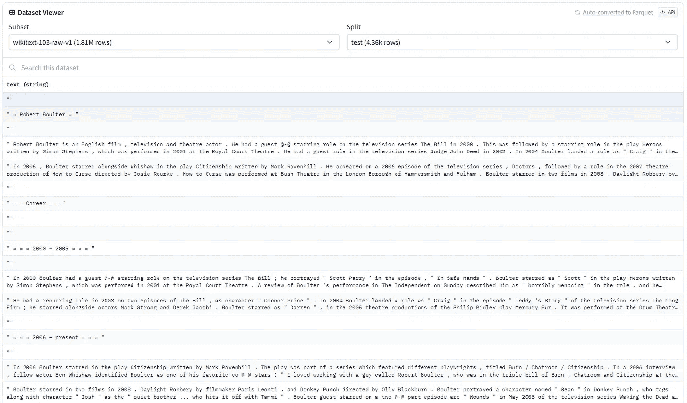
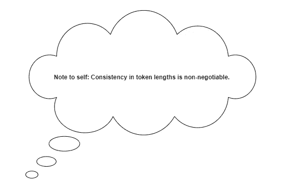
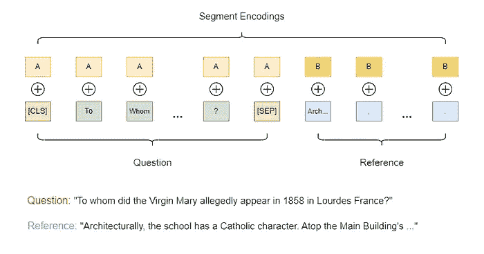
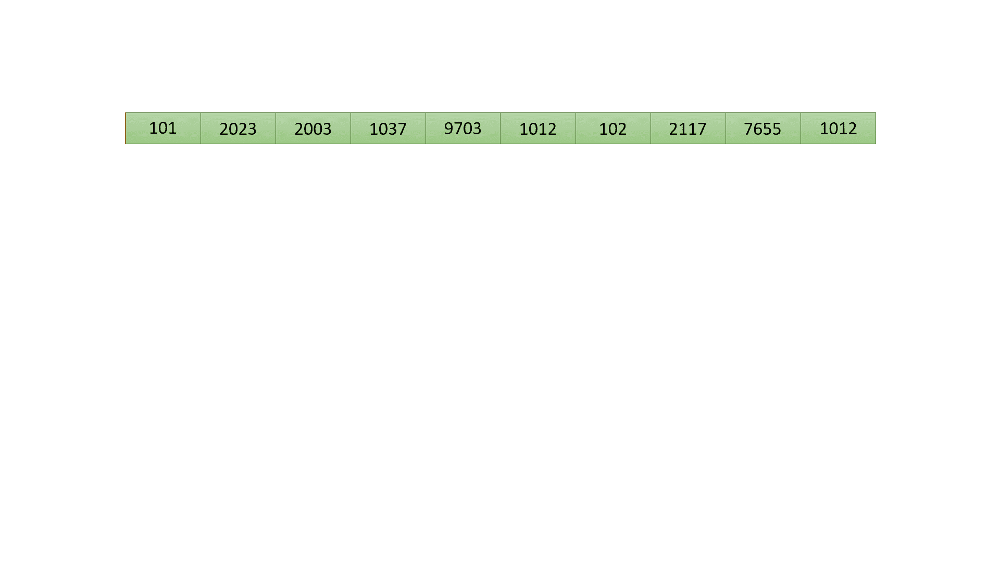
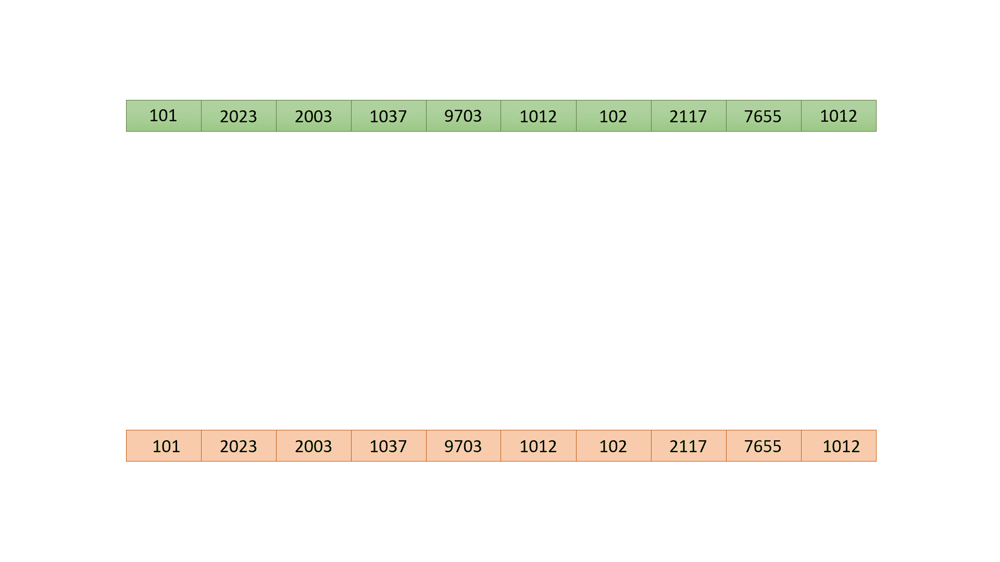
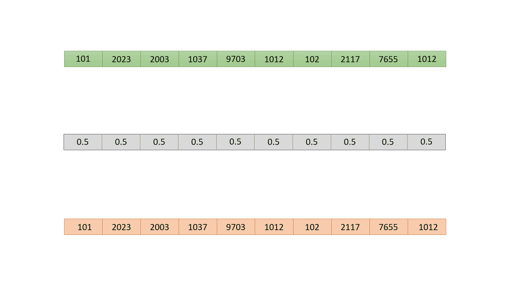
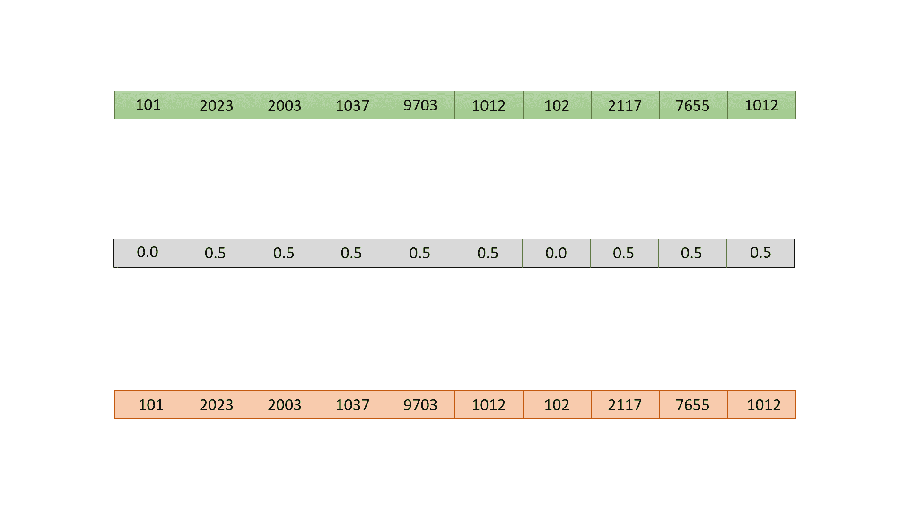
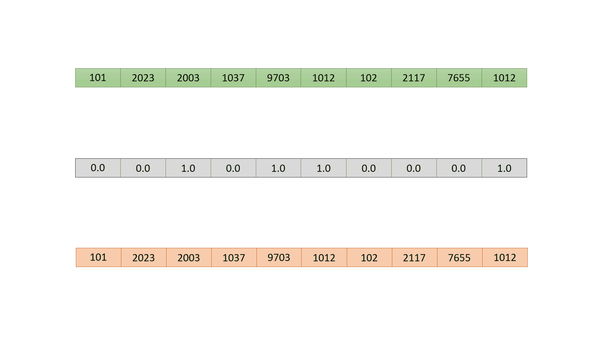
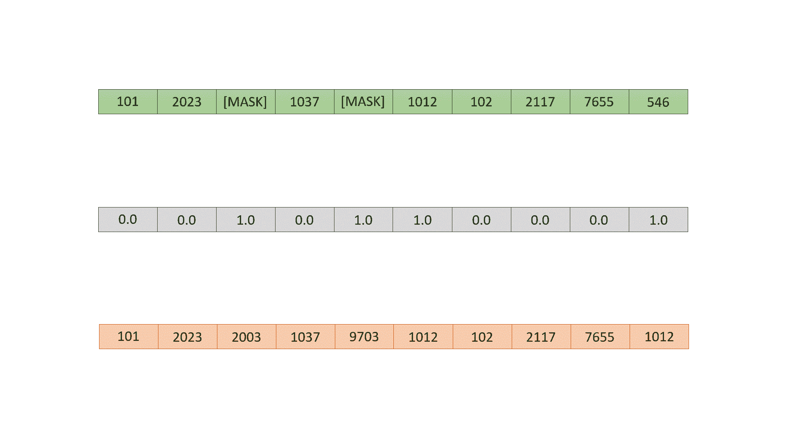
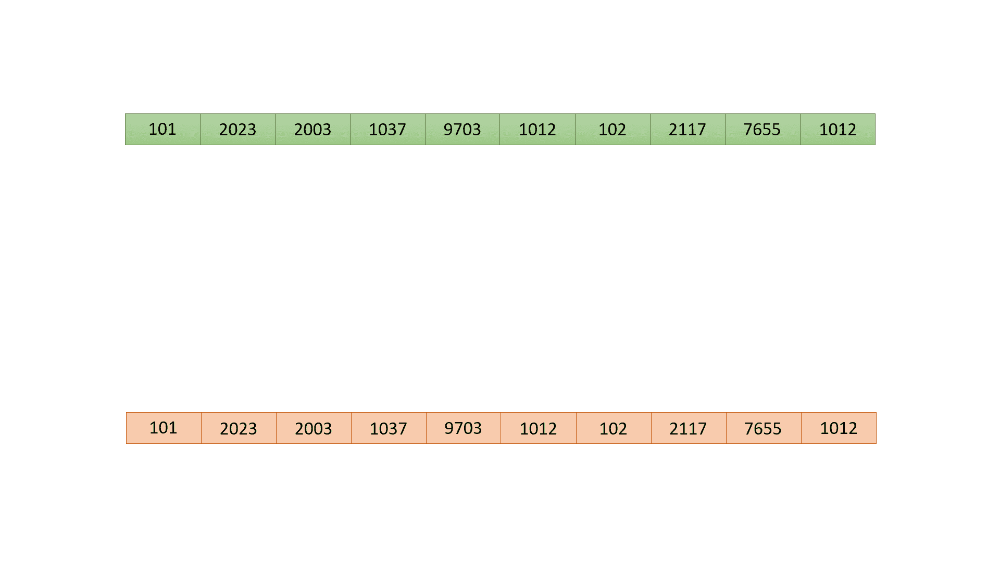

# 从头开始训练 BERT 的终极指南：准备数据集

> 原文：[`towardsdatascience.com/the-ultimate-guide-to-training-bert-from-scratch-prepare-the-dataset-beaae6febfd5`](https://towardsdatascience.com/the-ultimate-guide-to-training-bert-from-scratch-prepare-the-dataset-beaae6febfd5)

## 数据准备：深入挖掘，优化你的过程，发现如何解决最关键的步骤

[](https://dpoulopoulos.medium.com/?source=post_page-----beaae6febfd5--------------------------------)[](https://towardsdatascience.com/?source=post_page-----beaae6febfd5--------------------------------) [Dimitris Poulopoulos](https://dpoulopoulos.medium.com/?source=post_page-----beaae6febfd5--------------------------------)

·发布于[Towards Data Science](https://towardsdatascience.com/?source=post_page-----beaae6febfd5--------------------------------) ·阅读时间 13 分钟·2023 年 9 月 14 日

--


图片由[Patrick Tomasso](https://unsplash.com/@impatrickt?utm_source=medium&utm_medium=referral)拍摄，来源于[Unsplash](https://unsplash.com/?utm_source=medium&utm_medium=referral)

> 本故事的第一部分、第二部分和第四部分现已上线。

想象一下，花整整一天时间来微调 BERT，却遇到性能瓶颈让你感到困惑。你深入研究代码，发现问题所在：你没有做好特征和标签的准备。就这样，十小时宝贵的 GPU 时间一瞬间化为乌有。

说实话，*设置数据集不仅仅是另一个步骤——它是整个训练流程的工程基石*。有人甚至认为，一旦你的数据集准备好，剩下的主要是模板化的：喂入模型、计算损失、进行反向传播和更新模型权重。


训练流程 — 作者图像

在这个故事中，**我们将深入探讨为 BERT 准备数据的过程，为最终目标奠定基础：从头开始训练一个 BERT 模型。**

欢迎来到我们全面 BERT 系列的第三部分！在第一章中，我们介绍了 BERT——解析其目标并演示如何对其进行微调，以便用于实际的问答系统：

[从零开始训练 BERT 的终极指南：介绍](https://example.org/the-ultimate-guide-to-training-bert-from-scratch-introduction-b048682c795f?source=post_page-----beaae6febfd5--------------------------------)

### 揭开 BERT 的神秘面纱：改变 NLP 领域的模型的定义及其各种应用

towardsdatascience.com

然后，在第二章中，我们深入探讨了标记器的世界，探索了它们的机制，甚至为希腊语创建了一个自定义标记器：

[从零开始训练 BERT 的终极指南：标记器](https://example.org/the-ultimate-guide-to-training-bert-from-scratch-the-tokenizer-ddf30f124822?source=post_page-----beaae6febfd5--------------------------------)

### 从文本到标记：你的 BERT 标记化逐步指南

towardsdatascience.com

现在，我们正处理构建高性能 BERT 模型的一个最关键阶段：*数据集准备*。本指南将是技术性的，提供 Python 代码片段和流行开源项目的 GitHub 仓库链接。好了，我们失去光线了；让我们开始吧！

> [学习速递](https://www.dimpo.me/newsletter?utm_source=medium&utm_medium=article&utm_campaign=bert-dataset)是一个针对对机器学习和 MLOps 世界感到好奇的人的新闻通讯。如果你想了解更多类似的主题，可以[在这里](https://www.dimpo.me/newsletter?utm_source=medium&utm_medium=article&utm_campaign=bert-dataset)订阅。你会在每个月的最后一个星期天收到我的更新和对最新 MLOps 新闻和文章的思考！

# 下载并探索

首先，我们应该选择一个数据集。为了本教程的目的，我们将使用`[wikitext](https://huggingface.co/datasets/wikitext)`数据集，具体是`wikitext-2-raw-v1`子集。

根据文档，这个数据集收集了来自维基百科已验证文章的超过 1 亿个标记。这是我们 BERT 实验的理想场所，多亏了 Hugging Face，访问它非常简单：

```py
from datasets import load_dataset

datasets = load_dataset('wikitext', 'wikitext-2-raw-v1')
```

`datasets`变量包含三个分割：训练、验证和测试。我们先关注训练分割。

训练集包含 36,718 行长度可变的文本。你会发现从空字符串到完整段落的条目。这里用 Hugging Face 数据集查看器来预览一下：



Wikitext 数据集 — 作者提供的图片

**自我提醒：标记长度的一致性是不可妥协的。** 这很关键，因为我们的模型在训练过程中知道如何处理特定长度的序列。我们应该在数据处理阶段牢记这一点。

现在，数据集的特征如何呢？

```py
datasets["train"]
```

输出显示了一个相当简约的结构：

```py
Dataset({
    features: ['text'],
    num_rows: 36718
})
```

没错，它只是一个`text`特征。那么我们如何将这些原始数据转化为一个强大的 BERT 训练集呢？准备好，我们要开始动手了。

# 就像万圣节一样

为了创建我们的数据集准备蓝图，让我们花一点时间回顾 BERT 的目标。BERT 训练是一个两阶段的过程，但今天我们只关注第一阶段：预训练。这里的目标是教会模型什么是语言以及上下文如何改变单词的意义。

预训练阶段有两个关键任务：i) 掩码语言建模（MLM）和 ii) 下一个句子预测（NSP）。在 MLM 中，我们故意掩盖序列中的某些标记，并训练 BERT 准确预测它们。通过 NSP，我们向 BERT 呈现两个相邻的序列，让它预测第二个序列是否自然跟随第一个序列。

所以，我们的目标是创建一个支持这些任务的数据集，并教会 BERT 我们想要的概念。让我们开始吧！

## 基础知识

好的，首先：在进行序列掩码之前，我们需要做两件事：我们必须对句子进行分词，然后创建相同长度的标记序列。你还记得我们之前做的心理笔记吗？



作者提供的图片

首先让我们加载预训练的 BERT 分词器：

```py
from transformers import AutoTokenizer

model_checkpoint = "bert-base-uncased"
tokenizer = AutoTokenizer.from_pretrained(model_checkpoint, use_fast=True)
```

接下来，分词一个文本句子非常简单：我们编写一个接受示例并将其通过分词器的函数。然后，我们在数据集上映射这个函数。这是处理 Hugging Face 数据集时的常见做法，我们会一次次看到这个模式。

```py
def tokenize_function(examples):
    return tokenizer(examples["text"], add_special_tokens=False)

tokenized_datasets = datasets.map(
    tokenize_function, batched=True, num_proc=4, remove_columns=["text"])
```

注意`num_proc`和`batched`参数。这些参数对加速过程至关重要。随着数据集的增大，它们将产生巨大差异。有关`map`函数的更多信息，请查看`datasets`库的[文档](https://huggingface.co/docs/datasets/process#map)。要具体了解这些参数，请仔细阅读[多处理](https://huggingface.co/docs/datasets/process#multiprocessing)和[批处理](https://huggingface.co/docs/datasets/process#batch-processing)部分。

此外，请注意我们要求分词器省略添加任何特殊标记（`add_special_tokens=False`）。稍后你会明白为什么。

下一步是创建相同长度的序列。BERT 通常接受`512`个标记的序列。这主要由模型架构中的位置编码矩阵的形状定义。

因此，在这一步，我们将创建`255`个标记的序列。为什么？因为稍后我们希望将两个句子连接起来，创建一个支持 NSP 任务的数据集。这个过程将创建`510`个标记的序列（`255` + `255`）。然而，我们还应添加两个特殊标记：`[CLS]`以指示序列的开始，以及`[SEP]`以标记第一个句子结束和第二个句子开始的地方。

和往常一样，让我们创建一个辅助函数来完成这个任务：

```py
def group_texts(examples, block_size=255):
    # Concatenate all texts.
    concatenated_examples = {k: sum(examples[k], []) for k in examples.keys()}
    total_length = len(concatenated_examples[list(examples.keys())[0]])
    # We drop the small remainder. We can use padding later.
    total_length = (total_length // block_size) * block_size
    # Split by chunks of `block_size`.
    result = {
        k: [t[i : i + block_size] for i in range(0, total_length, block_size)]
        for k, t in concatenated_examples.items()
    }
    return result
```

这个函数执行两个转换：首先，它将所有序列汇集在一起，然后将它们再次拆分成`255`个标记的小块。让我们在我们的标记化数据集上映射它：

```py
lm_datasets = tokenized_datasets.map(
    group_texts, batched=True, batch_size=1000, num_proc=4)
```

这就完成了初步的转换。接下来，让我们将两个序列连接在一起，以创建我们想要的 NSP 效果。

## 嵌套句子预测

作为提醒，NSP 任务尝试预测两个给定句子是否在原始文本中相邻。因此，我们需要一个数据集，其中每条记录应包含一对句子以及一个标签，指示它们是否相关。

为了创建这样的数据集，我们将再次定义一个辅助函数。诚然，这个函数会比我们之前处理的稍微复杂一些，但不要因此感到害怕。处理复杂性最有效的方法往往是全身心投入其中。

```py
def create_nsp_entry(example, idx, dataset, total_examples):
    """
    Create a Next Sentence Prediction entry using the given example and its index.
    """
    import random

    first_sentence = example['input_ids']
    attention_mask = [1] * 512
    next_sentence_label = 0

    # Decide the second sequence based on the index
    if idx % 4 < 2:  # Use subsequent sequences half of the time
        next_idx = idx + 1
        try:
            next_sentence = dataset[next_idx]['input_ids']
        except IndexError:
            # If the index is out of bounds
            # (e.g., the example is the last in the dataset),
            # wrap around to the start.
            # In this case, set the label to 1.
            next_idx = next_idx % total_examples
            next_sentence = dataset[next_idx]['input_ids']
            next_sentence_label = 1  # Indicate that the sentences are not consecutive.
        # Set attention mask accordingly.
        attention_mask = [1] + example['attention_mask'] + [1] + dataset[next_idx]['attention_mask']
    else:
        # Get a random sentence to create a negative example.
        rand_idx = random.randint(0, total_examples - 1)
        while rand_idx == idx:  # Ensure we don't pick the same example.
            rand_idx = random.randint(0, total_examples - 1)
        next_sentence = dataset[rand_idx]['input_ids']
        next_sentence_label = 1
        attention_mask = [1] + example['attention_mask'] + [1] + dataset[rand_idx]['attention_mask']

    # Create combined input IDs
    combined_input_ids = [tokenizer.cls_token_id] + first_sentence + [tokenizer.sep_token_id] + next_sentence

    # Create token type IDs - the first sentences + the [SEP] are set to 0
    token_type_ids = [0] * (257) + [1] * (255)

    return {
        'input_ids': combined_input_ids,
        'token_type_ids': token_type_ids,
        'attention_mask': attention_mask,
        'next_sentence_label': next_sentence_label
    }
```

好吧，这看起来确实很多！所以，让我们通过可视化这个函数的功能来使代码更易于理解。这个函数旨在创建类似于我们在第一篇介绍博客文章中看到的 QnA 方案的东西：



BERT QnA 数据集准备 — 作者图片

`if/else`块的工作原理如下：

+   一半的时间，创建后续句子的序列，除了当当前序列是最后一个时，这种情况下，回绕并创建两个随机句子的序列。

+   另一半时间，创建两个随机句子的序列。

+   相应地设置下一个句子的标签：`0`表示后续序列，`1`表示它们没有关联。

+   使用`[CLS]`和`[SEP]`特殊标记将两个句子组合在一起。

+   创建`token_type_ids`列表以标记两个段落。

那么，我是如何想到`token_type_ids`和`next_sentence_label`这些名称的？这些名称是随机的吗，你可以使用任何变量名吗？不！如果你查看模型的[forward](https://github.com/huggingface/transformers/blob/fa6107c97edf7cf725305a34735a57875b67d85e/src/transformers/models/bert/modeling_bert.py#L1077)方法签名，你会发现正是这些名称：

```py
def forward(
        self,
        input_ids: Optional[torch.Tensor] = None,
        attention_mask: Optional[torch.Tensor] = None,
        token_type_ids: Optional[torch.Tensor] = None,  # Different segments
        position_ids: Optional[torch.Tensor] = None,
        head_mask: Optional[torch.Tensor] = None,
        inputs_embeds: Optional[torch.Tensor] = None,
        labels: Optional[torch.Tensor] = None,
        next_sentence_label: Optional[torch.Tensor] = None,  # labels for NSP
        output_attentions: Optional[bool] = None,
        output_hidden_states: Optional[bool] = None,
        return_dict: Optional[bool] = None,
    ) -> Union[Tuple[torch.Tensor], BertForPreTrainingOutput]:
   ...
```

注意这一点；你需要使用这些确切的名称。如果不使用，库会在将数据集传递给模型之前从中删除这些特性。为什么？因为这是[默认](https://github.com/huggingface/transformers/blob/fa6107c97edf7cf725305a34735a57875b67d85e/src/transformers/trainer.py#L746)行为。

最后，像往常一样，让我们映射这个方法。但首先，让我们分开不同的数据集拆分，以便稍后可以准备好进行训练，并将函数分别映射到每一个：

```py
train_dataset = lm_datasets['train']
validation_dataset = lm_datasets['validation']
test_dataset = lm_datasets['test']

nsp_train_dataset = train_dataset.map(
    lambda example, idx: create_nsp_entry(example, idx, train_dataset, total_examples=len(train_dataset)),
    with_indices=True)

nsp_validation_dataset = validation_dataset.map(
    lambda example, idx: create_nsp_entry(example, idx, validation_dataset, total_examples=len(validation_dataset)),
    with_indices=True)

nsp_test_dataset = test_dataset.map(
    lambda example, idx: create_nsp_entry(example, idx, test_dataset, total_examples=len(test_dataset)),
    with_indices=True)
```

我们现在映射函数的方法有一个微妙的区别：我们正在创建一个使用我们定义的函数的 lambda 函数，并设置`with_indices=True`，以便我们的辅助函数可以处理它操作的每个示例的索引。

太好了！我们已经准备好了数据集来处理 NSP 任务。那么 MLM 呢？在第一篇博客中，我们看到我们同时训练 BERT 进行这两个任务。因此，让我们接下来处理 MLM 转换。

# 掩码语言模型

幸运的是，`transformers`库为掩码语言模型（MLM）任务提供了一个简化的解决方案。只需使用适当的参数实例化`DataCollatorForLanguageModeling`类，效果就会非常好——大部分工作都为你完成了。

但等等，你不是来这里寻找简单的方法的，对吧？本指南的最终目的是深入探讨，因此我们不接受任何黑箱操作。我们将揭开帷幕，探讨如何为 MLM 创建自定义数据集。

我们将如何处理：首先，我们通过可视化核心概念来绘制心理图像。可以将其视为一个虚拟的故事板，使一切变得清晰。接下来，我们将逐步解析代码，以掌握每个组件。

我们的首要任务？为输入标记制作标签。这很简单；我们只需克隆输入数组即可。



标签生成——作者图像

接下来，我们构建“掩码”数组，该数组反映了输入和标签的形状。此掩码数组中的每个条目表示一个概率值，决定了相应位置的标记被掩码的可能性。

为了演示，我们将使用`0.5`的掩码概率，尽管在实际应用中，通常设定更接近`0.15`：



掩码生成——作者图像

现在，我们知道有些标记我们绝对不想掩码：特殊的`[CLS]`和`[SEP]`标记。所以，让我们将掩码数组中它们对应的概率值设置为零，从而有效地排除它们被掩码的可能性。



掩码特殊标记——作者图像

现在，对于掩码中的每个位置，让我们评估概率并将值设置为`1.0`或`0.0`。值`1.0`表示我们将在相应位置掩码标记，而`0.0`表示我们将保持不变：



概率评估——作者图像

很好，我们现在有了一个指示要掩码哪些标记的地图。但是有个变数：并不是所有被掩码的位置都会被`[MASK]`标记替代。实际上，我们将采用更复杂的策略。具体来说：50%的被掩码标记会得到特殊的`[MASK]`标记，25%会被替换为随机标记，剩下的 25%保持不变——尽管 BERT 对此一无所知。

实际上，我们使用 80–10–10 方案，但为了使其适用于我们的示例，我们采用 50–25–25 策略：



掩码标记——作者图像

最后，是时候处理标签了。那些不应该影响损失的索引标签——即未掩码的标记——被设置为 `-100`。这不是一个随机的负数，而是 PyTorch 的 [CrossEntropyLoss](https://pytorch.org/docs/stable/generated/torch.nn.CrossEntropyLoss.html) 中 `ignore_index` 属性的默认值。因此，Pytorch 在计算损失时会忽略这些标签：



过程标签— 作者提供的图像

就这些了！让我们在最终的总结动画中将所有内容汇总起来：



掩码语言建模 — 作者提供的图像

现在我们有了清晰的心理图像，让我们看看代码。这直接取自 `transformers` [库](https://github.com/huggingface/transformers/blob/41aef33758ae166291d72bc381477f2db84159cf/src/transformers/data/data_collator.py#L751)：

```py
def torch_mask_tokens(self, inputs: Any, special_tokens_mask: Optional[Any] = None) -> Tuple[Any, Any]:
    """
    Prepare masked tokens inputs/labels for masked language modeling: 80% MASK, 10% random, 10% original.
    """
    import torch

    labels = inputs.clone()
    # We sample a few tokens in each sequence for MLM training (with probability `self.mlm_probability`)
    probability_matrix = torch.full(labels.shape, self.mlm_probability)
    if special_tokens_mask is None:
        special_tokens_mask = [
            self.tokenizer.get_special_tokens_mask(val, already_has_special_tokens=True) for val in labels.tolist()
        ]
        special_tokens_mask = torch.tensor(special_tokens_mask, dtype=torch.bool)
    else:
        special_tokens_mask = special_tokens_mask.bool()

    probability_matrix.masked_fill_(special_tokens_mask, value=0.0)
    masked_indices = torch.bernoulli(probability_matrix).bool()
    labels[~masked_indices] = -100  # We only compute loss on masked tokens

    # 80% of the time, we replace masked input tokens with tokenizer.mask_token ([MASK])
    indices_replaced = torch.bernoulli(torch.full(labels.shape, 0.8)).bool() & masked_indices
    inputs[indices_replaced] = self.tokenizer.convert_tokens_to_ids(self.tokenizer.mask_token)

    # 10% of the time, we replace masked input tokens with random word
    indices_random = torch.bernoulli(torch.full(labels.shape, 0.5)).bool() & masked_indices & ~indices_replaced
    random_words = torch.randint(len(self.tokenizer), labels.shape, dtype=torch.long)
    inputs[indices_random] = random_words[indices_random]

    # The rest of the time (10% of the time) we keep the masked input tokens unchanged
    return inputs, labels
```

我们从克隆输入开始，形成标签——这现在已经是老新闻了！接下来，我们生成一个与标签形状相同的概率矩阵，并用选择的概率值填充它。然后，我们确定序列中的特殊标记，并将它们的掩码概率降低到零。你跟上了吗？一切应该都很熟悉！

这就有趣了：我们使用伯努利分布评估概率矩阵。听起来有点复杂，但基本上是一个硬币抛掷决定每个矩阵位置是 `1.0` 还是 `0.0`。然后我们将这些 1 和 0 转换为真和假值。矩阵中有‘假’的情况吗？我们将它们对应的标签值设置为 `-100`，如前所述。

最后，我们运用了之前提到的 80–10–10 掩码方案，使用相同的伯努利逻辑。这有效地掩盖、替换或保留输入序列中的标记，为 BERT 提供了丰富的数据。

就这样！使用 `datasets` 库来完成所有这些步骤只需一行代码。实例化一个 `DataCollatorForLanguageModeling` 对象，然后将其传递给 `Trainer`（有关 `Trainer` 的更多信息将在下一集介绍）：

```py
data_collator = DataCollatorForLanguageModeling(tokenizer=tokenizer, mlm_probability=0.15) 
```

# 结论

在从头开始训练 BERT 的过程中，准备数据集通常是最耗时且最困难的步骤，但也是最有价值的步骤之一。

如果你一直跟着，你不仅学会了如何准备数据集，还了解了数据集准备过程中每个决策的原因。从选择理想的数据集和分解其特征，到使用多种策略掩盖标记的精妙艺术，我们已经深入探讨了那些可能影响模型性能的细节。

在下一章，我们将最终触及训练过程。到时见！

# 关于作者

我的名字是[Dimitris Poulopoulos](https://www.dimpo.me/?utm_source=medium&utm_medium=article&utm_campaign=bert-dataset)，我是一名机器学习工程师，现为[HPE](https://www.hpe.com/us/en/home.html)工作。我为主要客户如欧盟委员会、国际货币基金组织、欧洲中央银行、宜家、Roblox 等设计和实施了人工智能及软件解决方案。

如果你有兴趣阅读更多关于机器学习、深度学习、数据科学和数据操作的文章，可以在[Medium](https://towardsdatascience.com/medium.com/@dpoulopoulos/follow)、[LinkedIn](https://www.linkedin.com/in/dpoulopoulos/)或在 Twitter 上的[@james2pl](https://twitter.com/james2pl)关注我。

表达的观点仅代表我个人，不代表我的雇主的观点或意见。
