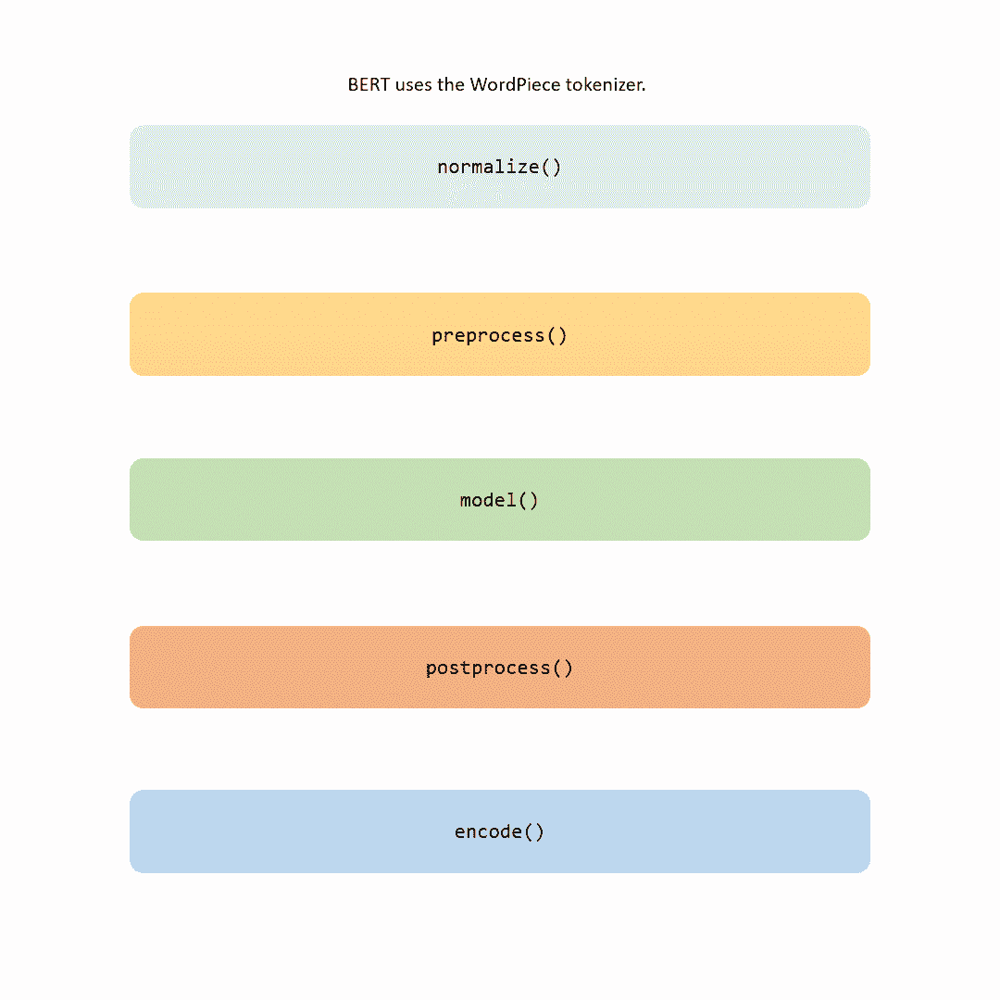

# 从零开始训练 BERT 的终极指南：分词器

> 原文：[`towardsdatascience.com/the-ultimate-guide-to-training-bert-from-scratch-the-tokenizer-ddf30f124822`](https://towardsdatascience.com/the-ultimate-guide-to-training-bert-from-scratch-the-tokenizer-ddf30f124822)

## 从文本到词元：你的 BERT 分词逐步指南

[](https://dpoulopoulos.medium.com/?source=post_page-----ddf30f124822--------------------------------)[](https://towardsdatascience.com/?source=post_page-----ddf30f124822--------------------------------) [Dimitris Poulopoulos](https://dpoulopoulos.medium.com/?source=post_page-----ddf30f124822--------------------------------)

·发布于 [Towards Data Science](https://towardsdatascience.com/?source=post_page-----ddf30f124822--------------------------------) ·阅读时间 13 分钟·2023 年 9 月 6 日

--


图片由 [Glen Carrie](https://unsplash.com/@glencarrie?utm_source=unsplash&utm_medium=referral&utm_content=creditCopyText) 提供，来源于 [Unsplash](https://unsplash.com/photos/oHoBIbDj7lo?utm_source=unsplash&utm_medium=referral&utm_content=creditCopyText)

> 本文的 第一部分、第三部分 和 第四部分 现已上线。

你知道吗？分词的方式可以决定你的语言模型的成败。你是否曾想过对罕见语言或专业领域的文档进行分词？将文本拆分成词元，这不仅仅是一项任务；*它是将语言转化为可操作智能的门户。* 本文将教你关于分词的所有知识，不仅是针对 BERT，还有任何大型语言模型。

在我上一篇文章中，我们讨论了 BERT，探讨了它的理论基础和训练机制，并讨论了如何微调它并创建问答系统。现在，随着我们深入了解这个开创性模型的复杂性，是时候关注一个被忽视的英雄：*分词*。

[](/the-ultimate-guide-to-training-bert-from-scratch-introduction-b048682c795f?source=post_page-----ddf30f124822--------------------------------) ## 从零开始训练 BERT 的终极指南：引言

### 解密 BERT：改变 NLP 领域的模型的定义和各种应用。

towardsdatascience.com

> 第三部分 现在已上线。

我明白了；分词可能看起来是你和训练模型这一激动人心过程之间的最后一个乏味障碍。相信我，我曾经也这样认为。但我在这里告诉你，分词不仅仅是一个“必要的邪恶”——*它本身就是一种艺术形式*。

在这个故事中，我们将检查分词管道的每一个部分。有些步骤很简单（如规范化和预处理），而其他步骤，如建模部分，则是使每个分词器独特的部分。



分词管道 — 作者图片

**当你读完这篇文章时，你不仅会了解 BERT 分词器的方方面面，还会掌握如何在自己的数据上训练它**。如果你感到冒险，你甚至会拥有在从头开始训练自己的 BERT 模型时定制这个关键步骤的工具。

> 将文本拆分成词元，这不是一项繁琐的工作；*它是将语言转化为可操作的智能的门户*。

那么，为什么分词如此关键？*本质上，分词是一个翻译器*；它接受人类语言并将其翻译成机器可以理解的语言：数字。但有一个难点：在这个翻译过程中，分词器必须保持一个重要的平衡，找到意义和计算效率之间的最佳点。所以，你看，这不仅仅是关于计算数字；*它是关于高效地捕捉语言本质，使机器能够理解*。

既然我们有了前提，让我们开始熟悉不同类型的分词器。这个旅程的第一个障碍是确定什么构成一个“单词”——这可能不像你我在讨论语言时通常考虑的那样简单。

> [学习率](https://www.dimpo.me/newsletter?utm_source=medium&utm_medium=article&utm_campaign=bert-tokenization) 是一份面向对 ML 和 MLOps 世界感兴趣的人的通讯。如果你想了解更多类似的话题，可以在[这里](https://www.dimpo.me/newsletter?utm_source=medium&utm_medium=article&utm_campaign=bert-tokenization)订阅。每个月的最后一个星期天你将收到我关于最新 MLOps 新闻和文章的更新和想法！

# 分词的类型

由于分词管道的建模步骤是更具挑战性的，因此在白天还年轻时处理它至关重要。

建立人类和机器语言之间的翻译器有多种方法。让我们探讨三种主要类型并权衡它们的利弊，以理解为什么子词分词在当今 NLP 领域中往往是首选方法。

## 基于单词的分词器

基于词的方法是最简单的，本质上是根据空格或其他分隔符（如标点符号）将原始文本切割成单词。可以把 Python 的`split()`函数看作是一个经典例子。


基于词的分词 — 作者图像

然而，这种方法有其局限性。要真正掌握语言的复杂性，你需要管理一个庞大的词汇表——仅英语就有超过五十万单词。此外，这种方法对屈折形式的处理也存在困难；像“dog”和“dogs”这样的词被视为完全不同的实体。而且如果你选择限制词汇表的大小，"unknown"标记，即任何未包含的词的占位符，将会随处可见，污染数据的含义。

## 基于字符的分词器

在光谱的另一端，我们有基于字符的分词器，它将文本拆分成单个字符。这大大减少了词汇表的大小，并几乎消除了未知标记的问题。例如，英语有 26 个字符。如果加上标点符号和其他符号，词汇表的大小会达到数百。


基于字符的分词器 — 作者图像

但这也有代价：孤立的字符通常缺乏有意义的上下文，这种方法可能会导致冗长的序列，从而增加了计算处理的复杂性，因为模型必须在其缓存中保持的上下文增长得非常快。

## 子词分词

子词分词是一种折衷方法，通常提供两全其美的解决方案。通过将稀有或复杂的词拆解成更小的有意义的单位——例如将“annoyingly”拆分为“annoy”，“ing”和“ly”——这种方法在效率和表现力之间取得了平衡。它提供了紧凑的词汇表而不牺牲语言的丰富性，特别适用于那些词汇可以自然组成更小的、有意义的部分的语言。


子词分词器 — 作者图像

> 请注意，在图中，为了简单起见，我们跳过了管道中的大部分步骤。在实际应用中，大多数情况下分词器已经将每个词转换为小写。

以“annoyingly”这个词为例，展示了子词分词的强大。当将其拆分为三个独立的子标记——“annoy”，“ing”和“ly”时，每个片段都为模型提供了语言理解的小课程。

第一个子标记“annoy”指示分词器关于根动词的基本含义。第二个子标记“ing”捕捉了一个常见的后缀，该后缀具有多种语法功能。它可以表示正在进行的动作（如“running”），动作的过程或结果（如“building”），甚至有助于形成名词（如“painting”）。最后，“ly”子标记则向分词器提示副词或形容词在英语中的常见构造方式，帮助模型理解这个词修饰动作或描述名词的特征。

那么，为什么子词分词已经成为金标准？*它有效地解决了基于单词和基于字符的对比的权衡问题。* 你会得到一个几乎没有未知标记的词汇表，以及一个足够强大的系统，能够捕捉到人类语言中最复杂形式的细微差别。

BERT 使用一种称为“WordPiece”的子词分词方法。接下来的内容将探讨这种方法是如何工作的以及如何自行训练它。

# WordPiece 分词器

因此，让我们从头开始构建 WordPiece 分词器，以理解所有的内部工作原理。**我们的方法将是双管齐下：首先，通过使用各种插图构建一个心理框架，以澄清概念。然后，我们将通过在自定义语料库上训练我们自己的分词器，将理论付诸实践，利用** `[**tokenizers**](https://huggingface.co/docs/tokenizers/index)` **库。**

首先，我们需要一个语料库——一个文本数据集，我们的分词器将从中学习。我们以以下段落作为起点：

> WordPiece 算法在 BERT 这一前沿语言模型的架构中扮演了至关重要的角色。具体而言，WordPiece 负责分词过程，将文本分解成更小、更易管理的单位或标记。这个分词步骤在 BERT 的预训练阶段至关重要，使模型能够有效地学习单词或子词之间的关系。通过使用 WordPiece 进行分词，BERT 在处理各种语言结构和细微差别时变得更加灵活。

因此，第一步是统计我们语料库中每个单词的出现次数，并将它们拆分成最小的单位：


作者提供的图像

在我们的实践练习中，你会注意到我们最初将单词拆分成单个字符。但这还不是全部：我们在原本出现在单词中间的字符前加上符号 `##`，将它们与那些作为单词开头字母的字符区分开。稍后你会看到这为什么很重要。

如果我们收集所有拆分，我们将创建我们的初始分词器词汇表。WordPiece 从可能的最小词汇表（即单个字符的词汇表）开始，并将其扩展到我们设定的限制。它是如何做到的呢？很高兴你问了！让我们看看，下一步是识别我们词汇表中每一个可能的字符配对：


图片由作者提供

现在，我们需要为每个配对分配一个得分。计算得分的公式如下：


图片由作者提供

因此，如果我们尝试计算第一个配对（`T, ##h`）的得分，我们得到以下结果：


图片由作者提供

使用相同的方法，我们计算每个配对的得分，并识别得分最高的配对。在我们的例子中，这个配对是（`##E, ##R`），所以接下来，我们可以将这个配对添加到我们的词汇表中，并通过合并这些字符更新拆分。我们的新词汇表现在多了一个标记：


图片由作者提供

接下来，我们重新回到我们的拆分，识别每一个可能的配对，对其打分，并将得分最高的配对添加到我们的词汇表中。我们在这里做的本质上是一种优化。通过识别常见的配对并将其视为单一单位，我们使分词器更加高效。

我们继续这个识别、评分和添加高分配对的过程，直到我们达到希望在词汇表中包含的目标标记数量。因此，通过将期望的标记数量设置为`60`，我们得到了以下词汇表：

> ‘##E’，‘##P’，‘##R’，‘##T’，‘##a’，‘##b’，‘##c’，‘##d’，‘##e’，‘##f’，‘##g’，‘##h’，‘##i’，‘##k’，‘##l’，‘##m’，‘##n’，‘##o’，‘##p’，‘##r’，‘##s’，‘##t’，‘##u’，‘##v’，‘##w’，‘##x’，‘##y’，‘##z’，‘，’，‘-’，‘。’，‘B’，‘S’，‘T’，‘W’，‘a’，‘b’，‘c’，‘d’，‘e’，‘f’，‘h’，‘i’，‘l’，‘m’，‘n’，‘o’，‘p’，‘r’，‘s’，‘t’，‘u’，‘v’，‘w’，‘##ERT’

最终，为了计算一个词的子标记，我们从字符串的开头开始，尝试识别出我们词汇表中出现的最长可能序列。例如，单词`BERT`被拆分为以下子词：`B`，`##ERT`：


图片由作者提供

作为我们分词器词汇表的最后润色，我们引入了一组特殊标记，这些标记在 BERT 模型中具有特定功能，并作为语言学标记。通常，这些特殊标记包括：`[[PAD], [UNK], [CLS], [SEP], [MASK]]`。

这里是每个特殊标记设计用途的简要说明：

+   `[PAD]`：用于平衡不同输入序列长度的填充标记。

+   `[UNK]`：表示“未知”，用于处理不在词汇表中的词。

+   `[CLS]`：即“分类”的缩写，这个标记在模型用于分类任务时会被加在输入的前面。

+   `[SEP]`：分隔符令牌，通常用于指示多句任务中一句话的结束和另一句话的开始。

+   `[MASK]`：在 BERT 模型的训练过程中使用，用于指示模型应预测缺失单词的位置。

就这样！你现在知道了 WordPiece，BERT 的分词器，如何将每个单词拆分成子词。接下来，让我们在我们的语料库上训练一个自定义的分词器。

# 训练 WordPiece

作为一名母语为希腊语的讲者，我对为希腊语训练 BERT 的 WordPiece 分词器的前景感到特别兴奋。如果你的母语不是英语，我强烈建议你也这么做。*本地化这些强大的模型不仅有助于自然语言处理技术的多样化，还提供了将它们调整到你自己语言或方言细微差别的机会。*

但如果你是英语讲者，可以考虑将你的分词器针对特定领域或行业进行优化。例如，你可以在法律文件上训练它，以捕捉法律术语的独特性。或者尝试让它理解 Python 代码？

在我的情况下，我需要找到并下载数据集。如今，获取所需的数据集比以往任何时候都要容易，感谢 Hugging Face Hub。我将使用`greek_legal_code`数据集：

```py
from datasets import load_dataset

raw_datasets = load_dataset("greek_legal_code", "chapter")
```

接下来，让我们快速创建我们的训练语料库。为此，我们只使用`1000`个`train`拆分的示例：

```py
training_corpus = (
    raw_datasets["train"][i : i + 1000]["text"]
    for i in range(0, len(raw_datasets["train"]), 1000)
)
```

接下来，让我们了解一下预训练的 BERT 分词器：

```py
from transformers import AutoTokenizer

old_tokenizer = AutoTokenizer.from_pretrained("bert-base-uncased")
```

为了比较前后效果，让我们看看原始 BERT 分词器如何对希腊语维基百科的[机器学习](https://el.wikipedia.org/wiki/%CE%9C%CE%B7%CF%87%CE%B1%CE%BD%CE%B9%CE%BA%CE%AE_%CE%BC%CE%AC%CE%B8%CE%B7%CF%83%CE%B7)进行分词：

```py
example = ("Μηχανική μάθηση είναι υποπεδίο της επιστήμης των υπολογιστών,"
           " που αναπτύχθηκε από τη μελέτη της αναγνώρισης προτύπων και της"
           " υπολογιστικής θεωρίας μάθησης στην τεχνητή νοημοσύνη. Το 1959,"
           " ο Άρθουρ Σάμουελ ορίζει τη μηχανική μάθηση ως 'Πεδίο μελέτης που"
           " δίνει στους υπολογιστές την ικανότητα να μαθαίνουν, χωρίς να έχουν"
           " ρητά προγραμματιστεί'")

tokens = old_tokenizer.tokenize(example)
print(tokens); print(len(tokens))
```

结果如下所示。总共，我们得到 274 个不同的令牌：

```py
['μ', '##η', '##χ', '##α', '##ν', '##ι', '##κ', '##η', 'μ', '##α', '##θ', '##η', '##σ', '##η', 'ε', '##ι', '##ν', '##α', '##ι', 'υ', '##π', '##ο', '##π', '##ε', '##δ', '##ι', '##ο', 'τ', '##ης', 'ε', '##π', '##ι', '##σ', '##τ', '##η', '##μ', '##ης', 'τ', '##ω', '##ν', 'υ', '##π', '##ο', '##λ', '##ο', '##γ', '##ι', '##σ', '##τ', '##ω', '##ν', ',', 'π', '##ου', 'α', '##ν', '##α', '##π', '##τ', '##υ', '##χ', '##θ', '##η', '##κ', '##ε', 'α', '##π', '##ο', 'τ', '##η', 'μ', '##ε', '##λ', '##ε', '##τ', '##η', 'τ', '##ης', 'α', '##ν', '##α', '##γ', '##ν', '##ω', '##ρ', '##ι', '##σ', '##ης', 'π', '##ρ', '##ο', '##τ', '##υ', '##π', '##ω', '##ν', 'κ', '##α', '##ι', 'τ', '##ης', 'υ', '##π', '##ο', '##λ', '##ο', '##γ', '##ι', '##σ', '##τ', '##ι', '##κ', '##ης', 'θ', '##ε', '##ω', '##ρ', '##ια', '##ς', 'μ', '##α', '##θ', '##η', '##σ', '##ης', 'σ', '##τ', '##η', '##ν', 'τ', '##ε', '##χ', '##ν', '##η', '##τ', '##η', 'ν', '##ο', '##η', '##μ', '##ο', '##σ', '##υ', '##ν', '##η', '.', 'τ', '##ο', '1959', ',', 'ο', 'α', '##ρ', '##θ', '##ου', '##ρ', 'σ', '##α', '##μ', '##ου', '##ε', '##λ', 'ο', '##ρ', '##ι', '##ζ', '##ε', '##ι', 'τ', '##η', 'μ', '##η', '##χ', '##α', '##ν', '##ι', '##κ', '##η', 'μ', '##α', '##θ', '##η', '##σ', '##η', 'ω', '##ς', "'", 'π', '##ε', '##δ', '##ι', '##ο', 'μ', '##ε', '##λ', '##ε', '##τ', '##ης', 'π', '##ου', 'δ', '##ι', '##ν', '##ε', '##ι', 'σ', '##τ', '##ου', '##ς', 'υ', '##π', '##ο', '##λ', '##ο', '##γ', '##ι', '##σ', '##τ', '##ε', '##ς', 'τ', '##η', '##ν', 'ι', '##κ', '##α', '##ν', '##ο', '##τ', '##η', '##τ', '##α', 'ν', '##α', 'μ', '##α', '##θ', '##α', '##ι', '##ν', '##ου', '##ν', ',', 'χ', '##ω', '##ρ', '##ι', '##ς', 'ν', '##α', 'ε', '##χ', '##ου', '##ν', 'ρ', '##η', '##τ', '##α', 'π', '##ρ', '##ο', '##γ', '##ρ', '##α', '##μ', '##μ', '##α', '##τ', '##ι', '##σ', '##τ', '##ε', '##ι', "'"]
274
```

现在，让我们训练分词器以更好地理解希腊语。我们将使用`50000`个单词的词汇表：

```py
tokenizer = old_tokenizer.train_new_from_iterator(training_corpus, 50000)
```

最后，重复测试：

```py
tokens = tokenizer.tokenize(example)
print(tokens); print(len(tokens))
```

结果非常惊人；我们将令牌的数量减少到了`67`，而且分词器似乎更好地理解了希腊语的细微差别：

```py
['μηχανικη', 'μαθη', '##ση', 'ειναι', 'υποπε', '##διο', 'της', 'επιστημης', 'των', 'υπολογιστων', ',', 'που', 'αναπτυχ', '##θηκε', 'απο', 'τη', 'μελετη', 'της', 'αναγνωρισης', 'προτυπων', 'και', 'της', 'υπολογισ', '##τικης', 'θεωριας', 'μαθησης', 'στην', 'τεχνητη', 'νοη', '##μοσυνη', '.', 'το', '1959', ',', 'ο', 'αρθ', '##ουρ', 'σαμου', '##ελ', 'οριζει', 'τη', 'μηχανικη', 'μαθη', '##ση', 'ως', "'", 'πεδιο', 'μελετης', 'που', 'δινει', 'στους', 'υπολογιστες', 'την', 'ικανοτητα', 'να', 'μα', '##θαι', '##νου', '##ν', ',', 'χωρις', 'να', 'εχουν', 'ρητα', 'προγραμματισ', '##τει', "'"]
67
```

就这样！你现在已经完全准备好训练一个符合你自己语料库的分词器。但不要止步于此——可以随意尝试完全不同的算法！想要切换方向，探索另一种方法？你可以轻松加载 GPT 分词器，它使用的是字节对编码（BPE）算法，而不是 WordPiece。在微调和定制分词器方面，天空才是极限。

# 结论

这真是一段旅程！从深入了解分词的复杂细节，到构建我们自己专属的 WordPiece 分词器，我们已经覆盖了很多内容。

如果你跟随了整个过程，你现在不仅拥有理论知识，还有实际的经验来创建一个符合你需求的分词器。也许你会为你的母语适配它，或者为某个行业特定的应用，甚至是像源代码分析这样复杂的任务。

记住，我们在这里探讨的原则超越了任何单一语言或领域。它们是所有自然语言处理任务的基础。通过理解和掌握这些原则，你为在一个只会变得更加重要的领域中取得成功奠定了基础。

是时候为下一个激动人心的阶段做好准备了——为模型训练准备数据集。相信我，如果你觉得分词很吸引人，那么数据集准备将同样令人瞩目。这将是我们所组装的所有部分——分词器、特殊标记以及你的领域或语言特定的细节——汇聚在一起，为 BERT 模型的学习过程提供动力的地方。

敬请关注！

# 关于作者

我的名字是 [Dimitris Poulopoulos](https://www.dimpo.me/?utm_source=medium&utm_medium=article&utm_campaign=bert-tokenization)，我是为 [HPE](https://www.hpe.com/us/en/home.html) 工作的机器学习工程师。我为欧洲委员会、国际货币基金组织、欧洲中央银行、宜家、Roblox 等主要客户设计和实施了 AI 和软件解决方案。

如果你有兴趣阅读更多关于机器学习、深度学习、数据科学和数据操作的文章，请关注我在 [Medium](https://towardsdatascience.com/medium.com/@dpoulopoulos/follow)、[LinkedIn](https://www.linkedin.com/in/dpoulopoulos/) 或者 Twitter 上的 [@james2pl](https://twitter.com/james2pl)。

所表达的观点仅代表我个人，并不代表我的雇主的观点或意见。
