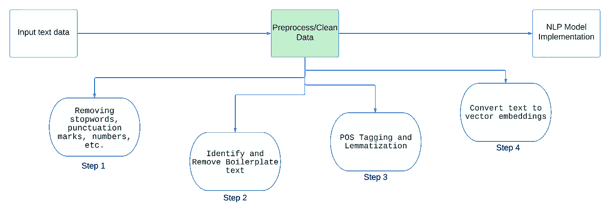
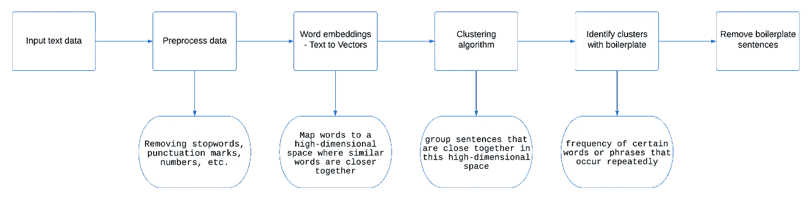
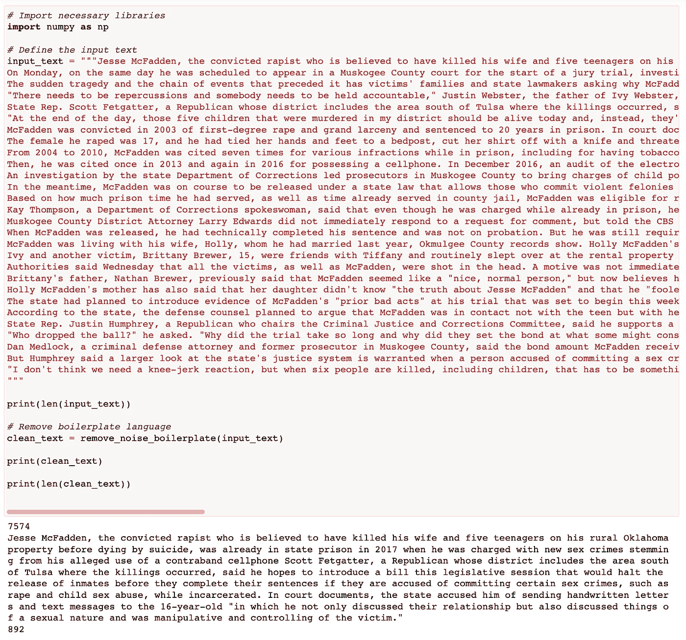

# 你 NLP 模型的终极预处理流程

> 原文：[`towardsdatascience.com/the-ultimate-preprocessing-pipeline-for-your-nlp-models-80afd92650fe`](https://towardsdatascience.com/the-ultimate-preprocessing-pipeline-for-your-nlp-models-80afd92650fe)

## 通过提供最佳可能的输入，充分发挥 NLP 机器学习模型的效果。

[](https://rahulraj24.medium.com/?source=post_page-----80afd92650fe--------------------------------)[](https://towardsdatascience.com/?source=post_page-----80afd92650fe--------------------------------) [Rahulraj Singh](https://rahulraj24.medium.com/?source=post_page-----80afd92650fe--------------------------------)

·发表在 [Towards Data Science](https://towardsdatascience.com/?source=post_page-----80afd92650fe--------------------------------) ·阅读时间 10 分钟·2023 年 5 月 8 日

--


照片由 [Cyrus Crossan](https://unsplash.com/@cys_escapes?utm_source=medium&utm_medium=referral) 提供，发布在 [Unsplash](https://unsplash.com/?utm_source=medium&utm_medium=referral) 上。

如果你曾经参与过文本摘要项目，你可能会发现很难看到你期望的结果。你脑海中有一个关于算法如何工作的概念，以及它应该在文本摘要中标记哪些句子，但往往算法提供的结果是“不是很准确”的。更有趣的是关键词提取，因为从主题建模到向量化嵌入的各种算法都表现得很出色，但当输入一个段落时，它们给出的结果同样是“不是很准确”的，因为出现频率最高的词不一定是段落中最重要的词。

> 数据预处理和清洗的需求在很大程度上取决于你要解决的具体问题。我将尝试创建一个通用的流程，应该适用于所有 NLP 模型，但你总是需要调整这些步骤，以获得最佳的结果。在这个故事中，我将重点关注解决 **主题建模、关键词提取和文本摘要** 的 NLP 模型。



预处理流程 | 作者图像

上面的图片概述了我们将要遵循的预处理 NLP 管道的过程。上述四个步骤将在后面用代码解释，同时还附有一个 Jupyter 笔记本，实现了完整的管道。这条管道的想法是突出那些能够提升将在文本数据上使用的机器学习算法性能的步骤。这是在输入数据和模型训练之间的一个步骤。

# 1\. 清理文本

结构化管道的第一步是清理输入文本数据，这可能包含几个步骤，具体取决于你试图构建的模型以及你期望的结果。机器学习算法（或者说几乎所有计算机算法，实际上是每一条计算机指令）都在数字上工作，这就是为什么为文本数据构建模型具有挑战性的原因。你实际上是在要求计算机学习和处理它从未见过的内容，因此需要多花一些功夫。

在下面的部分中，我提供了我们管道的第一个功能来执行文本数据的清理。清理功能包含许多操作部分，我在代码的注释中解释了它们。

要查看该功能的性能，下面是函数的输入和它生成的输出。

```py
input_text = "This is an example from a key football match tweet text with \n
a <b>HTML tag</b>, an emoji 😃 expression happiness and 😍 with eyes too, we 
also have a link https://example.google.com, extra   w. h.  i.  t. e.   
spaces, accented characters like café, contractions we generally observe 
like don't and won't, some very special characters like @ and #, UPPERCASE 
letters, numericals like 123455, and general english stopwords like a, an, 
and the. Why not add punctuations like !, ?, and ,. too"

clean_text = clean_text(input_text)
print(clean_text)

----------------------------------------------------------------------------
example key football match tweet text html tag emoji grinning face big eyes 
expression happiness smiling face hearteyes eyes also link extra w h e spaces 
accented characters like cafe contractions generally observe like special 
characters like uppercase letters numericals like one hundred twentythree 
thousand  four hundred fiftyfive general english stopwords like add 
punctuations like
```

正如我们在输出中所观察到的，文本现在已经清除了所有的 HTML 标签，将表情符号转换为其文字形式，并纠正了任何标点符号和特殊字符。现在处理这些文本更为简便，在接下来的几步中，我们将进一步优化它。

# 2\. 聚类以去除数据中的噪声和模板语言

我们预处理管道中的下一步可能是最重要且被低估的 NLP 工作流程活动。在下面的图示中，你可以看到下面的算法将要执行的粗略表示。



噪声去除过程的表示 | 作者提供的图片

那么，为什么去除噪声如此重要？因为这些文本隐藏在输入数据中，但不包含任何能够使学习算法更好的有用信息。像法律协议、新闻文章、政府合同等文件中包含了大量特定于组织的模板文本。假设你从法律合同中创建一个主题建模项目，以了解一系列合同中最重要的术语，而算法将管辖权解释和州法律定义作为合同中最重要的部分。法律合同包含了大量的法律和仲裁定义，但这些都是公开的，因此不特定于手头的合同，这使得这些预测实际上毫无用处。我们需要提取特定于该合同的信息。

> 从文本数据中去除模板语言是一项具有挑战性的工作，但却极为重要。由于这些数据都是干净的文本，因此很难检测和去除。但如果不去除，它会显著影响模型的学习过程。

现在让我们看看一个去除输入噪声和模板语言的函数的实现。这个算法使用聚类来找出重复出现的句子和词汇，并将其删除，假设重复超过阈值次数的内容可能是“噪声”。

下面，我们来看看这个函数在作为算法输入的新闻文章 [3] 上会产生什么结果。



去除模板代码的输出 | 图片由作者提供

从上面的输出图片中你可以看到，输入算法的文本长度为 7574，通过去除噪声和模板文本减少到 892。***去除模板和噪声将我们的输入大小减少了近 88%，*** 这些原本会进入机器学习算法的垃圾数据。结果文本是更清晰、更有意义的摘要形式。**通过去除噪声，我们让算法专注于重要的内容。**

# 3\. 词性标注

词性标注（POS），即为输入句子的每个词分配特定的词性标签的过程。它读取并理解词与句子中其他词的关系，并识别每个词的使用上下文。这些词性标签包括名词、动词、形容词、代词、介词、副词、连词和感叹词。这个过程至关重要，因为对于情感分析、文本分类、信息提取、机器翻译或任何其他形式的分析算法来说，了解词汇的使用上下文是非常重要的。上下文可以大大影响算法的自然语言理解（NLU）过程。

接下来，我们将进入预处理管道的最后一步，即将文本转换为向量嵌入，供机器学习算法使用。但是，在这之前，让我们讨论两个关键话题：词形还原和词干提取。

## 你需要词形还原（Lemmatization）还是词干提取（Stemming）？

词形还原和词干提取是自然语言处理工作流中常用的两种技术，帮助将屈折变化的词汇还原到其基础或根本形式。这些操作可能是最受质疑的，因此了解何时使用和何时不使用这些功能是值得的。词形还原和词干提取的核心思想是减少输入特征空间的维度。这有助于提高最终读取这些数据的机器学习模型的性能。

> 词干提取通过去除单词的后缀来将其还原为基本形式，而词形还原则使用词汇表和形态分析的形式将单词还原为基本形式。

由于其功能，词形还原通常比词干提取更准确，但计算开销较大。你特定用例中速度和准确性的权衡通常有助于决定使用哪种方法。

实施词形还原和词干提取时需要注意的一些重要点：

1.  **词形还原**保留了输入文本的语义。针对**情感分析**的算法，如果模型需要单词的时态，可能会工作得很好。过去发生的事情可能与现在发生的相同事情具有不同的情感。

1.  **词干提取**速度快，但准确性较低。在尝试进行**文本分类**的情况下，其中有成千上万的单词需要分类时，词干提取可能比词形还原更有效，主要是因为其速度。

1.  像所有方法一样，可能值得在你的用例中探索两者，并比较模型的性能，以查看哪种效果最好。

1.  此外，一些深度学习模型具备自动学习词汇表示的能力，这使得使用这些技术变得无关紧要。

# 4\. 词形还原和向量嵌入

该预处理工作流程的最终步骤是应用词形还原和将单词转换为向量嵌入（因为要记住机器如何最好地处理数字而非单词吗？）。如前所述，词形还原可能根据你预期的结果和使用的机器学习技术，可能需要或不需要。为了更通用的方法，我在我的预处理管道中包含了它。

下面编写的函数将从接收到的词性标注输入中提取单词，对每个单词进行词形还原，然后将向量嵌入应用于词形还原后的单词。注释进一步解释了每个步骤。

该函数将返回一个形状为 (num_words, X) 的 numpy 数组，其中 *‘num_words’* 表示输入文本中的单词数量，*‘X’* 是向量嵌入的大小。

> 向量嵌入的单词（单词的数值形式）应作为输入提供给任何机器学习算法。在使用深度学习模型或多个大型语言模型（LLMs）时，向量嵌入和词形还原可能不需要，因为算法已经足够成熟，可以构建自己对单词的表示。因此，如果你使用这些“自学习”算法中的任何一种，这可以是一个可选步骤。

## 完整管道实现

上述四个部分详细说明了我们预处理管道中的每个部分，下面附有用于运行预处理代码的工作笔记本。

[](https://github.com/rjrahul24/ai-with-python-series/blob/main/08.%20Natural%20Language%20Processing/Preprocessing%20Pipeline/NLP%20Preprocessing%20Pipeline%20.ipynb?source=post_page-----80afd92650fe--------------------------------) [## ai-with-python-series/NLP 预处理管道

### 一系列旨在学习人工智能概念的 Python 教程。该系列教程从…

[github.com](https://github.com/rjrahul24/ai-with-python-series/blob/main/08.%20Natural%20Language%20Processing/Preprocessing%20Pipeline/NLP%20Preprocessing%20Pipeline%20.ipynb?source=post_page-----80afd92650fe--------------------------------)

我想提醒您，这种实现并不是对每个 NLP 问题的一次性解决方案。构建一个稳健的预处理管道的核心思想是创建一个能够将最佳输入提供给机器学习算法的工作流程。上述步骤的顺序应该能解决约 70%的问题，通过针对特定用例的微调，您应该能够解决剩余部分。

# 结论


由 [Brett Jordan](https://unsplash.com/@brett_jordan?utm_source=medium&utm_medium=referral) 拍摄，来自 [Unsplash](https://unsplash.com/?utm_source=medium&utm_medium=referral)

我希望这个故事为您下一个自然语言处理（NLP）项目提供了一个稳健的框架。虽然处理词语是 AI 领域中最具挑战性的任务之一，但数据的适当清理、预处理和准备可以确保机器的学习过程顺畅。正如正确实施本文提到的技术一样，**遵循这里突出显示的预处理活动的顺序同样重要**。

> 每一步都依赖于前一步的成功。

如果输入到该算法中的数据包含大量停用词或 HTML 标签，模板删除逻辑将无法准确识别噪音。类似地，对整个文本进行词性标注、词形还原和向量化会使计算成本极高，并且很少像垃圾进垃圾出那样有效。因此，请尝试这个管道，并在您的 NLP 设置中享受更好的结果。

## 关于我

我已经使用 AI 构建产品和解决方案好几年了。在我目前在 Bloomberg 的职位之前，我曾在 Microsoft、Tesla 和 Johnson & Johnson 从事数据和机器学习工作。我拥有哥伦比亚大学的数据科学学位，同时也参与了人工智能负责任和伦理使用的研究。除了我的工作，我还是两本关于机器学习和数据科学的书籍及在线课程的作者。我不断探索通过利用 AI 解决复杂问题的方式，以在世界上产生积极影响，同时秉持伦理和负责任的实践。

随时通过[LinkedIn](https://www.linkedin.com/in/rjrahul24/)或[Twitter](https://twitter.com/rjrahul24)与我联系。

## 这里有更多你可能感兴趣的数据科学内容！

[](/a-detailed-novice-introduction-to-natural-language-processing-nlp-90b7be1b7e54?source=post_page-----80afd92650fe--------------------------------) ## 自然语言处理（NLP）的详细新手入门

### 《Python 中开始使用 NLP 的终极代码指南》

towardsdatascience.com [](/a-step-by-step-guide-to-speech-recognition-and-audio-signal-processing-in-python-136e37236c24?source=post_page-----80afd92650fe--------------------------------) ## Python 中语音识别和音频信号处理的逐步指南

### 教授机器人类词汇的科学

towardsdatascience.com [](/the-ultimate-guide-to-emotion-recognition-from-facial-expressions-using-python-64e58d4324ff?source=post_page-----80afd92650fe--------------------------------) ## 使用 Python 从面部表情识别情感的终极指南

### 构建一个可以处理图像和视频的面部情感识别（FER）算法

towardsdatascience.com

## 资源

[1] [`dataaspirant.com/nlp-text-preprocessing-techniques-implementation-python/#t-1600081660732`](https://dataaspirant.com/nlp-text-preprocessing-techniques-implementation-python/#t-1600081660732)

[2] [`www.exxactcorp.com/blog/Deep-Learning/text-preprocessing-methods-for-deep-learning`](https://www.exxactcorp.com/blog/Deep-Learning/text-preprocessing-methods-for-deep-learning)

[3] [`www.nbcnews.com/news/us-news/oklahoma-sex-offender-suspected-killing-6-was-free-sex-crimes-charges-rcna82884`](https://www.nbcnews.com/news/us-news/oklahoma-sex-offender-suspected-killing-6-was-free-sex-crimes-charges-rcna82884)

[4] [`www.nltk.org/book/ch05.html`](https://www.nltk.org/book/ch05.html)

[5] [`www.turing.com/kb/guide-on-word-embeddings-in-nlp`](https://www.turing.com/kb/guide-on-word-embeddings-in-nlp)
