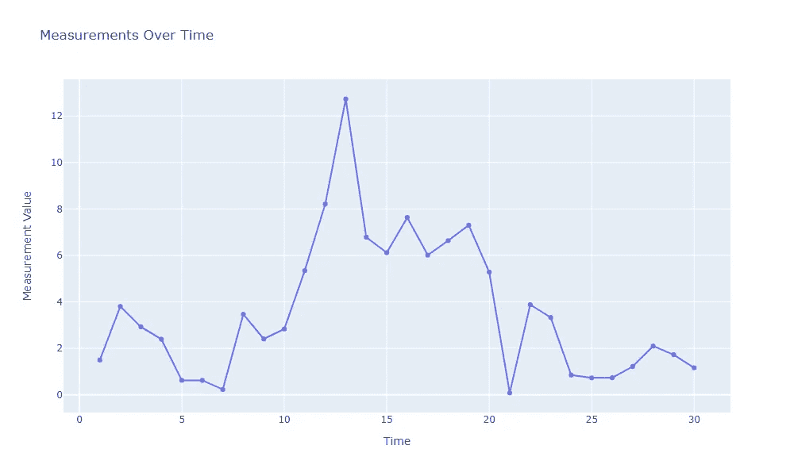
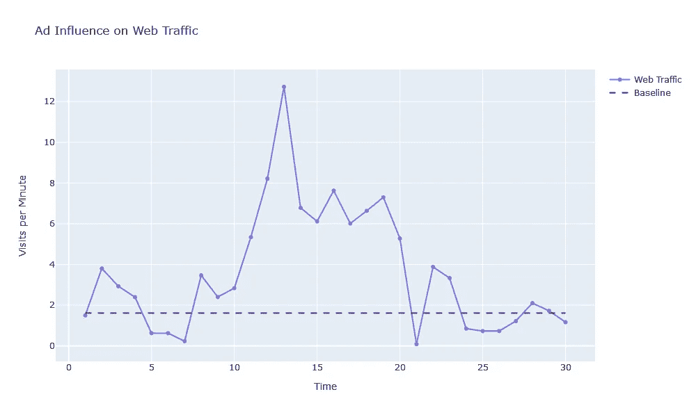
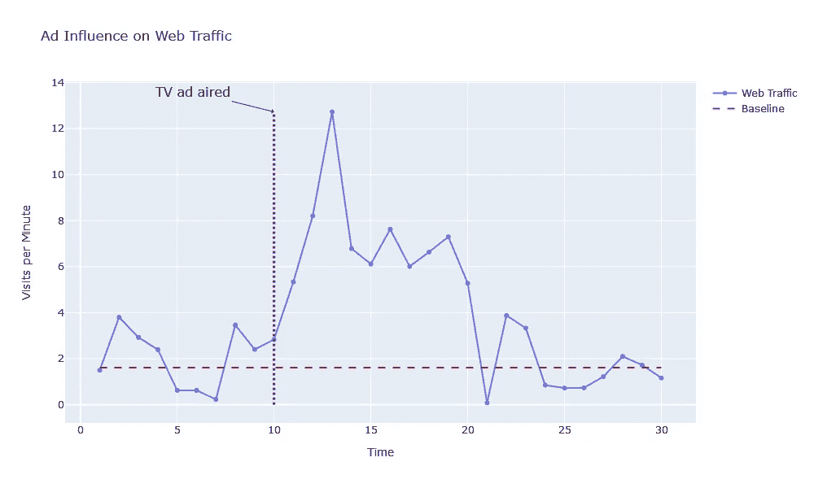
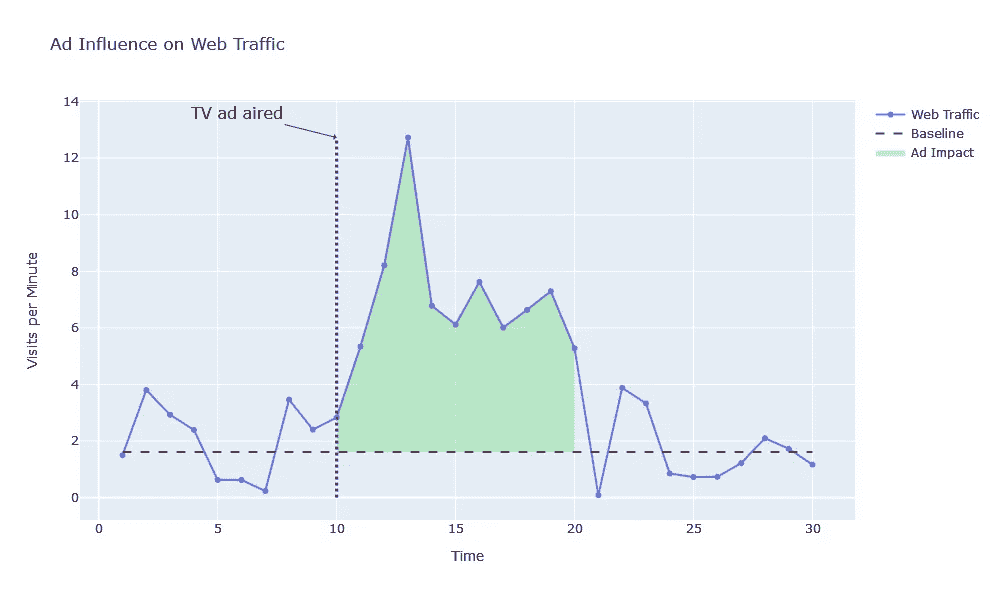
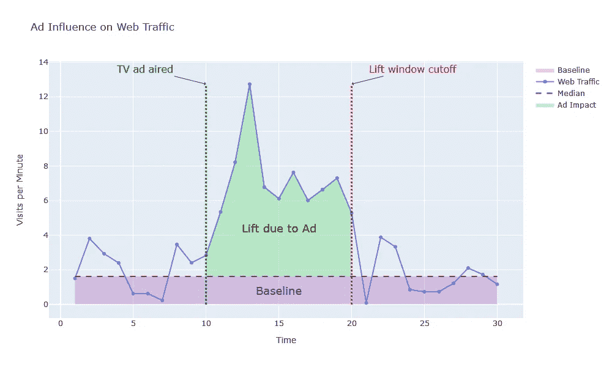

# 终极可视化助手

> 原文：[`towardsdatascience.com/the-ultimate-visualization-assistant-2dc89003d847`](https://towardsdatascience.com/the-ultimate-visualization-assistant-2dc89003d847)

## 一个与 AI 的夜晚如何改变了我对数据可视化的方式

[](https://medium.com/@anthonybaum?source=post_page-----2dc89003d847--------------------------------)[](https://towardsdatascience.com/?source=post_page-----2dc89003d847--------------------------------) [Anthony Baum](https://medium.com/@anthonybaum?source=post_page-----2dc89003d847--------------------------------)

·发表于 [Towards Data Science](https://towardsdatascience.com/?source=post_page-----2dc89003d847--------------------------------) ·阅读时间 9 分钟·2023 年 6 月 30 日

--


[Simon Abrams](https://unsplash.com/@flysi3000?utm_source=medium&utm_medium=referral)的照片，来源于[Unsplash](https://unsplash.com/?utm_source=medium&utm_medium=referral)

当太阳开始暗淡，城市灯光逐渐亮起时，办公室熬夜的不可避免性开始显现。我发现自己在与时间赛跑。一个关键的销售演示即将到来，而成功取决于一个未完成的请求——一个能够简洁传达我们新电视广告归因模型基本方法的有洞察力的数据可视化。

我需要一种既足够复杂以展示，又足够简单以无需解释即可传达大部分信息的东西。在时间紧迫的情况下，这并不容易。值得庆幸的是，人工智能的灯塔，我可靠的新助手——ChatGPT——随时准备简化眼前的任务。它的主要使命是：帮助我将脑海中仅仅是概念的数据转化为优雅的视觉叙事，能够吸引即使是最厌恶数据的观众。

这可能有点戏剧化，但我*确实*有点赶时间。对于一个销售演示，这需要一个过于简单的例子，我在我们的数据库中找不到，因此只好使用虚构的示例数据。

我脑海中清楚地知道我想展示的内容——一个网络流量基线、电视广告后网络响应的激增，以及一种在几乎没有文字的情况下传达我们将在这个例子中将基线与激增之间的差异归因的方式。

Matplotlib 图表在学术论文中非常扎实，但制作出既复杂又真正引人注目的图表可能需要过人的技巧。我经常转向 Power BI 来获取现成的外观和快速图表，但当你需要从零开始制定某些内容而没有现成数据时，它并不理想。

我已经使用了 Plotly 一段时间，这似乎是一个不错的选择。然而，我对这个包的信心不够，不能在不花费宝贵时间翻阅文档和 Stack Overflow 的情况下把我的想法变成代码。因此，时间紧迫，我开始了我的第一个提示。

> 我正在创建一个可视化图表，显示电视广告播出后的网络流量反应。我们从将网络流量表示为 30 分钟内每分钟网站访问次数开始。前十分钟需要是 0 到 4 之间的随机数。第二个十分钟周期需要是 4 到 20 之间的随机数，并且这些数字分布看起来像右偏直方图。第三个十分钟周期与第一个十分钟周期相同。请使用 Plotly 创建这些数据并绘制折线图。

提示返回了以下内容，我仅在 update_layout 函数中进行了编辑：

```py
import numpy as np
import plotly.graph_objects as go

# Set seed for reproducibility
np.random.seed(42)

# Create arrays with the specified distributions
first_ten = np.random.uniform(low=0, high=4, size=10)
last_ten = np.random.uniform(low=0, high=4, size=10)
middle_ten = np.random.gamma(shape=2, scale=2, size=10) + 4 # shift the gamma distribution

# Combine the arrays
measurements = np.concatenate((first_ten, middle_ten, last_ten))

# Create x values
x_values = np.arange(1, 31)

# Create the line chart
fig = go.Figure(
    data=go.Scatter(
        x=x_values, 
        y=measurements, 
        mode='lines+markers')
    )

fig.update_layout(
    title='Ad Influence on Web Traffic', 
    xaxis_title='Time', 
    yaxis_title='Visits per Minute',
    width=1000,
    height=600
)

fig.show()
```



上一个代码块生成的图表

我已经对这一点感到印象深刻，因为我没想到右偏直方图样式的请求处理得如此出色。也许我甚至能在下班前的聚会结束之前完成。

接下来，我需要一些东西来表示网络流量的基线。实际上，这可以简单到滚动中位数，但由于数据长度有限，这里要求这个可能行不通。相反，我认为前十组和后三组十个观测值的中位数可能更能传达正确的想法。

> 请首先计算两个数组 first_ten 和 last_ten 的联合中位数。将计算得到的中位数绘制为常量水平线。

```py
import numpy as np
import plotly.graph_objects as go

# Set seed for reproducibility
np.random.seed(42)

# Create arrays with the specified distributions
first_ten = np.random.uniform(low=0, high=4, size=10)
last_ten = np.random.uniform(low=0, high=4, size=10)
middle_ten = np.random.gamma(shape=2, scale=2, size=10) + 4 # shift the gamma distribution

# Combine the arrays
measurements = np.concatenate((first_ten, middle_ten, last_ten))

# Create x values
x_values = np.arange(1, 31)

# Calculate combined median
combined_median = np.median(np.concatenate((first_ten, last_ten)))

# Create the line chart
fig = go.Figure()

# Create the line chart
fig = go.Figure(
    data=go.Scatter(
        x=x_values, 
        y=measurements, 
        mode='lines+markers')
    )

# Add median line
fig.add_trace(
    go.Scatter(
        x=x_values, 
        y=[combined_median]*len(x_values), 
        mode='lines', 
        name='Baseline', 
        line=dict(color='firebrick', width=2, dash='dash'))
)

fig.update_layout(
    title='Ad Influence on Web Traffic',
    xaxis_title='Time',
    yaxis_title='Visits per Minute',
    width=1000,
    height=600
)

fig.show()
```

然后我仅将中位数线追踪的名称从“Median”更改为“Baseline”。



上面代码块中的图表，添加了基线常量线

现在，如果你对营销模型有所了解，“提升”的概念就会显现出来，但对于未受过训练的眼睛来说，这需要一些更集中的元素；需要解释的越少，视觉效果就越有效。此时主要缺少的是一个能暗示网络流量激增的因果关系的图表元素，以及一种传达归因于广告的流量量的方法。

我从因果关系元素开始。

> 在数据的第 10 分钟，一则电视广告播出，并引发了网络流量的激增。你会建议使用什么样的图表元素来传达不仅广告在那一分钟播出，而且广告是流量激增的原因？

响应建议使用垂直线和注释，并提供了代码更新。

```py
import numpy as np
import plotly.graph_objects as go

# Set seed for reproducibility
np.random.seed(42)

# Create arrays with the specified distributions
first_ten = np.random.uniform(low=0, high=4, size=10)
last_ten = np.random.uniform(low=0, high=4, size=10)
middle_ten = np.random.gamma(shape=2, scale=2, size=10) + 4 # shift the gamma distribution

# Combine the arrays
measurements = np.concatenate((first_ten, middle_ten, last_ten))

# Create x values
x_values = np.arange(1, 31)

# Calculate combined median
combined_median = np.median(np.concatenate((first_ten, last_ten)))

# Create the line chart
fig = go.Figure()

# Add scatter plot
fig.add_trace(
    go.Scatter(
        x=x_values, 
        y=measurements, 
        mode='lines+markers', 
        name='Web Traffic')
)

# Add median line
fig.add_trace(
    go.Scatter(
        x=x_values, 
        y=[combined_median]*len(x_values), 
        mode='lines', 
        name='Baseline', 
        line=dict(color='firebrick', width=2, dash='dash'))
)

# Add vertical line at minute 10
fig.add_shape(
    type='line',
    x0=10, y0=0,
    x1=10, y1=max(measurements),
    line=dict(
        color="Purple",
        width=3,
        dash="dot",
    )
)

# Add annotation to indicate TV spot
fig.add_annotation(
    x=10,
    y=max(measurements),
    text="TV ad aired",
    showarrow=True,
    arrowhead=1,
    ax=-100,
    ay=-25,
    font=dict(
        size=16,
        color="Black"
    ),
)

fig.update_layout(
    title='Ad Influence on Web Traffic',
    xaxis_title='Time',
    yaxis_title='Visits per Minute',
    width=1000,
    height=600
)

fig.show()
```

我仅更改了注释的字体大小。



上面代码块中的图表，添加了电视广告播出的常量线和注释

现在我们有了明确的原因和发生点来解释峰值。图表仍然需要一些东西来表示归因的流量。我已经知道我想要的——为“提升窗口”（十分钟）期间的基线和网络流量之间的区域添加阴影。我回到我的 AI 同事那里实现这个。

> 我想显示归因于广告的基线以上的网络流量。请在基线线和每分钟网络流量线之间添加绿色阴影。只为数据的第 10 分钟到第 20 分钟之间的区域着色。还请为阴影区域添加图例项。

```py
import numpy as np
import plotly.graph_objects as go

# Set seed for reproducibility
np.random.seed(42)

# Create arrays with the specified distributions
first_ten = np.random.uniform(low=0, high=4, size=10)
last_ten = np.random.uniform(low=0, high=4, size=10)
middle_ten = np.random.gamma(shape=2, scale=2, size=10) + 4 # shift the gamma distribution

# Combine the arrays
measurements = np.concatenate((first_ten, middle_ten, last_ten))

# Create x values
x_values = np.arange(1, 31)

# Calculate combined median
combined_median = np.median(np.concatenate((first_ten, last_ten)))

# Create the line chart
fig = go.Figure()

# Add scatter plot
fig.add_trace(
    go.Scatter(
        x=x_values, 
        y=measurements, 
        mode='lines+markers', 
        name='Web Traffic')
)

# Add median line
fig.add_trace(
    go.Scatter(
        x=x_values, 
        y=[combined_median]*len(x_values), 
        mode='lines', 
        name='Baseline', 
        line=dict(color='firebrick', width=2, dash='dash'))
)

# Add shaded region for the influence of the ad
fig.add_trace(
    go.Scatter(
        x=list(x_values[9:20]) + list(x_values[9:20])[::-1], 
        y=list([combined_median]*11) + list(measurements[9:20])[::-1], 
        fill='toself', 
        fillcolor='rgba(0,200,0,0.2)', 
        line=dict(width=0), 
        hoverinfo="skip", 
        showlegend=True, 
        name='Ad Impact')
)

# Add vertical line at minute 10
fig.add_shape(
    type='line',
    x0=10, y0=0,
    x1=10, y1=max(measurements),
    line=dict(
        color="Purple",
        width=3,
        dash="dot",
    )
)

# Add annotation to indicate TV spot
fig.add_annotation(
    x=10,
    y=max(measurements),
    text="TV ad aired",
    showarrow=True,
    arrowhead=1,
    ax=-100,
    ay=-25,
    font=dict(
        size=16,
        color="Black"
    ),
)

fig.update_layout(
    title='Ad Influence on Web Traffic',
    xaxis_title='Time',
    yaxis_title='Visits per Minute',
    width=1000,
    height=600
)

fig.show()
```



来自上述代码块的图表，添加了表示广告影响的阴影。

我感觉这已经到了一个不错的地方，但对我试图传达的“清晰度”仍不满意。我根据已经提供的代码做了一些补充。

我添加了一条常量垂直线和注释以标示提升窗口的截断，并将广告播放线和窗口截断线的颜色分别更改为绿色和红色。我还将基线常量线更改为紫色，并将其样式设置为虚线，以更好地匹配其他常量线。

然后我想要一个最终元素——基线区域的阴影。希望继续保持迄今为止的完美表现，我把这交给了我的助理。

> 请对整个基线区域添加紫色阴影。在第 15 分钟的基线水平线上方添加注释“Baseline”。

注意，我在这里没有引用任何坐标或阴影位置的具体数字。

```py
import numpy as np
import plotly.graph_objects as go

# Set seed for reproducibility
np.random.seed(42)

# Create arrays with the specified distributions
first_ten = np.random.uniform(low=0, high=4, size=10)
last_ten = np.random.uniform(low=0, high=4, size=10)
middle_ten = np.random.gamma(shape=2, scale=2, size=10) + 4 # shift the gamma distribution

# Combine the arrays
measurements = np.concatenate((first_ten, middle_ten, last_ten))

# Create x values
x_values = np.arange(1, 31)

# Calculate combined median
combined_median = np.median(np.concatenate((first_ten, last_ten)))

# Create the line chart
fig = go.Figure()

# Add baseline region
fig.add_trace(
    go.Scatter(
        x=list(x_values) + list(x_values)[::-1], 
        y=[combined_median]*len(x_values) + [0]*len(x_values), 
        fill='toself', 
        fillcolor='rgba(128, 0, 128, 0.2)', 
        line=dict(width=0), 
        hoverinfo="skip", 
        showlegend=True, 
        name='Baseline')
)

# Add scatter plot
fig.add_trace(
    go.Scatter(
        x=x_values, 
        y=measurements, 
        mode='lines+markers', 
        name='Web Traffic',
        line=dict(color='#636EFA'))
)

# Add median line
fig.add_trace(
    go.Scatter(
        x=x_values, 
        y=[combined_median]*len(x_values), 
        mode='lines', 
        name='Median', 
        line=dict(color='Purple', width=2, dash='dash'))
)

# Add shaded region for the influence of the ad
fig.add_trace(
    go.Scatter(
        x=list(x_values[9:20]) + list(x_values[9:20])[::-1], 
        y=list([combined_median]*11) + list(measurements[9:20])[::-1], 
        fill='toself', 
        fillcolor='rgba(0,200,0,0.2)', 
        line=dict(width=0), 
        hoverinfo="skip", 
        showlegend=True, 
        name='Ad Impact')
)

# Add vertical line at minute 10
fig.add_shape(
    type='line',
    x0=10, y0=0,
    x1=10, y1=max(measurements),
    line=dict(
        color="Green",
        width=3,
        dash="dot",
    )
)

# Add annotation to indicate TV spot
fig.add_annotation(
    x=10,
    y=max(measurements),
    text="TV ad aired",
    showarrow=True,
    arrowhead=1,
    ax=-100,
    ay=-25,
    font=dict(
        size=16,
        color="Green"
    ),
)

# Add vertical line at minute 20
fig.add_shape(
    type='line',
    x0=20, y0=0,
    x1=20, y1=max(measurements),
    line=dict(
        color="Red",
        width=3,
        dash="dot",
    )
)

# Add annotation to indicate lift window cutoff
fig.add_annotation(
    x=20,
    y=max(measurements),
    text="Lift window cutoff",
    showarrow=True,
    arrowhead=1,
    ax=100,
    ay=-25,
    font=dict(
        size=16,
        color="Red"
    ),
)

# Add annotation for lift
fig.add_annotation(
    x=15,
    y=combined_median + (max(measurements[9:20])-combined_median)/4,
    text="Lift due to Ad",
    showarrow=False,
    font=dict(
        size=18,
        color="Green"
    ),
)

# Add annotation for baseline
fig.add_annotation(
    x=15,
    y=combined_median/2,
    text="Baseline",
    showarrow=False,
    font=dict(
        size=18,
        color="Purple"
    ),
)

fig.update_layout(
    title='Ad Influence on Web Traffic',
    xaxis_title='Time',
    yaxis_title='Visits per Minute',
    width=1000,
    height=600
)

fig.show()
```



来自上述代码块的图表，添加了基线阴影、截断线和更多注释。

基线阴影请求的捕捉没有提供具体值是顶级的，这一点我已经深感印象。对可视化效果满意后，我将图表放入演示文稿中，发了一条 Teams 消息，并怀着依依不舍的目光看了下 ChatGPT 标签，关闭了我的笔记本电脑。当我收拾东西时，来自下班后群聊的通知在我的手机屏幕上闪烁。

> 看了演示消息，觉得你说你会晚点来？我们会为你准备一品脱啤酒。

祝好，ChatGPT。
