# 《被低估的珍宝 第一部分：8 个让你成为高手的 Pandas 方法》

> 原文：[`towardsdatascience.com/the-underrated-gems-pt-1-8-pandas-methods-that-will-make-you-a-pro-b1437a19ca3c?source=collection_archive---------0-----------------------#2023-07-17`](https://towardsdatascience.com/the-underrated-gems-pt-1-8-pandas-methods-that-will-make-you-a-pro-b1437a19ca3c?source=collection_archive---------0-----------------------#2023-07-17)

## 被低估的、未被重视的和未被深入探索的

[](https://medium.com/@andreas030503?source=post_page-----b1437a19ca3c--------------------------------)[](https://towardsdatascience.com/?source=post_page-----b1437a19ca3c--------------------------------) [Andreas Lukita](https://medium.com/@andreas030503?source=post_page-----b1437a19ca3c--------------------------------)

·

[关注](https://medium.com/m/signin?actionUrl=https%3A%2F%2Fmedium.com%2F_%2Fsubscribe%2Fuser%2F955ef38ea7b&operation=register&redirect=https%3A%2F%2Ftowardsdatascience.com%2Fthe-underrated-gems-pt-1-8-pandas-methods-that-will-make-you-a-pro-b1437a19ca3c&user=Andreas+Lukita&userId=955ef38ea7b&source=post_page-955ef38ea7b----b1437a19ca3c---------------------post_header-----------) 发表在 [Towards Data Science](https://towardsdatascience.com/?source=post_page-----b1437a19ca3c--------------------------------) ·10 分钟阅读·2023 年 7 月 17 日[](https://medium.com/m/signin?actionUrl=https%3A%2F%2Fmedium.com%2F_%2Fvote%2Ftowards-data-science%2Fb1437a19ca3c&operation=register&redirect=https%3A%2F%2Ftowardsdatascience.com%2Fthe-underrated-gems-pt-1-8-pandas-methods-that-will-make-you-a-pro-b1437a19ca3c&user=Andreas+Lukita&userId=955ef38ea7b&source=-----b1437a19ca3c---------------------clap_footer-----------)

--

[](https://medium.com/m/signin?actionUrl=https%3A%2F%2Fmedium.com%2F_%2Fbookmark%2Fp%2Fb1437a19ca3c&operation=register&redirect=https%3A%2F%2Ftowardsdatascience.com%2Fthe-underrated-gems-pt-1-8-pandas-methods-that-will-make-you-a-pro-b1437a19ca3c&source=-----b1437a19ca3c---------------------bookmark_footer-----------)

图片由 [Roman Kraft](https://unsplash.com/@iamromankraft?utm_source=medium&utm_medium=referral) 提供，来源于 [Unsplash](https://unsplash.com/?utm_source=medium&utm_medium=referral)

> “在喧嚣的环境中，正是那些低声细语的话语才蕴藏着隐藏的智慧 💎”

暂时忘记 ChatGPT。对我们中的一些人来说，我们会因为每次想执行简单的 Pandas 操作时都要不断地谷歌搜索解决方案而感到疲惫。似乎有无数种方法来做同一件事，那么究竟哪一种才是最佳选择？虽然有很多可能的解决方案确实很好，但也带来了不一致和对代码功能的困惑。

到达罗马有 1000 条可能的路线，可能甚至更多。问题是，你选择隐藏的小路还是复杂的路线？

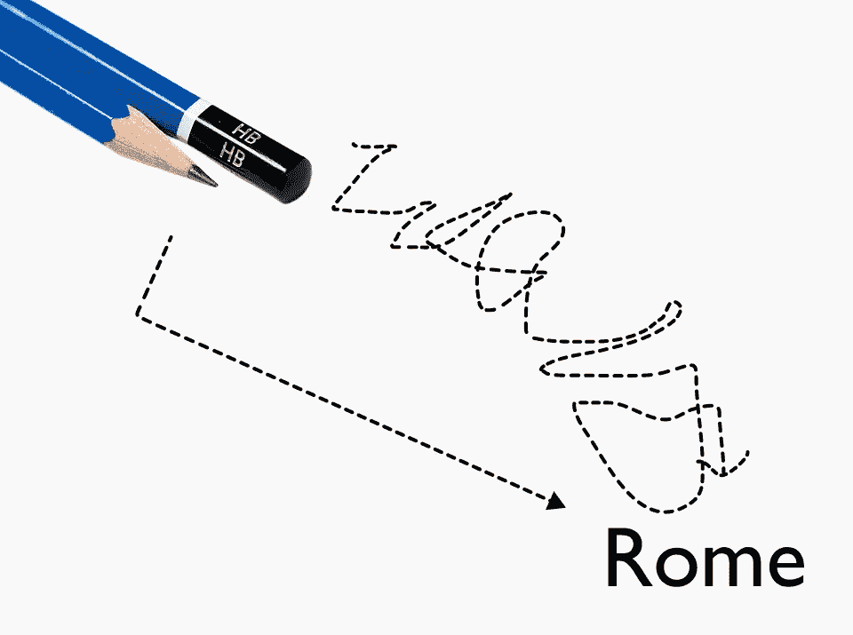

图片由作者提供

这里是本文的要点。我将带你了解如何通过处理来自[UCI 机器学习的自行车共享数据集](https://doi.org/10.24432/C5W894)¹来将这些方法付诸实践。通过采用这些方法，你不仅可以简化数据处理代码，还能更深入地理解你编写的代码。让我们开始导入数据集，并快速查看 DataFrame！

```py
import numpy as np
import pandas as pd
import matplotlib.pyplot as plt

bike = (pd
        .read_csv("../../dataset/bike_sharing/day.csv")
       )
bike
```

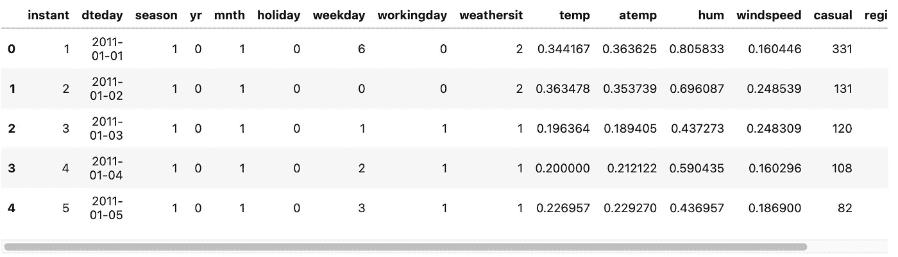

图片由作者提供

**目录**

+   方法 #1: `**.assign()**`

+   方法 #2: `**.groupby()**`

+   方法 #3: `**.agg()**`

+   方法 #4: `**.transform()**`

+   方法 #5: `**.pivot_table()**`

+   方法 #6: `**.resample()**`

+   方法 #7: `**.unstack()**`

+   方法 #8: `**.pipe()**`

# ☕️ 方法 #1: .assign()

忘掉使用`**df["new_col"] =**`和`**df.new_col =**`这种操作来创建新列。这里是你应该使用`**.assign()**`方法的原因——它返回一个 DataFrame 对象，允许你继续链式操作以进一步处理 DataFrame。与`**.assign()**`方法不同，上述两种臭名昭著的操作会返回`None`，这意味着你无法进一步链式操作。

如果你不信，那么让我重新提起旧的敌人——`**SettingWithCopyWarning**`。相信我们每个人在某个时刻都遇到过这个问题。

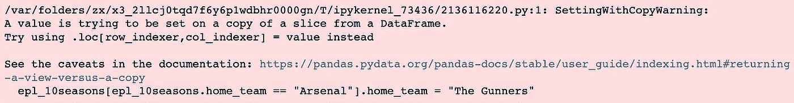

图片由作者提供

> 警告够了，我不想在我的笔记本中再看到丑陋的红色框框！

使用`**.assign()**`，让我们添加一些新列，如`**ratio_casual_registered**`、`**avg_temp**`和`**ratio_squared**`

```py
(bike
 .assign(ratio_casual_registered = bike.casual.div(bike.registered),
         avg_temp = bike.temp.add(bike.atemp).div(2),
         ratio_squared = lambda df_: df_.ratio_casual_registered.pow(2))
)
```

简而言之，上述方法的作用如下：

1.  我们可以使用`**.assign()**`方法创建任意数量的新列，用逗号分隔。

1.  在创建列`**ratio_squared**`时使用的 lambda 函数是为了访问我们在添加列`**ratio_casual_registered**`后最接近的 DataFrame。假设我们不使用 lambda 函数来访问最新的 DataFrame `**df_**`，而是继续使用`**bike.ratio_casual_registered.pow(2)**`，我们将会得到一个错误，因为原始 DataFrame 在创建`**ratio_squared**`之前，即使在`**.assign()**`方法中添加了该列，也没有`**ratio_casual_registered**`列。如果你对这个概念无法理解以决定是否使用 lambda 函数，我的建议是使用它！

1.  额外的！我留下了一些不那么常见的使用方法进行算术运算。

# ☕️ 方法 #2: .groupby()

好吧，`**.groupby()**`方法虽然不罕见，但在我们深入探讨下一个方法之前，它们是必要的。一个常被忽视且未被提及的事情是，`**.groupby()**`方法具有懒惰特性。也就是说，该方法是延迟评估的。换句话说，它不会立即评估，这就是为什么你在调用`**.groupby()**`方法后常常会看到`**<pandas.core.groupby.generic.DataFrameGroupBy object at 0x14fdc3610>**`。

从 Pandas DataFrame [文档](https://pandas.pydata.org/docs/reference/frame.html)² 中，传递给参数`**by**`的值可以是***映射、函数、标签、pd.Grouper 或此类的列表。*** 然而，你最常遇到的情况可能是按列名分组（用逗号分隔的 Series 名称列表）。在`**.groupby()**`操作之后，我们可以执行诸如`**.mean()**`、`**.median()**`，或使用`**.apply()**`应用自定义函数等操作。

> 我们传递给`**.groupby()**`方法的`**by**`参数中的指定列的值将成为结果的索引。如果我们指定了多个列进行分组，那么我们将获得一个 MultiIndex。

```py
(bike
 .groupby(['season', 'weathersit'])
 .mean(numeric_only=True) #alternative version: apply(lambda df_: df_.mean(numeric_only=True)) 
 .atemp
)
```

在这里，我们按照列`**season**`和`**weathersit**`对 DataFrame 进行了分组。然后，我们计算了均值，并仅选择了列`**atemp**`。

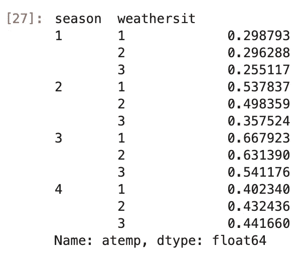

图片来源于作者

# ☕️ 方法 #3: .agg()

如果你足够细心去深入研究 Pandas [文档](https://pandas.pydata.org/docs/reference/frame.html)²，你可能会遇到`**.agg()**`和`**.aggregate()**`这两种方法。你可能会想知道它们有什么区别，以及什么时候使用哪个？节省你的时间吧！它们是相同的，`**.agg()**`只是`**.aggregate()**`的别名。

`**.agg()**`有一个参数`**func**`，它可以接受函数、字符串函数名或函数列表。顺便提一下，你也可以在列上聚合不同的函数！让我们继续上面的例子！

```py
#Example 1: Aggregating using more than 1 function
(bike
 .groupby(['season'])
 .agg(['mean', 'median'])
 .atemp
)

#Example 2: Aggregating using different function for different columns
(bike
 .groupby(['season'])
 .agg(Meann=('temp', 'mean'), Mediann=('atemp', np.median))
)
```

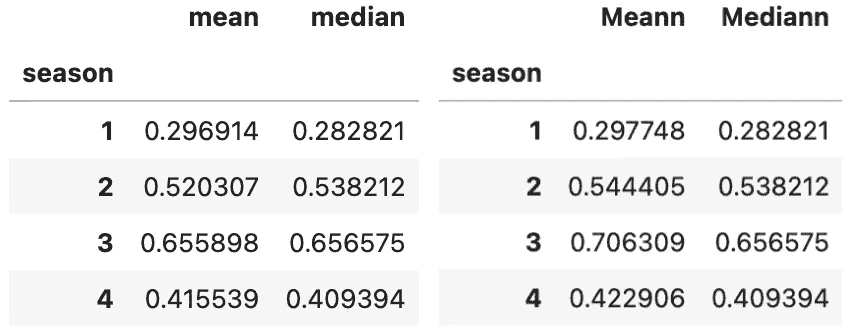

图片来源于作者

# ☕️ 方法 #4: .transform()

使用 `**.agg()**`，我们得到的结果在维度上相较于初始数据集是缩减的。简单来说，你的数据维度会减少，包含更少的行和列，包含汇总信息。如果你想对分组数据进行总结并获得聚合值，那么 `**.groupby()**` 是解决方案。

使用 `**.transform()**`，我们也开始时意图进行信息的汇总。然而，与创建信息汇总不同的是，我们希望输出的形状与原始 DataFrame 相同，而不缩小原始 DataFrame 的大小。

对于那些接触过类似 SQL 的数据库系统的人来说，`**.transform()**` 的概念可能与窗口函数类似。让我们看看 `**.transform()**` 在上面的示例中是如何工作的！

```py
(bike
 .assign(mean_atemp_season = lambda df_: df_
                                          .groupby(['season'])
                                          .atemp
                                          .transform(np.mean, numeric_only=True))
)
```

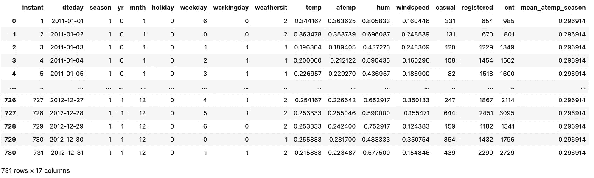

图片由作者提供

如上所见，我们创建了一个名为 `**mean_atemp_season**` 的新列，并将该列填充为 `**atemp**` 列的汇总（均值）。因此，每当 `**season**` 为 1 时，`**mean_atemp_season**` 的值就相同。请注意这里的重要观察点是我们保留了原始数据集的维度，并增加了一列！

# ☕️ 方法 #5: .pivot_table()

这是给那些对 Microsoft Excel 迷恋的人的额外提示。你可能会被诱惑使用 `**.pivot_table()**` 来创建汇总表。这个方法当然也有效！但这里有一点建议，`**.groupby()**` 更加灵活，适用于更广泛的操作，不仅限于重新排列，还包括过滤、转换或应用组特定的计算。

简要说明一下如何使用 `**.pivot_table()**`。你在 `**values**` 参数中指定你要汇总的列。接下来，使用原始 DataFrame 的子集指定你想要创建的汇总表的 **index**。这可以是多列，汇总表将是 MultiIndex 的 DataFrame。接下来，使用未选择为索引的原始 DataFrame 的子集来指定你想要创建的汇总表的 **columns**。最后但同样重要的是，不要忘记指定 `**aggfunc**`！我们来快速看一下！

```py
(bike
 .pivot_table(values=['temp', 'atemp'],
              index=['season'],
              columns=['workingday'],
              aggfunc=np.mean)
)
```

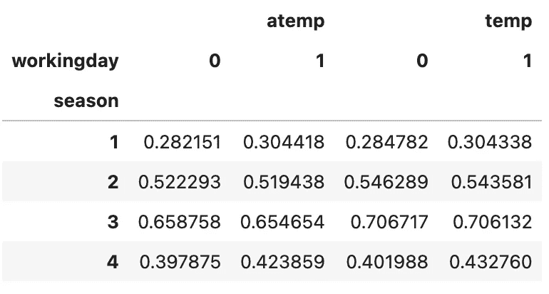

图片由作者提供

# ☕️ 方法 #6: .resample()

粗略地说，`**.resample()**` 方法可以被视为专门用于时间序列数据的分组和汇总，其中

> DataFrame 或 Series 的索引是类似日期时间的对象。

这使你可以根据不同的时间频率对数据进行分组和汇总，例如每小时、每天、每周、每月等。更一般地说，`**.resample()**` 可以接受 **DateOffset、Timedelta 或 str** 作为规则来执行重采样。让我们将其应用于之前的示例。

```py
def tweak_bike(bike: pd.DataFrame) -> pd.DataFrame:
    return (bike
            .drop(columns=['instant'])
            .assign(dteday=lambda df_: pd.to_datetime(df_.dteday))
            .set_index('dteday')
           )
bike = tweak_bike(bike)
(bike
 .resample('M')
 .temp
 .mean()
)
```

简而言之，我们在上面所做的操作是删除`**instant**`列，用`**dteday**`列覆盖`**dteday**`列，将`**dteday**`列的类型从`object`转换为`**datetime64[ns]**`类型，最后将这个`**datetime64[ns]**`列设为 DataFrame 的索引。


作者提供的图片

```py
(bike
 .resample('M')
 .temp
 .mean()
)
```

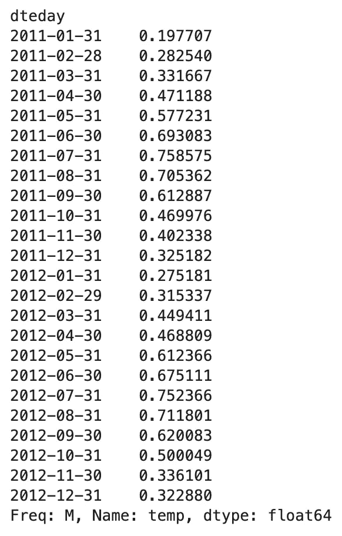

作者提供的图片

在这里，我们获得了特征`**temp**`的描述性统计汇总（均值），以月频率呈现。尝试使用不同的频率，如`**Q**`、`**2M**`、`**A**`等，来玩转`**.resample()**`方法。

# ☕️ 方法 #7: .unstack()

我们快要结束了！让我给你展示一下`**.unstack()**`为何既强大又有用。在此之前，让我们回到上述一个例子，我们想通过使用`**.groupby()**`和`**.agg()**`来找到不同季节和天气情况的平均温度。

```py
(bike
 .groupby(['season', 'weathersit'])
 .agg('mean')
 .temp
)
```

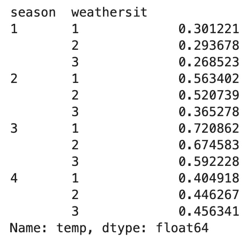

作者提供的图片

现在，让我们使用一个线图来可视化这一点，通过将`**.plot**`和`**.line()**`方法最小化地链接到上述代码中。在后台，Pandas 利用 Matplotlib 绘图后端来完成绘图任务。这给出了以下结果，我们都不想要，因为图的 x 轴是按 MultiIndex 分组的，使其更难以解释，且意义不大。

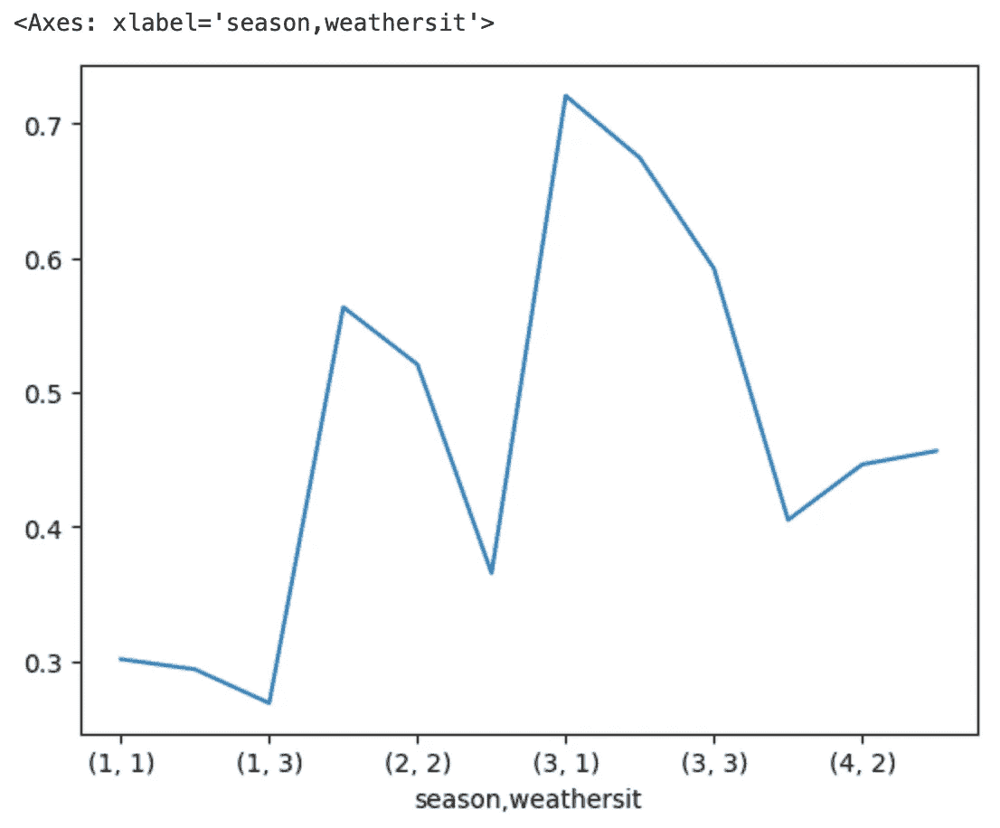

作者提供的图片

比较引入`**.unstack()**`方法后的图与上图。

```py
(bike
 .groupby(['season', 'weathersit'])
 .agg('mean')
 .temp
 .unstack()
 .plot
 .line()
)
```

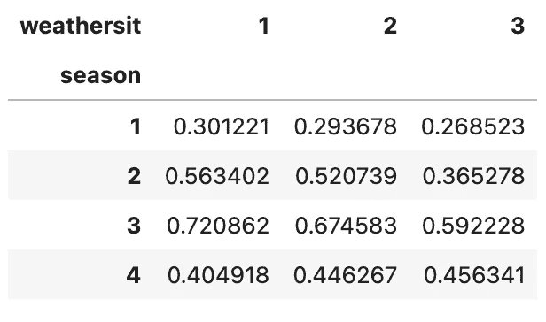

作者提供的图片

简而言之，`**.unstack()**`方法的作用是解开 MultiIndex DataFrame 中最内层的索引，在这个例子中是`**weathersit**`。这个所谓的解开索引变成了新 DataFrame 的列，这使得我们的线图绘制结果更加有意义，方便比较。

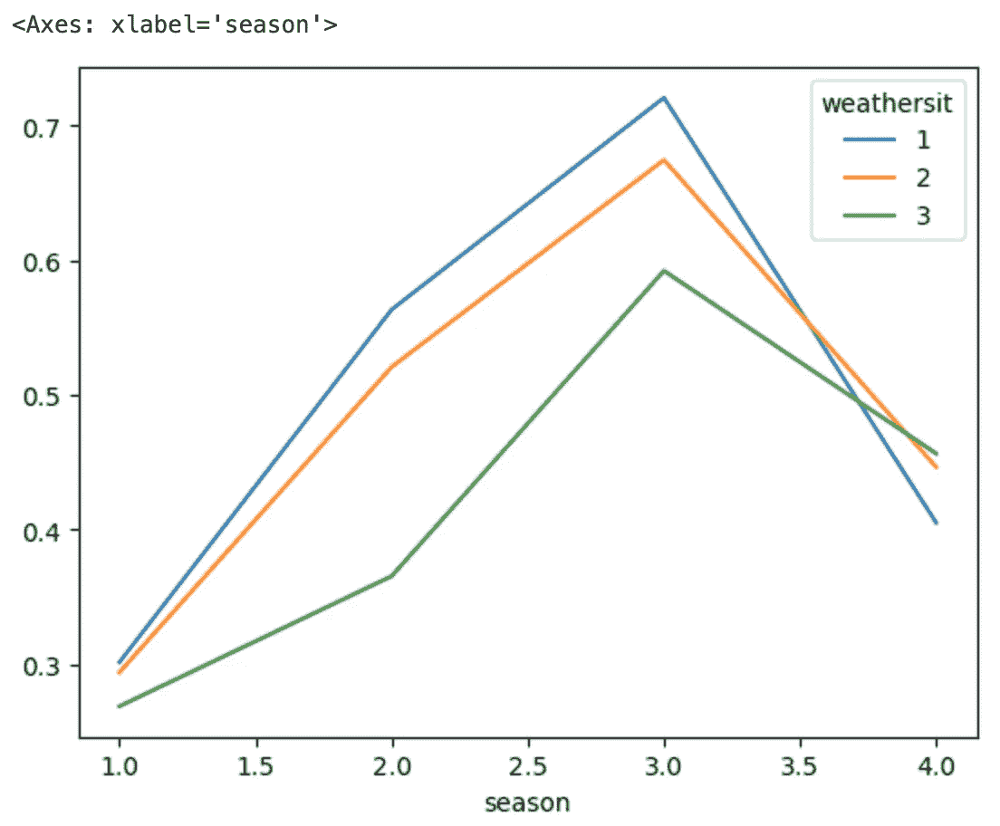

作者提供的图片

你还可以通过指定参数`**level=0**`作为`**.unstack()**`方法的一部分，来解开 DataFrame 中最外层的索引。让我们看看如何实现这一点。

```py
(bike
 .groupby(['season', 'weathersit'])
 .agg('mean')
 .temp
 .unstack(level=0)
 .plot
 .line()
)
```

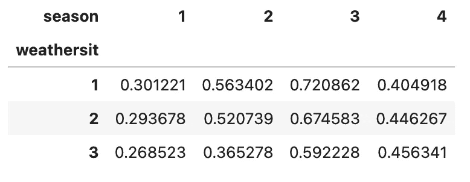

作者提供的图片

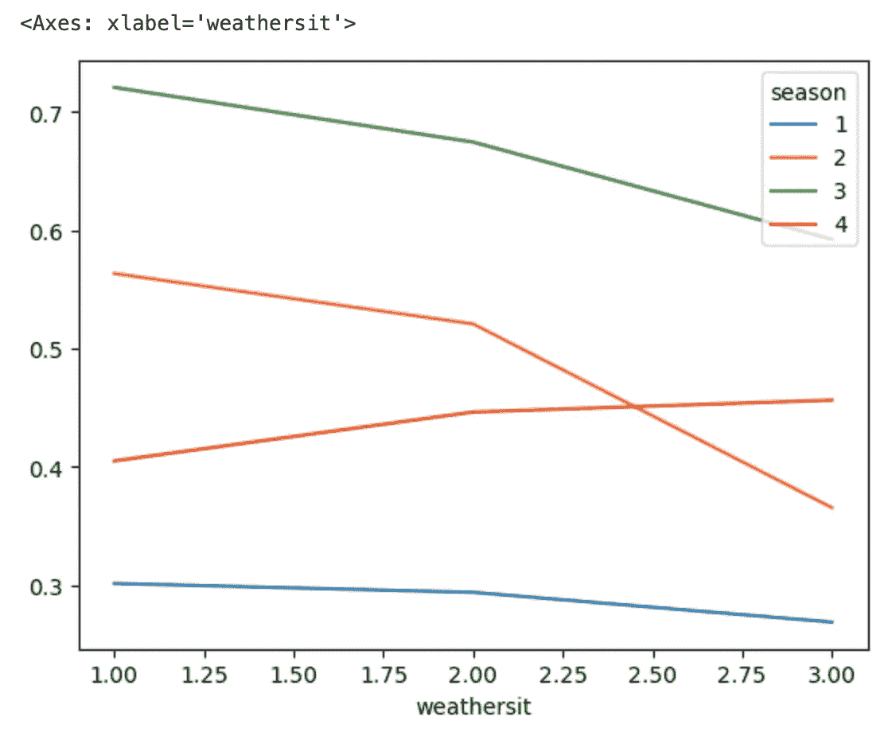

作者提供的图片

# ☕️ 方法 #8: .pipe()

从我的观察来看，当你在线搜索时，你几乎看不到普通人在他们的 Pandas 代码中实现这个方法。一个原因是，`**.pipe()**`有一种神秘的无法解释的气质，使得它对初学者和中级用户都不友好。当你去 Pandas [文档](https://pandas.pydata.org/docs/reference/frame.html)²时，你会发现的简短解释是***“应用期望 Series 或 DataFrame 的可链式函数”***。我认为这个解释有些混淆，并且对那些从未使用链式操作的人并不十分有帮助。

简而言之，`**.pipe()**`为您提供的是使用函数继续方法链技术的能力，在您无法找到直接解决方案执行操作返回 DataFrame 的情况下。

方法`**.pipe()**`接受一个函数作为参数，通过这个函数可以定义一个链外方法，然后将该方法作为`**.pipe()**`方法的参数引用。

> 使用`.pipe()`，您可以将 DataFrame 或 Series 作为自定义函数的第一个参数传递，并且该函数将应用于传递的对象，随后是指定的任何其他参数。

大多数情况下，您会看到`**.pipe()**`方法中的一行 lambda 函数，以方便使用（例如，在链处理过程中的某些修改步骤后获取最新 DataFrame）。

让我用一个简化的例子来说明。假设我们想要了解以下问题：***“对于 2012 年，每个季节相对于该年总工作日的工作日比例是多少？”***

```py
(bike
 .loc[bike.index.year == 2012]
 .groupby(['season'])
 .workingday
 .agg(sum)
 .pipe(lambda x: x.div(x.sum()))
)
```

在这里，我们使用`**.pipe()**`将函数注入到我们的链式方法中。由于执行了`**.agg(sum)**`之后，我们无法继续使用`**.div()**`进行链式处理，因此以下代码将无法工作，因为我们在链式处理过程中失去了对 DataFrame 的最新状态的访问。

```py
#Doesn't work out well!
(bike
 .loc[bike.index.year == 2012]
 .groupby(['season'])
 .workingday
 .agg(sum)
 .div(...)
)
```

> 提示：如果找不到继续链接方法的方式，请考虑如何使用`.pipe()`！大多数情况下，它会有所帮助！

# 结语

这就是低估的宝石💎第一部分的全部内容！这些都是我以前没有经常使用的方法，也许是因为我的坏习惯——用“只要能用，就够好！”的思维强行解决代码问题。不幸的是，这样做是不够好的！

只有在我花时间学习如何正确使用它们之后，它们才被证明是救命稻草，可以这么说！我还要感谢 Matt Harrison 和他的书[《高效 Pandas》](https://store.metasnake.com/effective-pandas-book)³，这本书彻底改变了我编写 Pandas 代码的方式。现在，我可以说我的代码更简洁、更可读，而且更有意义。

在低估的宝石第二部分中，我们将介绍其他八个较少为人知的 Pandas 方法，例如`**.explode()**`、`**.melt()**`和`**.expanding()**`！您可能不会经常使用它们，但在需要它们的时候它们肯定很方便。

如果你从本文中获得了一些有用的东西，请考虑在 Medium 上给我[***关注***](https://medium.com/@andreas030503)。每周一篇文章，轻松跟上时代潮流！

# 联系我！

+   [*LinkedIn*](https://www.linkedin.com/in/andreaslukita7/)👔

+   [*Twitter*](https://twitter.com/andreaslukita7)🖊

# 参考资料

1.  Fanaee-T，Hadi。 (2013)。自行车共享数据集。UCI 机器学习库。[`doi.org/10.24432/C5W894`](https://doi.org/10.24432/C5W894)。

1.  Pandas 文档: [`pandas.pydata.org/docs/reference/frame.html`](https://pandas.pydata.org/docs/reference/frame.html)

1.  Matt Harrison 的《Effective Pandas》: [`store.metasnake.com/effective-pandas-book`](https://store.metasnake.com/effective-pandas-book)
