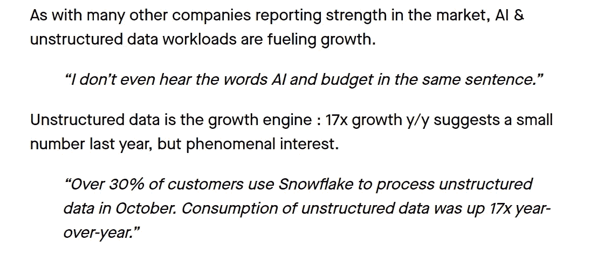
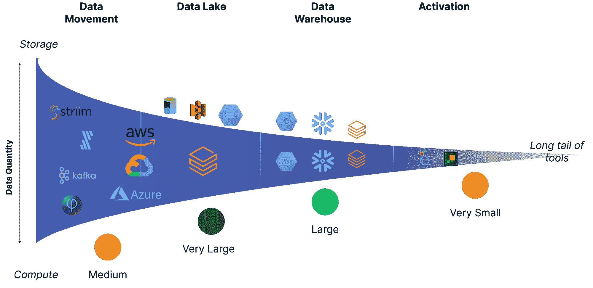

# 非结构化数据漏斗

> 原文：[`towardsdatascience.com/the-unstructured-data-funnel-245f72925176`](https://towardsdatascience.com/the-unstructured-data-funnel-245f72925176)


你向下挖掘的深度决定了你支付的费用。照片由[Ricardo Gomez Angel](https://unsplash.com/@rgaleriacom?utm_content=creditCopyText&utm_medium=referral&utm_source=unsplash)提供，来自[Unsplash](https://unsplash.com/photos/black-and-white-round-tunnel-JB3mBjGt94Y?utm_content=creditCopyText&utm_medium=referral&utm_source=unsplash)

## 为什么漏斗成为数据最重磅竞争者之间战争的中心

[](https://medium.com/@hugolu87?source=post_page-----245f72925176--------------------------------)[](https://towardsdatascience.com/?source=post_page-----245f72925176--------------------------------) [Hugo Lu](https://medium.com/@hugolu87?source=post_page-----245f72925176--------------------------------)

·发表于[Towards Data Science](https://towardsdatascience.com/?source=post_page-----245f72925176--------------------------------) ·9 分钟阅读·2023 年 12 月 15 日

--

*如果你不是 Medium 会员，你可以在这里[*免费*](https://www.getorchestra.io/blog/the-unstructured-data-funnel)阅读。*

# 介绍

非结构化数据呈现出多种形式。它通常以文本为主，但也可能包含日期、数字和字典等数据。数据工程师通常会遇到以深层次的[嵌套 JSON](https://www.ibm.com/docs/en/db2/11.5?topic=documents-json-nested-objects)形式出现的非结构化数据。然而，“非结构化”数据这个术语实际上是指任何非表格化的数据；事实上，超过 80%的[全球数据是非结构化的](https://www.unleash.so/a/answers/database-management/how-much-data-in-the-world-is-unstructured)。

尽管对我们数据从业者而言，非结构化数据似乎无害，但它在宏观层面上产生了巨大影响。实际上，GPT 模型[都经过训练](https://en.wikipedia.org/wiki/ChatGPT)以处理非结构化数据。Tomasz Tunguz 在[近期文章](https://www.linkedin.com/pulse/snow-angels-come-early-data-snowflakes-strength-spells-tomasz-tunguz-bdggc/)中对 Snowflake 财报电话会议的观察是正确的：



摘自 Tomasz Tunguz 的《Snow Angels》

在这种金融和宏观经济背景下看待非结构化数据可能显得有些奇怪。我的第一份工作是在投资银行，所以我在阅读类似内容时感到有些怀旧。“非结构化数据是增长引擎”对我来说是有意义的——这听起来像是一个非常大的市场[顺风](https://www.peakframeworks.com/post/headwinds-vs-tailwinds)！

不过，我已经有一段时间没有调整 Powerpoint 框了。从概念上讲，非结构化数据现在是一个深度嵌套的 json，等待处理。但从[财报电话会议](https://seekingalpha.com/article/4655043-snowflake-inc-snow-q3-2024-earnings-call-transcript)中可以看出，非结构化数据现在不仅仅是 JSON（曾经是吗？），还有文本、文档、[视频](https://benn.substack.com/p/avg-text)等。

现在出现的是，这些数据驱动了一些即将变得至关重要的用例，而数据处理的*位置*对数据领域的两大巨头：Databricks 和 Snowflake 至关重要。让我们深入探讨一下原因。

# 为什么非结构化数据重要？

[GPT](https://en.wikipedia.org/wiki/GPT-3)模型依赖数据。具体来说，它们[依赖非结构化](https://www.forbes.com/sites/forbestechcouncil/2023/07/24/unleashing-the-power-of-unstructured-data-the-rise-of-large-ai-models/?sh=76deafdd40f8)数据。这些包括文本文档、html 文件和代码片段。随着公司越来越倾向于在生产中实现[LLMs](https://cloud.google.com/ai/llms?hl=en)，处理这些数据的价值因其需求增加而增加。因此，它对像 Snowflake 和 Databricks 这样的供应商的价值也增加。

但是处理特定类型非结构化数据还有第二个元素。以嵌套 JSON 为例。嵌套 JSON 在处理时会被*展开*或*清理*。这意味着你可能会从以下内容开始：

```py
{
  "outer_key1": {
    "inner_key1": {
      "nested_key1": {
        "deeply_nested_key1": "value1",
        "deeply_nested_key2": "value2"
      },
      "nested_key2": {
        "deeply_nested_key3": "value3",
        "deeply_nested_key4": "value4"
      }
    },
    "inner_key2": {
      "nested_key3": {
        "deeply_nested_key5": "value5",
        "deeply_nested_key6": "value6"
      },
      "nested_key4": {
        "deeply_nested_key7": "value7",
        "deeply_nested_key8": "value8"
      }
    }
  },
  "outer_key2": {
    "inner_key3": {
      "nested_key5": {
        "deeply_nested_key9": "value9",
        "deeply_nested_key10": "value10"
      },
      "nested_key6": {
        "deeply_nested_key11": "value11",
        "deeply_nested_key12": "value12"
      }
    },
    "inner_key4": {
      "nested_key7": {
        "deeply_nested_key13": "value13",
        "deeply_nested_key14": "value14"
      },
      "nested_key8": {
        "deeply_nested_key15": "value15",
        "deeply_nested_key16": "value16"
      }
    }
  }
}
```

到这里：

```py
{
  "deeply_nested_key1": "value1",
  "deeply_nested_key2": "value2"
}
```

处理第二个 JSON 所需的计算能力比初始清理数据时所需的计算能力要少，后者处理第一个更大的对象。这意味着数据管道中第一次“清理”发生的位置会显著影响使用的计算资源。

所有非结构化数据都遵循这种模式。Snowflake 的[Document AI](https://www.youtube.com/watch?v=dN_IZp2W148)将像 pdf 这样的文档提取为表格形式的数据。这意味着处理的重部分只发生一次，结果数据会更加干净，处理也更容易。

# 非结构化数据漏斗

关注数据处理发生的*位置*对像 Snowflake 和 Databricks 这样的云服务提供商非常重要，因为他们基于云[计算](https://www.databricks.com/product/pricing)收取附加费用。这意味着你需要的计算能力越多，你支付的费用也越高。我们在前一节中看到，由于大型语言模型（LLMs），非结构化数据的重要性不断增加，但处理非结构化数据所需的计算能力随着数据在数据管道中进一步处理而减少。这是直观的，因为数据在数据管道中进展时会变得更干净、更聚合。

我们可以通过想象我们的数据管道基础设施来可视化这一点。我们中的大多数人通常拥有以下架构的子集：



非结构化数据漏斗。漏斗的宽度与需要处理的数据量成正比。数据在漏斗中流动时所需的计算是非线性的，因为非结构化数据清洗、数据源合并以及分析工作流等操作受到数据量以外的因素影响。想象一下作者的情况。

## 数据移动

漏斗的第一部分是数据团队首次接触非结构化数据的地方。这是一个数据移动层，架构上可能是批处理或流处理。这个层级没有存储元素，但像 Fivetran、Portable 或 Striim 这样的供应商正在进行*一些*转换（“ETL”或“ET L”而非“ELT”或“EL T”），这需要计算并减少传递到下一个层级的数据量。

这些工具在处理能力上受到限制，因为它们没有完整的数据历史记录，因此不能执行复杂的操作，如回填或慢变维度。然而，它们适用于简单的转换，如流连接或非结构化数据的去嵌套。大多数这些供应商反正不处理像文本文件这样的非结构化数据。你可以使用云原生服务来执行这些服务，例如 Azure EventHub、BigQuery PubSub，因此这些标志也涉及到漏斗的这一部分。

**可用计算资源**：中等

## 数据湖 / 对象存储

第二层指的是对象存储中的数据，如 Google Object Storage、AWS S3 或 Azure ADLS Gen-2。这些是三大云提供商的存储解决方案，可以存储任何文件格式的数据。漏斗的这一层是所有数据集中化的第一个地方，计算资源以各种形式轻松获得，可以直接从云提供商租用或通过像 Databricks 这样的供应商获取 Spark。这一层非常适合复杂的处理，尤其适合维度和复杂度的减少。这意味着涉及的计算资源异常高。

在我看来，这一层是处理非结构化数据最有意义的地方。你可以在这里存储任何东西。你拥有大量兼容的云基础设施（所有东西都可以与 S3 交互）。你有一个现成的存储层来存储你的处理数据。在这里进行这种处理非常有意义，因为它本质上比数据仓库更灵活。数据湖是为了存储任何格式的数据而构建的——这不正是非结构化数据*的特性*吗？

**可用计算资源**：非常高

## 数据仓库 / SQL 层

漏斗的这一层指的是以特定格式或特定格式集合存储的数据，通常这样做是为了使其能够使用类似 SQL 的语句轻松查询和处理。Snowflake 有自己的文件格式，这并不是什么秘密，它促进了这一点，也正是你支付“[入口费用](http://www.getorchestra.io/blog/understanding-snowflakes-pricing-model-ingress-and-egress-charges)”的原因，以便将数据“[导入 Snowflake](http://www.getorchestra.io/blog/understanding-snowflakes-pricing-model-ingress-and-egress-charges)”。在 Databricks 方面，他们有[.delta，它实际上是对.parquet 的抽象](http://www.getorchestra.io/blog/exploring-databricks-delta-and-parquet-file-formats)，而且是开源的。还有其他如.iceberg 这样的格式，它们是“酷”的，并且促进了 Snowflake 中的外部表（这使得 Snowflake 在漏斗层级上提升了一个层次）。

这个领域适合处理结构化数据或表格数据。然而，如展平 JSON 这样的操作也可以在这里进行（例如，参见[BigQuery](https://stackoverflow.com/questions/55244750/flatten-nested-json-string-to-different-columns-in-google-bigquery)或[Snowflake](https://www.google.com/search?q=snowflake+flatten&rlz=1C1RXQR_enGB1078GB1078&oq=snowflake+flatten&gs_lcrp=EgZjaHJvbWUqBwgAEAAYgAQyBwgAEAAYgAQyBwgBEAAYgAQyBwgCEAAYgAQyBwgDEAAYgAQyBwgEEAAYgAQyBwgFEAAYgAQyBwgGEAAYgAQyBwgHEAAYgAQyBwgIEAAYgAQyBwgJEAAYgATSAQgxNDQ0ajBqNKgCALACAA&sourceid=chrome&ie=UTF-8))。数据工程师普遍认为这不是 SQL 计算的最佳使用方式。主要反对意见是，增量执行此类操作既具有挑战性又缓慢，因此成本高昂。然而，实际成本已经在*移动*数据时产生。你已经为数据*通过*漏斗支付了费用。如果在漏斗更高的位置进行转换或解构，那么*移动*通过漏斗的体积就会减少，成本也会更低。

有趣的是，这个领域在 Snowflake 财报电话会议上引起了关注。考虑到我与大多数工程师交流时发现他们倾向于在漏斗尽可能高的位置进行数据处理以节省成本，"只需将数据导入 Snowflake"的口号可能正与企业数据高管和首席信息官们产生共鸣。也有可能像 DocumentAI 和 SnowPark Container Services 这样的功能实际上意味着 SQL Warehouse 与“Data Lakehouse”之间的界限正在模糊——同样的计算可以用于漏斗不同部分的数据。

需要注意的是，你可能会为在数据仓库中处理非结构化数据的计算处理支付双重加价。如果你使用像 Databricks 这样的服务，你会利用云提供商的计算能力处理存储在对象存储中的文本文件，Databricks 作为中介，因此你只需为计算支付一次加价。如果使用数据仓库，你则需要支付存储和计算的加价。而且你也不知道他们*究竟是如何*利用这些计算来分析文档的，因此你可能会多花一点钱。如果仓库支持[外部表](https://docs.snowflake.com/en/user-guide/tables-external-intro)，你可以避免前者。

为了完成这一层——高效运行 SQL 负载需要数据处于不同的特定格式。这催生了数据仓库市场，将这些数据转换为可查询和可转换的格式，如.delta。非结构化数据在某些方面正好相反，似乎*属于*它已经*存在*的地方，即数据湖。因此，在 LLM 的背景下，使用来自仓库层的计算来处理非结构化数据并没有真正的意义。确实，一些流行的 Snowflake 用例，如 Snowpark 容器服务和外部表，已经更像是一个类似于湖屋的计算/存储模型。

**计算的争夺**：高

## 数据激活——分析的“最后一公里”

最后提到的是漏斗的结束部分——数据激活。这是分析的“最后一公里”，通常涉及进行小检查以确保流程能够启动，然后将清理过的数据移至操作系统。这指的是与清理和汇总的数据进行交互的应用程序。

这些可能是经典的反向 ETL 用例、仪表盘或自动化的 Slack/电子邮件警报。

在这一点上，你的所有数据（结构化和非结构化）可能已经得到了充分的清理。你的数据工程、分析工程和产品团队可能都已经对其进行了仔细的审查、测试、清理和汇总。

这意味着从计算方面来看，真的没有什么需要做的了。

因此，非结构化数据漏斗中*最不感兴趣*的部分提供了*最少的机会*来对计算收费给数据团队。不仅所有的数据都是干净、扁平和完美的，而且也要小得多。

**计算的争夺**：低

# 结论

本文为数据从业者提供了一种在非结构化数据背景下思考数据处理的新方式。非结构化数据的独特之处在于，文本文件、HTML 文件、深度嵌套的 JSON 以及所有介于其间的内容都需要一个初步的、繁重的计算步骤来从数据中提取价值。这一步发生在哪里对大型数据云服务提供商来说很重要，因为它与使用量以及因此产生的收入密切相关。目前特别有趣的是，LLM 和 GPT 模型的部署已经创造了对这些之前对大多数数据从业者来说相当无用和无趣的数据的需求。

通过漏斗图示，我们可以看到数据团队“延迟”这个繁琐的处理步骤时间越长，成本越高，因为移动的数据总量更大。此外，考虑到各种文件格式和操作类型的需求，似乎最合理的做法是专注于在对象存储级别处理数据。这一点通过 Snowflake 显然“向上发展”以促进非结构化数据处理得到了很好的说明。

这也引出了一个问题，即云服务提供商是否会继续向上发展。解析来自 Gmail 的电子邮件可能足够简单。假设有一个专门将数据从 Gmail 移动到对象存储的工具——为什么这个工具也不能执行“T”；在这种情况下，解析出有用的信息（大概是使用 AI），并将平坦的记录表直接转储到 S3 中？是否因为大多数有用的非结构化数据存在于 Google 和 Microsoft 的云数据库中（它们既不是 Databricks 也不是 Snowflake，且拥有其*自有*的数据产品套件）？

我坦率地说，不知道这个问题的答案是什么。不过，我确定处理尽可能多的数据会有巨大的经济激励。处理到什么程度是一个有待讨论的问题，正如 Snowflake 成功说服公司在进行任何转换之前将数据迁移到 Snowflake 所展示的那样。BI 工具收费数十万美元的时代已经过去了。争夺 S3 的战斗已经开始🔥
