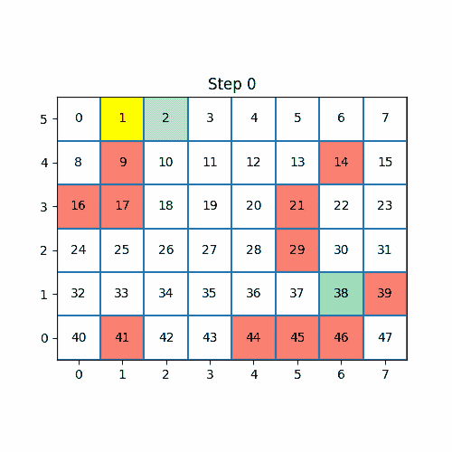

# 强化学习中的行动价值（使用 Q-learning）

> 原文：[`towardsdatascience.com/the-values-of-actions-in-reinforcement-learning-using-q-learning-cb4b03be5c81?source=collection_archive---------5-----------------------#2023-02-14`](https://towardsdatascience.com/the-values-of-actions-in-reinforcement-learning-using-q-learning-cb4b03be5c81?source=collection_archive---------5-----------------------#2023-02-14)

## 从零开始用 Python 实现的 Q-learning 算法

 [Eligijus Bujokas](https://eligijus-bujokas.medium.com/?source=post_page-----cb4b03be5c81--------------------------------)

·

[关注](https://medium.com/m/signin?actionUrl=https%3A%2F%2Fmedium.com%2F_%2Fsubscribe%2Fuser%2Fd61597e07b4d&operation=register&redirect=https%3A%2F%2Ftowardsdatascience.com%2Fthe-values-of-actions-in-reinforcement-learning-using-q-learning-cb4b03be5c81&user=Eligijus+Bujokas&userId=d61597e07b4d&source=post_page-d61597e07b4d----cb4b03be5c81---------------------post_header-----------) 发表在 [Towards Data Science](https://towardsdatascience.com/?source=post_page-----cb4b03be5c81--------------------------------) ·10 分钟阅读·2023 年 2 月 14 日

--

智能体穿越迷宫；作者 GIF

这篇文章是关于强化学习（RL）系列文章的延续。可以在这里查看其他文章：

 ## Python 强化学习世界的第一步

### 本文展示了如何在强化学习的基本世界中找到最佳位置的 Python 原始实现…

towardsdatascience.com  ## 使用 Python 的时间差分——第一个基于样本的强化学习算法

### 使用 Python 编码和理解 TD(0)算法

towardsdatascience.com

所有使用的代码可以在这里查看：[`github.com/Eligijus112/rl-snake-game`](https://github.com/Eligijus112/rl-snake-game)

包含所有绘图函数和代理训练代码的笔记本可以在这里查看：[`github.com/Eligijus112/rl-snake-game/blob/master/chapter-6-qlearning.ipynb`](https://github.com/Eligijus112/rl-snake-game/blob/master/chapter-6-qlearning.ipynb)

在这篇文章中，我将向读者介绍 Q 值的概念。为了便于理解，读者可以将***Q***替换为***Quality***，从而理解为***质量值***。q 值是数值，用于为*每个动作*从*每个状态*分配分数。
