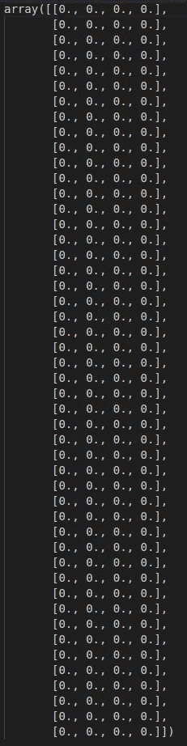
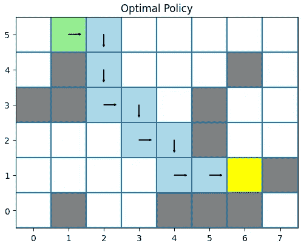

# 使用 Q-learning 的强化学习中行动的价值

> 原文：[`towardsdatascience.com/the-values-of-actions-in-reinforcement-learning-using-q-learning-cb4b03be5c81`](https://towardsdatascience.com/the-values-of-actions-in-reinforcement-learning-using-q-learning-cb4b03be5c81)

## 使用 Python 从头实现的 Q-learning 算法

[](https://eligijus-bujokas.medium.com/?source=post_page-----cb4b03be5c81--------------------------------)[](https://towardsdatascience.com/?source=post_page-----cb4b03be5c81--------------------------------) [Eligijus Bujokas](https://eligijus-bujokas.medium.com/?source=post_page-----cb4b03be5c81--------------------------------)

·发表于 [Towards Data Science](https://towardsdatascience.com/?source=post_page-----cb4b03be5c81--------------------------------) ·阅读时间 10 分钟·2023 年 2 月 14 日

--


代理在迷宫中穿越；GIF 由作者提供

这篇文章是关于强化学习（RL）系列文章的续集。请在这里查看其他文章：

[](/first-steps-in-the-world-of-reinforcement-learning-using-python-b843b76538e3?source=post_page-----cb4b03be5c81--------------------------------) ## 使用 Python 进行强化学习的第一步

### 如何在强化学习的基本世界之一中找到最佳位置的原始 Python 实现…

towardsdatascience.com [](/temporal-differences-with-python-first-sample-based-reinforcement-learning-algorithm-54c11745a0ee?source=post_page-----cb4b03be5c81--------------------------------) ## 使用 Python 的时间差分 — 第一个基于样本的强化学习算法

### 使用 Python 编写和理解 TD(0) 算法

towardsdatascience.com

所有使用的代码可以在这里查看：[`github.com/Eligijus112/rl-snake-game`](https://github.com/Eligijus112/rl-snake-game)

包含所有绘图函数和代理训练代码的笔记本可以在这里查看：[`github.com/Eligijus112/rl-snake-game/blob/master/chapter-6-qlearning.ipynb`](https://github.com/Eligijus112/rl-snake-game/blob/master/chapter-6-qlearning.ipynb)

在这篇文章中，我将向读者介绍 Q 值的概念。为了直观起见，读者可以将 ***Q*** 替换为 ***Quality***。q 值是数值，分配给 *每个动作* 从 *每个状态* 中的得分：


Q 值函数

在给定状态下，某个特定动作的 ***得分越高***，代理执行该动作的 ***效果越好***。

例如，如果我们可以从状态 1 选择左移或右移，那么如果

Q(left, 1) = 3.187

Q(right, 1) = 6.588

那么从状态 1 出发，能够带来更多价值的更好动作就是“正确”的动作。

存储 q 值的对象是**q-table**。**q-table** 是一个矩阵，每一行是一个状态，每一列是一个动作。我们将这种矩阵称为**Q**。

从之前的文章中，让我们回顾一下 Q 学习中需要的一些其他重要表格：

**S** — 状态矩阵，用于索引所有状态。

**R** — 奖励矩阵，指示过渡到给定状态时获得的奖励。

Q 学习中不需要价值函数 **V**，因为我们不仅关心状态的价值，还关心状态-动作对的价值。

想象一下我们有以下 48 状态的迷宫：


迷宫；作者拍摄

黄色状态是我们代理的起始状态（状态 1）。

绿色状态是目标状态（状态 38）。

红色状态是迷宫的墙壁。如果代理选择去墙壁状态，它将返回到最后一个状态且不获得奖励。离开边界的逻辑也适用。

我们的代理可以采取的动作由向量 ***[0, 1, 2, 3]*** 表示，对应于 ***[上, 下, 左, 右]***。

该代理的初始 Q 表如下：



48x4 矩阵；作者拍摄

有 48 行表示每个状态。

有 4 列表示代理在每一步可以采取的 4 种动作：**上、下、左或右**。

Q 学习算法的主要目标是 ***填充上述矩阵，以便我们的代理学习迷宫中最优的路径***。

我们将使用自定义的 Agent 类来实现 Q 学习算法：

```py
class Agent:
    def __init__(
        self, 
        nrow_maze: int,
        ncol_maze: int,
        actions: list = [0, 1, 2, 3],
        rewards: dict = {
            'step': 0.0, 
            'wall': 0.0,
            'goal': 10,
        }, 
        gamma: float = 0.9,
        alpha: float = 0.1,
        epsilon: float = 0.1,
        seed: int = 42,
        ) -> None:
        """
        Creates an agent for the maze environment.

        Parameters
        ----------
        nrow_maze : int
            The number of rows in the maze.
        ncol_maze : int
            The number of columns in the maze.
        actions : list, optional
            A list of actions that the agent can take. The default is [0, 1, 2, 3]. 
            0: Up
            1: Down
            2: Left
            3: Right
        rewards : dict, optional
            A dictionary of rewards for the agent. The default is {'step': -1, 'wall': -10, 'goal': 10}.
        gamma : float, optional
            The discount factor. The default is 0.9.
        alpha : float, optional
            The learning rate. The default is 0.1.
        epsilon : float, optional
            The exploration rate. The default is 0.1.
        seed : int, optional
            The seed for the random generator. The default is 42.
        """
        self.nrow_maze = nrow_maze
        self.ncol_maze = ncol_maze
        self.rewards = rewards
        self.gamma = gamma
        self.alpha = alpha
        self.epsilon = epsilon
        self.seed = seed
        self.actions = actions

        # By default, the starting index is 0 0 
        self.start_state = 0

        # By default, the goal index is the last index
        self.goal_state = nrow_maze * ncol_maze - 1

        # Creating the random generator with a fixed seed
        self.random_generator = np.random.default_rng(seed)

        # Creating the maze; We will denote it internaly as S 
        self.init_S_table()

        # Initiating the Q-table 
        self.init_Q_table()

        # Saving the initial past_action and past_state
        self.past_action = None
        self.past_state = None

        # Creating the action name dictionary 
        self.action_name_dict = {
            0: 'up',
            1: 'down',
            2: 'left',
            3: 'right',
        }

        # Counter for the number of times our agent has seen the terminal state
        self.num_goal_reached = 0

        # Counter for each state and how many times the agent visited each 
        self.state_visit_counter = {}

        # Empty dictionary of states visition paths
        self.state_visit_paths = {}

        # Placeholder for the current episode of learning 
        self.current_episode = 0

  #####
  # OTHER METHODS BELLOW
  #####
```

完整的 Q 学习算法如下¹


Q 学习算法；作者拍摄

在步骤 2.2.1 中的 *epsilon-贪婪策略* 是以 **1 - epsilon** 的概率采取 Q 值最大的动作，并以 **epsilon** 的概率采取随机动作。

上述策略通过以下代码在我们的代理中实现：

```py
def argmax(self, q_values: np.array):
        """argmax with random tie-breaking
        Args:
            q_values (Numpy array): the array of action values
        Returns:
            action (int): an action with the highest value
        """
        top = float("-inf")
        ties = []

        for i in range(len(q_values)):
            if q_values[i] > top:
                top = q_values[i]
                ties = []

            if q_values[i] == top:
                ties.append(i)

        return self.random_generator.choice(ties)

    def get_greedy_action(self, state: int) -> int:
        """
        Returns the greedy action given the current state
        """
        # Getting the q values for the current state
        q_values = self.Q[state]

        # Getting the greedy action
        greedy_action = self.argmax(q_values)

        # Returning the greedy action
        return greedy_action

    def get_epsilon_greedy_action(self, state: int) -> int: 
        """
        Returns an epsilon greedy action
        """
        if self.random_generator.random() < self.epsilon:
            return self.get_action()
        else:
            return self.get_greedy_action(state)
```

Q 学习步骤是 2.2.3 步骤。在每个状态下，我们的智能体采取一个动作。然后，通过更新智能体所在的当前状态和状态-动作对**Q(S, A)**来完成学习。更新规则中最重要的部分是，我们查看智能体通过采取动作最终到达的状态，然后从 Q 表中提取该状态的最大值。

让我们更仔细地检查这个方程：


Q 值更新方程

Q(S, A)是智能体所在的状态以及他采取的动作。

这


转换状态的最大值

部分是我们智能体在所有动作中最终到达的状态的最大可用 Q 值。

**r** 是过渡到给定状态的奖励。

其他所有的是用户定义的超参数。

由于我们使用算法估计值来更新 Q 值，因此 Q 学习属于自举方法家族。

**每次我们的智能体移动后，Q 表都会更新。**

我们在 Agent 类中 2.2.3 步骤的完整实现如下：

```py
def update_Q_table(self, new_state: int): 
        """
        Function that applies the RL update function
        """ 
        # Getting the next_state's reward
        reward = self.reward_dict[new_state]

        # Saving the current Q value
        current_Q = self.Q[self.past_state][self.past_action]

        # If the new state is the terminal state or the wall state, then the max_Q is 0
        max_Q = 0

        # Else we get the max Q value for the new state
        if new_state != self.goal_state:
            new_state_Q_values = self.Q[new_state]

            # Getting the max Q value 
            max_Q = np.max(new_state_Q_values)

        # Updating inplace the Q value 
        self.Q[self.past_state][self.past_action] = current_Q + self.alpha * (reward + self.gamma * max_Q - current_Q)
```

上述函数在每次智能体移动时都会被调用：

```py
 def terminal_step(self, new_state: int):
        """
        Updates the agent one last time and resets the agent to the starting position
        """ 
        # Updating the Q table
        self.update_Q_table(new_state)

        # Resetting the agent
        self.past_state = self.start_state
        self.past_action = self.get_epsilon_greedy_action(self.past_state)

        # Incrementing the number of episodes
        self.current_episode += 1

    def get_next_state(self, s: int, action: int) -> int: 
          """
          Given the current state and the current action, returns the next state index
          """
          # Getting the state coordinates
          s_row, s_col = self.get_state_coords(s)

          # Setting the boolean indicating that we have reached the terminal state 
          reached_terminal = False

          # Getting the next state
          next_state = -1
          if action == 0:
              next_state = self.get_state_index(s_row - 1, s_col)
          elif action == 1:
              next_state = self.get_state_index(s_row + 1, s_col)
          elif action == 2:
              next_state = self.get_state_index(s_row, s_col - 1)
          elif action == 3:
              next_state = self.get_state_index(s_row, s_col + 1)

          # If next_state is a wall or the agent is out of bounds, we will stay in the same state
          if (next_state == -1) or (next_state in self.wall_states):
              return s, reached_terminal

          # If next_state is the goal state, we will return to the starting state
          if next_state == self.goal_state:
              # Incrementing the number of times our agent has reached the goal state
              self.num_goal_reached += 1
              reached_terminal = True

          # Returning the next state
          return next_state, reached_terminal

    def move_agent(self): 
        """ 
        The function that moves the agent to the next state
        """
        # Getting the next state
        next_state, reached_terminal = self.get_next_state(self.past_state, self.past_action)

        # Updating the Q table
        if not reached_terminal:
            # Checking if the past_state is the same as the next_state; If that is true, it means our agent hit a wall 
            # or went out of bounds
            if self.past_state != next_state:
                self.update_Q_table(next_state)

            # Setting the past_state as the next_state
            self.past_state = next_state

            # Getting the next action
            self.past_action = self.get_epsilon_greedy_action(self.past_state)
        else: 
            self.terminal_step(next_state)
```

上面的代码片段应从下往上阅读。

在每次移动时，我们检查是否处于终止状态。如果智能体进入终止状态，Q 学习更新方程简化为：


终止状态的更新；作者提供的照片

让我们启动我们的智能体，训练一个回合并可视化智能体路径：

```py
 def train_episodes(self, num_episodes: int):
      """
      Function that trains the agent for one episode
      """
      # Calculating the episode number to end the training 
      end_episode = self.current_episode + num_episodes - 1

      # Moving the agent until we reach the goal state
      while self.current_episode != end_episode:
          self.move_agent()
```

```py
# Creating an agent object
agent = Agent(
    nrow_maze=6,
    ncol_maze=8,
    seed=6,
    rewards={'step': 0, 'goal': 10}
)

# Initiating the maze 
agent.init_maze(maze_density=11)

# Training the agent for one episode
agent.train_episodes(num_episodes=1)
```


智能体在迷宫中游荡；作者提供的 GIF

智能体需要 94 步才能到达目标。在每一步，智能体以 epsilon 贪婪的方式选择一个动作。在第一次迭代中，任何转换状态的 Q 值都是 0，因此 epsilon 贪婪算法与随机游荡相同。

让我们在一个回合后检查 Q 表。Q 表中所有的值都是零，只有状态 30 的值例外：

```py
agent.Q[30]

# Returns 
# array([0., 1., 0., 0.])
```

Q(30, 1)（意味着从状态 30 向“下”移动）值为 1。计算这个值的方程是：


请记住，初始**Q(30, 1) = 0.**

在一个回合后，我们只学到了一个 Q 值。让我们再训练一个回合：

```py
# Training the agent for one episode
agent.train_episodes(num_episodes=1)

# Printing out the agent's 37 state
agent.Q[37]

# Returns 
# array([0., 0., 0., 1.])
```

现在智能体从迷宫的另一边游荡，学到从状态 37 向右移动是最佳选择。

我们希望看到的是，随着回合的进行，我们的智能体的步骤数开始减少。

```py
# Creating an agent object
agent = Agent(
    nrow_maze=6,
    ncol_maze=8,
    seed=6,
    rewards={'step': 0, 'goal': 10}
)

# Initiating the maze 
agent.init_maze(maze_density=11)

# Letting the agent wonder for 1000 episodes
agent.train_episodes(100)
state_visits = agent.state_visit_paths
steps = [len(state_visits[episode]) for episode in state_visits]

# Ploting the number of steps per episode
plt.plot(steps)
plt.title("Number of steps per episode")
plt.xlabel("Episode")
plt.ylabel("Number of steps")
plt.show()
```


步骤数与回合数的关系；作者提供的照片

在初步探索后，到第 20 集时，代理拥有一个稳定的策略，并需要大约 10 步从起始位置到达终点位置。变异发生是因为我们仍在使用 epsilon 贪婪算法进行移动，而 10%的时间会选择随机动作。

现在，最佳贪婪策略如下所示：



最优策略；作者拍摄的照片。

此外，我们的代理跟踪它在任何给定状态下出现的次数。我们可以绘制这些数据，以查看在训练阶段哪些状态最受欢迎：


状态访问；作者拍摄的照片

我们可以看到，代理经常在起始状态的左右徘徊。但是，由于我们让代理只有 10%的时间采取随机动作，因此主要路径是贪婪的，也就是说，代理选择具有最大 Q 值的动作。

最后，我们可以绘制最终的代理遍历路径：


代理遍历；作者制作的 GIF

总结：

+   Q 学习算法在代理执行每个动作后更新 Q 表中的值。

+   Q 学习是一种自举算法，因为它使用自己的估计来更新 Q 值。

+   在 Q 学习中，我们只需要状态、奖励和 Q 表来实现整个算法。

+   Q 学习中的主要更新规则是：


Q 值更新方程

编程愉快，学习愉快！

[1]

+   作者：**理查德·S·萨顿，安德鲁·G·巴托**

+   年份：**2018**

+   页码：**131**

+   标题：**强化学习：导论**

+   网址：[**http://archive.ics.uci.edu/ml**](https://web.stanford.edu/class/psych209/Readings/SuttonBartoIPRLBook2ndEd.pdf)
