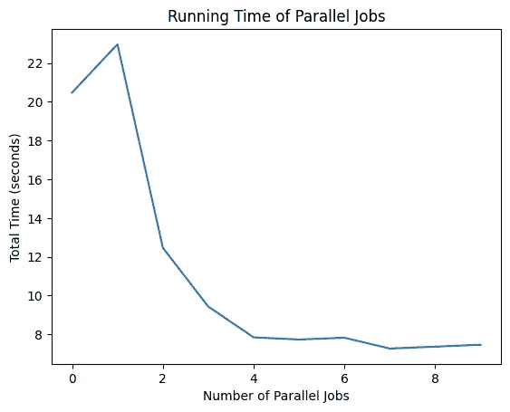
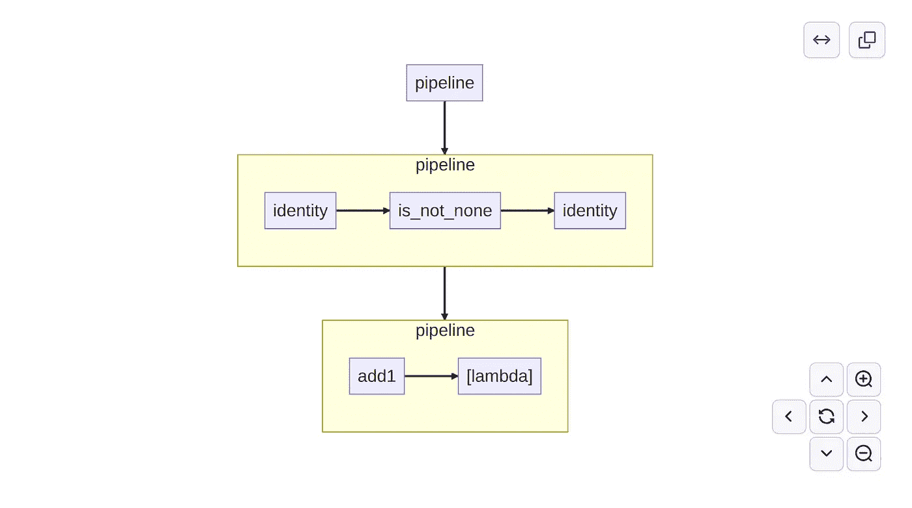
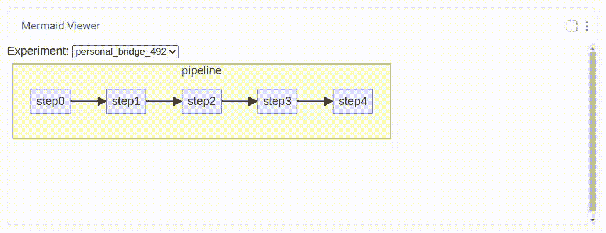

# 世界上最小的数据管道框架

> 原文：[`towardsdatascience.com/the-worlds-smallest-data-pipeline-framework-408eaf1a4ce4?source=collection_archive---------0-----------------------#2023-11-16`](https://towardsdatascience.com/the-worlds-smallest-data-pipeline-framework-408eaf1a4ce4?source=collection_archive---------0-----------------------#2023-11-16)

## 一个简单快速的数据管道基础，具备复杂的功能。

[](https://medium.com/@doug.blank?source=post_page-----408eaf1a4ce4--------------------------------)[](https://towardsdatascience.com/?source=post_page-----408eaf1a4ce4--------------------------------) [Douglas Blank, PhD](https://medium.com/@doug.blank?source=post_page-----408eaf1a4ce4--------------------------------)

·

[关注](https://medium.com/m/signin?actionUrl=https%3A%2F%2Fmedium.com%2F_%2Fsubscribe%2Fuser%2F66e2bac7e7d8&operation=register&redirect=https%3A%2F%2Ftowardsdatascience.com%2Fthe-worlds-smallest-data-pipeline-framework-408eaf1a4ce4&user=Douglas+Blank%2C+PhD&userId=66e2bac7e7d8&source=post_page-66e2bac7e7d8----408eaf1a4ce4---------------------post_header-----------) 发表在 [Towards Data Science](https://towardsdatascience.com/?source=post_page-----408eaf1a4ce4--------------------------------) · 7 分钟阅读 · 2023 年 11 月 16 日

--

[](https://medium.com/m/signin?actionUrl=https%3A%2F%2Fmedium.com%2F_%2Fbookmark%2Fp%2F408eaf1a4ce4&operation=register&redirect=https%3A%2F%2Ftowardsdatascience.com%2Fthe-worlds-smallest-data-pipeline-framework-408eaf1a4ce4&source=-----408eaf1a4ce4---------------------bookmark_footer-----------)

图片来源：[Ana Lucia Cottone](https://unsplash.com/@fromanalucia?utm_source=medium&utm_medium=referral) 于 [Unsplash](https://unsplash.com/?utm_source=medium&utm_medium=referral)

数据整理可能是数据科学家花费时间最多的工作。数据整理包括清理、转换以及将原始数据处理成有用的信息。像许多活动一样，整理过程通常需要随着时间的推移进行改进。因此，跟踪数据集是如何整理的很重要，这样你的团队可以管理并重复这个过程。虽然数据整理并不总是有趣，但它可能是现代公司中最重要的活动。

有些公司专注于数据管道，这些管道可能很复杂且非常精密。但是为了这次探索，让我们考虑将一个文本文件转化为一组单词或“标记”，并丢弃那些对我们没有用的文本。让我们从简单开始，逐步深入。

首先，让我们定义一系列步骤，以对文本中的单词执行整理函数。我们将使用 Python 的 **text.translate()** 函数来完成一些工作。考虑这 4 个函数：

```py
import string

def step1(word):
    trans = str.maketrans("", "", string.punctuation)
    return word.replace("\n", " ").translate(trans)

def step2(word):
    return word.lower()

def step3(word):
    trans = str.maketrans("", "", "0123456789")
    return word.replace("\n", " ").translate(trans)

def step4(word):
    return (all([char in string.ascii_letters for char in word]) and 
            len(word) > 0)
```

**step1** 是一个函数，用于删除单词中的所有标点符号和换行符。**step2** 将单词转换为小写。**step3** 再次使用 **text.translate()** 来删除数字。而 **step4** 将用作过滤器，过滤掉包含非 ASCII 字符的单词。你可以想象一些额外的步骤，例如词干提取。

由于这些是简单函数，如果我们对一个单词应用 **step1**，我们将得到：

```py
>>> step1("Testing---123;")
'Testing123'
```

确实，它已经从文本中删除了标点符号。我们可以通过将所有三个函数像俄罗斯套娃一样包裹在单词周围来应用它们：

```py
>>> step3(step2(step1("Testing---123;")))
'testing'
```

在这里我们看到函数 **step1**、**step2** 和 **step3** 已被应用，只剩下字母“testing”。注意，我们将定义我们的函数按特定的顺序进行工作。也就是说，**step1** 应该在 **step2** 之前完成，等等。

这个基于函数的过程简单易创建，也简单易用。当然，我们可以一次性完成所有的函数。但随着“管道”函数变得越来越长且复杂，将过程分解为离散的步骤会使过程更易于管理。实际上，每一步可能会变得如此复杂，以至于需要不同的团队来处理。

好的，到目前为止，一切顺利。但当然，我们不想手动将函数管道应用到每个单词上。我们想要将它应用到列表中的每个单词。为此，我们创建了一个非常简单的函数 **apply()**：

```py
def apply(step, values):
    return [step(value) for value in values]
```

现在我们可以在整个单词列表上使用相同的函数：

```py
>>> apply(step3, 
          apply(step2, 
                apply(step1, 
                      ["Testing---123;", "456---", "Hello!"])))
['testing', '', 'hello']
```

啊，是的，我们需要去除空白单词。**step4** 正是为此设计的，但使用起来有些复杂。它的样子是这样的：

```py
>>> list(filter(step4, 
            apply(step3, 
                  apply(step2, 
                        apply(step1, 
                              ["Testing---123;", "456---", "Hello!"])))))
['testing', 'hello']
```

也就是说，因为 **step4** 是一个过滤函数，返回 True 以保留单词，返回 False 以删除它，所以它的应用方式是：**filter(step4, data)**。

这个简单方法有几个问题：

1.  步骤是从内向外应用的。也就是说，第一个步骤 **step1** 是最内层的函数，而 **step3** 是最外层的。不是很直观。

1.  这非常冗长，因为我们必须为每个步骤函数重复**apply()**函数。

1.  过滤器（如**step4**）不能像其他函数一样使用。

考虑到这些问题，我们能否将主要功能抽象成一个通用的管道？我设想了一个两步法：

```py
# First we create a pipeline function:
p = my_pipeline(step1, step2, step3)

# And then we apply it to a dataset:
p(["Testing---123;", "456---", "Hello!"])
```

我们如何定义**my_pipeline**？事实证明，它非常简单：

```py
def my_pipeline(*steps):
    def wrapper(inputs):
        for step in steps:
            inputs = apply(step, inputs)
        return inputs
    return wrapper
```

也就是说，**my_pipeline**是一个函数，它接受一系列步骤函数，并返回一个函数，该函数接受一个单词列表，应用系列中的每个步骤，然后返回处理后的单词列表。

让我们试试：

```py
>>> p = my_pipeline(step1, step2, step3)
>>> p(["Testing---123;", "456---", "Hello!"])
['testing', '', 'hello']
```

它有效——我们得到了之前得到的完全一样的结果！**step4**过滤器函数怎么样？让我们暂时放下这个问题，试试这个系统在“真实”数据上的表现。好吧，这将是真实的假数据。对于这些实验，我们将创建 10,000 个文档，每个文档包含 10 个段落。我们将使用 Python 包**essential_generators**中的**DocumentGenerator()**。

```py
from essential_generators import DocumentGenerator
import os

gen = DocumentGenerator()

def generate_documents(
    count=10_000, 
    paragraphs=10, 
    output_folder="documents", 
    overwrite=False
):
    os.makedirs(output_folder, exist_ok=True)
    for n in range(count):
        filename = os.path.join(
            output_folder, 
            "doc_%05d.txt" % (n + 1)
        )
        if overwrite or not os.path.exists(filename):
            with open(filename, "w") as fp:
                for p in range(paragraphs):
                    fp.write(gen.paragraph() + "\n\n")

generate_documents()
```

这将需要大约 30 秒来生成所有数据。要继续我们的简单代码，我们需要引入一个步骤：

```py
def step0(filename):
    return open(filename).read().split(" ")
```

这一步将接收一个文件名，打开文件，并按空格分割文本。我们还需要对我们的**apply()**函数做一个小调整，以处理单词列表，而不是单词：

```py
def apply(step, outputs):
    return (step(input) if not isinstance(input, list) else 
            [step(i) for i in input] for input in outputs)
```

我还对**apply**做了一个小调整：现在它通过使用括号而不是方括号来返回一个*生成器表达式*而不是*列表推导式*。这将延迟处理直到需要时（有时称为“延迟评估”）。

现在我们可以构建一个接近完整的管道系统：

```py
p = my_pipeline(step0, step1, step2, step3)
list(p(["documents/doc_00001.txt"]))
```

请注意，它接受一个文件名列表作为输入。简单明了。但我仍然希望看到一些东西：

1.  以简单的方式处理过滤器的能力

1.  以并行运行管道快速处理数据集的能力

1.  可视化管道的能力

对于这三个附加功能，我会推荐你参考我基于上述想法开发的**picopipe**项目。你可以通过 pip 安装它：

```py
pip install picopipe
```

并使用上述相同的步骤函数运行它：

```py
from picopipe import pipeline, pfilter

p = pipeline(step0, step1, step2, step3, pfilter(step4))
list(p(["documents/doc_00001.txt"])[0])
```

在这里，**pfilter**代表管道过滤器，你只需将其包裹在**step4**函数周围。我对这个设计相当满意。但让我们看看它运行得有多快。

首先，让我们获取所有的文档文件名。一种简单的方法是使用**glob**：

```py
import glob

dataset = glob.glob("documents/doc_*.txt")
```

现在我们可以处理所有文档了：

```py
results = list(p(dataset))
```

在我的笔记本电脑上处理所有 10,000 个文档大约需要 21 秒。简短而甜美！我们能让它运行得更快吗？

是的！现在管道中还有一个**n_jobs**参数，指示你可以并行运行的作业数量。这里有一小段代码，将使用 0 到 9 个线程多次处理数据集。你认为使用 9 个线程并行运行会快多少？

```py
import time

x = []
y = []
for i in range(10):
    start = time.time()
    results = list(p(dataset, n_jobs=i))
    total_time = time.time() - start
    x.append(i)
    y.append(total_time)
```

这将需要几分钟。绘制结果时间与线程数的关系图显示：



显示将处理拆分为多个并行作业的运行时间的绘图。作者提供的图片。

有趣的是：图表并不随着额外线程的增加而继续减少。也就是说，使用 9 个线程并不比使用 1 个线程快 9 倍。为什么呢？不幸的是，您不能违法。而且有一个法则：[阿姆达尔定律](https://en.wikipedia.org/wiki/Amdahl%27s_law)。它基本上说，您永远不会因为存在无法减少的开销成本而使速度快 N 倍。在这种情况下，我可以使用 4 个线程将时间从约 21 秒减少到 8 秒。还不错！

最后，我想要可视化管道。在项目的这一部分，我选择尝试[Mermaid 图表格式](https://mermaid.js.org/)。它最近得到了很多支持，包括在 github 的仓库中。这种格式非常简单，易于创建。对于 github 的渲染，只需将文件命名为.mmd 扩展名即可。以下是使用**picopipe**生成 Mermaid 脚本的方法：

```py
from picopipe import to_mermaid

with open("pipeline.mmd", "w") as fp:
    fp.write(to_mermaid(p))
```

并且在 github 的渲染中显示如下：



Github.com 直接支持 Mermaid 文档文件。作者提供的图片。

不幸的是，github 不显示鼠标悬停功能（在 CSS 中定义）。但是，如果您可以设置自己的 CSS，则可以实现不仅可视化管道，还可以在鼠标悬停在步骤框时显示步骤代码：



如 Comet 的自定义面板中所示的 Mermaid 图表。作者提供的图片。

上述的带有鼠标悬停支持的 Mermaid 图表是使用 Comet 的自定义面板系统创建的（所有用户免费）。创建显示 Mermaid 文件的自定义面板非常简单。以下是上述 Mermaid 图表的实时演示：[comet.com/dsblank/picopipe/a4c044c1657b464087ec44f67ae22709](https://www.comet.com/dsblank/picopipe/a4c044c1657b464087ec44f67ae22709?experiment-tab=panels&showOutliers=true&smoothing=0&viewId=QXG0miglwPD2bCyWHGheKEF4j&xAxis=step)

这完成了我们对开发“世界上最小数据管道框架”的探索，以及对其并行化和可视化的探索。您可以在此处找到所有的代码：[github.com/dsblank/picopipe](https://github.com/dsblank/picopipe) 我希望您觉得这里呈现的想法和最终模块有用。

***对人工智能、机器学习或数据科学感兴趣吗？考虑鼓掌和关注。Doug 是*** [***comet.com***](https://www.comet.com/) ***的研究主管。***
