# 线性回归的理论深度解析

> 原文：[`towardsdatascience.com/theoretical-deep-dive-into-linear-regression-e53c579aef5b`](https://towardsdatascience.com/theoretical-deep-dive-into-linear-regression-e53c579aef5b)

## [可解释的人工智能](https://medium.com/tag/explainable-ai)

## 了解线性回归的本质及其如何以自然的方式扩展

 [Dr. Robert Kübler](https://dr-robert-kuebler.medium.com/?source=post_page-----e53c579aef5b--------------------------------)

·发布于 [Towards Data Science](https://towardsdatascience.com/?source=post_page-----e53c579aef5b--------------------------------) ·10 分钟阅读·2023 年 6 月 23 日

--

图片由 [Erik van Dijk](https://unsplash.com/@erikvandijk?utm_source=medium&utm_medium=referral) 提供，来源于 [Unsplash](https://unsplash.com/?utm_source=medium&utm_medium=referral)

大多数有抱负的数据科学博客作者都会这样做：撰写一篇关于线性回归的介绍性文章——这是一个自然的选择，因为这是我们进入这个领域时学习的第一个模型之一。虽然这些文章对初学者非常有用，但大多数都未能深入挖掘以满足高级数据科学家。

所以，让我带你了解一些鲜为人知但令人耳目一新的线性回归细节，这将使你成为更好的数据科学家（并在面试中获得加分）。

*这篇文章内容相当数学化，因此为了跟上内容，具备一些概率和微积分的坚实基础会很有帮助。*

# 数据生成过程

我非常喜欢在建模时考虑数据生成过程。处理过贝叶斯建模的人会明白我的意思，但对于其他人：想象一下你有一个数据集 (*X*, *y*)，由样本 (*x*, *y*) 组成。给定 *x*，如何得到目标 *y*？

> *假设我们有* n *个数据点，每个* x *有* k *个组件/特征*。

对于一个线性模型，参数为 ***w*₁, …, *wₖ*（系数）*，*b*（截距）*，*σ*（噪声）**，假设数据生成过程如下：

1.  计算 *µ* = *w*₁*x*₁ + *w*₂*x*₂ + … + *wₖxₖ* + *b*。

1.  随机生成一个 *y* ~ *N*(*µ, σ²*)。这与其他随机生成的数字独立。*或者：* 生成 *ε* ~ *N*(0, σ²*) 并输出 *y* = *µ* + *ε*。

就是这样。这两行简单的文字等同于人们喜欢详细解释的最重要的线性回归假设，即**线性、同方差性和误差独立性**。

从过程的第 1 步开始，你也可以看到我们用典型的线性方程 *w*₁*x*₁ + *w*₂*x*₂ + … + *w*ₖx*ₖ* + *b* 来建模期望 *µ*，而不是实际目标。我们知道无论如何不会击中目标，因此我们接受生成 *y* 的分布的均值。

## 扩展

**广义线性模型**。我们不必使用正态分布作为生成过程。如果我们处理的数据集**仅包含正目标**，那么假设使用**泊松****分布** Poi(*µ*) 可能更有利，这样你就得到了**泊松回归**。

如果我们的数据集只有目标 0 和 1，使用**伯努利分布** Ber(*p*)，其中 *p* = sigmoid(*µ*)，那就是**逻辑回归**。

只有 0, 1, …, *n* 之间的数字？使用**二项分布**来获取[**二项回归**](https://en.wikipedia.org/wiki/Binomial_regression)。

列表还在继续。长话短说：

> 思考一下哪个分布可能生成你在数据中观察到的标签。

# 我们到底在最小化什么？

好的，我们现在决定了一个模型。那么我们怎么训练它？我们怎么学习参数？当然，你知道：我们最小化了（均方）误差。但为什么？

关键在于，你只需使用我们之前描述的生成过程进行**最大似然估计**。我们观察到的标签是 *y*₁, *y*₂, …, *y*ₙ*，它们都是通过具有均值 *µ*₁, *µ*₂, …, *µ*ₙ 的正态分布独立生成的。看到这些 *y* 的可能性是多少？这是：

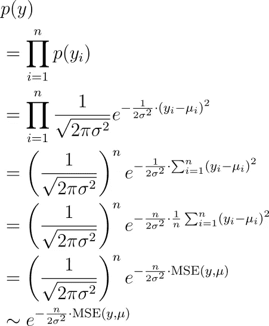

图片由作者提供。

我们现在想找到（隐藏在 *µᵢ* 中的）参数，以**最大化**这一项。这等同于最小化均方误差，如你所见。

## 扩展

**不等方差**。实际上，*σ* 不必是恒定的。你可以为数据集中每个观察值设置不同的 *σᵢ*。然后，你将最小化

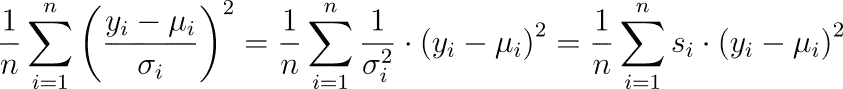

图片由作者提供。

代替，这就是**带有样本权重 *s* 的最小二乘法**。建模库通常允许你设置这些权重。在 scikit-learn 中，例如，你可以在 `fit` 函数中设置 `sample_weight` 关键字。

这样，你可以通过增加相应的 *s* 来更强调某些观察值。这等同于减小方差 *σ²*，即你更确信这个观察值的误差较小。这种方法也称为[**加权最小二乘法**](https://en.wikipedia.org/wiki/Weighted_least_squares)。

**输入的方差依赖性。** 你甚至可以说方差也依赖于输入 *x*。在这种情况下，你会得到一个有趣的损失函数，这也被称为**方差衰减**：

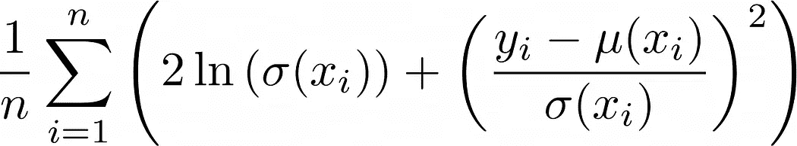

整个推导过程在这里概述：

 ## 免费获取回归神经网络中的不确定性估计

### 给定合适的损失函数，标准神经网络也可以输出不确定性

towardsdatascience.com

**正则化。** 除了仅仅最大化观察到的标签 *y*₁, *y*₂, …, *yₙ* 的似然，你还可以采用**贝叶斯观点**并**最大化后验似然**

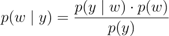

作者提供的图像。

在这里，*p*(*y* | *w*) 是上述的似然函数。我们必须决定一个 *p*(*w*) 的概率密度，即所谓的**先验或先验分布**。如果我们说参数独立地服从围绕 0 的正态分布，即 *wᵢ* ~ *N*(0, *ν²*)，那么我们最终会得到**L2 正则化，即岭回归**。对于拉普拉斯分布，我们得到**L1 正则化，即 LASSO**。

为什么呢？让我们以正态分布为例。我们有

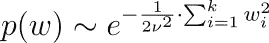

作者提供的图像。

因此，加上我们上述 *p*(*y* | *w*) 的公式，我们必须最大化

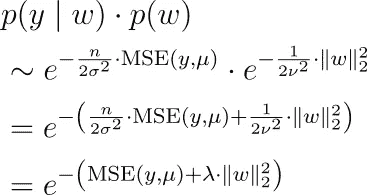

作者提供的图像。

这意味着我们必须**最小化均方误差加上一些正则化超参数乘以 *w* 的 L2 范数**。

> *注意，我们从贝叶斯公式中省略了分母 *p*(*y*)，因为它不依赖于 *w*，所以我们可以忽略它进行优化。*

你可以使用任何其他的先验分布来创建更有趣的正则化。你甚至可以说你的参数 *w* 是正态分布的，但与某个相关矩阵 Σ* **相关**。*

> *假设 Σ 是* 正定的*，即我们处于非退化情况。否则，没有密度 *p*(*w*)。*

如果你进行数学计算，你会发现我们然后必须优化

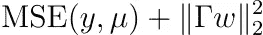

作者提供的图像。

对于某个矩阵 Γ。**注意：Γ 是可逆的，我们有 Σ⁻¹ = ΓᵀΓ。** 这也被称为**提霍诺夫正则化**。

**提示：** 从以下事实开始

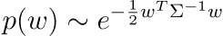

作者提供的图像。

并且记住，正定矩阵可以被[分解成某个可逆矩阵及其转置的乘积](https://en.wikipedia.org/wiki/Definite_matrix#Decomposition)。

# 最小化损失函数

很好，我们定义了我们的模型并知道我们想优化什么。但是我们如何优化它，即学习最优的参数以最小化损失函数？什么时候会有唯一解？让我们来看看。

## 普通最小二乘法

假设我们不进行正则化，也不使用样本权重。那么，均方误差可以写作

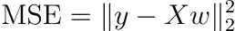

图像由作者提供。

这非常抽象，所以让我们以不同的方式书写

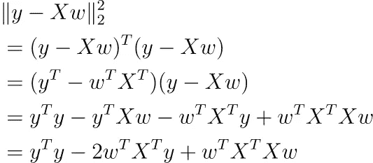

图像由作者提供。

使用 [矩阵微积分](https://en.wikipedia.org/wiki/Matrix_calculus#Scalar-by-vector_identities)，你可以对这个函数关于 *w* 求导（我们假设偏置项 *b* 已经包含在内）。

图像由作者提供。

如果你将这个梯度设为零，你会得到

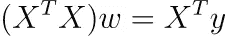

图像由作者提供。

如果 (*n* × *k*) 矩阵 *X* 的秩为 *k*，那么 (*k* × *k*) 矩阵 *X*ᵀ*X* 也是，即它是可逆的。为什么？这可以从 [rank(*X*) *=* rank(*X*ᵀ*X*)](https://en.wikipedia.org/wiki/Rank_(linear_algebra)#Properties) 中推导出来。

在这种情况下，我们得到**唯一解**

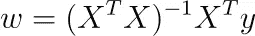

图像由作者提供。

> ***注意：*** *软件包不像这样优化，而是使用梯度下降或其他迭代技术，因为这样更快。不过，公式很好，并且为我们提供了有关问题的一些高级见解。*

但这真的能达到最小值吗？我们可以通过计算 Hessian 矩阵来找出，Hessian 矩阵是 *X*ᵀ*X*。该矩阵是半正定的，因为 *w*ᵀ*X*ᵀ*Xw = |Xw|²* ≥ 0 对于任何 *w*。它甚至是**严格**正定的，因为 *X*ᵀ*X* 是可逆的，即 0 不是特征值，所以我们的最优 *w* 确实在最小化我们的问题。

## 完美的多重共线性

这只是友好的情况。但如果 *X* 的秩小于 *k* 会发生什么？如果我们数据集中有两个特征，其中一个是另一个的倍数，例如，我们在数据集中使用 *height (in m)* 和 *height (in cm)* 作为特征。然后我们有 *height (in cm) = 100 * height (in m)*。

如果我们对分类数据进行独热编码而不丢弃其中一列，也可能发生这种情况。例如，如果我们数据集中有一个特征 *color*，它可以是红色、绿色或蓝色，那么我们可以进行独热编码，得到三列 *color_red, color_green,* 和 *color_blue*。对于这些特征，我们有 *color_red + color_green + color_blue =* 1，这也会引起完美的多重共线性。

在这些情况下，*X*ᵀ*X* 的秩也小于 *k*，因此这个矩阵是不可逆的。

> 故事结束。

还是不行？实际上不是，因为这可能意味着两件事：(*X*ᵀ*X*)*w = X*ᵀ*y* 有

1.  没有解或

1.  无限多的解。

事实证明，在我们的案例中，我们可以使用 [Moore-Penrose 伪逆](https://en.wikipedia.org/wiki/Moore%E2%80%93Penrose_inverse) 获得一个解。这意味着我们处于无穷多解的情况，这些解都给我们相同的（训练）均方误差损失。

如果我们用 *A*⁺ 表示 *A* 的 Moore-Penrose 伪逆，我们可以求解线性方程组为

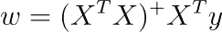

作者提供的图片。

要获得其他无穷多解，只需将 *X*ᵀ*X* 的零空间添加到这个特定解中。

## 使用 Tikhonov 正则化的最小化

记住，我们可以向权重中添加先验分布。然后我们需要最小化

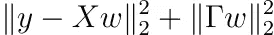

作者提供的图片。

对于某个可逆矩阵 Γ。按照普通最小二乘法中的相同步骤，即对 *w* 求导并将结果设置为零，解为

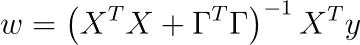

作者提供的图片。

精彩的部分：

> XᵀX + ΓᵀΓ 始终是可逆的！

让我们找出原因。只需证明 *X*ᵀ*X* + ΓᵀΓ 的零空间仅为 {0}。因此，我们取一个 *w* 使得 (*X*ᵀ*X* + ΓᵀΓ)*w* = 0。现在，我们的目标是证明 *w* = 0。

从 (*X*ᵀ*X* + ΓᵀΓ)*w* = 0 可得

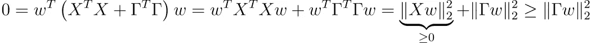

作者提供的图片。

这也意味着 |Γ*w*| = 0 → Γ*w = *0*。由于 Γ 是可逆的，*w* 必须是 0。通过相同的计算，我们可以看到 Hessian 矩阵也是正定的。

很好，因此 Tikhonov 正则化自动帮助使解唯一！由于岭回归是 Tikhonov 回归的特例（对于 Γ = λ*Iₖ，其中 Iₖ* 是 *k* 维单位矩阵），因此同样适用。

## 添加样本权重

最后，让我们还将样本权重添加到 Tikhonov 正则化中。添加样本权重等同于最小化

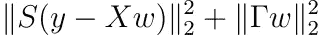

作者提供的图片。

对于某些对角矩阵 *S* 其对角元素 *sᵢ* 为正，最小化问题和普通最小二乘法一样简单。结果是

作者提供的图片。

**注意：** Hessian 矩阵也是正定的。

## 你的作业

假设对于 Tikhonov 正则化，我们不强制权重围绕 0，而是围绕某个点 *w*₀。证明优化问题变为

作者提供的图片。

结果是

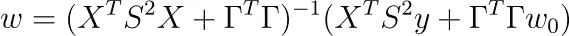

作者提供的图片。

这是 Tikhonov 正则化的最一般形式。有些人更喜欢定义 *P* := *S*²，*Q* := ΓᵀΓ，如 [这里所示](https://en.wikipedia.org/wiki/Ridge_regression#Generalized_Tikhonov_regularization)。

# 结论

在这篇文章中，我带你探讨了线性回归的几个高级方面。通过采用生成视角，我们可以看到广义线性模型与*普通*线性模型的区别仅在于用于抽样目标*y*的分布类型。

然后我们看到，最小化均方误差等同于最大化观测值的似然。如果我们对可学习参数施加一个先验正态分布，我们最终会得到 Tikhonov（以及 L2 作为特例）正则化。我们也可以使用不同的先验分布，如拉普拉斯分布，但那样就没有封闭的解公式了。不过，凸优化方法也可以帮助你找到最佳参数。

作为最后一步，我们为每个最小化问题找到了很多直接的解公式。这些公式在大数据集的实际应用中通常不会使用，但我们可以看到这些解总是唯一的。我们在过程中也学会了一些微积分。😉

我希望你今天学到了一些新的、有趣的和有价值的东西。感谢阅读！

> *如果你有任何问题，请在* [*LinkedIn*](https://www.linkedin.com/in/dr-robert-k%C3%BCbler-983859150/)*上联系我！*

如果你想更深入地了解算法的世界，可以试试我的新出版物**所有关于算法**！我仍在寻找作者！

[## 所有关于算法](https://medium.com/all-about-algorithms?source=post_page-----e53c579aef5b--------------------------------)

### 从直观的解释到深入的分析，算法通过示例、代码和精彩的内容得以呈现…

[medium.com](https://medium.com/all-about-algorithms?source=post_page-----e53c579aef5b--------------------------------)
