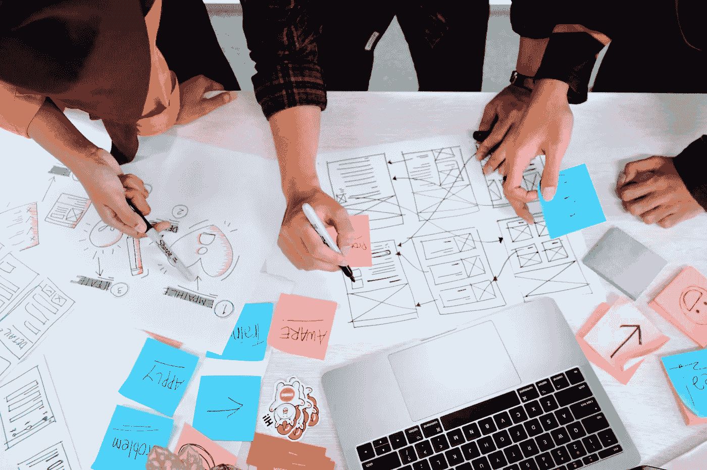
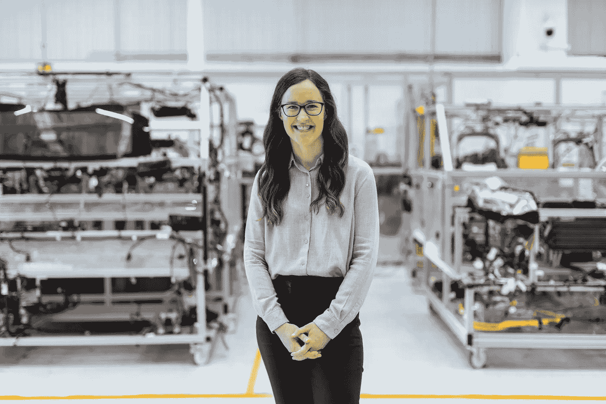

# 为什么以人为本的 AI 设计指南在制造业中使用时可能优雅地失败

> 原文：[`towardsdatascience.com/this-is-why-human-centred-ai-design-guidebooks-can-gracefully-fail-when-used-in-manufacturing-95ceae0aad21?source=collection_archive---------10-----------------------#2023-05-09`](https://towardsdatascience.com/this-is-why-human-centred-ai-design-guidebooks-can-gracefully-fail-when-used-in-manufacturing-95ceae0aad21?source=collection_archive---------10-----------------------#2023-05-09)

## 从一个使用案例中学习

 [Yuji Yamamoto](https://medium.com/@yuji.yamamoto?source=post_page-----95ceae0aad21--------------------------------)

·

[关注](https://medium.com/m/signin?actionUrl=https%3A%2F%2Fmedium.com%2F_%2Fsubscribe%2Fuser%2F1ffbd7c91ccf&operation=register&redirect=https%3A%2F%2Ftowardsdatascience.com%2Fthis-is-why-human-centred-ai-design-guidebooks-can-gracefully-fail-when-used-in-manufacturing-95ceae0aad21&user=Yuji+Yamamoto&userId=1ffbd7c91ccf&source=post_page-1ffbd7c91ccf----95ceae0aad21---------------------post_header-----------) 发表于 [数据科学前沿](https://towardsdatascience.com/?source=post_page-----95ceae0aad21--------------------------------) ·9 分钟阅读·2023 年 5 月 9 日

--

图片由 [UX Indonesia](https://unsplash.com/pt-br/@uxindo?utm_source=medium&utm_medium=referral) 提供，来源于 [Unsplash](https://unsplash.com/?utm_source=medium&utm_medium=referral)

我们看到在各个社区对以人为本的 AI（HAI）的关注日益增加。HAI 的基本理念是将人类和人性置于设计 AI 驱动应用程序的中心。HAI 设计寻求实现人类与 AI 的共生——AI 辅助人类任务而不是取代它们，人类通过提供反馈来改进 AI。

像 Google、Microsoft、IBM、Apple 等大科技公司重视 HAI 理念，并开发了自己的 HAI 设计方法，并公开分享作为指南。例如，Google 的 PAIR 研究团队提供的[People+AI 指南](https://pair.withgoogle.com/guidebook/)展示了如何组织和促进一系列研讨会，在这些研讨会上，不同领域的专家共同设计 AI 应用的功能和用户界面。它还提供了一系列在 HAI 设计过程中需要解决的问题和指导，如“应用程序的用户价值是什么？”以及“如何向用户解释预测结果？”。该指南进一步提供了各种实际应用 HAI 设计的示例用例，以激发设计参与者的灵感。Microsoft 分享了一种名为“[HAX 工具包](https://www.microsoft.com/en-us/haxtoolkit/)”的 HAI 方法。它提供了 PowerPoint 和 Excel 格式的设计指南和工作簿，目的是与 PAIR 的指南类似。

这些 HAI 方法的本质是相似的；它们允许多领域的人参与设计过程，并通过将用户体验、设计思维和负责任的 AI 的理论与实践融入统一的设计框架，促进捕捉和转化人们的需求为应用设计。

由[ThisisEngineering RAEng](https://unsplash.com/@thisisengineering?utm_source=medium&utm_medium=referral)拍摄，照片来自[Unsplash](https://unsplash.com/?utm_source=medium&utm_medium=referral)

好的，现在我来谈谈制造业:)。你可能认为制造业是一个可以轻松自动化的领域，但事实并非如此！即使在许多现代工厂中，许多技术熟练的人员仍在工作，并在开发、运行和改进工厂操作中扮演重要角色。因此，创造人类与机器之间的和谐至关重要。

那么，在制造业中整合 AI 技术时，为什么不使用 HAI 方法呢？这正是我们——一个拥有 AI、制造和用户体验专业知识的研究团队——的想法。我们与一家大型跨国制造商合作，试图开发并实施一种用于制造过程中的异常检测的机器学习模型。该模型检测来自关键制造设备中安装的传感器设备的数据中的异常模式。该模型的原型已经存在。我们使用了《People+AI》指南来帮助公司的 AI 项目。选择这种方法是因为它似乎是最全面且结构良好的方法。我们通过为期一天的研讨会使用了这种 HAI 方法，参与者包括约十名公司成员，涵盖了研发工程师、工艺工程师、数据科学家、技术人员和精益六西格玛专家等不同角色。

那么，使用这种方法的结果如何呢？嗯，我不会说它完全失败，但也不特别成功。总体而言，这种方法未能有效应对设计 AI 驱动的工业过程应用时复杂多面的挑战。研讨会的组织者（我们）和参与者感到他们必须同时处理来自不同角度的太多问题，导致了认知过载，并且体验混乱无序。

但我们从中学到了很多！我们意识到这种方法根本不适合制造业背景，需要对方法进行重大重构，以应对我们遇到的挑战。考虑到 HAI 方法之间的相似性，我们认为如果使用其他 HAI 方法，结果不会有太大不同。

让我们分享一下我们对这种方法在制造业中优雅地失败的反思。几个因素导致了这种失败，但在本文中，我挑选了三个重要的因素。希望这篇文章对那些有兴趣在工业环境中使用 AI 的人无论你的专业是什么，都能带来一些启发。

## **1\. 工作流设计不是该方法的一个组成部分：**

目前，科技公司和其他企业的 HAI 方法似乎主要针对帮助设计单一用户使用的应用程序，例如面向消费者的手机应用。在这种使用情况下，人机交互通常通过用户的屏幕、手指、眼睛和耳朵进行。指南似乎在设计这种交互时表现良好，使设计师能够探索不同的用户场景和体验，找到自动化和用户控制之间的平衡，管理对 AI 能力的期望等等。

另一方面，工业设施中的 AI 服务背景可能非常复杂。我们可以设想在制造厂使用异常检测的案例。这个应用程序通过放置在车间地板上的监视器屏幕显示传感器设备的健康状态，并在检测到异常时发出警报。应用程序的第一手用户是操作员。当然，操作员与应用程序之间的交互很重要，但事情并不止于此。当操作员收到警报时应该做什么或想做什么？这个人是否希望通过应用程序的帮助深入分析情况？或者他或她是否应该咨询上级或技术人员进行进一步的分析和决策？是否应该立即联系设备供应商？适当的行动是否取决于异常的严重性？行动是否取决于这些人的技能和知识？需要多少利益相关者参与决策？他们需要什么信息？如何在这些参与者之间共享信息？

如你所见，在制造环境中，初始事件——在此例中是发出警报——通常会触发一系列复杂的动作链，这些动作可能涉及组织内部或外部的多个人员。我们称这系列动作为工作流。我们已经了解到，手指-眼睛-屏幕的交互很难在没有工作流设计的情况下进行设计。因此，同时考虑这些设计或至少在开发过程中较早规划工作流设计是至关重要的，因为它们紧密相连。

HAI 方法是否支持这一点？不，工作流设计部分没有。在案例公司的研讨会上，设计参与者很高兴创建了关于异常状态和其他相关信息在车间地板上应如何显示的不同纸质原型。然而，由于他们对工作流如何展开了解有限，他们很快对哪些原型适合实际使用感到不确定。车间地板上的警报只是工作流的一个触发器。可能还有更多场景触发其他工作流，如假阴性、假阳性、传感器退化、传感器升级等。在没有适当的方法论支持的情况下，想象所有这些场景及其相应的工作流需要参与者付出大量的认知努力。

照片由[Cristina Gottardi](https://unsplash.com/es/@cristina_gottardi?utm_source=medium&utm_medium=referral)拍摄，来自[Unsplash](https://unsplash.com/?utm_source=medium&utm_medium=referral)

## **2\. 设计指南和问题引发了大量额外的询问：**

正如我们在本文介绍部分讨论的那样，PAIR 指南手册与其他 HAI 方法一样，提供了一套在应用设计过程中需要考虑的问题和指南。我可以在这里展示一些更多的例子；“如何建立适当的信任水平，以便用户不会对 AI 结果给予过多或过少的信任？”，“应用程序如何接受用户的反馈以改进应用程序的行为？”

这些问题或指导无疑对我们在设计过程中深入处理关键设计问题大有裨益。同时，解决这些问题需要广泛的假设思考，特别是对于行为具有概率性的 AI 驱动应用程序。在开发过程中，应用程序的具体行为并不总是明确的。对于较简单的交互，如移动电话应用，假设思考可能仍可管理。然而，在公司的研讨会上，假设思考很快发展到了我们无法处理的程度。

在研讨会开始时，除了参与者愿意在操作中使用异常检测模型外，几乎没有决定。我们遵循了指南手册建议的设计过程，设计指南和问题似乎对这个过程有所帮助。然而，研讨会的参与者很快对哪些问题和指南比其他问题和指南更重要以及问题应该回答的深度或细节感到不确定。这些问题也紧密相连。

因此，回答这些问题变成了大量的猜测工作。以一个设计问题为例——如何建立用户对应用程序的信任。许多因素可以影响这一点，但至少它依赖于预测结果如何呈现给用户。展示的设计可能会受到模型性能的影响。性能将受到在开发过程中尚未完全了解的生产阶段数据的影响。正如我们之前讨论的，结果展示还依赖于工作流程。

如你所见，一个设计问题会引发一系列其他相互关联的问题，这些问题很难一一回答。一个答案依赖于另一个答案，而另一个答案又依赖于另一个只能部分回答的答案……难怪参与者很快就感到困惑和不知所措。一位参与者在最后说：“好吧，我们现在知道前方有座巨大的山，但我们仍然不确定如何攀登它。”

图片由 [Luis Villasmil](https://unsplash.com/@villxsmil?utm_source=medium&utm_medium=referral) 提供，来源于 [Unsplash](https://unsplash.com/?utm_source=medium&utm_medium=referral)

## **3\. 整合收集信息的责任不明确：**

HAI 方法帮助设计参与者生成设计 AI 驱动应用所需的大量信息。这些方法提供了各种工具，如创意卡片、设计问题、指南和工作簿，以协助生成和记录这些信息。

那么谁来整合所有这些信息呢？通过研讨会，显而易见，这个方法主要是从 UX 设计师的角度设计的，而设计师似乎是那个整合信息并将其转化为设计的人。

好吧，我们理解“以人为中心的 AI”这个短语在 HAI 方法中被强调，但它们对 UX 的偏向性较大。这种偏向可能不会在方法用于更简单的交互（如手机应用）时混淆人们。UX 设计师在设计这种应用的功能和界面方面经验丰富。

但是当这个方法用于工业过程，其中工作流设计是交互设计的关键和不可分割部分时情况如何？在这种多面向的使用案例中，UX 设计师是否仍应整合来自研讨会的信息？还是具有广泛和深入工业过程理解的项目负责人更适合这个任务？我们在没有明确理解这一问题的情况下开始了研讨会，这进一步使得研讨会（已经是一团糟！）变得复杂。

## **最终，从失败中学习并继续前进…**

这三个因素已经足以使参与者感到不堪重负，并造成认知超负荷和混乱。我们只是带着对 HAI 方法在工业过程应用中的局限性不够了解的心态进入了研讨会。虽然这些方法为我们提供了坚实的基础，但我们发现需要进行重大修改以适应制造领域。

我们目前正在开发一种基于我们学习的新方法，并在公司进行测试。我们至少知道，工作流设计应该融入到这个方法中，并且该方法应该有效处理在设计过程中出现的一系列相互关联的“假设”问题。希望我们能在未来报告结果！！ :).

# 本博文与我的同事 Kristian Sandström 和 Alvaro Aranda Munoz 一起撰写。谢谢！
