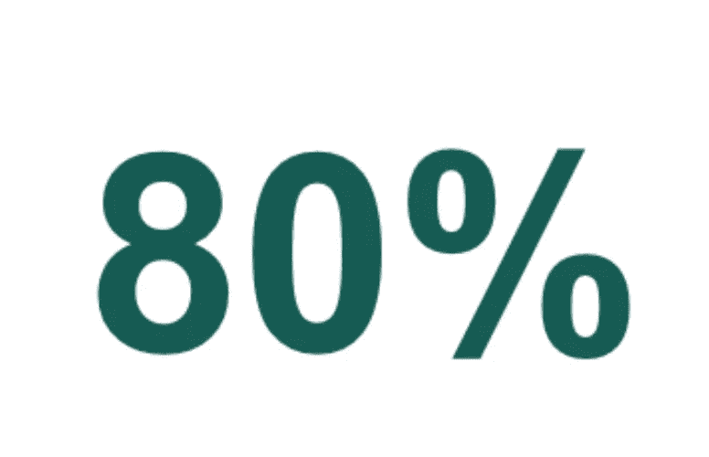

# 三种你可能不知道的表示百分比的图表

> 原文：[`towardsdatascience.com/three-charts-to-represent-a-percentage-you-may-not-know-84cc7d5c62a3`](https://towardsdatascience.com/three-charts-to-represent-a-percentage-you-may-not-know-84cc7d5c62a3)

## 数据可视化，Python

## 一个即用的 Python Altair 教程，用于构建表示百分比的图表

[](https://alod83.medium.com/?source=post_page-----84cc7d5c62a3--------------------------------)[](https://towardsdatascience.com/?source=post_page-----84cc7d5c62a3--------------------------------) [安杰利卡·洛·杜卡](https://alod83.medium.com/?source=post_page-----84cc7d5c62a3--------------------------------)

·发表于 [Towards Data Science](https://towardsdatascience.com/?source=post_page-----84cc7d5c62a3--------------------------------) ·5 分钟阅读·2023 年 8 月 23 日

--


[Markus Winkler](https://unsplash.com/@markuswinkler?utm_source=medium&utm_medium=referral) 拍摄的照片，来自 [Unsplash](https://unsplash.com/?utm_source=medium&utm_medium=referral)

以视觉方式表示百分比可能会更吸引观众，并帮助他们更好地理解数据。有多种方式可以以视觉方式表示百分比。最直接的策略是大数字（BAN），如下图所示。



图片由作者提供

除了 BAN，还有其他方式可以以视觉方式表示百分比。在本文中，我们将重点介绍三种策略：

+   饼图

+   100% 堆叠图

+   华夫图。

我们将使用 Python Altair 展示如何构建每种策略。Vega-Altair 库（简称 Altair）是一个基于 Vega 和 Vega-Lite 可视化语法的声明式 Python 统计可视化库。有关如何开始使用 Altair 的更多细节，你可以阅读官方的 [Python Altair 文档](https://altair-viz.github.io/)。

# 设置场景

为了展示每种图表的工作原理，我们将表示以下百分比：70%。为了表示这个值，你需要使用以下 Pandas DataFrame：

```py
data = {
    'percentage': [0.7,0.3],
    'label'     : ['70%','30%'],
    'color'     : ['#81c01e','lightgray']
}

df = pd.DataFrame(data)
```

DataFrame 必须包含两个值：百分比（70%）及其互补值（30%）。此外，我们设置了与每个切片相关的颜色：#81c01e（绿色的一种）用于我们的值，浅灰色用于其他。

让我们开始通过饼图来表示这个 DataFrame。

# 饼图

饼图是一种圆形图表，以环形显示数据。它类似于饼图，但中心有一个空洞，从而创建了不同类别百分比的可视化表示。

写下以下代码以在 Altair 中构建一个基本的甜甜圈图：

```py
import pandas as pd
import altair as alt

data = {
    'percentage': [0.7,0.3],
    'label'     : ['70%','30%'],
    'color'     : ['#81c01e','lightgray']
}

df = pd.DataFrame(data)

chart = alt.Chart(df).mark_arc(
    innerRadius=100,
    outerRadius=150
).encode( 
    theta='percentage',
    color=alt.Color('color', scale=None),
    tooltip='label'
).properties(
    width=300,
    height=300
)

chart.save('chart.html')
```

使用 `innerRadius` 和 `outerRadius` 设置甜甜圈图的内半径和外半径。

接下来，在甜甜圈图中添加文本，如下面的代码所示：

```py
text = alt.Chart(df.head(1)).mark_text(
    align='center',
    baseline='middle',
    fontSize=60,
    fontWeight='bold',
    color='black'
).encode(
    text='label',
    color=alt.Color('color', scale=None)
).properties(
    width=300,
    height=300
) 
```

仅将 DataFrame 的第一行传递给图表，并使用 `mark_text()` 在 Altair 中绘制文本。同时，设置字体大小、粗细和颜色。

最后，结合这两个图表，如以下代码片段所示：

```py
chart = (chart + text
).configure_view(
    strokeWidth=0
)

chart.save('donut-chart.html')
```

以下图示显示了结果图表：


作者提供的图片

# 100% 堆叠条形图

100% 堆叠条形图是一种将每个条形图堆叠到 100% 高度的堆叠条形图，用于显示每个类别的比例组成。

写下以下代码以在 Altair 中构建一个基本的 100% 堆叠条形图：

```py
import pandas as pd
import altair as alt

data = {
    'percentage': [0.7,0.3],
    'label'     : ['70%','30%'],
    'color'     : ['#81c01e','lightgray']
}

df = pd.DataFrame(data)

chart = alt.Chart(df).mark_bar(
    size=40
).encode(
    x=alt.X('sum(percentage)', axis=None),
    color=alt.Color("color", scale=None)
).properties(
    width=300
)
```

接下来，在条形图中添加文本，如下面的代码所示：

```py
text = alt.Chart(df.head(1)).mark_text(
    align='center',
    baseline='middle',
    fontSize=20,
    fontWeight='bold',
    color='lightgrey',
    dx=-30
).encode(
    text='label',
    x='percentage'
).properties(
    width=300
)
```

最后，结合这两个图表：

```py
chart = (chart + text
).configure_view(
  strokeOpacity=0
)

chart.save('stacked-bar-chart.html')
```

以下图示显示了结果图表：


作者提供的图片

# 华夫图

华夫图使用方格来显示数据，类似于一堆华夫饼。

在构建华夫图之前，你必须设置 10x10 网格，如下面的代码所示：

```py
import numpy as np
import pandas as pd
import altair as alt

# Compute x² + y² across a 2D grid
x, y = np.meshgrid(range(0, 10), range(0, 10))

ndex = 0
value = 70 # percentage

## calculate colors for each cell of the waffle chart
colors = []
for i in range(100,0,-1):
    if i <= np.round(value):
        colors.append(1)
    else:
        colors.append(0)

# Convert this grid to columnar data expected by Altair
df = pd.DataFrame({'x': x.ravel(),
                        'y': y.ravel(),
                        'z': colors})
```

接下来，使用 Altair 的 `mark_rect()` 标记方法构建你的华夫图：

```py
chart = alt.Chart(df).mark_rect(
    size=5, 
    stroke='black'
).encode(
    x=alt.X('x:O', axis=None),
    y=alt.Y('y:O', axis=None),
    color=alt.condition(alt.datum.z == 0, 
                        alt.value('lightgrey'),
                        alt.value('#81c01e')
                        )
).properties(
    width=200,
    height=200
)
```

可选地，在华夫图下方添加文本：

```py
text = alt.Chart(pd.DataFrame({'label' : [value/100]})).mark_text(
    align='center',
    baseline='middle',
    fontSize=30,
    fontWeight='bold',
    color='#81c01e'
).encode(
    text=alt.Text('label', format='.0%'),
).properties(
    width=200
)
```

最后，结合这两个图表并保存最终图表：

```py
chart = chart & text

chart.save('waffle-chart.html')
```

以下图示显示了结果图表：


作者提供的图片

# 总结

恭喜你！你刚刚学会了在 Python Altair 中表示百分比的三种不同方法：

+   通过 `mar_arc()` 标记方法绘制甜甜圈图

+   通过 `mark_bar()` 标记方法绘制 100% 堆叠条形图

+   通过 `mark_rect()` 标记方法绘制华夫图。

感谢阅读这篇博客文章！如果你有任何问题或意见，请留言或直接在 [LinkedIn](https://www.linkedin.com/in/angelicaloduca/) 上联系我。我很乐意与你联系！

你可以在我的书的 [GitHub 仓库](https://github.com/alod83/Data-Storytelling-with-Python-Altair-and-Generative-AI) 中找到这个示例的完整代码，[Data Storytelling with Generative AI using Python and Altair](https://www.manning.com/books/data-storytelling-with-generative-ai) 的第六章。

# 相关文章

[](/3-ways-to-build-a-geographical-map-in-python-altair-77c8e0781538?source=post_page-----84cc7d5c62a3--------------------------------) ## 3 种在 Python Altair 中构建地理地图的方法

### 一项关于如何在 Python Altair 中构建三种不同地图的数据可视化教程：区划图、点密度图……

[towardsdatascience.com [](/3-ways-to-visualize-time-series-you-may-not-know-c8572952ea9c?source=post_page-----84cc7d5c62a3--------------------------------) ## 3 种你可能不知道的时间序列可视化方法

### 一个关于如何在 Python 和 Altair 中可视化时间序列的即用教程

towardsdatascience.com

# 参考资料

+   [Python Altair 官方文档](https://altair-viz.github.io/)

+   A. Lo Duca [《使用 Python 和 Altair 的生成性 AI 进行数据讲述》](https://www.manning.com/books/data-storytelling-with-generative-ai) 曼宁 2024

+   A. Lo Duca 《使用 Python Altair 和生成性 AI 进行数据讲述》 — [GitHub 仓库](https://github.com/alod83/Data-Storytelling-with-Python-Altair-and-Generative-AI)

# 在你离开之前…

要查看 Altair 的实际应用，请观看视频教程。
