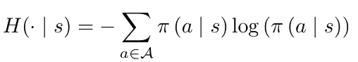

# 常见强化学习算法的三个根本性缺陷（及其修复方法）

> 原文：[`towardsdatascience.com/three-fundamental-flaws-in-common-reinforcement-learning-algorithms-and-how-to-fix-them-951160b7a207`](https://towardsdatascience.com/three-fundamental-flaws-in-common-reinforcement-learning-algorithms-and-how-to-fix-them-951160b7a207)

## 对抗在日常强化学习算法中遇到的这些缺陷

 [Wouter van Heeswijk, PhD](https://wvheeswijk.medium.com/?source=post_page-----951160b7a207--------------------------------)

·发布于 [数据科学前沿](https://towardsdatascience.com/?source=post_page-----951160b7a207--------------------------------) ·阅读时间 8 分钟·2023 年 1 月 30 日

--

图片由 [Varvara Grabova](https://unsplash.com/@santabarbara77?utm_source=medium&utm_medium=referral) 提供，来源于 [Unsplash](https://unsplash.com/?utm_source=medium&utm_medium=referral)

像 Q 学习和 REINFORCE 这样的强化学习算法已经存在了几十年，其教科书中的实现仍然被广泛使用。不幸的是，它们存在一些根本性的缺陷，这大大增加了学习良好策略的难度。

本文讨论了经典强化学习算法的三个主要缺陷，并提出了克服这些缺陷的解决方案。

# I. 选择被高估的动作

## 问题

大多数强化学习算法使用某种形式的价值函数来捕捉后续奖励，其中许多基于广为人知的 Q 学习算法。Q 学习的机制是**选择带来最高期望值的动作**。根据初始化情况，这一机制可能会在尝试的第一个动作上陷入困境，因此我们还以概率ϵ选择随机动作，通常设定为 0.05 左右。

在极限情况下，我们将无限次地探索每个动作，Q 值将收敛于真实值。然而，在实践中，我们处理的是有限样本和有偏的 Q 值。因此，**Q 学习一贯选择具有高估值的动作**！

想象这样一个场景，我们玩两个完全相同的[老虎机](https://medium.com/towards-data-science/a-minimal-working-example-for-deep-q-learning-in-tensorflow-2-0-e0ca8a944d5e)。机器 A 在早期迭代中给出的奖励高于平均水平，因此其 Q 值更高，我们持续玩 A。由于机器 B 仅偶尔被选择，我们需要很长时间才能发现 Q 值实际上是相同的。

更一般地说，价值函数总是会存在不完美之处，而强化学习往往会执行过高估值的动作。从某种意义上说，强化学习“奖励”了糟糕的估计，这显然不是一个理想的特性。

多臂老虎机问题清楚地展示了选择过高估值动作的影响[照片由[Bangyu Wang](https://unsplash.com/es/@bangyuwang?utm_source=medium&utm_medium=referral)提供，见[Unsplash](https://unsplash.com/?utm_source=medium&utm_medium=referral)]

## 解决方案

Q 学习的问题可以追溯到使用相同观察进行采样和更新的实践。我们可以通过使用一个策略进行采样，另一个策略进行更新来解耦这些步骤。这正是**双 Q 学习**（Van Hasselt, 2010）所做的。

双 Q 学习使用一个网络来采样动作，但用另一个网络的输出更新 Q 值。这一过程将采样和学习解耦，并且克服了过度估计。[来源：Van Hasselt (2010)]

更一般地说，使用**目标网络**是一个良好的实践。目标网络是策略的周期性副本，用于生成我们训练的目标值（而不是使用完全相同的策略来生成观察和目标）。这种方法减少了目标与观察之间的相关性。

另一种解决角度是考虑我们 Q 值估计的不确定性。与其仅仅记录动作的期望值，我们还可以跟踪观察的方差，以指示我们可能偏离真实值的程度。使用**不确定性边界和知识梯度**是实现这一目标的两种方法。我们不仅考虑选择具有最高期望 Q 值的动作，还考虑从新观察中能*学到*多少。这种方法偏向于探索具有高不确定性的动作，同时仍然进行智能采样。

## 你应该知道的七种强化学习探索策略

### 纯探索和-利用，ϵ-贪婪，玻尔兹曼探索，乐观初始化，置信区间……

towardsdatascience.com

# II. 糟糕的策略梯度更新

## 问题

策略梯度算法已经存在了几十年，并且是所有现代演员-评论员模型的根基。普通的策略梯度算法——例如 REINFORCE——依赖梯度来确定权重更新的方向。高奖励和高梯度的组合会产生强烈的更新信号。

传统的策略梯度更新函数，通过目标函数梯度 ∇_θJ(θ) 和步长 α 来更新策略权重 θ。

这个想法似乎很自然。如果奖励函数的斜率很陡，你就朝那个方向迈出大步。如果斜率很小，那就没有必要进行大幅更新。虽然这个逻辑可能很有说服力，但它也是根本有缺陷的。

左：超调行为的示例，进行了一次大幅策略更新但错过了奖励峰值。右：停滞行为的示例，被困在局部最优点，梯度接近 0。 [图像由作者提供]

梯度仅提供局部信息。它告诉我们斜率的陡峭程度，但不告诉我们在该方向上应走多远；我们可能会**超调**。此外，策略梯度并未考虑缺乏梯度信号可能会使我们**陷入次优平稳点**。

更糟的是，我们无法通过强制权重更新在某个参数区域内来控制这种行为。例如，在下面的图中，相同幅度的权重更新对策略产生了非常不同的效果。

两个高斯策略更新的示例。尽管这两个更新在参数空间中的大小相同，但左侧的策略显然受到的影响要大得多，而右侧的影响则较小 [图像由作者提供]

## 解决方案

一个简单的开始是尝试各种学习算法。传统的随机梯度下降（SGD）算法只考虑一阶矩。现代学习算法（例如 **ADAM**）考虑了二阶矩，通常会显著提升性能。虽然不能完全解决问题，但性能提升可能会非常显著。

**熵正则化**是一种常见的方法来防止普通策略梯度算法的过早收敛。大致来说，强化学习中的熵是衡量动作选择不可预测性的指标。熵正则化为探索未知动作添加了奖励，当我们对系统了解较少时，这种奖励会更高：

强化学习中的熵度量

更复杂的策略梯度算法扩展还考虑了二阶导数，这提供了函数的局部灵敏度信息。在平稳区域，我们可以安全地大步前进而不会产生后果。在陡峭但弯曲的坡度上，我们则会更倾向于谨慎地前进。诸如 [**自然策略梯度**](https://medium.com/towards-data-science/natural-policy-gradients-in-reinforcement-learning-explained-2265864cf43c)**、** **TRPO** **和** **PPO** 之类的算法考虑了更新的敏感性，无论是显式还是隐式地考虑了二阶导数。目前，PPO 是首选的策略梯度算法，在实现的便利性、速度和性能之间取得了良好的平衡。

自然策略梯度的权重更新方案。F(θ) 的 Fischer 矩阵包含关于局部灵敏度的信息，生成动态权重更新。

 ## 自然策略梯度在强化学习中的解释

### 传统的策略梯度方法固有地存在缺陷。自然梯度收敛更快、更好，形成了…

towardsdatascience.com  ## 信赖区域策略优化（TRPO）解释

### 强化学习算法 TRPO 基于自然策略梯度算法，确保更新保持…

towardsdatascience.com  ## 近端策略优化（PPO）解释

### 从 REINFORCE 到在连续控制中的首选算法的旅程

[towardsdatascience.com

# III. 性能不足的离策略学习

## 问题

某些算法（例如，基于 Q 学习的算法）依赖于 *离策略学习*，这意味着 **更新可能会使用与实际观察到的不同的动作**。而在策略学习中需要一个元组 *(s,a,r,s’,a’)* — 实际上，就像其算法名称 SARSA 一样— 离策略学习使用已知的最佳动作 *a* 而不是 *a’*。因此，我们只存储 *(s,a,r,s’)* 用于权重更新，并且学习策略独立于代理的动作。

由于其设置，离策略学习可以通过从**经验回放缓冲区**中提取先前观察进行重用，这在**生成观察（计算上）昂贵**时尤其方便。我们只需将状态*s’*输入到我们的策略中以获得动作*a*，使用得到的值来更新 Q 值。状态从*s*到*s’*的转移动态不需要重新计算。

不幸的是，即使在大型数据集上广泛训练离策略强化学习算法，当部署时，它通常表现得远不如预期。这是为什么呢？

问题归结为一个常见的统计学警告。假设是**训练集代表真实数据集**。当这种情况不成立时——通常是不成立的，因为更新的策略生成了不同的状态-动作对——策略就会拟合一个不反映代理最终操作环境的数据集。

## 解决方案

真实的离策略学习——例如，仅从静态数据集中学习良好的策略——在强化学习中可能从根本上是不可行的，因为更新策略不可避免地会改变观察到状态-动作对的概率。由于我们无法彻底探索搜索空间，我们不可避免地**将值外推到未见的状态-动作对**。

最常见的解决方案是不要在完全静态的数据集上训练，而是**不断丰富数据集**，添加在新策略下生成的观察。也可以考虑**移除旧的样本**，这些样本不再代表最近策略生成的数据。

另一个解决方案是**重要性采样**，本质上是根据观察在当前策略下生成的可能性重新加权观察。对于每个观察，我们可以计算它在原始和当前策略下生成的概率的比率，使得来自相似策略的观察更可能被抽取。

重要性采样考虑原始策略和目标策略之间的相似性，以更高的概率选择在与当前策略相似的策略下生成的观察。

如果你继续在样本外使离策略算法表现不佳，可以考虑切换到**在策略算法**。特别是当生成新观察很便宜时，样本效率的损失可能会被增强的策略质量所弥补。

 ## 如何建模经验回放、批量学习和目标网络

### 关于使用 TensorFlow 2.0 进行稳定和成功的深度 Q 学习的三种基本技巧的快速教程

[towardsdatascience.com

# 摘要

这篇文章解决了传统强化学习算法中遇到的三个常见缺陷，以及应对这些缺陷的策略。

## I. 高估的动作

问题：

+   基于价值函数逼近的算法系统性地选择具有高估值的动作。

解决方案：

+   使用目标网络减少目标和观察之间的相关性（例如，如在双重 Q 学习中）。

+   在动作选择中纳入价值估计的不确定性（例如，不确定性边界、知识梯度）。

## **II. 策略梯度更新不良**

问题：

+   策略梯度算法常常执行不佳的更新步骤，例如，当陷入局部最优时采取小步，或当过度步骤时错过奖励峰值。

解决方案：

+   使用包括例如 ADAM 的学习算法——它除了跟踪一阶梯度外，还跟踪动量——而不是标准的随机梯度下降。

+   向奖励信号中添加熵奖励，鼓励对未知区域进行更多探索。

+   部署包含二阶导数的算法（无论是显式还是隐式），如自然策略梯度、TRPO 或 PPO。

## III. 离策略学习的表现不足

问题：

+   回放缓冲区中的经验可能无法代表样本外的经验，从而导致值被错误地外推并且性能下降。

解决方案：

+   更新回放缓冲区，添加新的经验并删除旧的经验。

+   执行重要性采样以增加选择来自更接近目标策略的策略的经验的概率。

+   切换到在线学习（如果采样观察很便宜）。

# 参考文献

## 问题 I: 高估的动作

Hasselt, H. (2010). 双重 Q 学习。*神经信息处理系统进展*，*23*。

Matiisen, Tambet (2015). 解密深度强化学习。*计算神经科学实验室*。取自 neuro.cs.ut.ee/demystifying-deep-reinforcement-learning/

## 问题 II: 策略梯度更新不良

Mahmood, A. R., Van Hasselt, H. P., & Sutton, R. S. (2014). 具有线性函数逼近的离策略学习的加权重要性采样。*神经信息处理系统进展*，*27*。

康奈尔大学计算优化开放教材。 (2021). ADAM。网址：[`optimization.cbe.cornell.edu/index.php?title=Adam`](https://optimization.cbe.cornell.edu/index.php?title=Adam)

## 问题 III: 离策略学习的表现不足

Fujimoto, S., Meger, D., & Precup, D. (2019 年 5 月). 无探索的离策略深度强化学习。在 *国际机器学习大会*（第 2052–2062 页）。PMLR。
