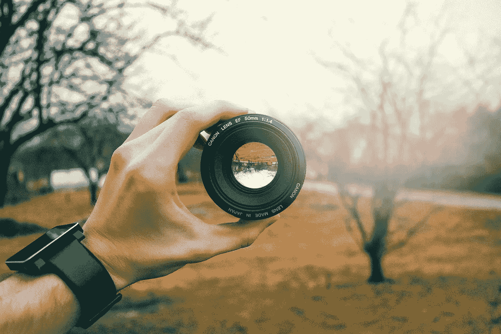
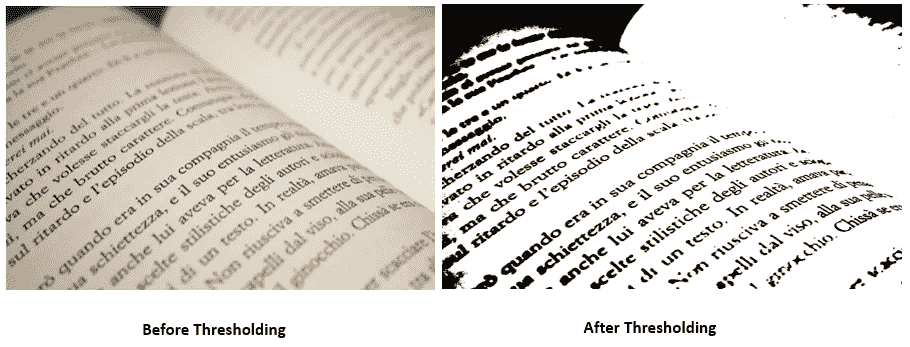

# 阈值化——一种使图像更清晰可见的方法 (CV-04)

> 原文：[`towardsdatascience.com/thresholding-a-way-to-make-images-more-visible-b3e314b5215c?source=collection_archive---------13-----------------------#2023-04-26`](https://towardsdatascience.com/thresholding-a-way-to-make-images-more-visible-b3e314b5215c?source=collection_archive---------13-----------------------#2023-04-26)

## 使用阈值化从图像中提取更多信息

 [Md. Zubair](https://zubairhossain.medium.com/?source=post_page-----b3e314b5215c--------------------------------)

·

[关注](https://medium.com/m/signin?actionUrl=https%3A%2F%2Fmedium.com%2F_%2Fsubscribe%2Fuser%2F2fdaeaeeea52&operation=register&redirect=https%3A%2F%2Ftowardsdatascience.com%2Fthresholding-a-way-to-make-images-more-visible-b3e314b5215c&user=Md.+Zubair&userId=2fdaeaeeea52&source=post_page-2fdaeaeeea52----b3e314b5215c---------------------post_header-----------) 发表在 [Towards Data Science](https://towardsdatascience.com/?source=post_page-----b3e314b5215c--------------------------------) ·7 分钟阅读·2023 年 4 月 26 日

--

图像来源：[Jonas Svidras](https://pixabay.com/users/jonas-svidras-6138262/?utm_source=link-attribution&utm_medium=referral&utm_campaign=image&utm_content=3046269) 来自 [Pixabay](https://pixabay.com//?utm_source=link-attribution&utm_medium=referral&utm_campaign=image&utm_content=3046269)

## 动机

在现实世界中，我们并不总是处理 100%清晰的图像。有时，图像会变得模糊、扭曲等。从这些类型的图像中提取信息成为一个关键问题。这就是为什么透明、清晰且更引人注目的图像在获取全面信息中扮演着至关重要的角色。

左侧图像取自[pxfuel](https://www.pxfuel.com/en/free-photo-jsbhm/download/1920x1080)的创作共享许可。右侧图像是在应用阈值处理后生成的。

阈值处理后的图像更加清晰。除了图像之外，这种阈值处理技术可能在成千上万的使用案例中非常有用。*如果你读完这篇文章，你将掌握* ***如何使用、在哪里使用以及何时使用*** *图像阈值处理的方法。*

> 详细来说，图像阈值处理将图像转换为二值图像，以提取更多信息。

## 目录

1.  `什么是图像阈值处理？`

1.  `全局与局部阈值处理的区别`

1.  `流行的阈值处理技术与 Python 实现`
