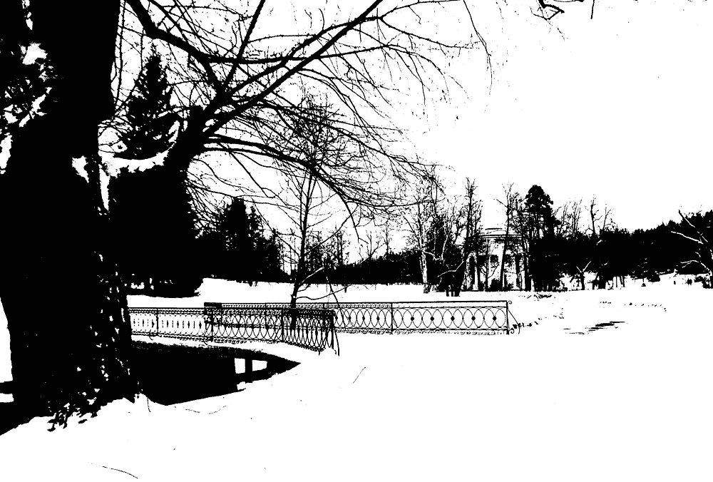
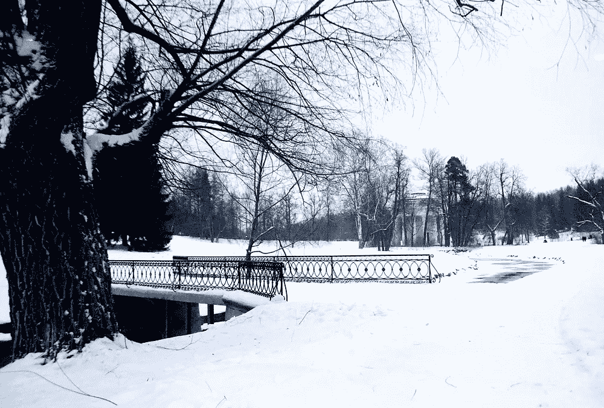
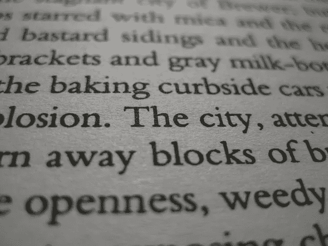
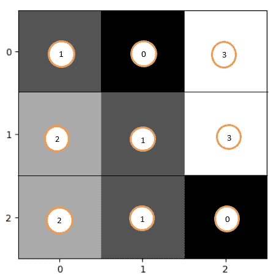
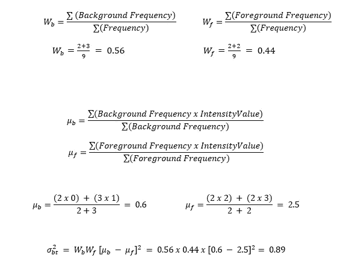

# 阈值化 — 使图像更清晰的方式 (CV-04)

> 原文：[`towardsdatascience.com/thresholding-a-way-to-make-images-more-visible-b3e314b5215c`](https://towardsdatascience.com/thresholding-a-way-to-make-images-more-visible-b3e314b5215c)

## 通过阈值化从图像中提取更多信息

 [Md. Zubair](https://zubairhossain.medium.com/?source=post_page-----b3e314b5215c--------------------------------)

·发表于 [Towards Data Science](https://towardsdatascience.com/?source=post_page-----b3e314b5215c--------------------------------) ·阅读时间 7 分钟·2023 年 4 月 26 日

--

图片由 [Jonas Svidras](https://pixabay.com/users/jonas-svidras-6138262/?utm_source=link-attribution&utm_medium=referral&utm_campaign=image&utm_content=3046269) 提供，来源于 [Pixabay](https://pixabay.com//?utm_source=link-attribution&utm_medium=referral&utm_campaign=image&utm_content=3046269)

## 动机

在现实世界中，我们并不总是处理百分之百清晰的图像。有时，图像会变得模糊、扭曲等等。从这些类型的图像中提取信息成为一个关键问题。这就是为什么透明、清晰和更具视觉吸引力的图像在获取全面信息方面扮演着重要角色。

左侧图像取自[pxfuel](https://www.pxfuel.com/en/free-photo-jsbhm/download/1920x1080)，并且在创意共享许可下使用。右侧图像是应用阈值化后的生成结果。

阈值化后的图像更具视觉清晰度。除了图像，这种阈值化技术在数千种应用场景中可能会很有帮助。*如果你读到文章的最后，你将掌握* ***如何使用、在哪里使用以及何时使用*** *图像阈值化的技能。*

> 具体来说，图像阈值化将图像转换为二值图像，以提取更多信息。

## 目录

1.  `什么是图像阈值化？`

1.  `全局阈值化与局部阈值化的区别`

1.  `流行的阈值化技术和 Python 实现`

## 什么是图像阈值化？

图像阈值化作用于灰度图像。这是一种将灰度图像分割成二值图像的方法 [1]。对于阈值化，某个特定的像素强度值被视为阈值值。所有大于或小于阈值的像素都被分配为最大或最小值。这将整个图像转换为二值图像。因为现在只有两种像素值。

假设我们想对像素强度值 123、50、180、200 应用图像阈值化。我们将阈值设置为 128。因此，所有大于 128 的值将变为最高的像素强度值 255，而小于 128 的值将变为 0。

左侧的图像是阈值化后的结果，右侧的图像是阈值化之前的图像（来自 Wikimedia Commons，公共领域许可）

看一下上面的两张图像。应用阈值化后，得到的图像完全是白色或黑色。相对高强度值的像素被转换成完全白色（强度值 255），而低强度值则变成纯黑色（强度值 0）。

## 全局阈值化和局部阈值化的区别

有许多阈值化技术可用。

相同的过程或阈值通常应用于整个图像。这种类型的阈值化被称为 ***全局阈值化***。

另一方面，局部/自适应阈值化在局部区域内工作。相同的阈值值不会应用于整个图像。我们可以对图像的不同部分应用不同的阈值值。

全局图像阈值化并不适用于所有情况。有时自适应阈值化更为合适。看看下面的图像。

图像来自于 [OpenCV](https://docs.opencv.org/3.4/d7/d4d/tutorial_py_thresholding.html) 文档

在原始图像中，光照在不同图像位置上有所变化。对整个图像应用相同的阈值将产生类似于全局阈值化图像的结果。自适应阈值化提供了更好的结果。

## 流行的阈值化技术和 Python 实现

我们将讨论 **全局阈值化** 技术——`*简单阈值化和 Otsu 阈值化*`。以及局部/自适应阈值化技术。

+   **简单阈值化**

简单阈值化是一种全局阈值技术。在这种方法中，我们需要设置一个边界（阈值）强度值。阈值值用于转换新的像素强度值。看看下面的表格。

不同的简单阈值化技术（图像由作者提供）

> 看看上面的表格。在操作部分，`pixel(x,y)` 表示阈值化图像的更新后的特定强度值，而 `src(x,y)` 表示应用阈值化之前图像的原始强度值。

**⭐ Python 实现️**

为了演示目的，我使用了以下图像。

图像由 [Picdream](https://pixabay.com/users/picdream-9595/?utm_source=link-attribution&utm_medium=referral&utm_campaign=image&utm_content=57266) 提供，来源于 [Pixabay](https://pixabay.com//?utm_source=link-attribution&utm_medium=referral&utm_campaign=image&utm_content=57266)

*一些通用代码用于导入库和加载图像 —*

阈值化始终作用于灰度图像。因此，我将图像从 BGR（OpenCV 通常以 BGR 格式读取图像）转换为灰度图像，代码为`cv2.cvtColor(img, cv2.COLOR_BGR2GRAY)`。

**二值阈值化**

`**OpenCV**`库通过提供各种函数来实现计算机视觉技术，使我们的工作变得更加轻松。以下代码片段帮助我们实现*二值阈值化*。其中`120`是阈值，`255`是最大强度值。因此，所有低于`120`的强度值将被设为`0`，其余为`255`。

输出会因不同的阈值而有所变化。

**二值反向阈值化**

这正好是二值化阈值的反向操作。我们将阈值设为`120`，最大值设为`255`。因此，所有低于`120`的强度值将为`255`（白色），其余为`0`（黑色）。*请查看以下代码。*

因此，在二值反向阈值的情况下，输出正好是二值阈值的相反结果。

**截断阈值化**

在我们的编码示例中，我们将阈值设为`145`，最大值设为`255`。因此，对于截断阈值化，所有低于`145`的值将被设为阈值`145`。否则，它将保持不变。

输出文本比之前的技术更为清晰可见。

**阈值为零**

在阈值为零的情况下，低于阈值的像素值将被设为零，否则保持不变。为了演示目的，我将阈值设置为 145，最大值设置为 255。代码如下所示。

**阈值反转**

这正好是阈值为零的相反操作。

**大津法阈值化**

**大津法**的阈值化与简单阈值化有所不同。它通过计算类间方差来设置阈值。有两个类别，即背景和前景像素。类间方差可以通过以下公式计算。

在这里，背景和前景类的平均权重分别用***Wb***和***Wf***表示。类的均值权重用***µb***和***µf***表示。我们需要计算所有像素强度值的类间方差。最终，选择类间方差最高的阈值。

***为了演示目的，下面给出了一个示例。***

3 x 3 图像（图像由作者提供）

在上图中，圆圈内的值是每个像素的强度值。像素强度为`***0,1,2, 和 3***`。强度值的频率如下所示。

在这里，我们将阈值设置为 2。所有小于 2 的值被视为背景，大于或等于 2 的值是前景。在上述图表中，红色条是背景频率，绿色条代表前景频率。

阈值计算如下所示。

阈值 2 的类间方差计算（图片作者提供）

*其他阈值 0、1 和 3 的类间方差见下表。*

图片由作者提供

最大的类间方差为 0.89，与阈值 2 相关。因此，根据 Otsu 方法，阈值为 2。

*以下是对之前图像的 Python 实现。*

这个结果非常棒，与之前的技术相比效果很好。*让我们看看 Otsu 阈值处理的阈值。*

**自适应/局部阈值处理**

在自适应/局部阈值处理的情况下，整个图像被分成一些分段，并对每个分段应用全局阈值。当光照均匀分布时，这种阈值处理更为可取。

演示灰度图像具有 6 个不同的分段（图片作者提供）

跟随灰度图像。方框是图像的分段。在自适应阈值处理的情况下，每个分段会被分开以应用全局阈值。因此，我们可以调整每个区域/分段的阈值。

文本图像上的自适应阈值处理实现如下所示。

结果也令人满意。

我们还可以将两个阈值输出进行融合以提取更多信息，如下所示。

## 结论

图像阈值处理是从模糊或不清晰的图像中提取信息的最佳方法之一。阈值处理技术不限于上述技术，但这些技术被广泛使用。选择何时使用哪种阈值处理技术完全依赖于你；我相信如果你对上述方法有清晰的概念，你将能够做出正确的决定。

## 参考文献

1.  [阈值处理（图像处理） — 维基百科](https://en.wikipedia.org/wiki/Thresholding_(image_processing))

`通过以下链接支持我的写作。`

`[`mzh706.medium.com/membership`](https://mzh706.medium.com/membership)`

我计算机视觉系列的先前文章 —

 [## NumPy 和 OpenCV 计算机视觉入门 (CV-01)]

### 使用 Python 开始你的计算机视觉编码

towardsdatascience.com  ## 关于计算机视觉中色彩表示的全面指南 (CV-02)

### 颜色空间和颜色模型的详细解释

[towardsdatascience.com  ## 最简单的图像融合指南 (CV-03)

### 最简单的图像融合和粘贴指南

[towardsdatascience.com
