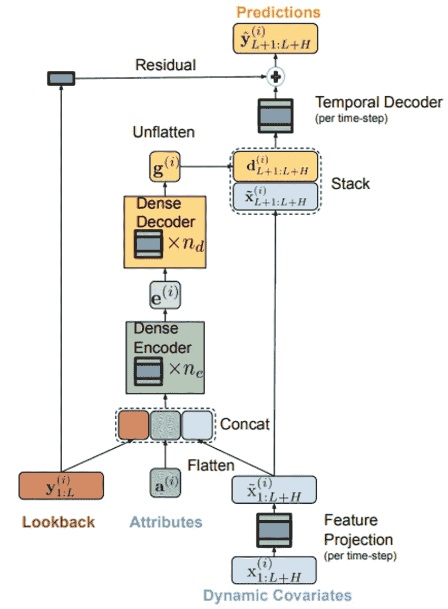
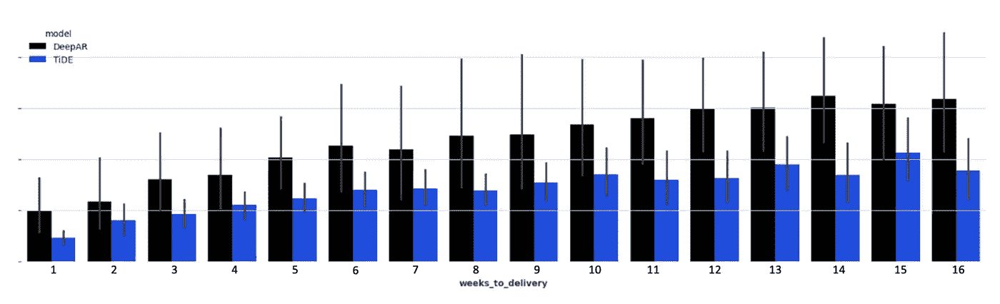
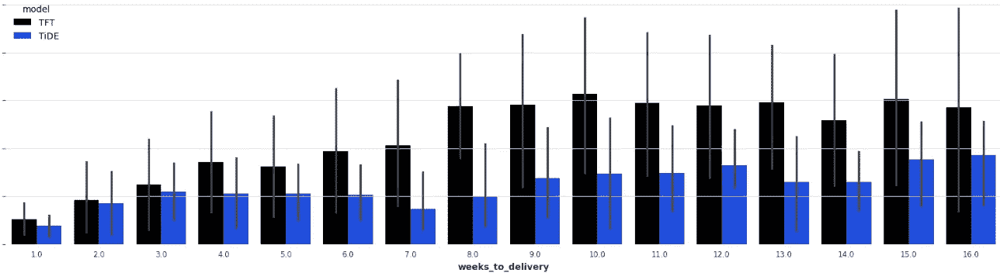

# TiDE：那个‘令人尴尬’的简单 MLP，击败了 Transformers

> 原文：[`towardsdatascience.com/tide-the-embarrassingly-simple-mlp-that-beats-transformers-7db77d588079`](https://towardsdatascience.com/tide-the-embarrassingly-simple-mlp-that-beats-transformers-7db77d588079)

## 深入探讨 TiDE，使用 Darts 的实现，以及与 DeepAR 和 TFT（一个 Transformer 架构）的实际案例比较

[](https://medium.com/@rjguedes?source=post_page-----7db77d588079--------------------------------)[](https://towardsdatascience.com/?source=post_page-----7db77d588079--------------------------------) [Rafael Guedes](https://medium.com/@rjguedes?source=post_page-----7db77d588079--------------------------------)

·发布在 [Towards Data Science](https://towardsdatascience.com/?source=post_page-----7db77d588079--------------------------------) ·9 分钟阅读·2023 年 12 月 8 日

--

随着各行业的不断发展，准确预测的重要性成为了一项不可妥协的资产，无论你是在电子商务、医疗保健、零售业，甚至是农业领域工作。能够预见未来并相应地制定计划，以克服未来的挑战，是使你在竞争中领先并在利润紧张、客户要求比以往任何时候都高的经济环境中蓬勃发展的关键。

Transformer 架构在过去几年里一直是 AI 的热门话题，特别是由于它们在自然语言处理（NLP）中的成功，chatGPT 就是最成功的用例之一，引起了所有人的关注，无论你是否是 AI 爱好者。然而，NLP 并不是唯一一个展示 Transformers 超越最先进解决方案的领域，在计算机视觉中，Stable Diffusion 及其变体也同样如此。

但 Transformers 能否超越最先进的时间序列模型？虽然已经付出了很多努力来开发用于时间序列预测的 Transformers，但似乎对于长期预测，简单的线性模型能够超越几种基于 Transformer 的方法。

在这篇文章中，我探讨了 TiDE，一个能够在长期预测中击败 Transformer 架构的简单深度学习模型。我还提供了使用 Python 的预测库 Darts 对 Walmart 数据集进行周销量预测的逐步实现。最后，我将 TiDE、DeepAR 和 TFT 在我公司实际案例中的表现进行了比较。


图 1：TiDE 是一种全新的预测模型，它是“简单到尴尬”的 MLP，旨在超越 Transformers ([source](https://unsplash.com/photos/landscape-photo-of-seashore-ZhsYjreGsSE))

一如既往，代码可以在 [Github](https://github.com/rjguedes8/TiDE) 上找到。

# 时间序列稠密编码器模型 (TiDE)

TiDE 是一种新颖的时间序列编码器-解码器模型，已显示出在长期预测中优于最先进的 Transformer 模型 [1]。它是一种多变量时间序列模型，能够使用静态协变量（例如产品品牌）和动态协变量（例如产品价格），这些协变量可以在预测范围内已知或未知。

与 Transformers 复杂的架构不同，TiDE 基于简单的编码器-解码器架构，仅使用多层感知机（MLP），没有任何注意力层。

**编码器**负责通过两个关键步骤将时间序列的过去和协变量映射到特征的稠密表示：

+   **特征投影**，它减少了整个回溯和预测范围内动态协变量的维度。并且；

+   **稠密编码器**，它接收特征投影的输出，与静态协变量和时间序列的过去连接，并将它们映射到嵌入中。

**解码器**接收来自编码器的嵌入，并通过两项操作将其转换为未来预测：

+   **稠密解码器**，它将嵌入映射到预测范围内每个时间步的向量；以及

+   **时间解码器**，它将稠密解码器的输出与该时间步的投影特征结合，以生成预测。

**残差连接**将回溯线性映射到与预测范围大小相同的向量，并将其添加到时间解码器的输出中，以生成最终预测。



图 2：TiDE 架构 ([source](https://arxiv.org/pdf/2304.08424.pdf))

# 如何在实践中使用 TiDE

本节介绍了使用 Walmart 的每周销售数据集（可在 [kaggle](https://www.kaggle.com/datasets/aslanahmedov/walmart-sales-forecast/data?select=train.csv)（许可证 CC0：公共领域）上获取）逐步实现 TiDE 的过程，并借助名为 Darts 的包。

Darts 是一个用于预测和异常检测的 Python 库 [2]，包含多个模型，如用于基线的简单模型、传统模型（如 ARIMA 或 Holt-Winters）、深度学习模型（如 TiDE 或 TFT）或基于树的模型（如 LightGBM 或随机森林）。它还支持单变量和多变量模型，其中一些模型提供概率预测解决方案。

训练数据集包含 2 年 8 个月的每周销售数据和 5 列：

+   *Store* — 存储编号和一个静态协变量

+   *Dept* — 部门编号和其他静态协变量

+   *Date* — 时间序列的时间索引，按周分布，将用于提取动态协变量，如周数和月份

+   *Weekly_Sales* — 目标变量

+   *IsHoliday* — 另一个动态协变量，用于识别某一周是否有假期

测试数据集具有相同的列，除了目标 (***Weekly_Sales****)*。

我们首先导入所需的库，并定义一些全局变量，如日期列、目标列、静态协变量、序列的频率以及要使用的缩放器：

```py
# Libraries
import pandas as pd
import numpy as np
from darts import TimeSeries
from darts.models import TiDEModel
from darts.dataprocessing.transformers import Scaler
from darts.utils.timeseries_generation import datetime_attribute_timeseries
from darts.utils.likelihood_models import QuantileRegression
from darts.dataprocessing.transformers import StaticCovariatesTransformer

# Global Variables
TIME_COL = "Date"
TARGET = "Weekly_Sales"
STATIC_COV = ["Store", "Dept"]
FREQ = "W-FRI"
SCALER = Scaler()
TRANSFORMER = StaticCovariatesTransformer()
```

默认的缩放器是 MinMax Scaler，但我们可以使用来自 scikit-learn 的任何缩放器，只要它具备 `fit()`、`transform()` 和 `inverse_transform()` 方法。转换器也是如此，默认情况下是来自 scikit-learn 的 Label Encoder。

之后，我们加载训练数据集，并将 pandas 数据框转换为 TimeSeries，这是 Darts 所期望的格式。

我没有进行探索性数据分析，因为我的目标只是向你展示如何实现它，但我注意到了一些负值，这可能表示退货。然而，我将这些负值视为错误，并将其替换为 0。

我还使用了 `fill_missing_dates` 参数来添加缺失的周，并将这些日期也填充为 0。

```py
# read train and test datasets and transform train dataset
train = pd.read_csv('data/train.csv')
train["Date"] = pd.to_datetime(train["Date"])
train[TARGET] = np.where(train[TARGET] < 0, 0, train[TARGET])
train_darts = TimeSeries.from_group_dataframe(
 df=train,
 group_cols=STATIC_COV,
 time_col=TIME_COL,
 value_cols=TARGET,
 static_cols=STATIC_COV,
 freq=FREQ,
 fill_missing_dates=True,
 fillna_value=0)
```

我们还加载了测试数据集，以便定义我们的预测范围以及预测范围中的假期。

```py
# read test dataset and determine Forecast Horizon
test = pd.read_csv('data/test.csv')
test["Date"] = pd.to_datetime(test["Date"])
FORECAST_HORIZON = len(test['Date'].unique())
```

之后，对于训练集中的每个序列，我们创建动态协变量（周、月和一个识别特定周假期的二进制列）：

```py
# we get the holiday data that we have in both train and test dataset
holidays_df = pd.concat([train[["Date", "IsHoliday"]], test[["Date", "IsHoliday"]]]).drop_duplicates()
# convert bool to numeric
holidays_df["IsHoliday"] = holidays_df["IsHoliday"]*1
# create dynamic covariates for each series in the training darts
dynamic_covariates = []
for serie in train_darts:
    # add the month and week as a covariate
    covariate = datetime_attribute_timeseries(
        serie,
        attribute="month",
        one_hot=True,
        cyclic=False,
        add_length=FORECAST_HORIZON,
    )
    covariate = covariate.stack(
        datetime_attribute_timeseries(
            serie,
            attribute="week",
            one_hot=True,
            cyclic=False,
            add_length=FORECAST_HORIZON,
        )
    )

  # create holidays with dates for training and test
    holidays_serie = pd.merge(pd.DataFrame(covariate.time_index).rename(columns={'time':'Date'}), holidays_df, on='Date', how='left')
    covariate = covariate.stack(
                TimeSeries.from_dataframe(holidays_serie, time_col="Date", value_cols="IsHoliday", freq=FREQ)
            )
    dynamic_covariates.append(covariate)
```

现在，我们已经准备好所有数据，只需对数据进行缩放：

```py
# scale covariates
dynamic_covariates_transformed = SCALER.fit_transform(dynamic_covariates)
# scale data
data_transformed = SCALER.fit_transform(train_darts)
# transform static covariates
data_transformed = TRANSFORMER.fit_transform(data_transformed)
```

最后，我们准备好进行预测了！

在我们的案例中，我们将预测接下来的 38 周的同一系列的每周销售额，不过你也可以预测不在训练集中的时间序列，只要它们具有相同的静态协变量。为此，你必须重复相同的数据准备过程。

```py
TiDE_params = {
    "input_chunk_length": 4, # number of weeks to lookback
    "output_chunk_length": FORECAST_HORIZON,
    "num_encoder_layers": 1,
    "num_decoder_layers": 1,
    "decoder_output_dim": 1,
    "hidden_size": 15,
    "temporal_width_past": 4,
    "temporal_width_future": 4,
    "temporal_decoder_hidden": 26,
    "dropout": 0.1,
    "batch_size": 16,
    "n_epochs": 5,
    "likelihood": QuantileRegression(quantiles=[0.25, 0.5, 0.75]),
    "random_state": 42,
    "use_static_covariates": True,
    "optimizer_kwargs": {"lr": 1e-3},
    "use_reversible_instance_norm": False,
}

model = TiDEModel(**TiDE_params)
model.fit(data_transformed, future_covariates=dynamic_covariates_transformed, verbose=False)
pred = SCALER.inverse_transform(model.predict(n=FORECAST_HORIZON, series=data_transformed, future_covariates=dynamic_covariates_transformed, num_samples=50))
```

这里有一个商店 1 和部门 1 的预测示例，我们可以看到模型能够预测 2012 年黑色星期五和感恩节那周的激增，这是由于我们拥有的三个动态协变量（周、月以及识别某一周是否有假期的二进制列）。我们还可以看到，一年中有几个激增，可能来自折扣或营销活动，这可以通过动态协变量来处理，以改进我们的预测，这些数据也可以在 kaggle 上找到。


图 3：商店 1 和部门 1 的预测结果（图片由作者制作）

# TiDE 与 DeepAR 的比较以及 TiDE 与 TFT 在实际应用中的比较

在我的公司，我们在 2022 年底部署了一个新的预测模型，旨在预测接下来 16 周内 264 个时间序列的订单量。

当时击败生产中模型的模型是 DeepAR，一种可在 Python 库 GluonTS [3] 中找到的深度学习架构。像 TiDE 一样，DeepAR 允许使用静态和动态协变量。

尽管 DeepAR 为我们提供了良好的结果，但它在较长时间范围（+8 周）内出现了我们称之为*‘预测爆炸’*的问题。从一周到另一周，仅增加一周的数据，模型就会给出与前一周完全不同的预测，预测的量高于正常水平。

尽管如此，我们制定了控制机制，并更改了一个特定的超参数（上下文长度，DeepAR 对此非常敏感），以避免此类情况，但最近发现这还不够，我们不得不每周密切监控结果，并调整其他超参数以获得合理的预测。

因此，我们决定开始新一轮研究，寻找一个更稳定可靠的模型，这时我们发现了 TiDE。我们对 TiDE 进行了超参数优化，包括使用哪些动态和静态协变量，哪些系列用于训练，哪些不用于训练等。然后我们在 2022 年 7 月到 2023 年 7 月的整整一年数据中，比较了优化后的 DeepAR 和 TiDE 模型在 26 个不同的截止日期上的表现。

结果显示，TiDE 不仅在短期和长期内优于 DeepAR（如图 4 所示），而且也解决了我们希望解决的*‘预测爆炸’*初始问题。



图 4：DeepAR 与 TiDE 在实际用例中的比较。用于比较的指标是 MSE，但由于保密原因在 y 轴上未显示（图像由作者制作）。

在我们的模型研究中，我们还将 TiDE 与 TFT [4]（一种 Transformer 架构）进行了比较，以验证[1]中作者关于 TiDE 在长期预测中超越 Transformer 架构的说法。正如图 5 所示，TiDE 能够击败 TFT，特别是在长期预测（6 周以上）中。



图 5：TFT 与 TiDE 在实际用例中的比较（图像由作者制作）。

# 结论

Transformer 架构将是人类历史上下一次重大革命的基础。尽管它们在 NLP 和计算机视觉领域表现出色，但正如[1]中的作者所述，它们在长期预测方面无法超越更简单的模型。

在这篇文章中，我们将 TFT（一种 Transformer 架构）和 DeepAR 与 TiDE 进行了比较，验证了对于我们的用例，TiDE 能够超越这两个模型。

尽管 Transformer 架构足够强大以进行长期预测，但为什么谷歌还会开发一种新的非 Transformer 时间序列模型？TSMixer [5] 是谷歌开发的最新时间序列模型，它在 M5 竞赛中击败了包括 TFT 在内的 Transformers。

目前，更简单的模型似乎在预测方面更具优势，但让我们拭目以待未来的发展，看看 Transformers 是否能得到改进，以提供更好的长期结果！

**保持联系：** [LinkedIn](https://www.linkedin.com/in/rafaelguedes97/), [Medium](https://medium.com/@rjguedes97)

# 参考文献

[1] Abhimanyu Das, Weihao Kong, Andrew Leach, Shaan Mathur, Rajat Sen, Rose Yu. 使用 TiDE 进行长期预测：时间序列密集编码器。arXiv:2304.08424, 2023

[2] Julien Herzen, Francesco Lässig, Samuele Giuliano Piazzetta, Thomas Neuer, Léo Tafti, Guillaume Raille, Tomas Van Pottelbergh, Marek Pasieka, Andrzej Skrodzki, Nicolas Huguenin, Maxime Dumonal, Jan Kościsz, Dennis Bader, Frédérick Gusset, Mounir Benheddi, Camila Williamson, Michal Kosinski, Matej Petrik, Gaël Grosch. Darts: 用户友好的现代机器学习时间序列，2022

[3] Alexander Alexandrov, Konstantinos Benidis, Michael Bohlke-Schneider, Valentin Flunkert, Jan Gasthaus, Tim Januschowski, Danielle C. Maddix, Syama Rangapuram, David Salinas, Jasper Schulz, Lorenzo Stella, Ali Caner Türkmen, Yuyang Wang. GluonTS: Python 中的概率时间序列模型。arXiv:1906.05264, 2019

[4] Bryan Lim, Sercan O. Arik, Nicolas Loeff, Tomas Pfister. 时间融合变压器用于可解释的多时间跨度时间序列预测。arXiv:1912.09363, 2019

[5] Si-An Chen, Chun-Liang Li, Nate Yoder, Sercan O. Arik, Tomas Pfister. TSMixer: 用于时间序列预测的全 MLP 架构。arXiv:2303.06053, 2023
