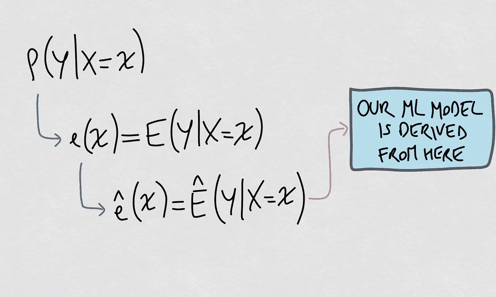
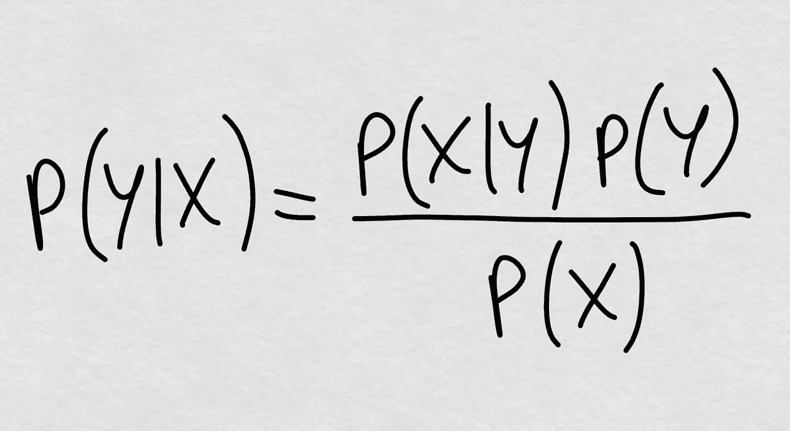
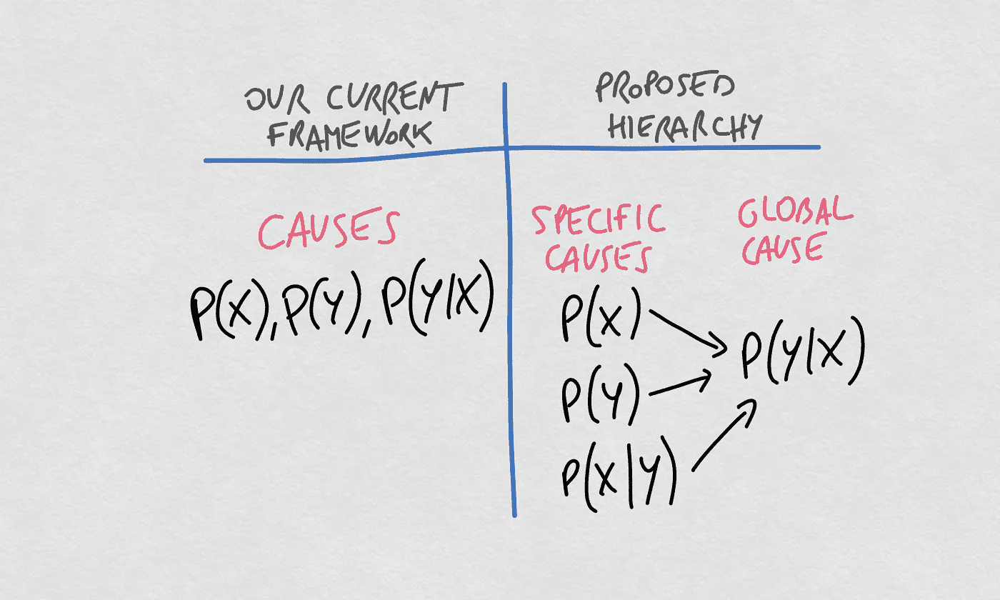
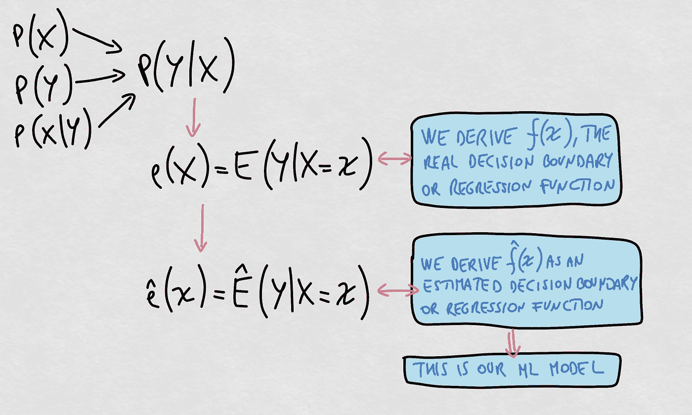
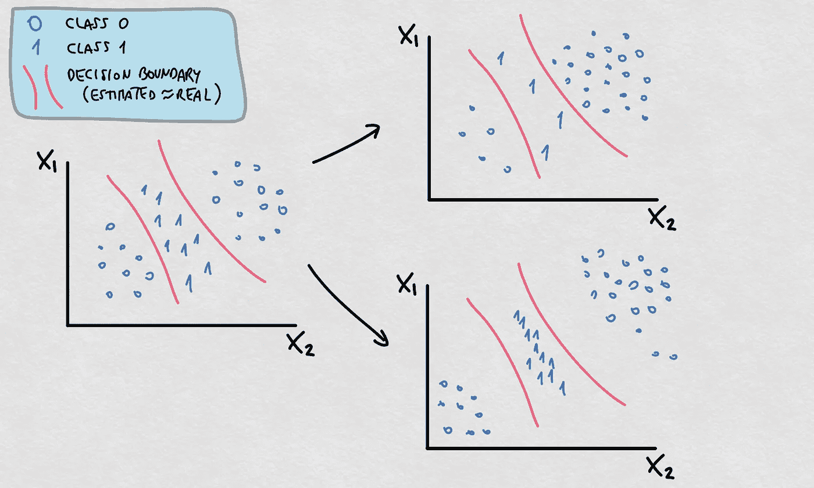
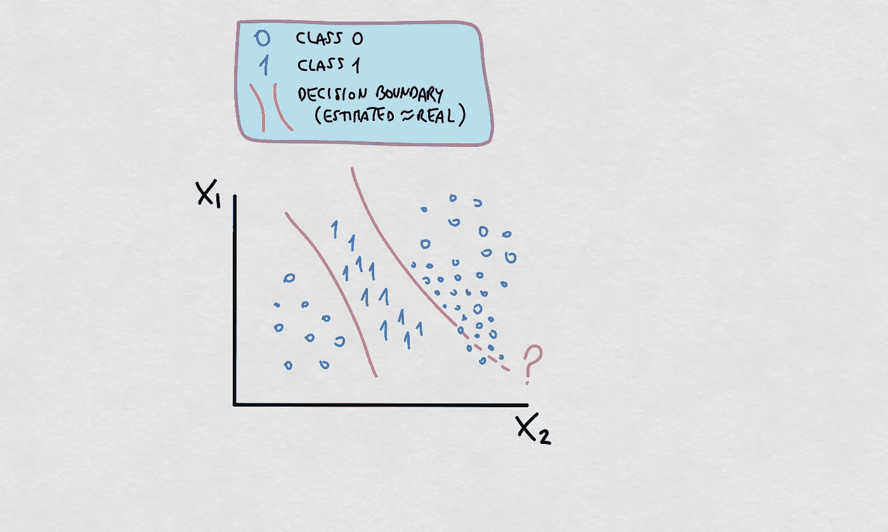
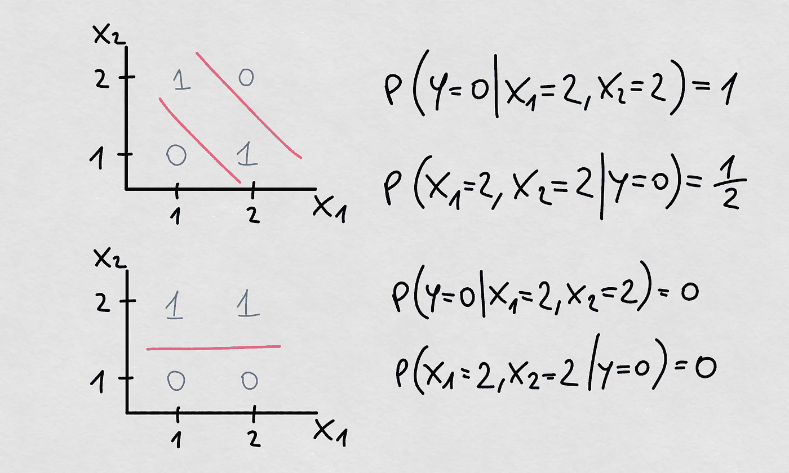

# 整理数据集变化框架

> 原文：[`towardsdatascience.com/tidying-up-the-framework-of-dataset-shifts-cd9f922637b7?source=collection_archive---------16-----------------------#2023-07-18`](https://towardsdatascience.com/tidying-up-the-framework-of-dataset-shifts-cd9f922637b7?source=collection_archive---------16-----------------------#2023-07-18)

## 回顾模型降级的原因

  [Valeria Fonseca Diaz](https://medium.com/@valefonsecadiaz?source=post_page-----cd9f922637b7--------------------------------)

·

[关注](https://medium.com/m/signin?actionUrl=https%3A%2F%2Fmedium.com%2F_%2Fsubscribe%2Fuser%2F6e363caf1c79&operation=register&redirect=https%3A%2F%2Ftowardsdatascience.com%2Ftidying-up-the-framework-of-dataset-shifts-cd9f922637b7&user=Valeria+Fonseca+Diaz&userId=6e363caf1c79&source=post_page-6e363caf1c79----cd9f922637b7---------------------post_header-----------) 发表在 [Towards Data Science](https://towardsdatascience.com/?source=post_page-----cd9f922637b7--------------------------------) · 11 分钟阅读 · 2023 年 7 月 18 日 

--

*与* [*Marco Dalla Vecchia*](https://medium.com/u/cf7c25429480?source=post_page-----cd9f922637b7--------------------------------) *合作，担任图像创作者*

我们训练模型，并使用它们根据一组输入预测特定的结果。我们都知道这就是机器学习的游戏。我们对训练它们知道很多，以至于它们现在已经进化成了人工智能，这是有史以来最先进的智能水平。但在使用它们时，我们还没有那么远，我们继续探索和理解模型部署后每一个重要的方面。

所以今天，我们将讨论模型性能漂移（或简称模型漂移）的问题，也常被称为模型失败或模型退化。我们指的是我们的机器学习模型所提供的预测质量问题。不论是分类还是数值，我们关注的是该预测与真实类别或值之间的差距。当预测质量相对于我们部署模型时下降时，我们称之为模型性能漂移。你可能在文献中找到过其他术语，但在我们当前的讨论中，请关注 *模型性能漂移* 或简洁地说 *模型漂移*。

# 我们所知道的

几个博客、书籍和许多论文已经探索并解释了模型漂移的核心概念，因此我们将首先进入当前的图景。我们主要将这些概念组织为 *协变量偏移*、*先验偏移* 和 *条件偏移*。后者也常被称为 *概念漂移*。这些偏移被认为是模型漂移的主要原因（记住，这是预测质量的下降）。总结定义如下：

+   ***协变量偏移***：P(X) 的分布发生变化，但 P(Y|X) 不一定发生变化。这意味着输入特征的分布发生了变化，这些偏移可能导致模型漂移。

+   ***先验偏移***：P(Y) 分布的变化。在这里，标签或数值输出变量的分布发生了变化。如果输出变量的概率分布发生偏移，当前模型对给定预测的确定性会大大降低，因此模型可能会出现漂移。

+   ***条件偏移***（即 ***概念漂移***）：条件分布 P(Y|X) 发生变化。这意味着，对于给定的输入，输出变量的概率发生了变化。根据我们目前的了解，这种偏移通常使我们很难保持预测质量。真的如此吗？

有许多来源列举了这些数据集偏移的发生实例。研究的一个核心机会是检测这些类型的偏移，而无需新的标签[1, 2, 3]。最近发布了有趣的指标，以无监督的方式监控模型的预测性能[2, 3]。这些指标确实受到数据集偏移不同概念的驱动，并且相当准确地反映了数据真实概率分布的变化。因此，我们将深入探讨这些偏移的理论。为什么？因为也许我们可以对这些定义进行一定的整理。通过整理，我们可能能够更轻松地前进，或者更清楚地理解整个框架。

为此，让我们回到一开始，慢慢推导这个故事。拿一杯咖啡，慢慢阅读，跟随我。或者，千万不要漂移！

# 真实模型与估计模型

我们训练的机器学习模型尝试让我们接近一个真实但未知的关系或函数，这个函数将特定输入 X 映射到输出 Y。我们自然区分真实的未知关系和估计的关系。然而，估计模型受限于真实未知模型的行为。也就是说，如果真实模型发生变化，而估计模型对这些变化不够稳健，那么估计模型的预测将会不够准确。

我们可以监控的性能涉及到*估计函数*，但模型漂移的原因在于*真实模型*的变化。

+   **真正的模型是什么？** 真正的模型建立在所谓的条件分布 P(Y|X)上。这是给定输入的输出的概率分布。

+   **估计模型是什么？** 这是一个函数***ê(x)***，它专门**估计 P(Y|X=*x*)的期望值**。这个函数是与我们的机器学习模型相关的。

这是这些元素的视觉表示：

（图片由作者提供）

好的，现在我们澄清了这两个元素，我们准备好组织所谓的数据集偏移的想法，以及这些概念之间的联系。

# 新的安排

## 模型漂移的全球原因

我们的主要目标是理解我们估计模型的模型漂移的原因。因为我们已经理解了估计模型和条件概率分布之间的联系，我们可以在这里陈述我们之前已经知道的：***我们估计模型漂移的全球原因是 P(Y|X)的变化。***

基本而显然容易，但比我们想象的更为根本。我们假设我们的估计模型是对真实模型的*良好*反映。真实模型由 P(Y|X)支配。因此，如果 P(Y|X)发生变化，我们的估计模型很可能会漂移。我们需要注意我们在上述图中展示的推理路径。

我们之前已经知道这一点，那有什么新鲜的？新鲜的是我们现在将 P(Y|X)的变化称为***全球原因***，而不仅仅是***一种原因***。这将对其他原因施加一种层次结构。这种层次结构将帮助我们很好地定位关于其他原因的概念。

## 特定原因：全球原因的元素

知道全球原因在于 P(Y|X)的变化，自然而然地需要深入挖掘构成这一概率的元素。一旦我们识别了这些元素，我们将继续讨论模型漂移的原因。那么这些元素是什么呢？

我们一直都知道这一点。条件概率在理论上定义为 P(Y|X) = P(Y, X) / P(X)，即联合概率除以 X 的边际概率。但我们可以再次展开联合概率，我们获得了几个世纪以来我们所熟知的神奇公式：

（图片由作者提供）

你已经看到我们要去哪里了吗？条件概率完全由三个元素定义：

+   P(X|Y)：逆条件概率

+   P(Y)：先验概率

+   P(X)：协变量的边际概率

因为这三个元素定义了条件概率 P(Y|X)，所以我们可以给出第二个陈述：如果 P(Y|X) 发生变化，这些变化来自于定义它的至少一个元素。换句话说，***P(Y|X) 的变化由 P(X|Y)、P(Y) 或 P(X) 的任何变化定义。***

也就是说，我们已经将当前知识中的其他元素定位为***模型漂移的具体原因***，而不仅仅是 P(Y|X) 的平行原因。

回到这篇文章的开头，我们列出了协变量漂移和先验漂移。我们注意到，还有另一个具体原因：*逆条件分布 P(X|Y) 的变化*。我们通常在谈论 P(Y) 的变化时会提到这个分布，好像我们一般在考虑从 Y 到 X 的逆关系 [1,4]。

## 新的概念层次结构

（图片来源于作者）

现在我们可以清楚地比较当前关于这些概念的思考和提出的层次结构。到目前为止，我们一直在通过识别不同的概率分布来讨论模型漂移的原因。已知这三种主要分布，P(X)、P(Y) 和 P(Y|X) 是我们 ML 模型预测质量漂移的主要原因。

我在这里提出的转折为这些概念施加了一个层次结构。在这个结构中，估计 X -> Y 关系的模型的漂移的全局原因是条件概率 P(Y|X) 的变化。这些 P(Y|X) 的变化可以来自于 P(X)、P(Y) 或 P(X|Y) 的变化。

列举一下这个层次结构的一些影响：

+   我们可能会遇到 P(X) 发生变化的情况，但如果 P(Y) 和 P(X|Y) 也相应地发生变化，那么 P(Y|X) 保持不变。

+   我们也可能遇到 P(X) 变化的情况，但如果 P(Y) 或 P(X|Y) 没有相应地变化，P(Y|X) 将会变化。如果你之前对此主题进行过一些思考，你可能已经看到在某些情况下，我们看到 X 的变化，并且这些变化似乎并不完全独立于 Y|X，所以最终 Y|X 也会发生变化。在这里，P(X) 是 P(Y|X) 变化的具体原因，而 P(Y|X) 反过来是我们模型漂移的全局原因。

+   前两个陈述对于 P(Y) 也是正确的。

因为这三个具体原因可能会或可能不会独立变化，总体而言，P(Y|X) 的变化可以通过这些具体元素的变化来解释。可能是 P(X) 在这里稍微变化了一下，P(Y) 在那里稍微变化了一下，这两个变化也会导致 P(X|Y) 变化，最终导致 P(Y|X) 变化。

> P(X) 和 P(Y|X) 不能被独立看待，P(X) 是 P(Y|X) 的一个原因

## 在这一切中，估计的 ML 模型在哪里？

好，现在我们知道所谓的协变量和先验转移是条件转移的原因，而不是与之并行。条件转移包括导致估计模型预测性能下降的具体原因。但估计模型实际上是决策边界或函数，而不是对实际概率的直接估计。那么这些原因对真实和估计的决策边界意味着什么呢？

让我们收集所有的部分，绘制连接所有元素的完整路径：

(图片由作者提供)

注意，我们的机器学习模型可以是解析的或数值的。此外，它可以是参数化或非参数化的表示。因此，最终，我们的机器学习模型是决策边界或回归函数的估计，这些是从预期的条件值中推导出来的。

这一事实对我们讨论的原因有重要的影响。虽然 P(X)、P(Y)和 P(X|Y)中发生的大多数变化将意味着 P(Y|X)和 E(Y|X)的变化，***但并非所有这些变化都必然意味着真实决策边界或函数的变化***。在这种情况下，如果估计的决策边界或函数最初是准确的，那么它将保持有效。看看下面这个例子：

(图片由作者提供)

+   看到 P(Y)和 P(X)发生了变化。点的密度和位置导致了不同的概率分布。

+   这些变化使得 P(Y|X)发生变化。

+   然而，决策边界保持有效。

这里有一个重要的点。假设我们只关注 P(X)的变化，而没有真实标签的信息。我们想知道预测的准确性。如果 P(X)转向估计决策边界有很大不确定性的区域，预测可能是不准确的。因此，在协变量转移到决策边界的不确定区域的情况下，很可能也发生了条件转移。但我们无法知道决策边界是否发生了变化。在这种情况下，我们可以量化 P(X)的变化，这可能表明 P(Y|X)的变化，但我们无法知道决策边界或回归函数发生了什么。这是这个问题的表示：

既然我们说了这些，现在是时候再做一个声明了。当我们提到 P(Y|X)的变化时，我们讨论的是***条件转移***。我们所说的***概念漂移***可能特别指的是***真实决策边界或回归函数的变化***。下面是一个典型的条件转移示例，显示了决策边界的变化，但没有协变量或先验转移。实际上，这种变化来自于逆条件概率 P(X|Y)的变化。

(图片由作者提供)

# 对我们当前监控方法的影响

我们关心理解这些原因，以便开发方法来尽可能准确地监测我们的机器学习模型的性能。所提出的任何想法都不是对现有实际解决方案的坏消息。恰恰相反，借助这一新的概念层次，我们可能能够进一步推动检测模型性能下降原因的尝试。我们已有的方法和指标主要是在我们列出的不同概念的基础上提出的。然而，我们可能在度量指标的假设中混淆了概念。例如，我们可能将“无条件漂移”作为一种假设，而实际上它可能是“决策边界无变化”或“回归函数无变化”。我们需要继续思考这一点。

# 更多关于预测性能下降的信息

放大和缩小。我们已经深入探讨了框架，以思考预测性能下降的原因。但我们还有另一个维度来讨论这个话题，那就是预测性能漂移的类型。我们的模型因列出的原因而遭受痛苦，这些原因以不同的预测错位形式体现出来。我们主要发现了四种类型：偏差、斜率、方差和非线性漂移。查看这篇文章以了解这一硬币的另一面。

# 总结

我们在这篇文章中研究了模型性能下降的***原因***，并提出了基于我们之前已知概念的理论联系的框架。以下是要点：

+   概率 P(Y|X)支配真实的决策边界或函数。

+   估计的决策边界或函数被假定为对真实边界或函数的最佳近似。

+   估计的决策边界或函数即是机器学习模型。

+   机器学习模型可能会经历预测性能下降。

+   这种退化是由 P(Y|X)的变化引起的。

+   P(Y|X)的变化是因为这些元素中的至少一个发生了变化：P(X)、P(Y)或 P(X|Y)。

+   P(X)和 P(Y)可以发生变化，而决策边界或回归函数不变。

一般的说法是：***如果机器学习模型在漂移，那么 P(Y|X)也在变化。反之则不一定成立。***

这一概念框架希望能成为机器学习预测性能下降这一关键主题的种子。尽管理论讨论本身非常令人愉快，但我相信这个联系将帮助我们进一步推进在实践中测量这些变化的目标，同时优化所需资源（样本和标签）。如果你有其他贡献，请加入讨论。

*是什么导致你的模型在预测性能上出现漂移？*

*祝你思考愉快！*

## *参考文献*

[1] [`huyenchip.com/2022/02/07/data-distribution-shifts-and-monitoring.html`](https://huyenchip.com/2022/02/07/data-distribution-shifts-and-monitoring.html)

[2] [`www.sciencedirect.com/science/article/pii/S016974392300134X`](https://www.sciencedirect.com/science/article/pii/S016974392300134X)

[3][`nannyml.readthedocs.io/en/stable/how_it_works/performance_estimation.html#performance-estimation-deep-dive`](https://nannyml.readthedocs.io/en/stable/how_it_works/performance_estimation.html#performance-estimation-deep-dive)

[4] [`medium.com/towards-data-science/understanding-dataset-shift-f2a5a262a766`](https://medium.com/towards-data-science/understanding-dataset-shift-f2a5a262a766)
