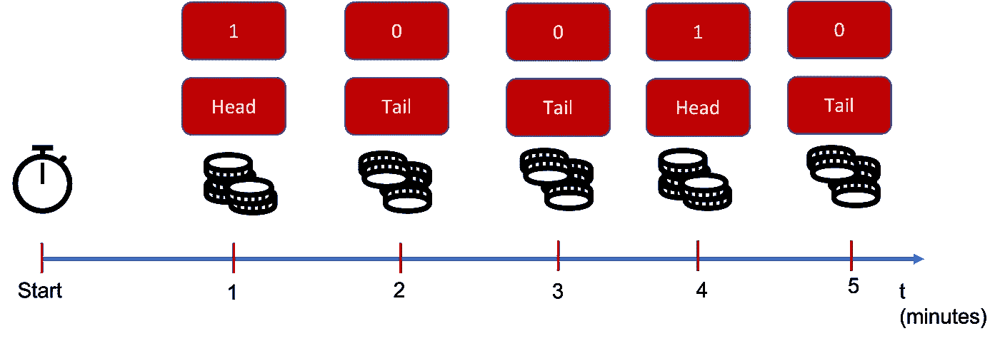
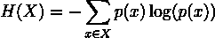
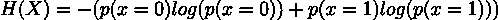
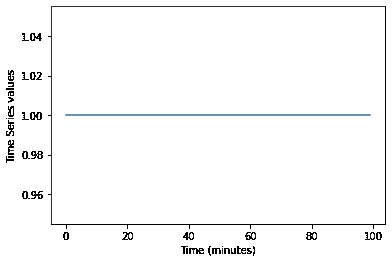
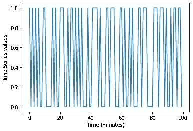
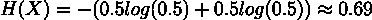
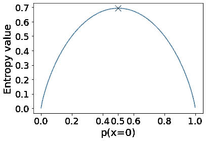
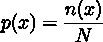

# 时间序列复杂性分析使用熵

> 原文：[`towardsdatascience.com/time-series-complexity-analysis-using-entropy-ec49a4aaff11?source=collection_archive---------2-----------------------#2023-09-04`](https://towardsdatascience.com/time-series-complexity-analysis-using-entropy-ec49a4aaff11?source=collection_archive---------2-----------------------#2023-09-04)

## 这里有一种方法，可以用几行代码了解你的时间序列有多复杂

 [Piero Paialunga](https://piero-paialunga.medium.com/?source=post_page-----ec49a4aaff11--------------------------------)

·

[关注](https://medium.com/m/signin?actionUrl=https%3A%2F%2Fmedium.com%2F_%2Fsubscribe%2Fuser%2F254e653181d2&operation=register&redirect=https%3A%2F%2Ftowardsdatascience.com%2Ftime-series-complexity-analysis-using-entropy-ec49a4aaff11&user=Piero+Paialunga&userId=254e653181d2&source=post_page-254e653181d2----ec49a4aaff11---------------------post_header-----------) 发表在 [Towards Data Science](https://towardsdatascience.com/?source=post_page-----ec49a4aaff11--------------------------------) ·8 分钟阅读·2023 年 9 月 4 日

--

图片由作者提供，使用 Midjourney 生成

每个数据科学家都知道：**解决机器学习问题的第一步是探索数据。**

而且，这不仅仅是理解哪些特征可以帮助你解决问题。这实际上需要领域知识、大量的努力、很多询问和尝试去了解。这是一个必要的步骤，但在我看来，这是**第二**步。

第一步在某种程度上、形态上或形式上，基于对你数据的**复杂性**分析。他们是让你在总是一样的东西中寻找细节和模式，还是输出完全不同？他们想让你找到 0.0001 和 0.0002 之间的距离，还是找到 0 和 10 之间的距离？

让我更好地解释一下。

比如说，我是一个**信号处理专家**。我学习了傅里叶变换、chirplet 变换、小波变换、希尔伯特变换、时间序列预测、时间序列聚类、1D CNN、RNN，以及许多其他吓人的名字。

在时间序列领域，一个非常常见的问题是从一个输入（可能是另一个时间序列）到一个时间序列输出。例如：

+   **你有一个实验设置的属性，你想使用机器学习来模拟你的实验：** 这实际上是我的博士论文，称为**代理建模**。

+   你有了股票市场到第 300 天的数据，你想预测第 301 天的情况：这非常著名，被称为**时间序列预测**。

+   你有一个非常脏或嘈杂的信号，你想清理它：这被称为**编码器-解码器信号去噪**，也非常著名。

在这些问题中，我惊讶地发现，首先看的通常是**输出（而不是输入）时间序列**。

假设我在我的数据集中取一个随机时间序列。这个时间序列是一个温和且平滑的正弦和余弦组合吗？它是一个多项式函数吗？它是一个对数函数吗？还是一个我连名字都无法称呼的函数？

如果我再拿一个随机时间序列，它会如何变化？任务是基于从明显的基线中观察到的小变化，还是识别整个数据集中完全不同的行为？

用一句话来说，我们试图理解我们的任务有多**复杂**：我们在估计**时间序列的复杂性**。现在，“复杂”这个词对我们每个人的意义可能不同。

当我妻子向我展示她的解剖学课程时，我发现它们极其复杂，但对她来说，这只是另一个星期二 :)

好消息是，有一种更科学和独特的方式来描述复杂性：**熵的概念**。

# 1\. 1/0 时间序列的熵（理论）

让我们从一个非常简单的例子开始定义熵：一个只能有值 1 和 0 的时间序列。我知道这并不是我们习惯处理的时间序列类型，但你可以想象成每分钟你进入房间时翻一个硬币：如果是正面，你测得 1；如果是反面，你测得 0（或者相反，坦白说我并没有特别偏好 1 是正面……）。

作者制作的图像

现在，如果你考虑一下，当它在我们的大脑中没有真正的印象时，或者当它没有给你大量信息时，某些东西会更“复杂”。

我不再逗你了，我将给你这个该死的**熵**的方程：

**方程 1**

让我们分解一下：

+   **X**是我们的时间序列的领域，在我们的例子中，X = {0,1}

+   **p(x)**是验证 X 中值 x 的概率

为什么里面有对数？这是什么意思？为什么有那个负号？

让我们通过示例来学习。

想象一下 X 为 0（尾部）的概率是 0，X 为 1（头部）的概率是 1\. 这甚至不是真正的时间序列，因为它总是 1\. 熵的值是多少？

现在，p(x=0)=0，因此第一个贡献是 0\. p(x=1)=1，但 1 的对数是 0\. 这意味着第二个贡献也是 0，因此熵确实是 0。

熵是 0 是什么意思？意味着时间序列完全不复杂，这很有意义，因为它看起来像这样：

图片来源于作者

这个时间序列没有“复杂性”，对吧？这就是为什么它的熵是 0。

如果我们知道 p(x=0)=p(x=1)=0.5，那么意味着 1 和 0（正面或反面）的概率完全相同。

图片来源于作者

这确实更复杂了，不是吗？

熵现在变成：

这个值高于 0\. 这个值本身没有意义，但它是你可以得到的**最高值**。这意味着如果你将 p(x=0)更改为不同于 0.5 的值，熵会降低*。

图片来源于作者

> *** 注意，当你改变 p(x=0)时，你也会改变 p(x=1)，因为 p(x=1)=1-p(x=0)**

现在让我们思考一下我们的发现。

+   当概率是 0 时，这意味着**没有复杂性**，因为我们已经知道了一切：你只有一个值。

+   当概率是 0.0001 时，这意味着**复杂性非常小**，因为可能 x=0，但大多数时候 x 将等于 1

+   当概率是 0.5 时，现在复杂性是**最大**的，因为你真的不知道接下来会发生什么：它可能是 1 或 0，概率相同

这就是我们认为的“复杂”的概念。在简单的 1/0 方式中，你可以通过回顾出现次数来找到概率，并获取熵。

# 2\. 1/0 时间序列的熵（练习）

在我们的代码中，我们将使用**Python**，并且我们还将使用非常基础的库：

让我们写代码以找到相同的解决方案，但使用概率的“回顾性”，或者说，使用它们的**频率定义：**

其中：

+   **x** 是定义域中的一个值：在我们的例子中，x 只有 0 和 1 两种可能，因此 x 的值为 0 或 1。

+   **n(x)** 是时间序列中**x**出现的次数。

+   **N** 是我们时间序列的长度。

我们将找到 p(x=0)和 p(x=1)，然后使用上面的方程 1……

好的，我再为你粘贴一次：

**方程 1**

在**Python**中，你可以通过这段非常简单的代码来实现：

它有效吗？让我们测试一下！

让我们生成一个长度为 100 的时间序列，0 出现的概率为 0.5：

太棒了。所以我们得到了平衡的时间序列。虽然我们设置了 0.5 作为概率，但这并不意味着**完全**50 和 50，如你所见，这会给我们在估计概率时带来一些误差。这就是我们生活在的不完美世界 :)

计算理论熵的方程如下：

让我们看看理论熵和实际熵是否匹配：

太棒了！它们确实匹配！

现在让我们改变 p_0，看看它们是否继续匹配：

它们匹配的误差非常小，对吧？

有趣的是，如果我们这样做三次，**增加**时间序列的大小，误差将会越来越小。

在大小为 10k 后，我们基本上没有实际熵和预测熵之间的差异❤

# 3\. 任意时间序列的熵

现在，如果我们仍然假设我们的时间序列具有离散值（0、1、2……），我们可以**扩展**熵的定义，适用于超过 2 个值的时间序列。

例如，让我们选择一个**三值情况**。所以我们的时间序列可以是 0、1 或 2。

让我们创建一个新的概率向量 p_0、p_1 和 p_2。为此，我们将生成 3 个 0 到 100 之间的随机数，并将它们存储在一个向量中，然后除以总和：

我们可以使用之前相同的方程（和相同的代码）来计算实际熵和预测熵。

让我们扩展熵的定义到实际熵的定义中：

这同样适用于仅有 0/1 的情况：

正如我们所看到的，即使在三值情况下，理论熵和预测熵也相匹配：

为了向你展示我没有作弊，我们可以看到它适用于各种情况。如果我们迭代地改变 p_vector（和时间序列），我们仍然会看到实际熵和预测熵匹配：

# 4\. 结果

在这篇博客中，我们：

+   反思在应用任何机器学习之前分析**时间序列**的复杂性。

+   反思了时间序列的**熵**和**无序**的概念。

+   定义了**熵**的数学方程，并通过示例进行解释。

+   **在实践中应用**了 0/1 时间序列和 0、1、2 时间序列，展示了理论定义如何与我们的计算近似相匹配。

现在，这种方法的问题（限制）是有时时间序列可能过于**连续**，以至于该方法无法工作。但不要惊慌！有一种**连续熵**的定义可以修正时间序列的熵。

我将在下一篇博客中讨论！

# 5\. 结论

如果你喜欢这篇文章并且想了解更多关于机器学习的内容，或者你只是想问我一些问题，你可以：

A. 在[**Linkedin**](https://www.linkedin.com/in/pieropaialunga/)上关注我，我会在上面发布所有的故事。

订阅我的[**新闻通讯**](https://piero-paialunga.medium.com/subscribe)。它会让你了解新故事，并给你机会向我提问，获取所有可能的修正或解答。

成为[**推荐会员**](https://piero-paialunga.medium.com/membership)，这样你就不会有“每月最大故事数量”的限制，可以阅读我（以及其他数千名机器学习和数据科学顶级作者）关于最新技术的文章。
