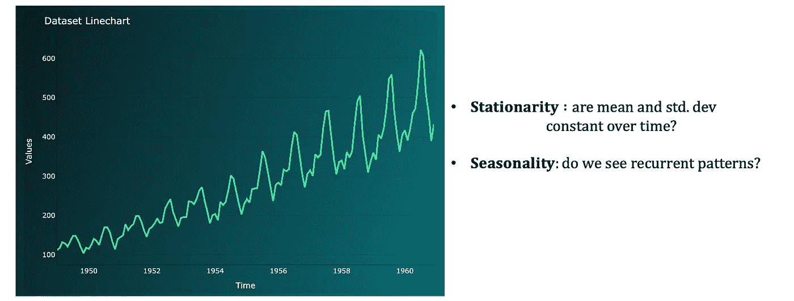

# 使用 sARIMA 和 Dash 进行时间序列数据分析

> 原文：[`towardsdatascience.com/time-series-data-analysis-with-sarima-and-dash-f4199c3fc092?source=collection_archive---------3-----------------------#2023-05-06`](https://towardsdatascience.com/time-series-data-analysis-with-sarima-and-dash-f4199c3fc092?source=collection_archive---------3-----------------------#2023-05-06)

## 介绍一个 Dash 网页应用程序，指导时间序列数据集的分析，使用 sARIMA 模型 | [在线应用](https://gabria1.pythonanywhere.com/) | [Git Hub](https://github.com/gabri-al/sarima_dashboard)

 [Gabriele Albini](https://gabri-albini.medium.com/?source=post_page-----f4199c3fc092--------------------------------)

·

[关注](https://medium.com/m/signin?actionUrl=https%3A%2F%2Fmedium.com%2F_%2Fsubscribe%2Fuser%2F93c18fcb4ee6&operation=register&redirect=https%3A%2F%2Ftowardsdatascience.com%2Ftime-series-data-analysis-with-sarima-and-dash-f4199c3fc092&user=Gabriele+Albini&userId=93c18fcb4ee6&source=post_page-93c18fcb4ee6----f4199c3fc092---------------------post_header-----------) 发表在 [Towards Data Science](https://towardsdatascience.com/?source=post_page-----f4199c3fc092--------------------------------) · 10 分钟阅读 · 2023 年 5 月 6 日 

--

# 介绍

在处理时间序列数据集时，统计模型如 SARIMA 可以是理解数据组成部分（趋势、季节性和时间依赖性）的强大工具。

本文将简要介绍 sARIMA 模型，然后展示一个网页应用程序，该程序指导用户完成分析数据和拟合最佳模型以进行预测的步骤。该应用程序是使用 *Plotly Dash* 和 Python 构建的：

+   [链接](https://gabria1.pythonanywhere.com/) 到在线应用

+   [链接](https://github.com/gabri-al/sarima_dashboard)到 Git Hub 仓库

*目录：*

1\. Sarima 模型的理论介绍

1.1 模型的基本构件

1.2 如何选择模型超参数：ACF 和 PACF

1.3 平稳性

2\. 实用模板用于处理 Sarima 模型

2.1 绘制你的数据

2.2 将数据转换为平稳

2.3 使用 ACF 和 PACF 确定合适的模型超参数

2.4 执行模型网格搜索以识别最佳超参数

2.5 最终模型：拟合和预测

结论

# 1\. Sarima 模型的理论介绍

## **1.1 模型的基本构件**

要理解 sARIMA 模型是什么，我们首先介绍这些模型的基本构件。

sARIMA 是由不同子模型组成的（即我们用来表示时间序列数据的多项式），其缩写为：季节性（s）自回归（AR）积分（I）移动平均（MA）：

+   **AR**：自回归组件，由超参数“p”控制，假设在时间“t”上的当前值可以表示为前“p”值的线性组合：

AR | 作者提供的图片

+   **I**：积分组件由超参数“d”表示，这是应用于数据的差分变换的阶数。*差分*是一种用于去除数据趋势的技术（即使数据相对于均值平稳，正如我们稍后会看到的），这有助于模型拟合数据，因为它隔离了趋势组件（我们使用 d=1 处理线性趋势，d=2 处理二次趋势，等等）。差分数据 d=1 意味着处理连续数据点之间的差异：

I | 作者提供的图片

+   **MA**：移动平均组件，由超参数“q”控制，假设在时间“t”上的当前值可以表示为一个常数项（通常是均值）加上前“q”点误差的线性组合：

MA | 作者提供的图片

+   如果我们考虑到目前的组件，我们得到“ARIMA”，这是一个用于处理没有季节性的时间序列数据的模型家族的名称。sARIMA 模型是一种广泛应用于具有季节性的数据的模型，通过增加一个 **S** 组件：季节性组件，它由一组新的 AR、I、MA 组件组成，并带有季节滞后。换句话说，一旦确定了季节性并定义了其滞后（由超参数“m”表示——例如 m=12 意味着在每年的月度数据集中，我们会看到相同的行为），我们会创建一组新的 AR（P）、I（D）、MA（Q）组件，相对于季节滞后（m）（例如如果 D=1 且 m=12，这意味着我们对序列应用 1 阶差分，滞后为 12）。

总结一下，sARIMA 模型由 7 个超参数定义：3 个用于模型的非季节性部分，4 个用于季节性部分。它们表示为：

> **sARIMA (p,d,q) (P,D,Q)m**

多亏了模型的灵活性，我们可以“关闭”数据中未体现的组件（即如果数据没有趋势或季节性，相应的参数可以设置为 0），仍然使用相同的模型框架来拟合数据。

另一方面，sARIMA 的局限性之一是这些模型只能捕捉到 1 种季节性。如果一个每日数据集具有年季节性和周季节性，我们需要选择其中较强的一种。

## 1.2 如何选择模型超参数：ACF 和 PACF

为了确定模型超参数，我们通常查看时间序列的***自相关***和***部分自相关***；由于所有上述组件使用过去的数据来建模现在和未来的数据点，我们应该研究过去和现在的数据是如何相关的，并定义需要多少个过去的数据点来建模现在。

因此，自相关和部分自相关是两个广泛使用的函数：

+   **ACF**（自相关）：描述时间序列及其滞后的相关性。所有数据点都与它们之前的滞后 1、滞后 2、滞后 3 等进行比较。结果的相关性绘制在直方图上。此图（也称为“自相关图”）用于可视化整个时间序列中保留了多少信息。ACF 帮助我们选择 sARIMA 模型，因为：

> **ACF 有助于确定 MA(q)超参数**。

+   **PACF**（部分自相关）：描述时间序列及其滞后的部分相关性。与 ACF 不同，PACF 显示了一个点 X_t 和一个滞后之间的相关性，而这种相关性并未被与其他较低滞后的常见相关性所解释。换句话说，PACF 隔离了两个项之间的直接相关性。PACF 帮助我们选择 sARIMA 模型，因为：

> **PACF 有助于确定 AR(p)超参数**。

然而，在使用这些工具之前，我们需要提到 ACF 和 PACF 只能用于“**平稳**”的时间序列。

## **1.3 平稳性**

一个（弱）平稳的时间序列是一个：

+   **均值是恒定的**（即序列围绕一条水平线波动，没有正或负趋势）

+   **方差是恒定的**（即没有季节性或均值偏离的变化）

当然，并不是所有的时间序列本身就是平稳的；然而，我们可以通过转换来使它们变得平稳。**最常见的转换**用于使时间序列平稳包括：

+   **自然对数**：通过对每个数据点应用对数，我们通常能够使时间序列在*方差*方面变得平稳。

+   **差分**：通过对时间序列进行差分，我们通常能够去除趋势，使时间序列在*均值*方面变得平稳。

在转换时间序列后，我们可以使用两个工具来确认它是否平稳：

+   **Box-Cox**图：这是一个滚动均值（x 轴）与滚动标准差（y 轴）（或分组点的均值与方差）的图。如果我们在图表中没有观察到任何特定趋势，并且在两个轴上都看到很少的变化，那么我们的数据就是平稳的。

+   **增广迪基–福勒**检验（ADF）：一种统计检验，我们尝试拒绝原假设，即时间序列是非平稳的。

一旦时间序列平稳，我们可以分析 ACF 和 PACF 模式，并找到 SARIMA 模型的超参数。

# 2\. 使用 Sarima 模型的实用模板

确定适合我们数据的 sARIMA 模型包括一系列步骤，我们将在 AirPassenger 数据集上执行这些步骤（数据集可在[此处](https://www.kaggle.com/datasets/rakannimer/air-passengers)获取）。

每一步大致对应于 Dash 网页应用程序的一个“页面”。

## **2.1 绘制数据图**

创建你的原始数据的折线图：一些上述特征可以通过肉眼看到，特别是平稳性和季节性。

原始折线图 | 图片由作者提供

在上面的图表中，我们看到一个正向线性趋势和一个反复出现的季节性模式；考虑到我们有月度数据，我们可以假设季节性为年度（滞后 12）。数据不是平稳的。

## **2.2 转换数据以使其平稳**

为了找到模型超参数，我们需要使用平稳的时间序列。因此，如果数据不是平稳的，我们需要对其进行转换：

+   从*对数变换*开始，以使数据相对于方差平稳（对数定义在正值上。因此，如果数据呈现负值或 0 值，请在每个数据点上添加一个常数）。

+   应用*差分*以使数据相对于均值平稳。通常从差分阶数 1 和滞后 1 开始。如果数据仍然不平稳，尝试相对于季节性滞后进行差分（例如，如果我们有月度数据，则为 12）。 （使用反向顺序不会有差异）。

对于我们的数据集，我们需要执行以下步骤以使其完全平稳：

平稳转换 | 图片由作者提供

在每一步之后，通过查看 ADF 检验的 p 值和 Box-Cox 图，我们看到：

+   Box-Cox 图从任何趋势中逐渐变得干净，所有点越来越接近。

+   p 值逐渐下降。我们最终可以拒绝原假设。

平稳转换（2）| 图片由作者提供

## 2.3 使用 ACF 和 PACF 识别合适的模型超参数

在将数据转换为平稳的过程中，我们已经确定了 3 个参数：

+   由于我们应用了差分，模型将包括差分组件。我们应用了 1 和 12 的差分：我们可以设置 d=1 和 D=1，并且 m=12（12 的季节性）。

对于其余参数，我们可以查看变换后的 ACF 和 PACF。

一般来说，我们可以应用以下*规则*：

+   我们有一个**AR(p)过程如果**：PACF 在某个滞后“p”处有显著峰值（之后没有显著峰值），并且 ACF 衰减或显示出正弦波行为（交替的正、负峰值）。

+   我们有一个**MA(q)过程如果**：ACF 在某个滞后“q”处有显著峰值（之后没有显著峰值），并且 PACF 衰减或显示出正弦波行为（交替的正、负峰值）。

+   在**季节性 AR(P)或 MA(Q)过程**的情况下，我们会看到显著的峰值在季节性滞后处重复出现。

通过查看我们的示例，我们可以看到以下内容：

变换后的 ACF 和 PACF | 图片由作者提供

+   与上述行为最接近的规则，建议使用“q”介于 1 到 3 之间的某些 MA(q)过程；我们在 12 处仍然有显著的峰值，这也可能暗示着 MA(Q)过程，其中 Q=1（因为 m=12）。

我们使用 ACF 和 PACF 来获取一系列超参数值，这些值将形成模型候选者。我们可以将这些不同的模型候选者与我们的数据进行比较，并选择表现最好的一个。

在示例中，我们的模型候选者似乎是：

+   SARIMA (p,d,q) (P,D,Q)m = (0, 1, 1) (0, 1, 1) 12

+   SARIMA (p,d,q) (P,D,Q)m = (0, 1, 3) (0, 1, 1) 12

## 2.4 执行模型网格搜索以识别最佳超参数

网格搜索可以用来比较多个模型候选者：我们将每个模型拟合到数据中，并选择表现最好的一个。

要设置网格搜索，我们需要：

+   创建一个包含所有可能模型超参数组合的列表，给定每个超参数的值范围。

+   拟合每个模型，并使用选择的 KPI 测量其性能。

+   根据表现最佳的模型选择超参数。

在我们的案例中，我们将使用**AIC（赤池信息量准则）分数**来比较模型性能。这个 KPI 公式是拟合误差（准确性）与模型复杂性之间的权衡。一般来说，当复杂性过低时，误差较高，因为我们过度简化了模型拟合任务；相反，当复杂性过高时，由于过拟合，误差仍然较高。这两者之间的权衡将帮助我们识别“表现最佳”的模型。

***实用说明***：在拟合 sARIMA 模型时，我们需要使用带有对数变换的原始数据集（如果我们已应用），*但我们不希望使用经过差分变换的数据*。

我们可以选择保留部分时间序列（通常是最新的 20%观察值）作为测试集。

在我们的示例中，基于以下超参数范围，最佳模型是：

模型网格搜索 | 作者图片

> SARIMA (p,d,q) (P,D,Q)m = (0, 1, 1) (0, 1, 1) 12

## 2.5 最终模型：拟合与预测

我们最终可以对训练集、测试集以及任何未来的样本观察进行预测。最终的图表是：

最终模型 | 作者图片

为了确认我们捕捉了所有的相关性，我们可以绘制模型残差的 ACF 和 PACF：

在这种情况下，强季节性成分的一些信号仍然存在，但大多数剩余滞后项的相关性为 0。

# 结论

上述步骤应适用于任何可以通过 sARIMA 建模的数据集。总结：

1-绘制并探索你的数据

Dash 实时应用 | 作者图片

2-应用变换使数据平稳（关注左侧图表和 ADF 测试）

Dash 实时应用 | 作者图片

3-通过查看 ACF 和 PACF（右侧图表）来确定合适的超参数

Dash 实时应用 | 作者图片

4-执行网格搜索以选择最佳超参数

Dash 实时应用 | 作者图片

5-使用最佳模型进行拟合和预测

Dash 实时应用 | 作者图片

在本地下载应用程序，上传自己的数据集（通过替换数据文件夹中的.csv 文件）并尝试拟合最佳模型。

感谢阅读！
