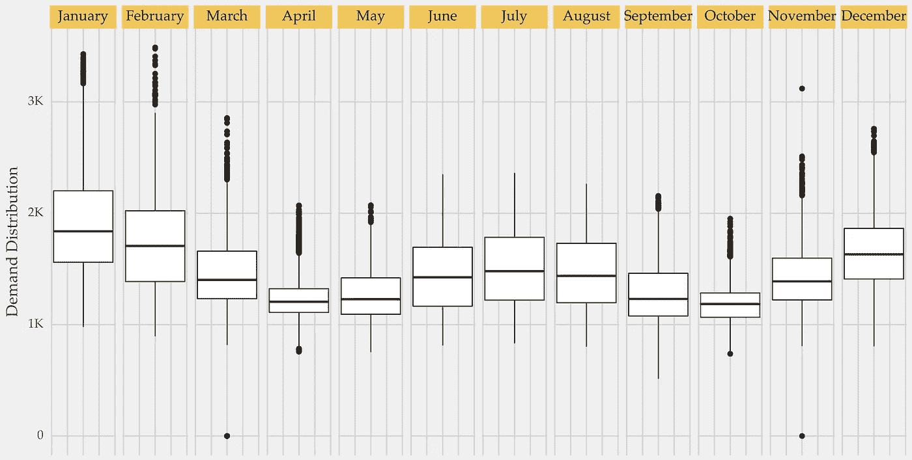
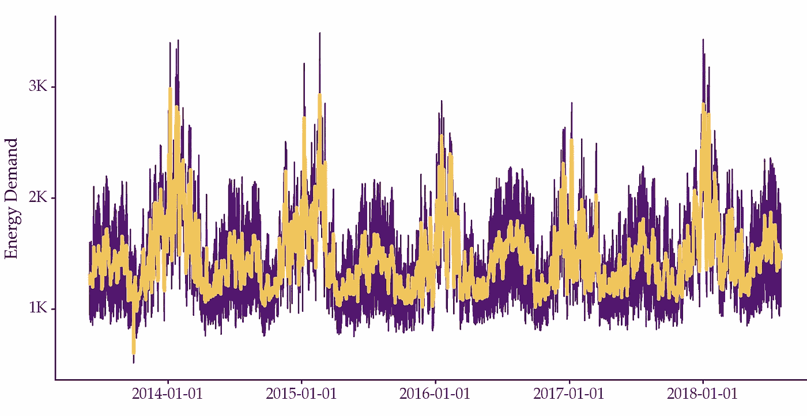
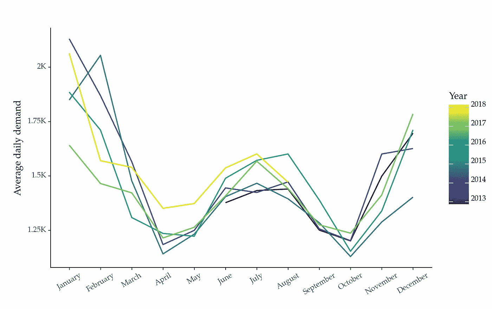
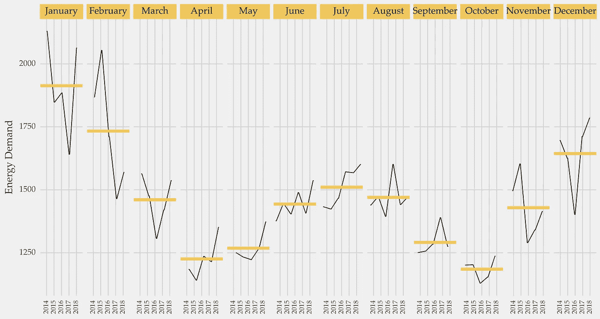
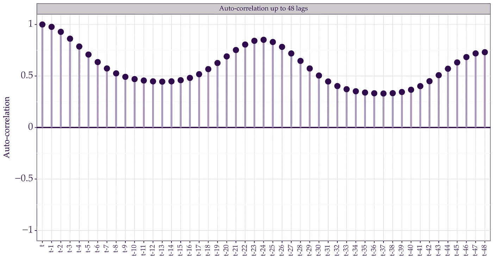
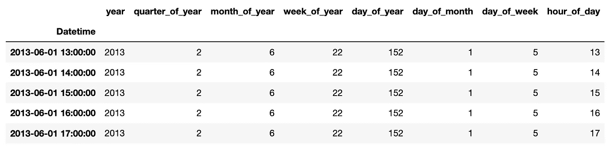
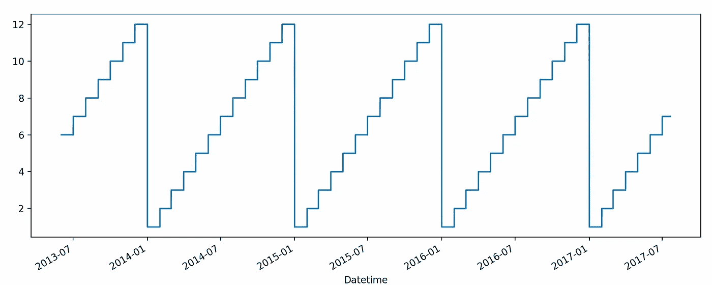
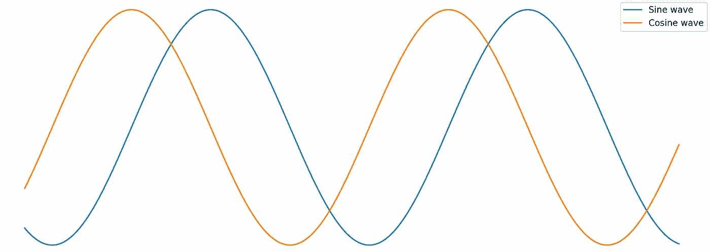
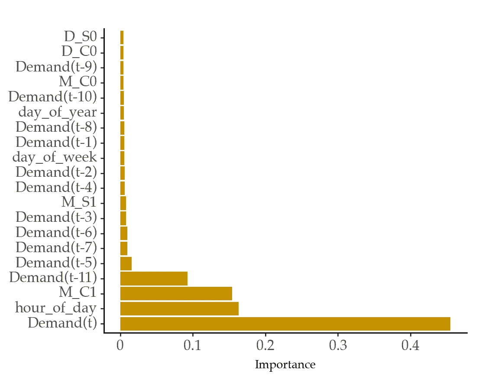
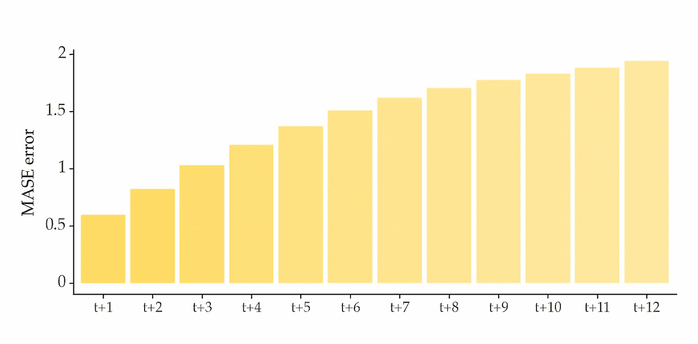

# 气候变化的时间序列：预测能源需求

> 原文：[`towardsdatascience.com/time-series-for-climate-change-forecasting-energy-demand-79f39c24c85e`](https://towardsdatascience.com/time-series-for-climate-change-forecasting-energy-demand-79f39c24c85e)

## 如何利用时间序列分析和预测来应对气候变化

[](https://vcerq.medium.com/?source=post_page-----79f39c24c85e--------------------------------)[](https://towardsdatascience.com/?source=post_page-----79f39c24c85e--------------------------------) [维托尔·塞尔凯拉](https://vcerq.medium.com/?source=post_page-----79f39c24c85e--------------------------------)

·发布于 [Towards Data Science](https://towardsdatascience.com/?source=post_page-----79f39c24c85e--------------------------------) ·阅读时间 7 分钟·2023 年 5 月 2 日

--


图片由 [Matthew Henry](https://unsplash.com/@matthewhenry?utm_source=medium&utm_medium=referral) 提供，来源于 [Unsplash](https://unsplash.com/?utm_source=medium&utm_medium=referral)

这是系列文章 *气候变化的时间序列* 的第四部分。文章列表：

+   第一部分: 风能预测

+   第二部分: 太阳辐射预测

+   第三部分: [预测大型海浪](https://medium.com/towards-data-science/time-series-for-climate-change-forecasting-large-ocean-waves-78484536be36)

到目前为止，我们探讨了预测在将清洁能源源整合到电网中的重要性。

预测在能源系统的需求侧也发挥着关键作用。

# 平衡能源需求和供应

电力系统需要确保能源供应和需求之间的平衡。这一平衡对电网的可靠性至关重要。如果需求大于供应，会导致停电。当供应超过需求时，会出现多余的能源，往往被浪费掉。

电力系统使用预测模型来帮助预测能源需求。准确的需求预测有助于更高效地生产和使用能源。这直接影响到气候，因为它减少了浪费。

分析能源消耗在家庭中也很有价值。例如，个人可以检查哪些电器消耗更多的能源，并利用这些信息在高峰时段避免更高的费用。顺便提一句：据估计，约 8%的住宅电力需求来自待机功耗 [4]。

## 预测能源需求

预测能源需求是一个困难的问题。

能源消耗依赖于多个因素，其中一些可能不容易获得用于建模。例如，包括影响加热或制冷设备使用的天气和经济状况。天气的特征是高度变化的模式。这些模式使得预测天气对能源需求的影响程度变得困难。

能源需求数据在不同时间尺度上展示季节性模式，包括每日、每月或每年。例如，在冬季，能源需求因加热需求而增加。



按月分布的能源需求。图片由作者提供。

捕捉所有季节性效应在构建准确的能源需求预测模型中非常重要。

你怎么做呢？

# 实操：预测能源需求

在本文的其余部分，我们将开发一个能源需求预测模型。你将学到如何：

+   使用自相关和数据可视化分析多个季节性效应；

+   从日期和时间信息中提取特征，以处理多个季节性效应。

本教程中使用的完整代码可在 Github 上找到：

+   [`github.com/vcerqueira/tsa4climate/`](https://github.com/vcerqueira/tsa4climate/tree/main/content/part_4)

## 数据集

我们将使用一个代表美国肯塔基州每小时电力消耗（以兆瓦为单位）的数据集[1]。数据从 2013 年到 2018 年收集，总共有 45,344 个观测值。

这就是数据的样子：



美国肯塔基州的每小时能源需求时间序列。黄色线是每日平均需求。数据来源见参考文献 [1]。图片由作者提供。

## 可视化季节性

上述图表表明系列中存在年度规律模式。

另一种可视化季节性的方法是使用名为季节性图的图形：



每年的平均月能源需求的季节性图。图片由作者提供。

季节性图使得查看年度月度模式变得容易。例如，能源消耗在冬季和夏季增加，在春季和秋季减少。这可能与加热（冬季）或制冷（夏季）有关。

下图中的季节性子序列图对于分析数据在月份内部和跨月份的动态也很有帮助：



每年的平均月能源需求的季节性子序列图。图片由作者提供。

## 使用自相关函数（ACF）分析季节性

你还可以使用[自相关](https://medium.com/towards-data-science/12-things-you-should-know-about-time-series-975a185f4eb2)来分析季节性。季节性时间序列在每个季节性滞后中会显示出更高的自相关性。



自相关图。波动表明每日季节性。图片由作者提供。

上图展示了高达 48 个滞后的自相关图。自相关显示了一个由每日季节性引起的振荡模式。

所以，除了年度规律性变化外，还有明显的每日季节性。特定小时观察到的值与前一天同一小时捕捉到的值相关。

## 自回归

作为起点，我们将开发一个用于预测电力消耗的自回归模型。[你可以查看之前的文章了解这种建模的详细信息。](https://medium.com/towards-data-science/machine-learning-for-forecasting-transformations-and-feature-extraction-bbbea9de0ac2)

```py
from sklearn.model_selection import train_test_split

from src.tde import time_delay_embedding

# Train / test split
train, test = train_test_split(series, test_size=0.2, shuffle=False)

# using past 12 observations as explanatory variables
N_LAGS = 12
# using the next 12 hours as the forecasting horizon
HORIZON = 12

# transforming time series into a tabular format for supervised learning
X_train, Y_train = time_delay_embedding(train, n_lags=N_LAGS, horizon=HORIZON, return_Xy=True)
X_test, Y_test = time_delay_embedding(test, n_lags=N_LAGS, horizon=HORIZON, return_Xy=True)
```

## 处理多重季节效应

大多数时间序列分解或预测方法设计为处理单一季节周期。

随着数据采集成本的降低，它使得以高采样频率（如每日或每小时）收集时间序列成为可能。高频时间序列提供了更多的数据，[这是训练机器学习模型的重要因素](https://medium.com/towards-data-science/machine-learning-for-forecasting-size-matters-b5271ec784dc)。然而，这些数据也包含复杂的季节性模式，这可能很难建模。

那么，你如何处理多重季节效应？

我们将应用两个特征提取过程来完成这项工作：

+   基于日期和时间数据提取特征；

+   使用基于傅里叶项的三角函数表示。

## 基于日期和时间提取特征

建模多重季节模式的一个简单方法是总结每个时间步的日期和时间信息。你可以提取相关的周期，比如小时或一年中的天数，并将其作为解释变量。

库 sktime 提供了一个方便的类来实现这一点：

```py
from sktime.transformations.series.date import DateTimeFeatures

hourly_feats = DateTimeFeatures(ts_freq='H',
                                keep_original_columns=False,
                                feature_scope='efficient')

dtime_train = hourly_feats.fit_transform(X_train)
```

这是输出的一个示例：



这些特征对于许多具有复杂季节性的时间序列可能是有效的方法。但是，它们可能会忽略时间的连续性。例如，假设你将月份信息编码为从 1（1 月）到 12（12 月）的整数：



将月份信息编码为整数。图像由作者提供。

在这种情况下，模型无法理解 12 月在 1 月之前。使用独热编码转换月份信息也会导致这个问题。

## 傅里叶项

傅里叶项是基于正弦和余弦波的周期性和确定性系列。这些项的平滑性使得时间连续性的建模成为可能。



使用傅里叶项编码月份信息。图像由作者提供。

这是一个用于提取傅里叶级数的 sklearn 兼容类：

```py
from datetime import datetime

import numpy as np
import pandas as pd

class FourierTerms:

    def __init__(self, period: float, n_terms: int, prefix=''):
        self.period = period
        self.n_terms = n_terms
        self.prefix = prefix

    def transform(self, index: pd.DatetimeIndex, use_as_index: bool = True):
        t = np.array(
            (index - datetime(1970, 1, 1)).total_seconds().astype(float)
        ) / (3600 * 24.)

        fourier_x = np.column_stack([
            fun((2.0 * (i + 1) * np.pi * t / self.period))
            for i in range(self.n_terms)
            for fun in (np.sin, np.cos)
        ])

        col_names = [
            f'{self.prefix}{fun.__name__[0].upper()}{i}'
            for i in range(self.n_terms)
            for fun in (np.sin, np.cos)
        ]

        fourier_df = pd.DataFrame(fourier_x, columns=col_names)

        if use_as_index:
            fourier_df.index = index

        return fourier_df
```

主要输入是季节周期（例如，12 用于每月时间序列）、日期时间信息和项数。项数影响表示的平滑性。最佳项数取决于输入数据。

几种流行的方法使用傅里叶项来建模复杂的季节性。这些方法包括[Prophet](https://facebook.github.io/prophet/)、[TBATS](https://www.sktime.net/en/stable/api_reference/auto_generated/sktime.forecasting.tbats.TBATS.html)、[greykite](https://linkedin.github.io/greykite/docs/0.1.0/html/pages/model_components/0300_seasonality.html)或[时间变化回归](https://orbit-ml.readthedocs.io/en/stable/tutorials/ktr1.html)。

傅里叶项作为解释性特征包括在内，如下所示：

```py
fourier_daily = FourierTerms(n_terms=2, period=24, prefix='D_')
fourier_monthly = FourierTerms(n_terms=2, period=24 * 30.5, prefix='M_')
fourier_yearly = FourierTerms(n_terms=2, period=24 * 365, prefix='Y_')

dfourier_train = fourier_daily.transform(X_train.index)
mfourier_train = fourier_monthly.transform(X_train.index)
yfourier_train = fourier_yearly.transform(X_train.index)

feats_train = pd.concat([X_train, dtime_train, dfourier_train,
                         mfourier_train, yfourier_train],
                        axis=1)

model = RandomForestRegressor()
model.fit(feats_train, Y_train)
```

因此，自动回归与总结日期和时间数据的特征相结合。下面的特征重要性评分表明这些特征为模型提供了相关信息：



随机森林重要性评分。图片由作者提供。

就像预测能源生产的情况一样，能源需求模型在较长时间范围内的准确性会降低：



MASE 误差按预测时间范围。图片由作者提供。

# 主要结论

+   能源需求预测与气候变化相关。它们使电力系统能够做出明智的决策，并将清洁能源来源整合到电网中；

+   需求时间序列受到多个因素的影响，并具有复杂的季节性；

+   你可以通过总结日期和时间信息来处理多个季节性模式。傅里叶项是实现这一目标的常用方法；

+   能源需求在长期内难以预测，即超过几小时。提高长期预测的准确性对电力系统的效率至关重要。

感谢阅读，下次故事再见！

## 参考文献

[1] PJM 每小时能源消耗（许可证：CC0：公共领域）

[2] Rolnick, David, 等。“利用机器学习应对气候变化。” ACM 计算调查（CSUR）55.2（2022）：1–96。

[3] MacKay, David. *可持续能源-没有热空气*。UIT cambridge，2008 年。
