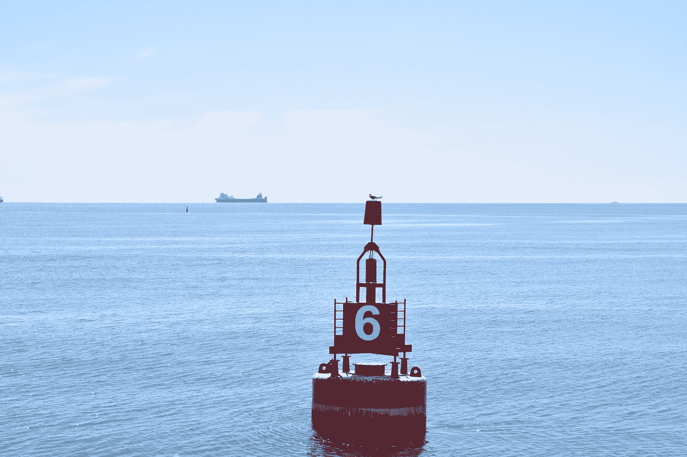
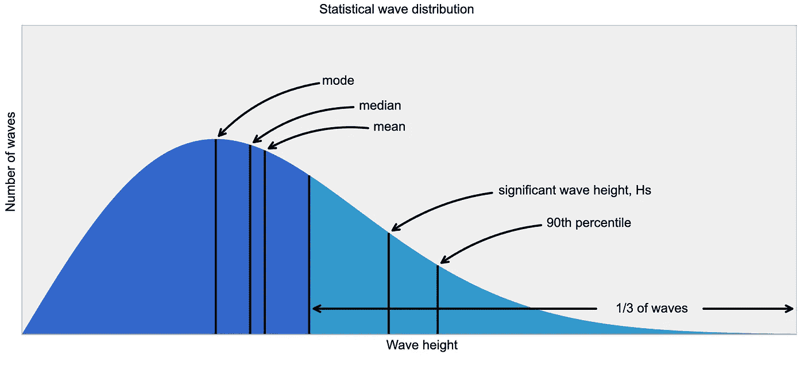
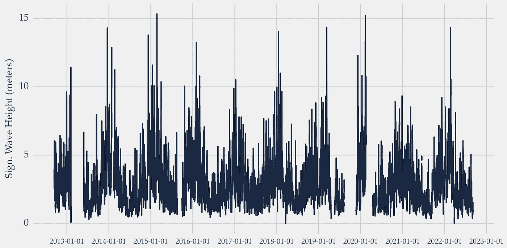
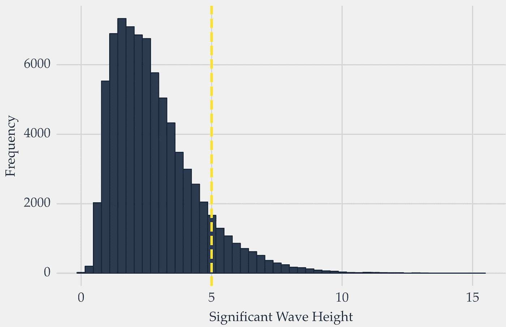
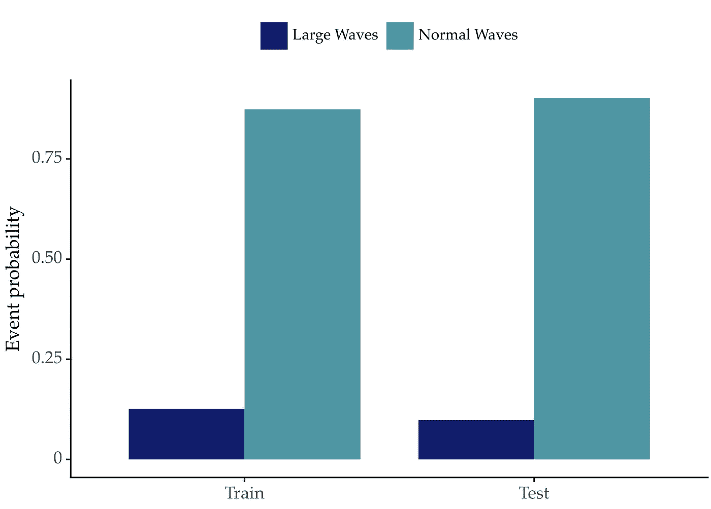
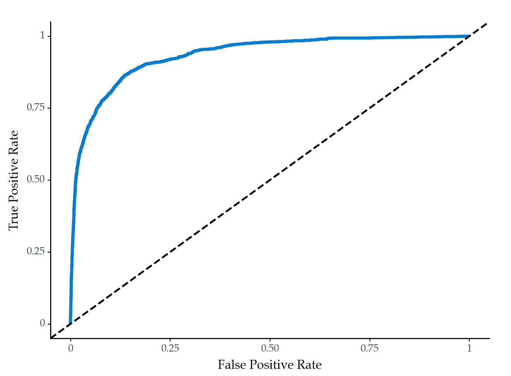

# 气候变化时间序列：大型海洋波浪预测

> 原文：[`towardsdatascience.com/time-series-for-climate-change-forecasting-large-ocean-waves-78484536be36`](https://towardsdatascience.com/time-series-for-climate-change-forecasting-large-ocean-waves-78484536be36)

## 如何使用时间序列分析和预测来应对气候变化

[](https://vcerq.medium.com/?source=post_page-----78484536be36--------------------------------)[](https://towardsdatascience.com/?source=post_page-----78484536be36--------------------------------) [Vitor Cerqueira](https://vcerq.medium.com/?source=post_page-----78484536be36--------------------------------)

·发表在 [Towards Data Science](https://towardsdatascience.com/?source=post_page-----78484536be36--------------------------------) ·7 分钟阅读·2023 年 4 月 25 日

--


照片由 [Silas Baisch](https://unsplash.com/@silasbaisch?utm_source=medium&utm_medium=referral) 提供，来源于 [Unsplash](https://unsplash.com/?utm_source=medium&utm_medium=referral)

这是系列*气候变化时间序列*的第三部分。文章列表：

+   第一部分: 风能预测

+   第二部分: 太阳辐射预测

# 海洋波浪能



波浪能转换器是从海洋波浪中获取能量的浮标。照片（浮标的照片，但不是 WEC 的照片）由 [Emmy C](https://unsplash.com/@emmy__c?utm_source=medium&utm_medium=referral) 提供，来源于 [Unsplash](https://unsplash.com/?utm_source=medium&utm_medium=referral)

海洋波浪是一个有前景的可再生能源来源。

为什么选择海洋波浪？

当谈到可再生能源时，人们通常会想到太阳能或风能。这些是最受欢迎的可再生能源来源。然而，由于其一致性，海洋波浪具有巨大潜力。

我们可以在约 90%的时间内从海洋波浪中获取能量。这个数字对于太阳能或风能来说大约是 20%-30%。详细信息请参见参考文献[1]。例如，太阳能技术仅在白天有效。

除了其一致性，波浪能也比上述两种替代能源更具预测性。海洋波浪能的主要限制是生产成本。目前，这些成本相对于太阳能或风能较高。

## 从波浪到电力

波浪能通过称为波浪能转换器（WECs）的设备转换为电力。这些设备是放置在海面上的浮标。

海洋波浪输出的能量取决于波浪的高度。这个量随时间变化。因此，预测波浪的高度是从海洋波浪中高效生产能量的关键任务。

波浪的高度是根据所谓的显著波高来量化的。该量值定义为最高三分之一波浪的平均波高，从波谷到波峰：



统计波浪分布。图片来源[here](https://en.wikipedia.org/wiki/Significant_wave_height#/media/File:Wavestats.svg)（公有领域许可证）。

## 当波浪过大时——第二个动机

预测波浪高度对于除能源生产之外的其他因素也很重要。

预测即将到来的大浪有助于管理海洋操作的安全。准确的预测可以防止沿海灾害，并保护波能转换器。这些设备可能需要关闭以防止大浪造成损坏。

安全问题也与船只通行有关。一艘船只在移动时需要最低水深。大浪会减少水深，这可能无法达到最低要求。因此，预测可以提高船只移动的效率，从而降低成本，提高港口的可靠性。

总结来说，预测海洋波浪的高度很重要，原因有几个：

+   估计能源生产以管理电网；

+   管理海洋操作，包括船只通行。

# 教程：预测大浪

在本文的其余部分，我们将开发一个模型来预测即将到来的大浪。你将学习如何构建一个概率预测模型，该模型估计事件发生的可能性。

完整的代码可在 Github 上获得：

+   [`github.com/vcerqueira/tsa4climate`](https://github.com/vcerqueira/tsa4climate)

## 数据集

我们将使用一个来自爱尔兰海岸放置的智能浮标收集的实际数据集。除了其他信息，收集的数据包括显著波高，这是我们想要预测的变量。此数据在参考文献[2]的来源中提供。

下载数据后，你可以使用以下代码读取：

```py
import pandas as pd

file = 'path_to_data/IrishSmartBuoy.csv'
# reading the data set
# skipping the second with skiprows
# parsing time column to datetime and setting it as index
data = pd.read_csv(file, skiprows=[1], parse_dates=['time'], index_col='time')
# defining the series and converting cm to meters
series = data['SignificantWaveHeight'] / 100
# resampling to hourly and taking the mean
series = series.resample('H').mean()
```

以下是数据的样子：



每小时显著波高时间序列。图片来源于作者

有几个时期的数据缺失。也许浮标正在维护。此外，还可以看到明显的季节性因素。波浪的高度在冬季通常较高。



时间序列的分布。图片来源于作者

数据分布显示出右偏态。重尾表示大浪，这对预测很重要。

关于如何定义大浪没有明确的共识。我们将其定义为至少 5 米高的波浪。这个阈值在上面的图中用黄色垂直线表示。

因此，目标是预测未来的波浪是否会超过 5 米。这个问题可以被框架化为超越概率预测任务。

## 超越概率预测概述

超越概率预测是预测时间序列在预定义的未来时间段内超越预定义阈值的概率的问题。

这个任务在极端值高度相关的领域是重要的。例如，在环境科学中，模型用于预测自然灾害如飓风或洪水的可能性。另一个例子是工程领域，专业人员使用模型来预测设备故障的可能性。

从机器学习的角度来看，主要挑战是缺乏关于超越事件的信息。根据定义，超越事件是稀有的。模型需要应对不平衡的类别分布，大多数观察值是非事件情况。

## 为什么用概率？

大浪的发生很难预测。因此，将预测结果以概率的形式呈现是有用的，以传达这些预测背后的不确定性和局限性。

一般来说，概率预测通过改善对每个可能行动相关风险的评估来帮助决策。

## 建立模型

我们可以使用[自回归](https://medium.com/towards-data-science/machine-learning-for-forecasting-transformations-and-feature-extraction-bbbea9de0ac2)来处理这个任务。

目标是使用过去近期的海洋波高作为解释变量。目标是一个二元变量，表示是否会很快出现大浪。

```py
from sklearn.model_selection import train_test_split

# https://github.com/vcerqueira/tsa4climate/tree/main/src
from src.tde import time_delay_embedding

# using past 24 observations as explanatory variables
N_LAGS = 24
# using the next 12 hours as the forecasting horizon
HORIZON = 12
# forecasting the probability of waves above 5 meters
THRESHOLD = 5

# leaving last 20% of observations for testing
train, test = train_test_split(series, test_size=0.2, shuffle=False)

# transforming time series into a tabular format for supervised learning
X_train, Y_train = time_delay_embedding(train, n_lags=N_LAGS, horizon=HORIZON, return_Xy=True)
X_test, Y_test = time_delay_embedding(test, n_lags=N_LAGS, horizon=HORIZON, return_Xy=True)

y_train = Y_train.apply(lambda x: (x > THRESHOLD).any(), axis=1).astype(int)
y_test = Y_test.apply(lambda x: (x > THRESHOLD).any(), axis=1).astype(int)
```

在这种情况下，我们将预测范围设置为 12 小时。因此，在每个时刻，我们的目标是预测在接下来的 12 小时内出现大浪的可能性。

目标变量的分布不平衡，大多数观察值指的是正常的波浪：



每个数据分区中按波浪类型（大/正常）的分布。图片作者提供。

由于目标变量是二元的，我们希望构建一个二元概率分类模型。对于这个案例研究，我们选择了随机森林。

```py
from sklearn.ensemble import RandomForestClassifier
from sklearn.metrics import roc_auc_score, roc_curve

model = RandomForestClassifier(max_depth=5)
model.fit(X_train, y_train)

probs = model.predict_proba(X_test)[:, 1]

roc_auc_score(y_test, probs)
fpr, tpr, thresholds = roc_curve(y_test, probs)
```

在训练模型后，我们可以使用*.predict_proba*方法获得概率预测。

二元概率预测可以使用 ROC（接收器操作特征）曲线来评估。其思想是绘制假阳性率（x 轴）与真正率（y 轴）在不同决策阈值下的关系。

这会生成如下的曲线：



预测模型的 ROC 曲线。图片作者提供。

曲线越接近左上角越好。对角线虚线是随机模型应该达到的水平。

ROC 曲线通常由其下方的面积（AUC）来总结。AUC 是用于评估二元概率分类器的指标，它量化了模型区分两类的能力。我们模型的 AUC 为 0.94，这是一个不错的分数。

# 关键要点

+   海洋波浪是一个有前景的可再生能源来源；

+   虽然这一来源比太阳能或风能更为稳定，但生产成本却阻碍了它的推广；

+   大型海洋波浪对海事操作的安全构成了担忧，包括沿海灾害或船只的通行。此外，大波浪还可能损坏波浪能转换器；

+   预测即将到来的大波浪是一项有用的任务。概率预测更为理想，因为这些提供了对决策至关重要的更多信息；

+   预测模型的进步可以帮助加速海洋波浪能的采纳。

感谢阅读，下次故事见！

## 参考文献

[1] Drew, Benjamin, Andrew R. Plummer, and M. Necip Sahinkaya. “波浪能转换器技术综述。” (2009): 887–902。

[2] [爱尔兰波浪浮标](https://erddap.marine.ie/erddap/tabledap/IWaveBNetwork.html)（许可证：创意共享署名 4.0）
