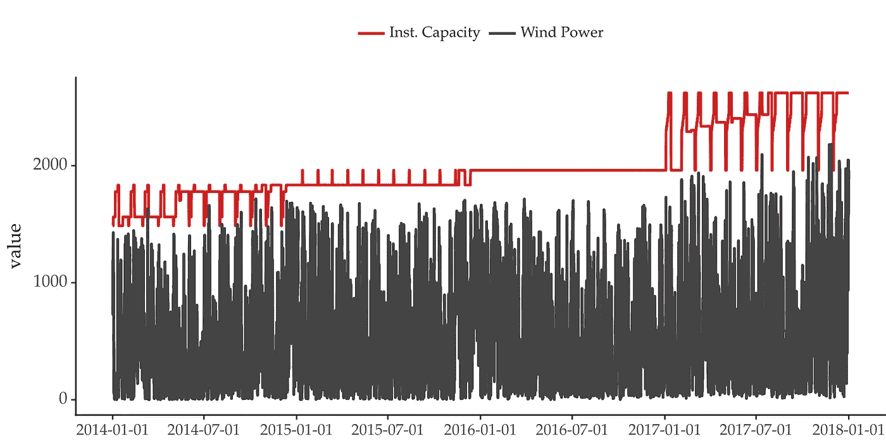
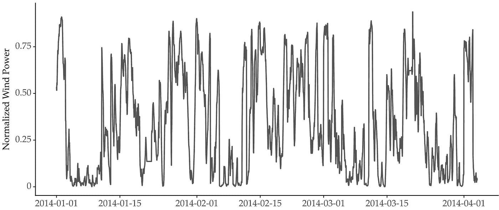
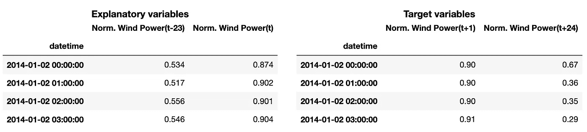
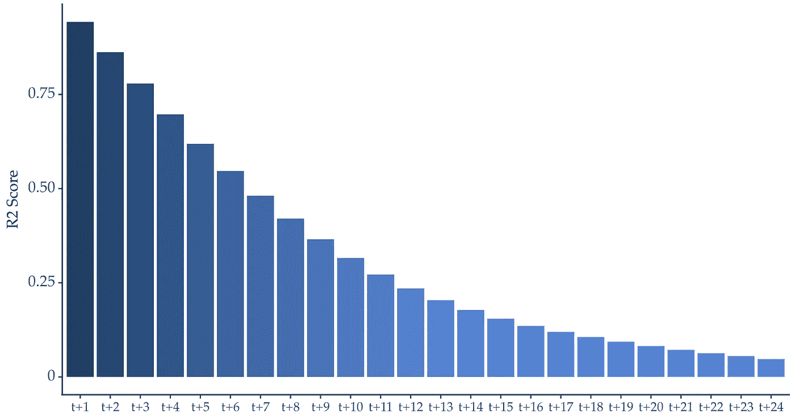
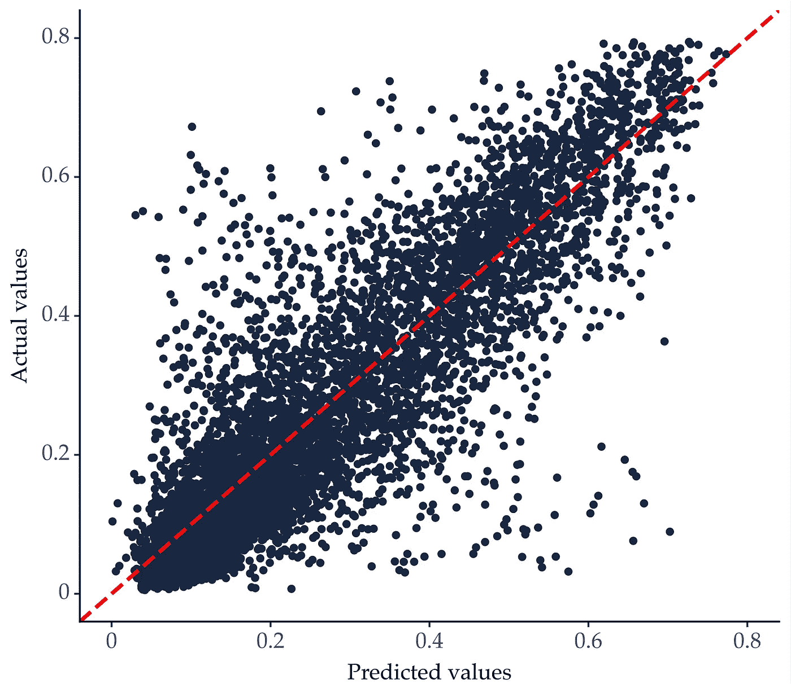

# 气候变化中的时间序列：风力发电预测

> 原文：[`towardsdatascience.com/time-series-for-climate-change-forecasting-wind-power-8ed6d653a255`](https://towardsdatascience.com/time-series-for-climate-change-forecasting-wind-power-8ed6d653a255)

## 如何利用时间序列分析和预测应对气候变化

[](https://vcerq.medium.com/?source=post_page-----8ed6d653a255--------------------------------)[](https://towardsdatascience.com/?source=post_page-----8ed6d653a255--------------------------------) [Vitor Cerqueira](https://vcerq.medium.com/?source=post_page-----8ed6d653a255--------------------------------)

·发布于 [Towards Data Science](https://towardsdatascience.com/?source=post_page-----8ed6d653a255--------------------------------) ·阅读时间 6 分钟·2023 年 3 月 29 日

--


由 [American Public Power Association](https://unsplash.com/@publicpowerorg?utm_source=medium&utm_medium=referral) 提供的照片，来源于 [Unsplash](https://unsplash.com/?utm_source=medium&utm_medium=referral)

# 朝着清洁能源生产迈进

非可再生能源对我们的星球造成了沉重的生态足迹。这一问题促使了清洁能源的科学和技术进步，例如太阳能、风能和海洋波浪能。这些能源对环境友好，不像煤炭或石油。

延迟清洁能源广泛应用的原因之一是它们的不规则性。它们是高度可变的资源，这使得其行为难以预测。

因此，预测这些资源的条件是一个关键挑战。准确的预测对于高效生产清洁能源至关重要。

在本文中，我们将开发一个模型来预测风力发电。

# 风力发电

风力发电是日益普及的可再生能源之一。[截至 2020 年，风力发电约占丹麦电力生产的 47%](https://www.reuters.com/article/us-climate-change-denmark-windpower-idUSKBN1Z10KE)。其他国家也增加了电力网中的风力发电份额。

风力发电也有一些缺点。例如，风力涡轮机的视觉影响和噪音。此外，风力发电基础设施需要相当大的初期投资。

风力发电的电网整合也很困难。风力发电只能在风吹起时生成。这使得它成为一种间歇性和不可预测的能源。因此，它需要与其他替代能源配合使用。

## 风力突增

风力波动也是电力系统运营商面临的主要问题。这些是在短时间内（分钟到小时）风力发电的大幅变化。如果未及时检测，风力波动可能会影响电网的可靠性。

风力波动可以是向上或向下的变化。当发生突然的功率下降时，必须提高其他来源的能量来补偿损失。突然的上升变化可能促使操作员减少其他来源的输出，或者选择销售过剩的能源。

## 预测的作用

电力系统运营商依赖预测模型来预测风力条件。这些模型使运营商能够高效地平衡和整合多个能源来源。准确的预测对于电网的效率以及降低成本非常重要。

# 实践操作

在本文的其余部分，我们将构建一个预测风力发电的模型。目标是展示这个问题的挑战性以及未来的发展如何带来价值。

你可以在 Github 上找到这个项目的完整代码：

+   [`github.com/vcerqueira/tsa4climate`](https://github.com/vcerqueira/tsa4climate)

## 数据集

在这个教程中，我们将使用一个关于比利时风电场的公开数据集。

时间序列以 15 分钟为间隔从 2014 年到 2018 年收集。除了风力发电，我们还获取了关于已安装容量的信息（最大可能生成的电力）：



风力发电时间序列（兆瓦），包括已安装的容量。数据来源见参考文献[1]。图片由作者提供。

随着新风机的加入，已安装容量随时间增加。因此，我们将风力发电量标准化为风电场的容量。这就形成了一种风力发电量占总容量百分比的度量。



风力发电占已安装容量的百分比。前四个月的样本。图片由作者提供。

## 构建预测模型

我们将使用机器学习算法构建一个预测模型。这个想法是应用一种叫做自回归的建模技术。自回归涉及使用最近的观察数据（滞后）来预测未来的观察数据。你可以在[以前的文章](https://medium.com/towards-data-science/machine-learning-for-forecasting-transformations-and-feature-extraction-bbbea9de0ac2)中阅读更多关于自回归的内容。

首先，我们需要将时间序列转换为表格格式。这可以通过一种叫做时间延迟嵌入的[滑动窗口方法](https://medium.com/towards-data-science/machine-learning-for-forecasting-transformations-and-feature-extraction-bbbea9de0ac2)完成：

```py
from sklearn.model_selection import train_test_split

# src module here: https://github.com/vcerqueira/tsa4climate/tree/main/src
from src.tde import time_delay_embedding

# number of lags and forecasting horizon
N_LAGS, HORIZON = 24, 24

# leaving last 20% of observations for testing
train, test = train_test_split(series, test_size=0.2, shuffle=False)

# transforming time series into a tabular format for supervised learning
X_train, Y_train = time_delay_embedding(train, n_lags=N_LAGS, horizon=HORIZON, return_Xy=True)
X_test, Y_test = time_delay_embedding(test, n_lags=N_LAGS, horizon=HORIZON, return_Xy=True)
```

我们将滞后数和预测视野都设置为 24。在每个时间步骤中，我们希望模型使用过去 24 小时的数据来预测接下来 24 小时的波动高度。

这是训练解释变量和目标变量的样本：



第一和最后的解释变量与目标变量的样本

接下来，我们使用训练集选择一个模型。在本教程中，我们进行随机搜索以选择和优化回归算法。此外，我们还测试是否应包含特征提取。特定的[特征提取过程基于滞后汇总统计](https://medium.com/towards-data-science/machine-learning-for-forecasting-transformations-and-feature-extraction-bbbea9de0ac2)。

```py
from sklearn.pipeline import Pipeline
from sklearn.preprocessing import FunctionTransformer
from sklearn.model_selection import RandomizedSearchCV, TimeSeriesSplit

from src.model_selection import (MetaEstimator,
                                 search_space_with_feature_ext)

# Create a pipeline for hyperparameter optimization
# 'feature' contains different possibilities for feature extraction
# 'model' contains different regression algorithms and respective hyperparameters
pipeline = Pipeline([('feature', FunctionTransformer()),
                     ('model', MetaEstimator())])

# do random search optimization for model selection
search_mod = RandomizedSearchCV(estimator=pipeline,
                                param_distributions=search_space_with_feature_ext,
                                scoring='r2',
                                n_iter=30,
                                n_jobs=1,
                                refit=True,
                                verbose=2,
                                cv=TimeSeriesSplit(n_splits=3),
                                random_state=123)

search_mod.fit(X_train, Y_train)

print(search_mod.best_estimator_)
# Pipeline(steps=[('feature', FunctionTransformer()),
#                 ('model', RidgeCV(alphas=0.25))])
```

选择的模型是没有特征提取的岭回归。我们使用完整的训练集重新训练该模型，并在测试集上进行评估。

```py
from sklearn.metrics import r2_score

# forecasting testing observations using the selected model
Y_hat_test = search_mod.predict(X_test)
Y_hat_test = pd.DataFrame(Y_hat_test, columns=Y_train.columns)

# evaluating the selected model over the forecasting horizon
r2_scores = {col: r2_score(y_true=Y_test[col], y_pred=Y_hat_test[col])
             for col in Y_hat_test}
```

结果揭示了两个主要挑战：

+   在大范围内进行预测；

+   预测极端观察值。

## 预测范围内的不确定性增加

众所周知，[长期预测（即超过几个时间步）比短期预测更困难](https://medium.com/towards-data-science/6-methods-for-multi-step-forecasting-823cbde4127a)。风力预测也遵循这一趋势：



在预测范围内的预测性能（R²得分）。图片由作者提供。

预测下一小时的波浪功率是容易的。R2 得分约为 0.98——几乎完美。然而，当我们进行较长时间范围的预测时，性能会大幅下降。

长期预测（在这种情况下，超过几个小时）对有效平衡能源需求和供应非常重要。

## 预测极端值



显示实际值和预测值关系的散点图。图片由作者提供。

我们还需要模型在预测极端值时的准确性。在这种情况下，这些极端值代表高或低风力。这样的值很重要，因为它们可能对电网操作产生影响。

上图显示了一个预测值和实际值的散点图。红色虚线是理想情况，其中预测值与观察值相符。

大部分数据点围绕红线分布。但是，对于极端观察值，数据点偏离了红线。因此，模型有时未能预测极端值。

克服这两个局限性对于将风能整合到电力网中至关重要。

# 主要收获

+   风力发电是越来越受欢迎的可再生能源；

+   预测风力条件是估算来自此来源的能量的关键任务；

+   这个预测任务可以通过基于自回归的模型来解决。

+   预测风力具有两个挑战：低长期预测性能和极端观察值的低性能。

感谢阅读。这篇文章是关于气候变化时间序列系列帖子的第一篇。敬请关注更多内容！

## 参考文献

[1] [比利时风力发电风电场](https://www.elia.be/en/grid-data/power-generation/wind-power-generation)（许可证 [CC BY 4.0](https://creativecommons.org/licenses/by/4.0/legalcode)）

[2] Rolnick, David, 等. “利用机器学习应对气候变化。” *ACM 计算机调查 (CSUR)* 55.2 (2022): 1–96.
