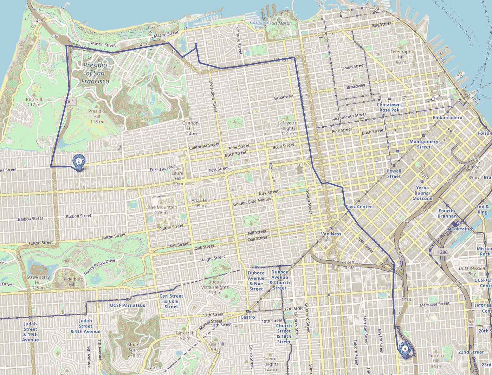
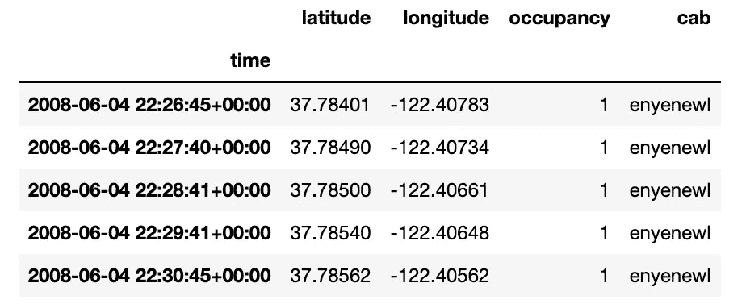
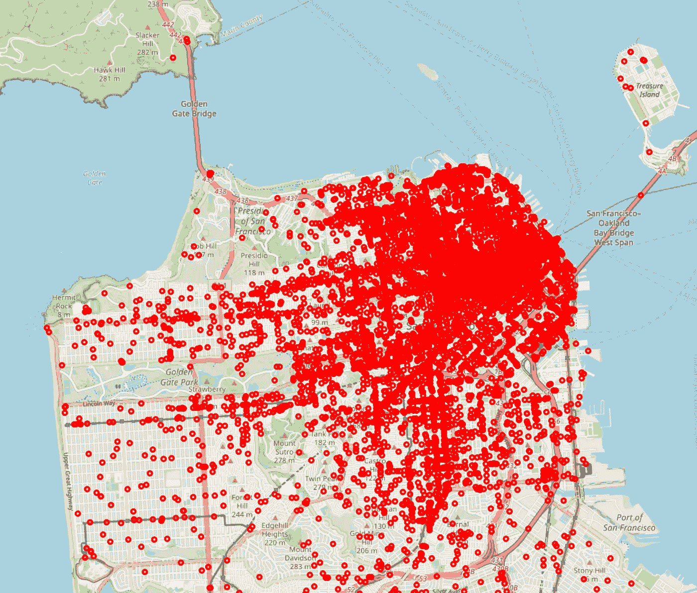
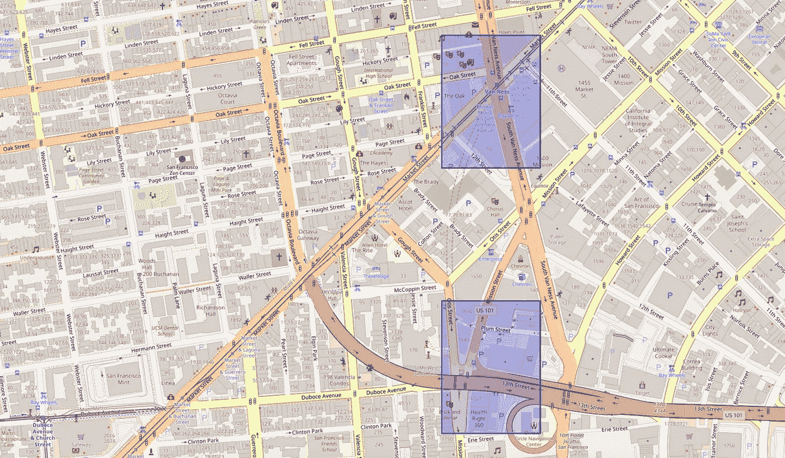
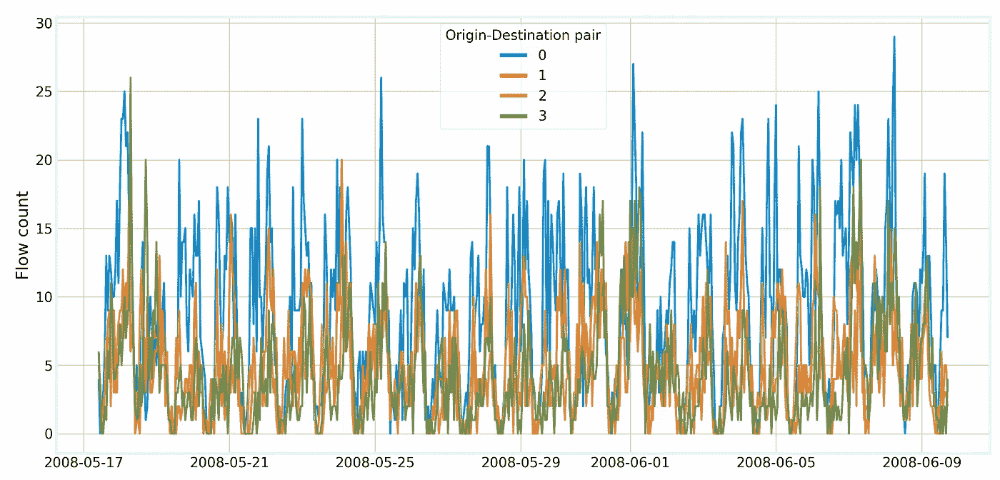

# 气候变化时间序列：起源-目的地需求预测

> 原文：[`towardsdatascience.com/time-series-for-climate-change-origin-destination-demand-forecasting-79c8fed6af89`](https://towardsdatascience.com/time-series-for-climate-change-origin-destination-demand-forecasting-79c8fed6af89)

## 挖掘浮动车数据以应对气候变化

[](https://vcerq.medium.com/?source=post_page-----79c8fed6af89--------------------------------)[](https://towardsdatascience.com/?source=post_page-----79c8fed6af89--------------------------------) [Vitor Cerqueira](https://vcerq.medium.com/?source=post_page-----79c8fed6af89--------------------------------)

·发表于 [Towards Data Science](https://towardsdatascience.com/?source=post_page-----79c8fed6af89--------------------------------) ·阅读时间 6 分钟·2023 年 6 月 15 日

--


图片来源: [Denys Nevozhai](https://unsplash.com/fr/@dnevozhai?utm_source=medium&utm_medium=referral) 于 [Unsplash](https://unsplash.com/?utm_source=medium&utm_medium=referral)

这是《*气候变化的时间序列*》系列的第八部分。文章列表：

+   第一部分: [预测风力](https://towardsdatascience.com/time-series-for-climate-change-forecasting-wind-power-8ed6d653a255)

+   第二部分: 太阳辐射预测

+   第三部分: [预测大洋波浪](https://medium.com/towards-data-science/time-series-for-climate-change-forecasting-large-ocean-waves-78484536be36)

+   第四部分: [预测能源需求](https://medium.com/towards-data-science/time-series-for-climate-change-forecasting-energy-demand-79f39c24c85e)

+   第五部分: 预测极端天气事件

+   第六部分: 使用深度学习进行精准农业

+   第七部分: [通过聚类减少食品浪费](https://medium.com/towards-data-science/time-series-for-climate-change-reducing-food-waste-with-clustering-c2f067ffa907)

# 浮动车数据用于流动建模

挖掘浮动车数据是智能交通系统中的关键任务。浮动车数据指的是由配备 GPS 设备的车辆收集的数据，这些数据提供了关于车辆位置和速度的信息。

了解城市内部的流动模式是交通运输中的一项重要任务。例如，这有助于减少拥堵和整体交通活动。减少在交通中的时间意味着排放的温室气体减少。因此，准确的模型对气候变化有积极影响。

GPS 设备的普及产生了许多与移动性相关的数据集。但是，从 GPS 数据中学习是一个具有挑战性的问题。空间依赖性很复杂但非常重要。而且，还有时间依赖性，例如高峰时段。移动模式在工作日和非工作日也有所不同。

## 起始-目的地流量计数估计



旧金山的一次出租车行程。图片来源：作者

浮动车数据为移动建模提供了许多可能性。其中之一是起始-目的地（OD）流量计数问题。

OD 流量计数指的是在给定时间段内估计有多少辆车辆从一个子区域穿越到另一个子区域。这项任务有多个相关的原因。出租车公司可以根据特定区域的预期需求动态分配车队。

# 实操：预测旧金山的 OD 需求

在本文的其余部分，我们将预测旧金山的出租车乘客需求。我们将把这个问题作为 OD 流量计数任务来处理。

本教程中使用的完整代码可以在 Github 上找到：

+   [`github.com/vcerqueira/tsa4climate`](https://github.com/vcerqueira/tsa4climate)

## 数据集

我们将使用由美国加利福尼亚州旧金山的一家出租车车队收集的数据集。该数据集包含来自 536 辆出租车的 GPS 数据，时间跨度为 21 天。总共有 1.21 亿条 GPS 路径，分布在 464045 次行程中。有关更多细节，请参见参考文献 [1]。



数据集的样本。

在每个时间步长和每辆出租车上，我们都有其坐标信息和是否有乘客乘坐的信息。

## 问题定义



旧金山的一些出租车行程的结束位置。图片来源：作者。

我们的目标是根据起始点建模人们的去向。OD 流量计数估计可以分为四个子任务：

1.  空间网格分解

1.  起始-目的地对的选择

1.  时间离散化

1.  建模和预测

让我们逐个深入探讨每个问题。

## 空间网格分解

空间分解是 OD 流量计数估计的一个常见预处理步骤。其思想是将地图分割成网格单元，这些网格单元代表城市的一小部分。然后，我们可以统计每对网格单元之间有多少人穿越。



旧金山的两个示例网格单元。图片来源：作者。

在这个案例研究中，我们将城市地图分成 10000 个网格单元，如下所示：

```py
import pandas as pd

from src.spatial import SpatialGridDecomposition, prune_coordinates

# reading the data set
trips_df = pd.read_csv('trips.csv', parse_dates=['time'])

# removing outliers from coordinates
trips_df = prune_coordinates(trips_df=trips_df, lhs_thr=0.01, rhs_thr=0.99)

# grid decomposition with 10000 cells
grid = SpatialGridDecomposition(n_cells=10000)
# setting bounding box
grid.set_bounding_box(lat=trips_df.latitude, lon=trips_df.longitude)
# grid decomposition
grid.grid_decomposition()
```

在上面的代码中，我们去除了异常地点。这些异常可能是由于 GPS 故障引起的。

## 获取最受欢迎的行程

在空间分解过程之后，我们获取了每次出租车行程的起点和终点，当它们被乘客占用时。

```py
from src.spatial import ODFlowCounts

# getting origin and destination coordinates for each trip
df_group = trips_df.groupby(['cab', 'cab_trip_id'])
trip_points = df_group.apply(lambda x: ODFlowCounts.get_od_coordinates(x))
trip_points.reset_index(drop=True, inplace=True)
```

该想法是重建数据集，以包含以下信息：每次乘客旅行的起点、终点和起始时间戳。这些数据构成了我们的出发地-目的地 (OD) 流量计数模型的基础。

这些数据使我们能够计算从 A 单元格到 B 单元格的旅行次数：

```py
# getting the origin and destination cell centroid
od_pairs = trip_points.apply(lambda x: ODFlowCounts.get_od_centroids(x, grid.centroid_df), axis=1)
```

为了简便起见，我们选择了旅行次数最多的前 50 个 OD 网格单元对。选择这个子集是可选的。然而，只有少量旅行的 OD 对在时间上会显示稀疏需求，这很难建模。此外，从车队管理的角度来看，需求低的旅行可能不太有用。

```py
flow_count = od_pairs.value_counts().reset_index()
flow_count = flow_count.rename({0: 'count'}, axis=1)

top_od_pairs = flow_count.head(50)
```

## 时间离散化

在找到需求最高的 OD 对后，我们将其在时间上离散化。通过计算每小时每个给定顶级对的旅行次数来完成此操作。可以按如下方式进行：

```py
# preparing data
trip_points = pd.concat([trip_points, od_pairs], axis=1)
trip_points = trip_points.sort_values('time_start')
trip_points.reset_index(drop=True, inplace=True)

# getting origin-destination cells for each trip, and origin start time
trip_starts = []
for i, pair in top_od_pairs.iterrows():

    origin_match = trip_points['origin'] == pair['origin']
    dest_match = trip_points['destination'] == pair['destination']

    od_trip_df = trip_points.loc[origin_match & dest_match, :]
    od_trip_df.loc[:, 'pair'] = i

    trip_starts.append(od_trip_df[['time_start', 'time_end', 'pair']])

trip_starts_df = pd.concat(trip_starts, axis=0).reset_index(drop=True)

# more data processing
od_count_series = {}
for pair, data in trip_starts_df.groupby('pair'):

    new_index = pd.date_range(
        start=data.time_start.values[0],
        end=data.time_end.values[-1],
        freq='H',
        tz='UTC'
    )

    od_trip_counts = pd.Series(0, index=new_index)
    for _, r in data.iterrows():
        dt = r['time_start'] - new_index
        dt_secs = dt.total_seconds()

        valid_idx = np.where(dt_secs >= 0)[0]
        idx = valid_idx[dt_secs[valid_idx].argmin()]

        od_trip_counts[new_index[idx]] += 1

    od_count_series[pair] = od_trip_counts.resample('H').mean()

od_df = pd.DataFrame(od_count_series)
```

这会产生一组时间序列，每个顶级 OD 对一个时间序列。以下是四个示例对的时间序列图：



四个示例出发地-目的地对的流量计数时间序列。图片由作者提供。

时间序列显示出日常季节性，这主要由高峰时段驱动。

## 预测

由时间离散化产生的时间序列集可用于预测。我们可以构建一个模型来预测相对于给定 OD 对的乘客旅行需求量。

下面是如何针对一个示例 OD 对进行操作的步骤：

```py
from pmdarima.arima import auto_arima

# getting the first OD pair as example
series = od_df[0].dropna()

# fitting an ARIMA model
model = auto_arima(y=series, m=24)
```

上述内容，我们基于 ARIMA 构建了一个预测模型。该模型根据最近的需求预测下一小时的乘客需求。我们使用 ARIMA 方法是为了简便，但也可以使用其他方法，如[深度学习](https://medium.com/towards-data-science/how-to-transform-time-series-for-deep-learning-3b6abbbb3726)。

## 深入了解图神经网络

上述方法是一种简单而有效的解决 OD 流量计数问题的方法。但它将每个 OD 对视为一个独立的时间序列。

实际上，每对之间与相邻的 OD 对或周围道路相关联。因此，图神经网络在预测交通状况方面得到了越来越多的应用。道路网络被建模为图形，神经网络可以捕捉其中的复杂交互。你可以查看[这个 Keras 示例](https://keras.io/examples/timeseries/timeseries_traffic_forecasting/)来了解如何实现这种方法。

# 关键要点

+   移动建模是智能交通系统中的一项重要任务；

+   OD 流量计数模型可以帮助减少城市交通，从而减少温室气体的排放；

+   你可以通过基于空间分解和时间离散化的方法来解决 OD 流量计数问题。这将生成每个 OD 对的一组时间序列，可用于预测。

感谢阅读，下次故事见！

## 参考文献

[1] [旧金山，USA 的出租车移动轨迹数据集。](https://ieee-dataport.org/open-access/crawdad-epflmobility)（许可证 [CC BY 4.0](https://creativecommons.org/licenses/by/4.0/)）

[2] Moreira-Matias, Luís 等人。“使用高速 GPS 数据流进行时变 OD 矩阵估计。” *应用专家系统* 44 (2016): 275–288。
