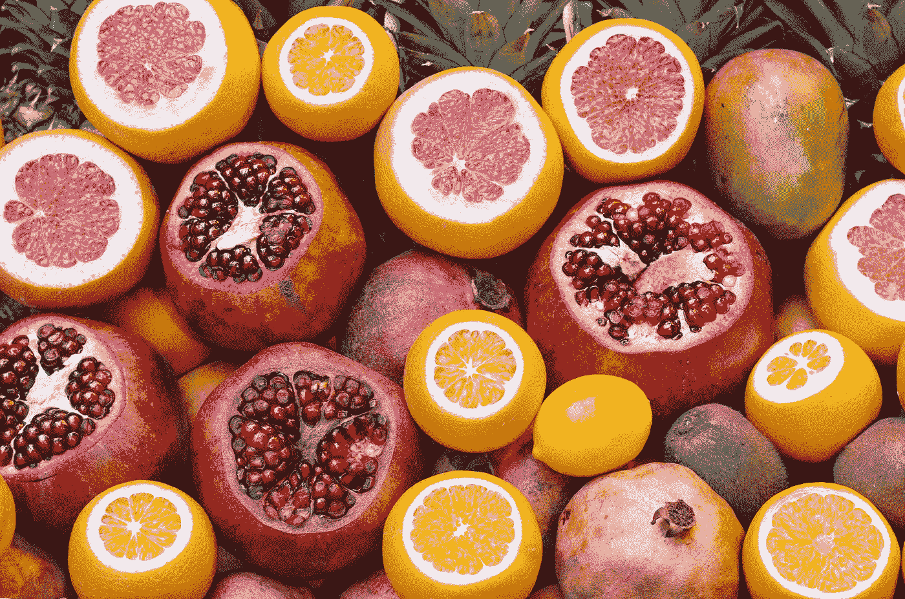

# 气候变化时间序列：通过聚类减少食物浪费

> 原文：[`towardsdatascience.com/time-series-for-climate-change-reducing-food-waste-with-clustering-c2f067ffa907?source=collection_archive---------10-----------------------#2023-06-07`](https://towardsdatascience.com/time-series-for-climate-change-reducing-food-waste-with-clustering-c2f067ffa907?source=collection_archive---------10-----------------------#2023-06-07)

## 使用时间序列聚类来提高需求预测的准确性

 [Vitor Cerqueira](https://vcerq.medium.com/?source=post_page-----c2f067ffa907--------------------------------)

·

[关注](https://medium.com/m/signin?actionUrl=https%3A%2F%2Fmedium.com%2F_%2Fsubscribe%2Fuser%2Fefb5f27c836d&operation=register&redirect=https%3A%2F%2Ftowardsdatascience.com%2Ftime-series-for-climate-change-reducing-food-waste-with-clustering-c2f067ffa907&user=Vitor+Cerqueira&userId=efb5f27c836d&source=post_page-efb5f27c836d----c2f067ffa907---------------------post_header-----------) 发表在 [Towards Data Science](https://towardsdatascience.com/?source=post_page-----c2f067ffa907--------------------------------) ·6 分钟阅读·2023 年 6 月 7 日

--

图片由 [Luke Michael](https://unsplash.com/@lukemichael?utm_source=medium&utm_medium=referral) 提供，来源于 [Unsplash](https://unsplash.com/?utm_source=medium&utm_medium=referral)

这是系列文章 *气候变化时间序列* 的第七部分。文章列表：

+   第一部分： 风能预测

+   第二部分： 太阳辐射预测

+   第三部分: [预测大型海洋波浪](https://medium.com/towards-data-science/time-series-for-climate-change-forecasting-large-ocean-waves-78484536be36)

+   第四部分: [预测能源需求](https://medium.com/towards-data-science/time-series-for-climate-change-forecasting-energy-demand-79f39c24c85e)

+   第五部分: 预测极端天气事件

+   第六部分: 使用深度学习进行精准农业

# 减少食品浪费

改善供应链是减少我们生态足迹的另一个关键步骤。在发达国家，常常会有大量的消费品剩余，例如食品。这些剩余品需要大量的能源和资源，往往会被浪费掉。

减少过度生产是减少温室气体排放的重要里程碑。我们可以通过更好地理解我们的需求量来解决这个问题。

以食品为例。每年我们损失大约 1.3 亿公吨的食品[1]。当然，这并不是所有的剩余食品都与供应链有关。其中一部分在生产或运输过程中就已丧失，例如由于……
