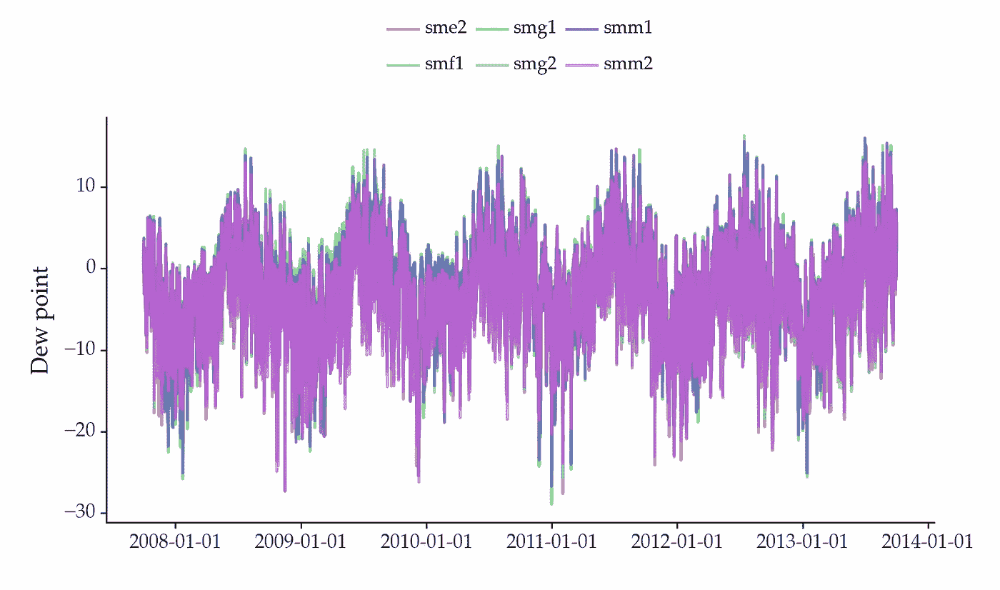

# 气候变化中的时间序列：使用深度学习进行精准农业

> 原文：[`towardsdatascience.com/time-series-for-climate-change-using-deep-learning-for-precision-agriculture-806878cab9c`](https://towardsdatascience.com/time-series-for-climate-change-using-deep-learning-for-precision-agriculture-806878cab9c)

## 如何使用时间序列分析和预测来应对气候变化

[](https://vcerq.medium.com/?source=post_page-----806878cab9c--------------------------------)[](https://towardsdatascience.com/?source=post_page-----806878cab9c--------------------------------) [维托尔·塞尔奎拉](https://vcerq.medium.com/?source=post_page-----806878cab9c--------------------------------)

·发布于 [数据科学前沿](https://towardsdatascience.com/?source=post_page-----806878cab9c--------------------------------) ·阅读时间 6 分钟·2023 年 5 月 29 日

--


图片来源: [Irewolede](https://unsplash.com/@irewolede?utm_source=medium&utm_medium=referral) 在 [Unsplash](https://unsplash.com/?utm_source=medium&utm_medium=referral)

这是 *气候变化中的时间序列* 系列的第六部分。文章列表：

+   第一部分: 预测风能

+   第二部分: 太阳辐射预测

+   第三部分: [预测大型海洋波浪](https://medium.com/towards-data-science/time-series-for-climate-change-forecasting-large-ocean-waves-78484536be36)

+   第四部分: [预测能源需求](https://medium.com/towards-data-science/time-series-for-climate-change-forecasting-energy-demand-79f39c24c85e)

+   第五部分: [预测极端天气事件](https://medium.com/towards-data-science/times-series-for-climate-change-forecasting-extreme-weather-events-335dc199fb6f)

# 精准农业

精准农业旨在改进农业管理。以优化生产，同时节省资源并减少环境影响。

有多种技术致力于提高农业的可持续性。例如：

+   智能灌溉系统：使用传感器优化灌溉过程；

+   精准种植系统：优化种植过程，如种子间距；

+   作物产量预测，帮助农民决定每个季节种植什么作物。

## 露点温度


图片来源: [西蒙·库兹涅佐夫](https://unsplash.com/@simonkuznetsovphoto?utm_source=medium&utm_medium=referral) 在 [Unsplash](https://unsplash.com/?utm_source=medium&utm_medium=referral)

在灌溉系统的情况下，过少的灌溉会增加植物的压力并降低作物产量。但过多的灌溉会导致过多的湿气，从而滋生害虫。一个最佳的灌溉过程可以节省大量水资源并保护其他资源。

影响灌溉的一个指标是露点温度。露点温度指示空气中的水分含量。这反过来影响灌溉过程。因此，预测露点温度有助于支持水资源规划。

露点温度的相关性延伸到水文学、气候学和农业等领域。例如，如果预测显示出过多湿气的可能性，可以主动采取害虫控制措施。预测还可以用来预见霜冻，这对植物有害。在这种情况下，农民可以采取预防措施来保护作物。

预测露点温度在能源管理方面也很重要。在高露点温度下，人们倾向于使用空调系统来应对高相对湿度水平。预测这些条件可以用于预测能源需求的增加。这有助于提高电网的效率。

# 实操：使用深度学习进行露点温度的时空预测

在本文的其余部分，我们将预测多个地点的露点温度。你将学习如何使用深度学习构建时空预测模型。

本教程的完整代码可以在 Github 上找到：

+   [`github.com/vcerqueira/tsa4climate`](https://github.com/vcerqueira/tsa4climate)

## 时空预测基础

时空数据是多变量时间序列的一个特例。这些数据集涉及在多个地点观察一个变量，例如露点温度。

这种类型的数据包含了时间依赖性和空间依赖性。特定地点收集的数据点与其滞后值以及附近地点的当前和过去滞后值相关。建模这两种依赖性对于每个地点获得更好的预测可能是重要的。

时空预测通常使用诸如 VAR（向量自回归）或 STAR（时空自回归）等技术。我们将使用 VAR 方法结合深度神经网络。

## 数据集

我们将使用由美国农业部收集的实际数据集。更多细节请参考文献[1]。该数据集包含了露点温度的信息，这一变量在 6 个附近的站点中被记录。

下载数据后，你可以使用以下代码进行读取：

```py
import pandas as pd

DATE_TIME_COLS = ['month', 'day', 'calendar_year', 'hour', 'water_year']

# reading the data set
data = pd.read_csv(filepath)

# parsing the datetime column
data['datetime'] = \
    pd.to_datetime([f'{year}/{month}/{day} {hour}:00'
                    for year, month, day, hour in zip(data['calendar_year'],
                                                      data['month'],
                                                      data['day'],
                                                      data['hour'])])

data = data.drop(DATE_TIME_COLS, axis=1).set_index('datetime')
data.columns = data.columns.str.replace('_dpt_C', '')
```

数据的样貌如下：



不同地点的时间序列似乎是相关的。

## VAR — 准备数据以进行监督学习

我们将使用 VAR 方法来准备数据以训练深度神经网络。VAR 方法旨在捕捉不同变量之间的时间依赖性。在这种情况下，变量代表在 6 个位置收集的露点温度。

我们可以通过使用滑动窗口将每个变量转换为矩阵格式，然后将结果合并来实现这一点。你可以查看[a previous article](https://medium.com/towards-data-science/how-to-transform-time-series-for-deep-learning-3b6abbbb3726)获取更多关于这一过程的细节。

```py
from sklearn.model_selection import train_test_split

from src.tde import transform_mv_series

N_LAGS, HORIZON = 12, 12

# number of stations
N_STATIONS = data.shape[1]

# leaving last 20% of observations for testing
train, test = train_test_split(data, test_size=0.2, shuffle=False)

# computing the average of each series in the training set
mean_by_location = train.mean()

# mean-scaling: dividing each series by its mean value
train_scaled = train / mean_by_location
test_scaled = test / mean_by_location

# transforming the data for supervised learning
X_train, Y_train = transform_mv_series(train_scaled, n_lags=N_LAGS, horizon=HORIZON)
X_test, Y_test = transform_mv_series(test_scaled, n_lags=N_LAGS, horizon=HORIZON)
```

然后，我们基于 keras 构建一个堆叠 LSTM 模型。LSTM（长短期记忆）是一种特殊的递归神经网络，可以捕捉时间依赖性。

```py
from keras.models import Sequential
from keras.layers import Dense, Dropout, LSTM, RepeatVector, TimeDistributed

model = Sequential()
model.add(LSTM(64, activation='relu', input_shape=(N_LAGS, N_STATIONS)))
model.add(Dropout(.2))
model.add(RepeatVector(HORIZON))
model.add(LSTM(32, activation='relu', return_sequences=True))
model.add(Dropout(.2))
model.add(TimeDistributed(Dense(N_STATIONS)))

model.compile(optimizer='adam', loss='mse')
```

定义和编译模型后，我们可以如下训练它：

```py
from keras.callbacks import ModelCheckpoint

# model checkpoint for saving the best model during training
model_checkpoint = ModelCheckpoint(
    filepath='best_model_weights.h5',
    save_weights_only=True,
    monitor='val_loss',
    mode='min',
    save_best_only=True)

# fitting the model
history = model.fit(X_train, Y_train,
                    epochs=25,
                    validation_split=0.2,
                    callbacks=[model_checkpoint])
```

训练后，我们可以加载由模型检查点回调保存的最佳权重：

```py
# The best model weights are loaded into the model after training
model.load_weights('best_model_weights.h5')

# predictions on the test set
preds = model.predict_on_batch(X_test)
```

## 扩展模型

我们可以通过不同方式扩展这个模型。例如，包含其他气象信息作为解释变量。像露点温度这样的气象数据受到各种因素的影响。它们的包含可能是更好预测性能的关键。

测试其他神经网络配置也可能是有益的。我们应用了堆叠 LSTM，但其他方法也显示出有前景的预测性能。例如 N-BEATS、DeepAR 或 ES-RNN。

我们还可以包括空间信息，例如地理坐标。这样，模型可以改善不同位置之间空间依赖性的建模。

# 关键要点

+   精准农业旨在优化农业过程。这种优化可以减少农业对环境的影响；

+   露点温度是水文学中的一个关键指标。预测这个变量对各种活动都是有益的，例如灌溉；

+   气象变量通常在几个站点中捕获，这导致了一个时空数据集；

+   深度学习可以用于构建一个时空预测模型。我们使用包含来自六个不同位置的露点温度的数据集训练了一个 LSTM 神经网络；

+   这个模型可以通过包括额外的解释变量、空间信息或更改网络架构来扩展。

感谢阅读，下一个故事见！

## 参考文献

[1] [来自美国爱达荷州西南部四个以西部刺柏为主的实验流域的天气、降雪和径流数据。](https://data.nal.usda.gov/dataset/data-weather-snow-and-streamflow-data-four-western-juniper-dominated-experimental-catchments-south-western-idaho-usa)（许可证：美国公共领域）

[2] Arikan, Bugrayhan Bickici 等。“北达科他州的露点时间序列预测。” *知识基础工程与科学* 2.2 (2021): 24–34。

[3] Liakos, Konstantinos G., 等人。“农业中的机器学习：综述。” *传感器* 18.8 (2018): 2674.
