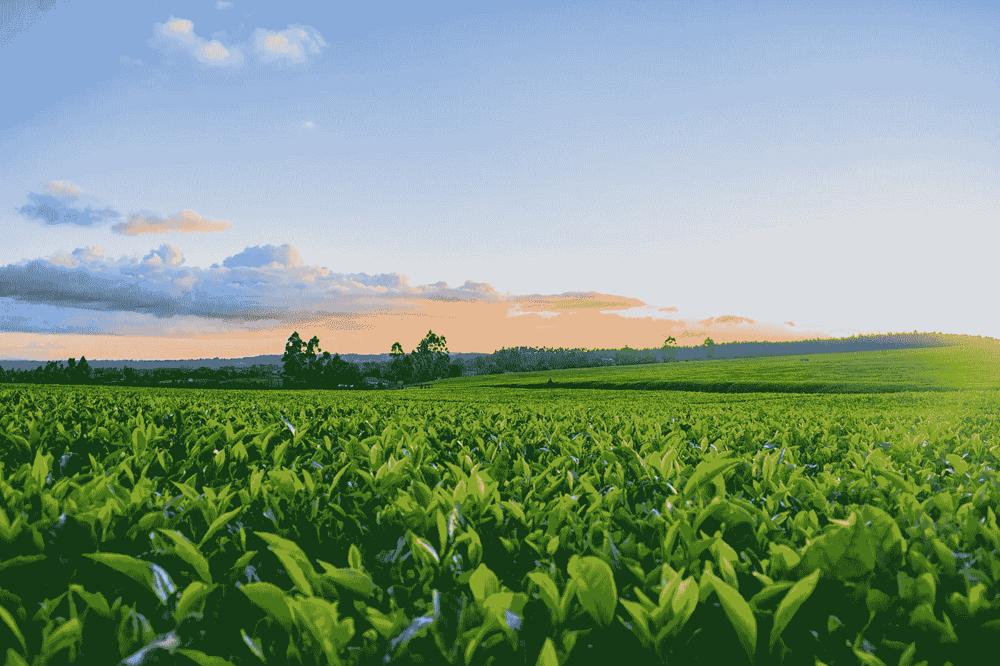

# 气候变化的时间序列：使用深度学习进行精准农业

> 原文：[`towardsdatascience.com/time-series-for-climate-change-using-deep-learning-for-precision-agriculture-806878cab9c?source=collection_archive---------12-----------------------#2023-05-29`](https://towardsdatascience.com/time-series-for-climate-change-using-deep-learning-for-precision-agriculture-806878cab9c?source=collection_archive---------12-----------------------#2023-05-29)

## 如何使用时间序列分析和预测应对气候变化

 [Vitor Cerqueira](https://vcerq.medium.com/?source=post_page-----806878cab9c--------------------------------)

·

[关注](https://medium.com/m/signin?actionUrl=https%3A%2F%2Fmedium.com%2F_%2Fsubscribe%2Fuser%2Fefb5f27c836d&operation=register&redirect=https%3A%2F%2Ftowardsdatascience.com%2Ftime-series-for-climate-change-using-deep-learning-for-precision-agriculture-806878cab9c&user=Vitor+Cerqueira&userId=efb5f27c836d&source=post_page-efb5f27c836d----806878cab9c---------------------post_header-----------) 发表在 [Towards Data Science](https://towardsdatascience.com/?source=post_page-----806878cab9c--------------------------------) ·6 分钟阅读·2023 年 5 月 29 日

--

[Irewolede](https://unsplash.com/@irewolede?utm_source=medium&utm_medium=referral)拍摄于[Unsplash](https://unsplash.com/?utm_source=medium&utm_medium=referral)

这是系列文章*气候变化的时间序列*的第六部分。文章列表：

+   第一部分: 风能预测

+   第二部分: 太阳辐射预测

+   Part 3: [预测大洋海浪](https://medium.com/towards-data-science/time-series-for-climate-change-forecasting-large-ocean-waves-78484536be36)

+   Part 4: [预测能源需求](https://medium.com/towards-data-science/time-series-for-climate-change-forecasting-energy-demand-79f39c24c85e)

+   Part 5: [预测极端天气事件](https://medium.com/towards-data-science/times-series-for-climate-change-forecasting-extreme-weather-events-335dc199fb6f)

# 精准农业

精准农业旨在改善农业管理。以优化生产同时节约资源和减少环境影响。

有几种技术致力于改善农业的可持续性。例如：

+   智能灌溉系统：利用传感器优化灌溉过程；

+   精准种植系统：优化种植过程，如种子之间的间距；

+   农作物产量预测，帮助农民决定每个季节种植什么作物。

## 露点温度
