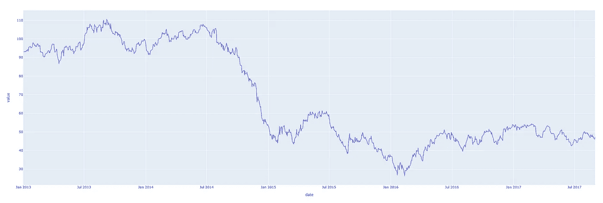
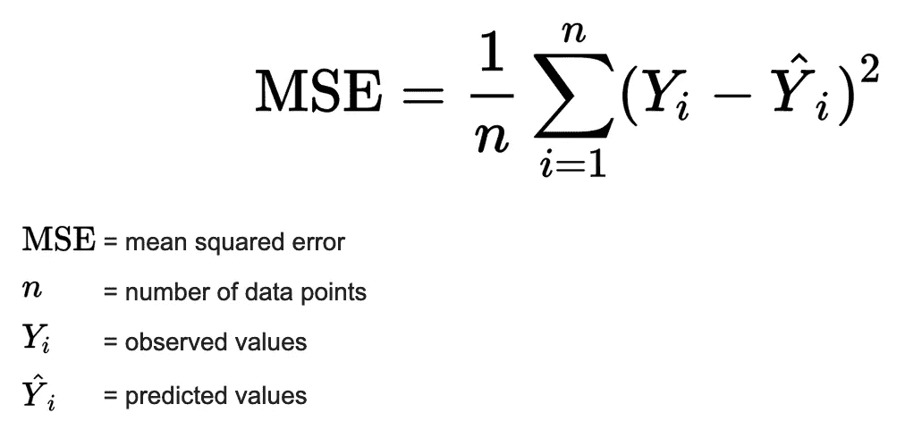
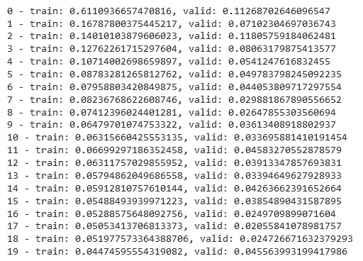
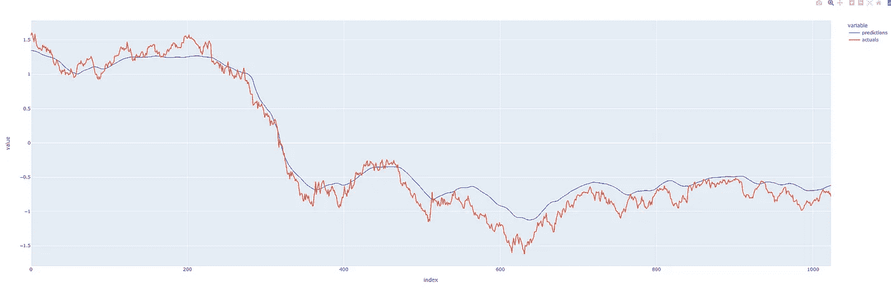
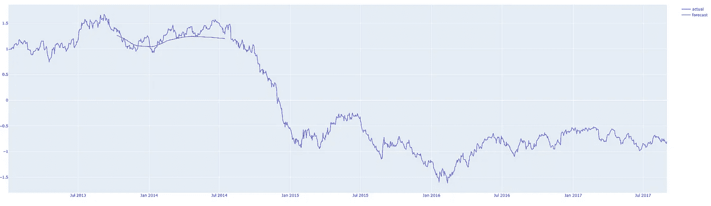
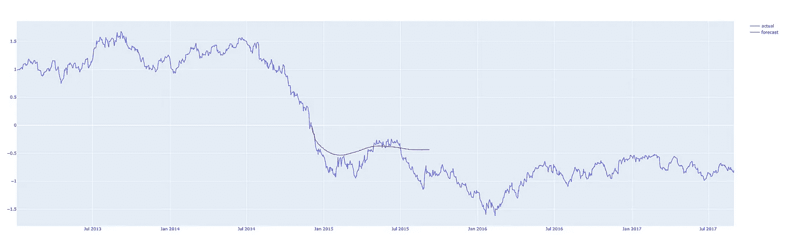
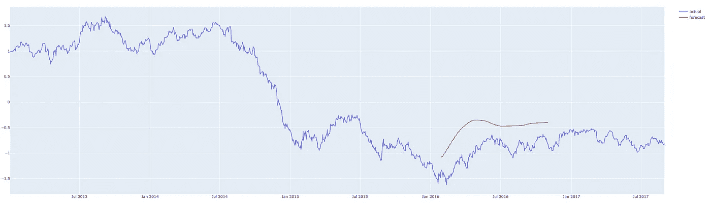
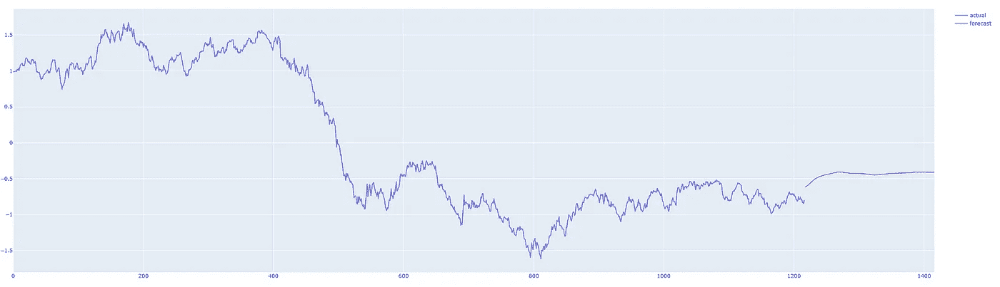

# 基于深度学习的时间序列预测（LSTM-RNN）在 PyTorch 中的应用

> 原文：[`towardsdatascience.com/time-series-forecasting-with-deep-learning-in-pytorch-lstm-rnn-1ba339885f0c`](https://towardsdatascience.com/time-series-forecasting-with-deep-learning-in-pytorch-lstm-rnn-1ba339885f0c)

## 一个关于使用 PyTorch 进行单变量时间序列深度学习预测的深入教程

[](https://zainbaq.medium.com/?source=post_page-----1ba339885f0c--------------------------------)[](https://towardsdatascience.com/?source=post_page-----1ba339885f0c--------------------------------) [Zain Baquar](https://zainbaq.medium.com/?source=post_page-----1ba339885f0c--------------------------------)

·发布于 [Towards Data Science](https://towardsdatascience.com/?source=post_page-----1ba339885f0c--------------------------------) ·阅读时间 12 分钟·2023 年 2 月 9 日

--


[Unsplash: Maxim Hopman](https://unsplash.com/@nampoh)

# **介绍**

信不信由你，人类在不断被动地预测事物——即使是最微小或看似琐碎的事情。过马路时，我们预测汽车会在哪里以安全地过马路，或者我们尝试预测球在我们试图接住它时会在哪里。我们不需要知道汽车的确切速度或影响球的风向才能完成这些任务——这些能力对我们来说或多或少是自然而然的。这些能力通过一系列事件得到调整，通过多年的经验和实践使我们能够应对我们生活中不可预测的现实。而当需要主动预测大规模现象，如天气或一年后的经济表现时，我们往往因为需要考虑的因素过多而失败。

这就是计算的力量所在——弥补我们无法将即使是最看似随机的事件与未来事件联系起来的不足。众所周知，计算机在执行特定任务时非常擅长——我们可以利用这一点来预测未来。

**什么是“时间序列”？**

时间序列是指在一段时间内发生的任何可量化的指标或事件。尽管这听起来很琐碎，但几乎任何东西都可以被认为是时间序列。比如一个月内每小时的平均心率，或者一年内每日的股票收盘价，或者某城市一年内每周的交通事故数量。记录这些信息在任何统一的时间段内被认为是时间序列。聪明的人会注意到，这些例子中都有一个**频率**（每天、每周、每小时等）和一个**时间长度**（一个月、一年、一天等）来描述事件发生的周期。

对于时间序列，指标是在我们观察指标的时间长度内以统一频率记录的。换句话说，每个记录之间的时间应该是相同的。

在本教程中，我们将探讨如何使用时间序列中的过去数据来预测未来可能发生的情况。

**目标**

算法的目标是能够接受一系列值，并预测序列中的下一个值。最简单的方法是使用**自回归**模型，然而，这已经被其他作者广泛讨论过，因此我们将专注于一种更深入的学习方法，即使用**递归神经网络**。我已将实现笔记本链接[在此](https://drive.google.com/file/d/1ZzxQISX0519T347j3Sx71iHKsdYDOzcl/view?usp=sharing)。本教程中使用的数据集曾在 Kaggle 比赛中使用，可以在[这里](https://www.kaggle.com/competitions/store-sales-time-series-forecasting/data?select=oil.csv)找到。

# **数据准备**

让我们看看一个示例时间序列。下面的图表显示了 2013 年至 2018 年间油价的一些数据。



作者提供的图像

这只是一个在日期轴上绘制单一数值序列的图表。下表显示了该时间序列的前 10 个条目。从日期列来看，很明显我们有每天频率的价格数据。

```py
date        dcoilwtico
2013-01-01  NaN
2013-01-02  93.14
2013-01-03  92.97
2013-01-04  93.12
2013-01-07  93.20
2013-01-08  93.21
2013-01-09  93.08
2013-01-10  93.81
2013-01-11  93.60
2013-01-14  94.27
```

许多机器学习模型在标准化数据上表现更好。标准化数据的方式是将数据转换为每列的均值为 0，标准差为 1。下面的代码提供了一种使用**scikit-learn**库进行标准化的方法。

```py
from sklearn.preprocessing import StandardScaler

# Fit scalers
scalers = {}
for x in df.columns:
  scalers[x] = StandardScaler().fit(df[x].values.reshape(-1, 1))

# Transform data via scalers
norm_df = df.copy()
for i, key in enumerate(scalers.keys()):
  norm = scalers[key].transform(norm_df.iloc[:, i].values.reshape(-1, 1))
  norm_df.iloc[:, i] = norm
```

我们还希望确保我们的数据具有统一的频率——在这个例子中，我们在这 5 年中每天都有油价数据，所以这很好地解决了问题。如果你的数据中不是这种情况，Pandas 提供了几种不同的方法来重新采样数据以适应统一的频率。

## **序列化**

一旦实现了这一点，我们将使用时间序列生成固定长度的片段或**序列**。在记录这些序列时，我们还会记录序列之后发生的值。例如：假设我们有一个序列：[1, 2, 3, 4, 5, 6]。

通过选择序列长度为 3，我们可以生成以下序列及其相关目标：

**[Sequence]: Target**

[1, 2, 3] → 4

[2, 3, 4] → 5

[3, 4, 5] → 6

另一种看待这个问题的方法是，我们定义了回顾多少步以预测下一个值。我们将这个值称为 **训练窗口**，预测的值数目称为 **预测窗口**。在这个例子中，这些分别是 3 和 1。下面的函数详细说明了如何实现这一点。

```py
# Defining a function that creates sequences and targets as shown above
def generate_sequences(df: pd.DataFrame, tw: int, pw: int, target_columns, drop_targets=False):
  '''
  df: Pandas DataFrame of the univariate time-series
  tw: Training Window - Integer defining how many steps to look back
  pw: Prediction Window - Integer defining how many steps forward to predict

  returns: dictionary of sequences and targets for all sequences
  '''
  data = dict() # Store results into a dictionary
  L = len(df)
  for i in range(L-tw):
    # Option to drop target from dataframe
    if drop_targets:
      df.drop(target_columns, axis=1, inplace=True)

    # Get current sequence  
    sequence = df[i:i+tw].values
    # Get values right after the current sequence
    target = df[i+tw:i+tw+pw][target_columns].values
    data[i] = {'sequence': sequence, 'target': target}
  return data
```

*PyTorch* 要求我们以以下方式将数据存储在 Dataset 类中：

```py
class SequenceDataset(Dataset):

  def __init__(self, df):
    self.data = df

  def __getitem__(self, idx):
    sample = self.data[idx]
    return torch.Tensor(sample['sequence']), torch.Tensor(sample['target'])

  def __len__(self):
    return len(self.data)
```

然后，我们可以使用 *PyTorch* 的 DataLoader 来迭代数据。使用 DataLoader 的好处是它内部处理批次和洗牌，因此我们不必担心自己实现这些功能。

训练批次在以下代码执行后就准备好了：

```py
# Here we are defining properties for our model

BATCH_SIZE = 16 # Training batch size
split = 0.8 # Train/Test Split ratio

sequences = generate_sequences(norm_df.dcoilwtico.to_frame(), sequence_len, nout, 'dcoilwtico')
dataset = SequenceDataset(sequences)

# Split the data according to our split ratio and load each subset into a
# separate DataLoader object
train_len = int(len(dataset)*split)
lens = [train_len, len(dataset)-train_len]
train_ds, test_ds = random_split(dataset, lens)
trainloader = DataLoader(train_ds, batch_size=BATCH_SIZE, shuffle=True, drop_last=True)
testloader = DataLoader(test_ds, batch_size=BATCH_SIZE, shuffle=True, drop_last=True)
```

在每次迭代中，DataLoader 将输出 16（批次大小）个序列及其相关目标，我们将这些序列传递给模型。

# **模型架构**

以下类在 *PyTorch* 中定义了这一架构。我们将使用一个 LSTM 层，后面跟着一些密集层用于模型的回归部分，并且它们之间有丢弃层。模型将为每个训练输入输出一个单一值。

```py
class LSTMForecaster(nn.Module):

  def __init__(self, n_features, n_hidden, n_outputs, sequence_len, n_lstm_layers=1, n_deep_layers=10, use_cuda=False, dropout=0.2):
    '''
    n_features: number of input features (1 for univariate forecasting)
    n_hidden: number of neurons in each hidden layer
    n_outputs: number of outputs to predict for each training example
    n_deep_layers: number of hidden dense layers after the lstm layer
    sequence_len: number of steps to look back at for prediction
    dropout: float (0 < dropout < 1) dropout ratio between dense layers
    '''
    super().__init__()

    self.n_lstm_layers = n_lstm_layers
    self.nhid = n_hidden
    self.use_cuda = use_cuda # set option for device selection

    # LSTM Layer
    self.lstm = nn.LSTM(n_features,
                        n_hidden,
                        num_layers=n_lstm_layers,
                        batch_first=True) # As we have transformed our data in this way

    # first dense after lstm
    self.fc1 = nn.Linear(n_hidden * sequence_len, n_hidden) 
    # Dropout layer 
    self.dropout = nn.Dropout(p=dropout)

    # Create fully connected layers (n_hidden x n_deep_layers)
    dnn_layers = []
    for i in range(n_deep_layers):
      # Last layer (n_hidden x n_outputs)
      if i == n_deep_layers - 1:
        dnn_layers.append(nn.ReLU())
        dnn_layers.append(nn.Linear(nhid, n_outputs))
      # All other layers (n_hidden x n_hidden) with dropout option
      else:
        dnn_layers.append(nn.ReLU())
        dnn_layers.append(nn.Linear(nhid, nhid))
        if dropout:
          dnn_layers.append(nn.Dropout(p=dropout))
    # compile DNN layers
    self.dnn = nn.Sequential(*dnn_layers)

  def forward(self, x):

    # Initialize hidden state
    hidden_state = torch.zeros(self.n_lstm_layers, x.shape[0], self.nhid)
    cell_state = torch.zeros(self.n_lstm_layers, x.shape[0], self.nhid)

    # move hidden state to device
    if self.use_cuda:
      hidden_state = hidden_state.to(device)
      cell_state = cell_state.to(device)

    self.hidden = (hidden_state, cell_state)

    # Forward Pass
    x, h = self.lstm(x, self.hidden) # LSTM
    x = self.dropout(x.contiguous().view(x.shape[0], -1)) # Flatten lstm out 
    x = self.fc1(x) # First Dense
    return self.dnn(x) # Pass forward through fully connected DNN.
```

这个类是一个即插即用的 Python 类，我构建它是为了能够动态构建任何大小的神经网络（此类型），基于我们选择的参数——因此请随意调整参数 n_hidden 和 n_deep_players，以添加或删除模型中的参数。更多参数意味着更多模型复杂性和更长的训练时间，所以一定要参考你的使用场景，以确定对数据最合适的参数设置。

作为一个任意选择，我们创建一个具有 5 层全连接层的长短期记忆（LSTM）模型，每层 50 个神经元，最终每个训练样本在每个批次中以单一输出值结束。在这里，**sequence_len** 指的是训练窗口，而 **nout** 定义了预测的步数；将 **sequence_len** 设置为 180 和 **nout** 设置为 1，意味着模型将回顾过去 180 天（半年），以预测明天会发生什么。

```py
nhid = 50 # Number of nodes in the hidden layer
n_dnn_layers = 5 # Number of hidden fully connected layers
nout = 1 # Prediction Window
sequence_len = 180 # Training Window

# Number of features (since this is a univariate timeseries we'll set
# this to 1 -- multivariate analysis is coming in the future)
ninp = 1

# Device selection (CPU | GPU)
USE_CUDA = torch.cuda.is_available()
device = 'cuda' if USE_CUDA else 'cpu'

# Initialize the model
model = LSTMForecaster(ninp, nhid, nout, sequence_len, n_deep_layers=n_dnn_layers, use_cuda=USE_CUDA).to(device)
```

# **模型训练**

定义了模型后，我们可以选择损失函数和优化器，设置学习率和训练轮数，并开始训练循环。由于这是一个回归问题（即我们尝试预测一个连续值），一个安全的选择是均方误差作为损失函数。这提供了一种稳健的方法来计算实际值与模型预测值之间的误差。计算公式如下：



图片摘自 Google。

优化器对象存储和计算了反向传播所需的所有梯度。

```py
# Set learning rate and number of epochs to train over
lr = 4e-4
n_epochs = 20

# Initialize the loss function and optimizer
criterion = nn.MSELoss().to(device)
optimizer = torch.optim.AdamW(model.parameters(), lr=lr)
```

这是训练循环。在每次训练迭代中，我们将计算之前创建的训练集和验证集上的损失：

```py
# Lists to store training and validation losses
t_losses, v_losses = [], []
# Loop over epochs
for epoch in range(n_epochs):
  train_loss, valid_loss = 0.0, 0.0

  # train step
  model.train()
  # Loop over train dataset
  for x, y in trainloader:
    optimizer.zero_grad()
    # move inputs to device
    x = x.to(device)
    y  = y.squeeze().to(device)
    # Forward Pass
    preds = model(x).squeeze()
    loss = criterion(preds, y) # compute batch loss
    train_loss += loss.item()
    loss.backward()
    optimizer.step()
  epoch_loss = train_loss / len(trainloader)
  t_losses.append(epoch_loss)

  # validation step
  model.eval()
  # Loop over validation dataset
  for x, y in testloader:
    with torch.no_grad():
      x, y = x.to(device), y.squeeze().to(device)
      preds = model(x).squeeze()
      error = criterion(preds, y)
    valid_loss += error.item()
  valid_loss = valid_loss / len(testloader)
  v_losses.append(valid_loss)

  print(f'{epoch} - train: {epoch_loss}, valid: {valid_loss}')
plot_losses(t_losses, v_losses)
```



训练循环的示例输出，显示每个时代的训练和验证损失。

现在模型已经训练完成，我们可以评估我们的预测。

# **推断**

在这里，我们将简单地调用我们训练好的模型来预测未打乱的数据，并查看预测与真实观察值的差异。

```py
def make_predictions_from_dataloader(model, unshuffled_dataloader):
  model.eval()
  predictions, actuals = [], []
  for x, y in unshuffled_dataloader:
    with torch.no_grad():
      p = model(x)
      predictions.append(p)
      actuals.append(y.squeeze())
  predictions = torch.cat(predictions).numpy()
  actuals = torch.cat(actuals).numpy()
  return predictions.squeeze(), actuals
```



历史上的归一化预测与实际油价。图片由作者提供。

初次尝试，我们的预测看起来还不错！而且我们验证损失与训练损失一样低，说明我们没有过拟合模型，因此模型可以被认为具有良好的泛化能力——这对任何预测系统都很重要。

有了对该时间段油价的相对合理估计，让我们看看能否用它来预测未来的情况。

# **预测**

如果我们将历史定义为预测时刻之前的系列，算法则很简单：

1.  从历史记录中获取最新有效序列（训练窗口长度）。

1.  将最新的序列输入模型，并预测下一个值。

1.  将预测值附加到历史记录中。

1.  从第 1 步重复进行任意次数的迭代。

一个警告是，根据训练模型时选择的参数，预测得越远，模型越容易受到自身偏差的影响，开始预测均值。因此，如果不必要，我们不希望总是预测过远，因为这会降低预测的准确性。

这在下面的函数中实现：

```py
 def one_step_forecast(model, history):
      '''
      model: PyTorch model object
      history: a sequence of values representing the latest values of the time 
      series, requirement -> len(history.shape) == 2

      outputs a single value which is the prediction of the next value in the
      sequence.
      '''
      model.cpu()
      model.eval()
      with torch.no_grad():
        pre = torch.Tensor(history).unsqueeze(0)
        pred = self.model(pre)
      return pred.detach().numpy().reshape(-1)

  def n_step_forecast(data: pd.DataFrame, target: str, tw: int, n: int, forecast_from: int=None, plot=False):
      '''
      n: integer defining how many steps to forecast
      forecast_from: integer defining which index to forecast from. None if
      you want to forecast from the end.
      plot: True if you want to output a plot of the forecast, False if not.
      '''
      history = data[target].copy().to_frame()

      # Create initial sequence input based on where in the series to forecast 
      # from.
      if forecast_from:
        pre = list(history[forecast_from - tw : forecast_from][target].values)
      else:
        pre = list(history[self.target])[-tw:]

      # Call one_step_forecast n times and append prediction to history
      for i, step in enumerate(range(n)):
        pre_ = np.array(pre[-tw:]).reshape(-1, 1)
        forecast = self.one_step_forecast(pre_).squeeze()
        pre.append(forecast)

      # The rest of this is just to add the forecast to the correct time of 
      # the history series
      res = history.copy()
      ls = [np.nan for i in range(len(history))]

      # Note: I have not handled the edge case where the start index + n is 
      # before the end of the dataset and crosses past it.
      if forecast_from:
        ls[forecast_from : forecast_from + n] = list(np.array(pre[-n:]))
        res['forecast'] = ls
        res.columns = ['actual', 'forecast']
      else:
        fc = ls + list(np.array(pre[-n:]))
        ls = ls + [np.nan for i in range(len(pre[-n:]))]
        ls[:len(history)] = history[self.target].values
        res = pd.DataFrame([ls, fc], index=['actual', 'forecast']).T
      return res
```

让我们尝试几个案例。

从系列中间的不同位置进行预测，以便将预测与实际发生的情况进行比较。由于我们编码的预测器可以从任何地方进行预测，并且可以预测任意合理的步数。红线表示预测。请注意，图中的 y 轴显示的是归一化价格。



从 2013 年第三季度预测 200 天。图片由作者提供。



从 2014/15 年年末预测 200 天。图片由作者提供。



从 2016 年第一季度预测 200 天。图片由作者提供。



从数据的最后一天预测 200 天。图片由作者提供。

这只是我们尝试的第一个模型配置！更多地实验架构和实现将使您的模型训练得更好，并更准确地进行预测。

# 结论

就这样！一个可以预测**单变量**时间序列中接下来会发生什么的模型。考虑到这种模型可以应用的各种方式和场景，真的很酷。是的，这篇文章仅处理了**单变量**时间序列，其中只有一个值序列。然而，也有方法可以使用多个测量不同事物的序列来进行预测。这被称为**多变量**时间序列预测，它主要只需要对模型架构进行一些调整，这些我将在未来的文章中进行介绍。

这种预测模型的真正魔力在于模型的 LSTM 层，它如何处理和记忆序列作为神经网络的**递归**层。有关不同类型神经网络的更多信息，我强烈推荐[3blue1brown 的视频](https://www.youtube.com/watch?v=aircAruvnKk)。他有一个很棒的系列，详细介绍了这些算法如何在内部工作，非常直观。

感谢阅读，确保查看我的其他文章！

**参考资料：**

时间序列数据 — [`www.kaggle.com/competitions/store-sales-time-series-forecasting/data?select=oil.csv`](https://www.kaggle.com/competitions/store-sales-time-series-forecasting/data?select=oil.csv)
