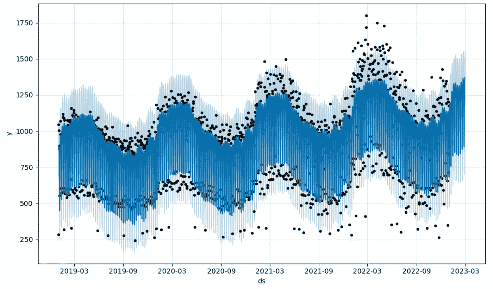

# 用 Facebook 的 Prophet 进行时间序列预测——第一部分

> 原文：[`towardsdatascience.com/time-series-forecasting-with-facebooks-prophet-in-10-minutes-958bd1caff3f`](https://towardsdatascience.com/time-series-forecasting-with-facebooks-prophet-in-10-minutes-958bd1caff3f)

## 用 6 行代码构建一个有效模型

[](https://guillaume-weingertner.medium.com/?source=post_page-----958bd1caff3f--------------------------------)[](https://towardsdatascience.com/?source=post_page-----958bd1caff3f--------------------------------) [Guillaume Weingertner](https://guillaume-weingertner.medium.com/?source=post_page-----958bd1caff3f--------------------------------)

·发表于[Towards Data Science](https://towardsdatascience.com/?source=post_page-----958bd1caff3f--------------------------------) ·6 分钟阅读·2023 年 3 月 23 日

--



Prophet 的输出——作者插图

# #1 动机

时间序列预测模型在商业决策过程中带来的附加值是不可否认的。我最近构建了一个模型，其影响如此之大，以至于我想在这里分享这种方法。

在尝试预测目标变量的未来值时，主要有两大类预测模型：

**传统时间序列模型**和**机器学习模型**。


时间序列模型——作者插图

+   使用**单变量时间序列模型**时，基本思路是仅根据目标变量（即我们试图预测的变量）过去数据的趋势和季节性来预测未来值，而不考虑其他因素。多变量模型是其扩展，输入可以是多个时间序列。

+   使用**（监督）机器学习模型**时，基本思路是利用其他解释变量，并建模它们与目标变量之间的关系来进行预测。

在这篇文章中，你猜对了，我们将重点关注传统方法，并尝试回答一个简单的问题：**我们能否快速利用时间序列的过去值来预测未来值？** 这个问题出现在许多领域：股市动向、公司销售、二氧化碳排放等等。

实际上，为了回答业务问题，你往往不是在寻找一种能够赢得机器学习挑战的最佳模型，而只是寻求一个足够好的估计，以便做出基于数据的决策。

这就是**Facebook 的 Prophet**的作用。它是一个现成的算法，易于设置，并且几乎不费力气就能获得不错的结果。

让我们看看如何开箱即用，并在几分钟内获得结果。

# #2 商业问题

对于这个快速教程，我们将使用一个生成的数据集，代表一个虚构公司的销售——ABC 公司（你可以大致看出，原创性不是我的强项）。

*简单声明：此数据集是虚构的，仅用于通过一个适合时间序列预测的示例来说明 Prophet 的使用。*

首先，让我们导入必要的库来加载和绘制数据。

```py
import pandas as pd
import datetime
import matplotlib.pyplot as plt
from matplotlib.ticker import MaxNLocator
from matplotlib.dates import MonthLocator, YearLocator, DateFormatter

df = pd.read_csv('sales_data.csv')
df['date'] = pd.to_datetime(df['date'])
df.head()
```

这就是我们的数据框的样子：虚构的 ABC 公司的每日销售数据：


虚构的数据集——图片由作者提供。

我们可以绘制它以突出显示两个感兴趣的点：

+   明显的年度上升趋势——销售额随着时间的推移在增长。

+   一年中的季节性——公司在上半年销售比下半年更多。


ABC 公司在时间上的销售——图片由作者提供

现在，这整个小操作的目标是对未来的销售进行预测——从 2023 年 1 月开始。

因为我们使用的是*Prophet*，一个单变量时间序列模型，我们只使用过去的销售数据（季节性和趋势）来预测未来的销售数据。

请注意，你可以将额外的时间序列作为模型的输入，实际上使*Prophet*成为一个多变量模型。

让我们看看这如何工作。

# #3 设置模型

如果你之前从未使用过*Prophet*，你需要使用 pip 或 conda 安装它并导入：

```py
#pip install prophet
#OR
#conda install -c conda-forge prophet

from prophet import Prophet
```

现在，让我们实际建立模型并进行预测。

如果你之前玩过机器学习模型，那么接下来的步骤应该很熟悉：

+   将列重命名为‘ds’和‘y’。这对*Prophet*的工作至关重要。

+   创建一个*Prophet*实例，并在过去的数据上训练/拟合模型。

+   使用模型对未来数据进行预测。

```py
# Rename the columns
df.columns = ['ds', 'y']

# Creating an instance of the Prophet class and training the model
m = Prophet() #instantiating a new Prophet object
model = m.fit(df) #build the model with the historical data

future = model.make_future_dataframe(periods=60, freq='D') #build the dataframe containing the predictions (and the historical data with the model fit)
forecast = model.predict(future) #The forecast object here is a new dataframe that includes a column yhat with the forecast

forecast[['ds', 'trend', 'weekly', 'yearly', 'yhat']].tail()
```

这就是预测的样子：


这是第一个开箱即用的 Prophet 模型的结果——yhat 是预测——图片由作者提供。

Facebook 的*Prophet*是一个*加性回归模型*，最终预测（yhat）是所有分量（趋势和季节性）分别建模的总和。

***yhat(t) = g(t) + s(t) + h(t) + e(t)***，其中

+   *g(t)* = 随时间的增长（趋势）

+   *s(t)* = 季节性（每周、每年等）

+   *h(t)* = 假期（在我们的用例中尚未建模）

+   *e(t)* = 白噪声误差项（在我们的用例中尚未出现）

**总共用了 6 行代码**来建立一个初步的工作模型。

有两个图表值得关注，以便更清楚地了解结果：

第一个图是实际的预测随时间变化的图：

```py
plot1 = model.plot(forecast, uncertainty=True)
```


Prophet 的输出——图片由作者提供

你可以大致看出这个图表上有 3 种不同的元素：

1.  黑点代表我们实际的过去数据点。

1.  蓝线是通过数据点拟合的模型，并将其外推到未来（在图表的最后 60 天）

1.  浅蓝色区域是不确定性区间

第二个有趣的图表是模型组件的分解。这展示了我们刚刚提到的趋势和季节性模型。

```py
plot2 = model.plot_components(forecast)
```


Prophet 的组件 — 作者提供的图片

目前，在这个非常基础的模型中，我们只有 3 个组件：

+   **趋势**随着时间的推移而增长

+   **每周季节性**显示周末销售较少

+   **年度季节性**清晰地展示了两个销售量不同的时期

我们将在*第二部分*中看到，我们可以添加更多特征来提高模型的性能。

**请注意，预测本质上是不确定的，但构建此模型有助于识别趋势或规划潜在情景，这无疑在决策过程中提供了附加价值。**

# #4 下一步是什么？

当然，这还不是一个令人满意的结果（还），因为预测的质量未知，仅仅基于这个基础的“黑箱”模型所输出的结果很难做出任何决策。

然而，这是一个很好的起点。接下来的步骤将包括：

+   评估模型的性能

+   理解黑箱和相关的超参数

+   微调模型的超参数以提高其性能

**敬请期待第二部分！**

# **有用的资源**

[1] 官方 Prophet 文档：[`facebook.github.io/prophet/`](https://facebook.github.io/prophet/)

[2] Joos Korstanje 的《用 Python 进行高级预测：包括 LSTMs、Facebook Prophet 和 Amazon DeepAR 的最新模型》

[3] Aileen Nielsen 的《实用时间序列分析：使用统计和机器学习进行预测》

[4] 一个有用的网站，解释时间序列预测并快速了解 Prophet 的方程：[`otexts.com/fpp3/prophet.html`](https://otexts.com/fpp3/prophet.html)

*感谢你读到文章的最后。*

关注以获取更多内容！

如果你有任何问题或意见，欢迎在下面留言，或通过* [*LinkedIn*](https://www.linkedin.com/in/guillaume-weingertner-a4a27972/) *与我联系！*
