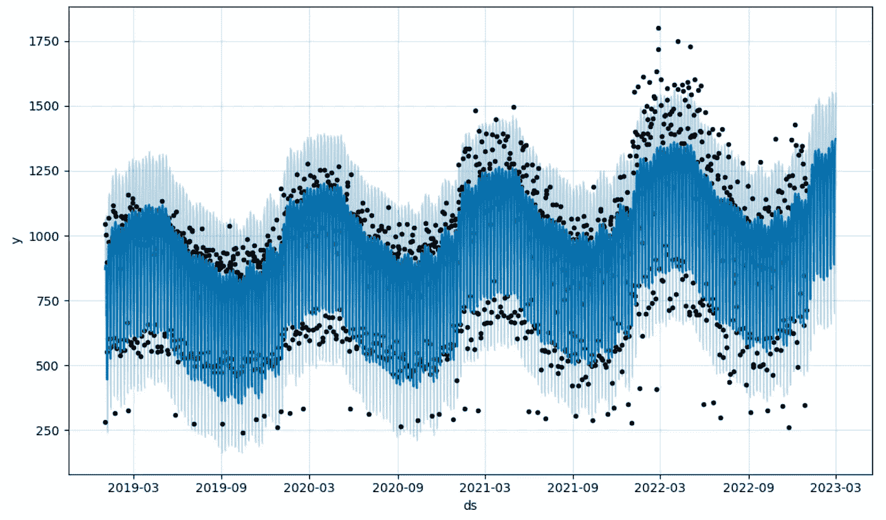

# 使用 Facebook 的 Prophet 进行时间序列预测（10 分钟）——第二部分

> 原文：[`towardsdatascience.com/time-series-forecasting-with-facebooks-prophet-in-10-minutes-part-2-1f558ccc3e83?source=collection_archive---------8-----------------------#2023-04-25`](https://towardsdatascience.com/time-series-forecasting-with-facebooks-prophet-in-10-minutes-part-2-1f558ccc3e83?source=collection_archive---------8-----------------------#2023-04-25)

## 模型性能和超参数微调

 [Guillaume Weingertner](https://guillaume-weingertner.medium.com/?source=post_page-----1f558ccc3e83--------------------------------)

·

[关注](https://medium.com/m/signin?actionUrl=https%3A%2F%2Fmedium.com%2F_%2Fsubscribe%2Fuser%2F4ebea49e580e&operation=register&redirect=https%3A%2F%2Ftowardsdatascience.com%2Ftime-series-forecasting-with-facebooks-prophet-in-10-minutes-part-2-1f558ccc3e83&user=Guillaume+Weingertner&userId=4ebea49e580e&source=post_page-4ebea49e580e----1f558ccc3e83---------------------post_header-----------) 发表在 [Towards Data Science](https://towardsdatascience.com/?source=post_page-----1f558ccc3e83--------------------------------) ·9 分钟阅读·2023 年 4 月 25 日

--

Prophet 的输出——作者提供的图片

# #1 上一集…

在第一部分，我们展示了如何快速建立第一个可运行的模型——仅需 6 行代码。请见下方链接：

 ## 使用 Facebook 的 Prophet 进行时间序列预测（10 分钟）——第一部分

### 使用 6 行代码构建一个可运行的模型

[towardsdatascience.com

但我们真的能相信这个模型的输出吗？

如果是这样，它的表现如何？我们能否使它更好？

让我们看看如何评估模型的性能，添加假期/特殊事件（这些可能是时间序列的重要组成部分），并调整其超参数以使其更准确和可靠。

# #2 训练-测试分割

为了评估我们模型的性能，我们可以等到未来的值发生后，与模型预测的结果进行比较，或者我们可以使用一种非常常见的模型验证方法，即将我们的历史数据分成两个不同的数据集：

+   一个用于拟合模型的**训练集**
