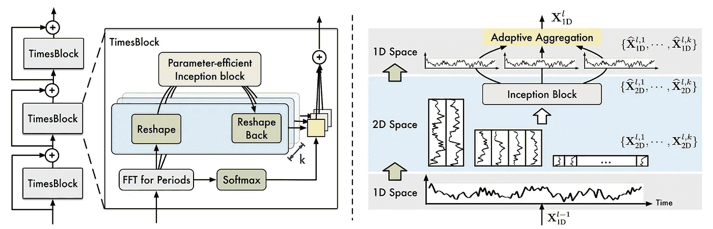
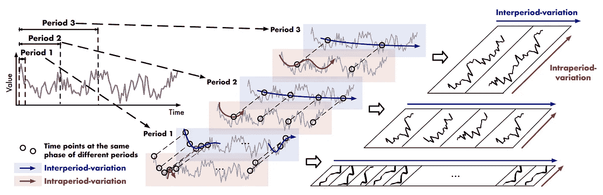
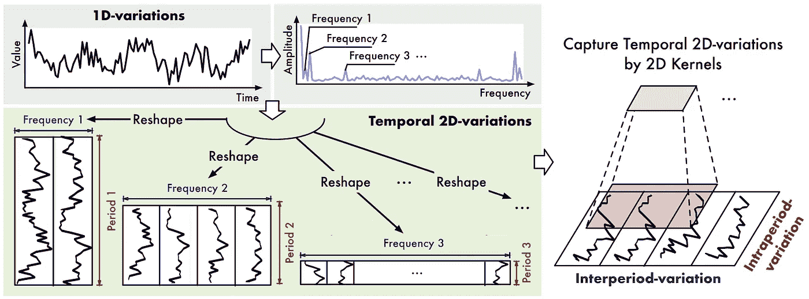
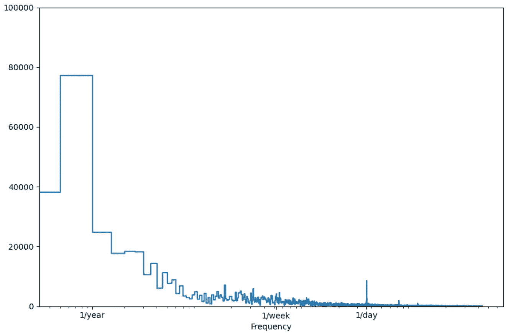
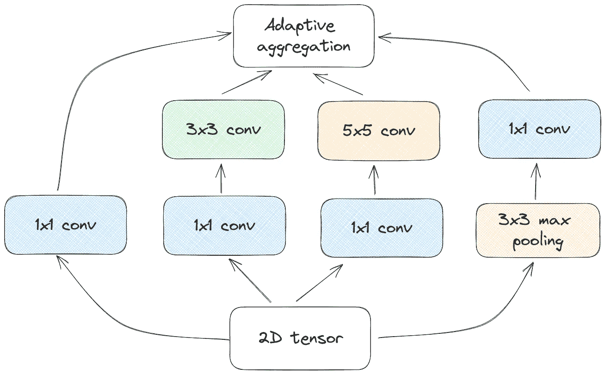
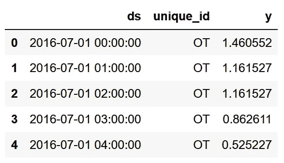
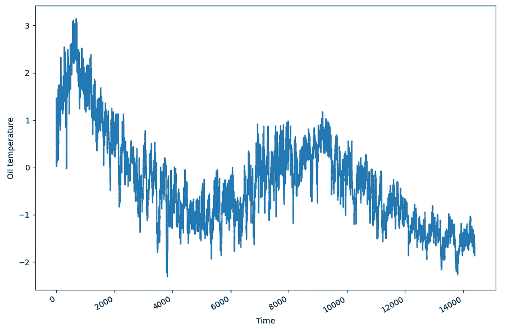
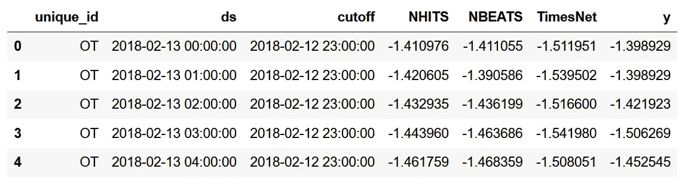
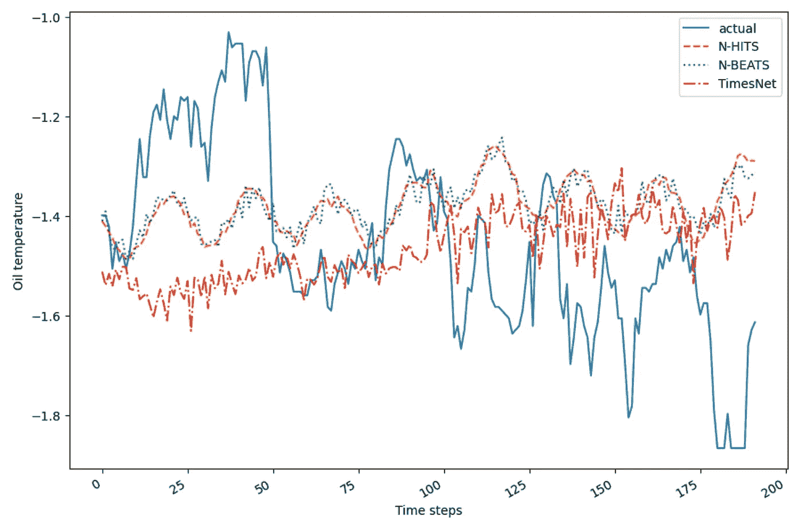
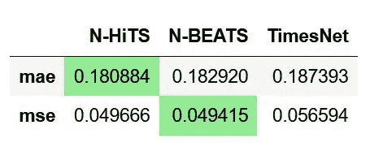

# TimesNet：时间序列预测的最新进展

> 原文：[`towardsdatascience.com/timesnet-the-latest-advance-in-time-series-forecasting-745b69068c9c`](https://towardsdatascience.com/timesnet-the-latest-advance-in-time-series-forecasting-745b69068c9c)

## 了解 TimesNet 架构，并使用 Python 应用于预测任务

[](https://medium.com/@marcopeixeiro?source=post_page-----745b69068c9c--------------------------------)[](https://towardsdatascience.com/?source=post_page-----745b69068c9c--------------------------------) [Marco Peixeiro](https://medium.com/@marcopeixeiro?source=post_page-----745b69068c9c--------------------------------)

·发表于[Towards Data Science](https://towardsdatascience.com/?source=post_page-----745b69068c9c--------------------------------) ·10 分钟阅读·2023 年 10 月 10 日

--


图片由[Rachel Hisko](https://unsplash.com/@rachelhisko?utm_source=medium&utm_medium=referral)提供，来源于[Unsplash](https://unsplash.com/?utm_source=medium&utm_medium=referral)

在之前的文章中，我们探索了最新的最先进预测技术，分别是 2020 年发布的[N-BEATS](https://medium.com/towards-data-science/the-easiest-way-to-forecast-time-series-using-n-beats-d778fcc2ba60)、2022 年的[N-HiTS](https://medium.com/towards-data-science/all-about-n-hits-the-latest-breakthrough-in-time-series-forecasting-a8ddcb27b0d5)以及 2023 年 3 月的[PatchTST](https://medium.com/towards-data-science/patchtst-a-breakthrough-in-time-series-forecasting-e02d48869ccc)。请注意，N-BEATS 和 N-HiTS 依赖于多层感知机架构，而 PatchTST 则利用了 Transformer 架构。

截至 2023 年 4 月，文献中发布了一种新模型，它在时间序列分析的多个任务中实现了最先进的结果，如预测、填补、分类和异常检测：**TimesNet**。

TimesNet 由吴、胡、刘等人在他们的论文中提出：[TimesNet：时间序列分析的时间 2D-变异建模](https://browse.arxiv.org/pdf/2210.02186.pdf)。

与之前的模型不同，它使用基于 CNN 的架构，在不同任务中实现了最先进的结果，使其成为时间序列分析的基础模型的优秀候选者。

在这篇文章中，我们探讨了 TimesNet 的架构和内部工作原理。接着，我们将模型应用于预测任务，并与 N-BEATS 和 N-HiTS 一起完成我们的小实验。

一如既往，更多详细信息请参阅[原始论文](https://browse.arxiv.org/pdf/2210.02186.pdf)。

> **使用我的** [**免费时间序列备忘单**](https://www.datasciencewithmarco.com/pl/2147608294) **在 Python 中学习最新的时间序列分析技术！获取统计和深度学习技术的实现，全部在 Python 和 TensorFlow 中！**

让我们开始吧！

# 探索 TimesNet

TimesNet 的动机来自于意识到许多现实生活中的时间序列展示了*多周期性*。这意味着在不同的周期中会发生变化。

例如，外部温度既有日周期也有年周期。通常，白天比夜晚热，夏天比冬天热。

现在，这些多个周期相互重叠并相互作用，使得单独分离和建模变得困难。

因此，TimesNet 的作者建议将序列重塑为二维空间，以建模*周期内变化*和*周期间变化*。

回到我们的天气示例，周期内变化将是温度在一天内的变化，而周期间变化将是温度从一天到另一日，或从一年到另一年的变化。

牢记这些，让我们深入探讨模型的架构。

## TimesNet 的架构

让我们看看 TimesNet 的架构。



TimesNet 的架构。图像由 Haixu Wu, Tengge Hu, Yong Liu, Hang Zhou, Jianmin Wang 和 Mingsheng Long 提供，来自[TimesNet: Temporal 2D-Variation Modeling For General Time Series Analysis](https://browse.arxiv.org/pdf/2210.02186.pdf)

从上面的图中，我们可以看到 TimesNet 是由多个*TimesBlock*堆叠而成，并具有残差连接。

在每个 TimesBlock 中，我们可以看到序列首先经过快速傅里叶变换（FTT）以找到数据中的不同周期。然后，将其重塑为二维向量并发送到 Inception 块，在那里它学习和预测序列的二维表示。然后，这种深度表示必须通过*自适应聚合*重新变形回一维向量。

这里有很多内容需要了解，所以让我们更详细地介绍每个步骤。

## 捕捉多周期性

为了捕捉时间序列中多个周期的变化，作者建议将一维序列转换为二维空间，以同时建模周期内变化和周期间变化。



TimesNet 的架构。图像由 Haixu Wu, Tengge Hu, Yong Liu, Hang Zhou, Jianmin Wang 和 Mingsheng Long 提供，来自[TimesNet: Temporal 2D-Variation Modeling For General Time Series Analysis](https://browse.arxiv.org/pdf/2210.02186.pdf)

在上面的图中，我们可以看到模型如何在二维空间中表示变化。在红色矩形内，我们可以看到周期内变化，即数据在一个周期内的变化。然后，蓝色矩形包含周期间变化，即数据从一个周期到另一个周期的变化。

为了更好地理解这一点，假设我们有带有周周期的日数据。周期间变化指的是数据从周一到周二，再到周三等的变化情况。

然后，周期间变化指的是数据如何从第 1 周的周一变化到第 2 周的周一，从第 1 周的周二变化到第 2 周的周二。换句话说，它是同一*相位*在不同周期中的数据变化。

这些变化随后被表示在 2D 空间中，其中周期间变化是垂直的，而周期内变化是水平的。这使得模型能够更好地学习数据变化的表示。

虽然一维向量显示相邻点之间的变化，但这种 2D 表示法显示了相邻点和相邻周期之间的变化，提供了更完整的情况。

然而，仍有一个问题：我们如何找到序列中的周期？

## 确定数据中的显著周期

为了识别时间序列中的多个周期，模型应用了快速傅里叶变换（FTT）。

这是一种数学操作，将信号转换为频率和幅度的函数。



模型如何应用 FTT 以找到时间序列中的前*k*个显著周期。图片由 Haixu Wu, Tengge Hu, Yong Liu, Hang Zhou, Jianmin Wang 和 Mingsheng Long 提供，来自[TimesNet: Temporal 2D-Variation Modeling For General Time Series Analysis](https://browse.arxiv.org/pdf/2210.02186.pdf)

上图中，作者展示了 FTT 的应用方式。一旦我们得到了每个周期的频率和幅度，幅度最大的周期被认为是最相关的。

例如，这是对[Etth1 数据集](https://github.com/zhouhaoyi/ETDataset/blob/main/ETT-small/ETTh1.csv)应用 FTT 的结果。



对 Etth1 数据集应用 FTT 的结果。我们可以看到，日周期和年周期是最显著的。图片由作者提供。

上图中的快速傅里叶变换使我们能够快速识别数据中的日周期和年周期，因为我们在这些周期上看到更高的幅度峰值。

一旦应用 FTT，用户可以设置参数*k*以选择前-*k*个最重要的周期，这些周期是幅度最大的。

TimesNet 随后为每个周期创建 2D 向量，并将其发送到 2D 卷积核，以捕捉时间变化。

## 在 TimesBlock 内部

一旦序列经过傅里叶变换，并为前-*k*周期创建了 2D 张量，数据将被发送到下图所示的 Inception 模块。


TimesNet 的架构。图片由 Haixu Wu, Tengge Hu, Yong Liu, Hang Zhou, Jianmin Wang 和 Mingsheng Long 提供，来自[TimesNet: Temporal 2D-Variation Modeling For General Time Series Analysis](https://browse.arxiv.org/pdf/2210.02186.pdf)

当然，请注意我们探索的所有步骤都是在 TimesBlock 内部进行的。

现在，数据的 2D 表示被送入**Inception**块。

Inception 模块是计算机视觉模型[GoogLeNet](https://openaccess.thecvf.com/content_cvpr_2015/papers/Szegedy_Going_Deeper_With_2015_CVPR_paper.pdf)的构建块，该模型于 2015 年发布。

Inception 模块的主要思想是通过保持数据稀疏来实现高效表示。这样，我们可以在技术上增加神经网络的大小，同时保持计算效率。

这是通过执行各种卷积和池化操作实现的，然后将所有内容连接在一起。在 TimesNet 的背景下，这就是 Inception 模块的样子。



TimesNet 中的 Inception 模块。图像由作者提供。

你可能会想知道为什么作者选择了一个视觉模型来处理时间序列数据。

对这个问题的简单回答是视觉模型在解析 2D 数据（如图像）方面特别擅长。

另一个好处是可以在 TimesNet 内部更换视觉骨干。虽然作者使用了 Inception 块，但可以更换为其他视觉模型骨干，因此 TimesNet 也可以从计算机视觉的进展中受益。

现在，将 Inception 模块从 TimesNet 与 GoogLeNet 中的 Inception 模块区分开来的一个元素是使用了**自适应聚合**。

## 自适应聚合

要进行聚合，必须先将 2D 表示重塑为 1D 向量。

然后，使用自适应聚合，因为不同周期的幅度不同，这表明它们的重要性。

这就是为什么 FTT 的输出也会被送到 softmax 层，以便根据每个周期的相对重要性进行聚合。

聚合数据是单个 TimesBlock 的输出。然后，多个 TimesBlock 通过残差连接堆叠在一起，创建 TimesNet 模型。

现在我们了解了 TimesNet 模型是如何工作的，让我们在预测任务中测试它，并与 N-BEATS 和 N-HITS 进行比较。

# 使用 TimesNet 进行预测

现在，让我们在预测任务中应用 TimesNet 模型，并与 N-BEATS 和 N-HiTS 的表现进行比较。

对于这个小实验，我们使用了[Etth1 数据集](https://github.com/zhouhaoyi/ETDataset)，该数据集在创作共用授权下发布。

这是一个在文献中广泛使用的时间序列预测的流行基准。它跟踪电力变压器的每小时油温，反映了设备的状况。

你可以在[GitHub](https://github.com/marcopeix/time-series-analysis)上访问数据集和代码。

## 导入库并读取数据

我们首先导入所需的库。在这里，我们使用了 Nixtla 提供的[NeuralForecast](https://nixtla.github.io/neuralforecast/)的实现。

```py
import numpy as np
import pandas as pd
import matplotlib.pyplot as plt

from neuralforecast.core import NeuralForecast
from neuralforecast.models import NHITS, NBEATS, TimesNet

from neuralforecast.losses.numpy import mae, mse
```

然后，我们可以读取我们的 CSV 文件。

```py
df = pd.read_csv('data/etth1.csv')

df['ds'] = pd.to_datetime(df['ds'])

df.head()
```



Etth1 数据集的前五行。注意数据集已经具有 neuralforecast 期望的格式。图片由作者提供。

在上图中，请注意数据集已经具有 NeuralForecast 期望的格式。基本上，该包需要三列：

+   一个标记为*ds*的日期列

+   一个标记为*unique_id*的 ID 列来标记你的系列

+   一个标记为*y*的值列

然后，我们可以绘制我们的系列。

```py
fig, ax = plt.subplots()

ax.plot(df['y'])
ax.set_xlabel('Time')
ax.set_ylabel('Oil temperature')

fig.autofmt_xdate()
plt.tight_layout()
```



可视化 Etth1 数据集中的每小时油温。图片由作者提供。

现在，我们可以继续进行预测。

## 预测

对于我们的实验，我们使用 96 小时的预测范围，这是文献中长期预测的常见范围。

我们还保留两个 96 时间步的窗口来评估我们的模型。

首先，我们定义一个要用来进行预测任务的模型列表。再次，我们将使用 N-BEATS、N-HiTS 和 TimesNet。

我们将保持所有模型的默认参数，并将最大训练轮次限制为 50。请注意，默认情况下，TimesNet 将选择数据中最重要的前 5 个周期。

```py
horizon = 96

models = [NHITS(h=horizon,
               input_size=2*horizon,
               max_steps=50),
         NBEATS(h=horizon,
               input_size=2*horizon,
               max_steps=50),
         TimesNet(h=horizon,
                 input_size=2*horizon,
                 max_steps=50)]
```

完成后，我们可以用我们的模型列表和数据的频率（即每小时）来实例化*NeuralForecasts*对象。

```py
nf = NeuralForecast(models=models, freq='H')
```

然后，我们进行交叉验证，以获得预测和数据集的实际值。这样，我们可以评估每个模型的性能。

再次，我们使用两个 96 时间步的窗口进行评估。

```py
preds_df = nf.cross_validation(df=df, step_size=horizon, n_windows=2)
```



预测 DataFrame 的前五行。图片由作者提供。

一旦模型训练完成并进行预测，我们会得到上述*DataFrame*。我们可以看到实际值以及之前指定的每个模型的预测结果。

我们也可以轻松地将预测与实际值进行可视化。

```py
fig, ax = plt.subplots()

ax.plot(preds_df['y'], label='actual')
ax.plot(preds_df['NHITS'], label='N-HITS', ls='--')
ax.plot(preds_df['NBEATS'], label='N-BEATS', ls=':')
ax.plot(preds_df['TimesNet'], label='TimesNet', ls='-.')

ax.legend(loc='best')
ax.set_xlabel('Time steps')
ax.set_ylabel('Oil temperature')

fig.autofmt_xdate()
plt.tight_layout()
```



可视化每个模型在测试集上的预测。这里，所有模型都未能预测到测试集中观察到的下降。图片由作者提供。

在上图中，所有模型似乎都未能预测到测试集中观察到的油温下降。此外，N-BEATS 和 N-HiTS 捕捉到了一些在 TimesNet 的预测中未观察到的周期性模式。

仍然，我们需要通过计算 MSE 和 MAE 来评估模型，以确定哪个模型最好。

## 评估

现在，我们只需计算 MAE 和 MSE，以找出哪个模型表现最佳。

```py
data = {'N-HiTS': [mae(preds_df['NHITS'], preds_df['y']), mse(preds_df['NHITS'], preds_df['y'])],
       'N-BEATS': [mae(preds_df['NBEATS'], preds_df['y']), mse(preds_df['NBEATS'], preds_df['y'])],
       'TimesNet': [mae(preds_df['TimesNet'], preds_df['y']), mse(preds_df['TimesNet'], preds_df['y'])]}

metrics_df = pd.DataFrame(data=data)
metrics_df.index = ['mae', 'mse']

metrics_df.style.highlight_min(color='lightgreen', axis=1)
```



每个模型在 Etth1 数据集上的长期预测任务的性能指标。图片由作者提供。

从上图可以看出，N-HiTS 达到了最低的 MAE，而 N-BEATS 达到了最低的 MSE。

不过，MAE 的差异为 0.002，MSE 的差异为 0.00025。由于 MSE 的差异非常小，特别是考虑到误差是平方的，我认为 N-HiTS 是这个任务的冠军模型。

所以，事实证明 TimesNet 并未达到最佳性能。不过，请记住，我们只是进行了一个简单的实验，没有进行超参数优化，只在一个数据集上，且仅在两个 96 时间步长的窗口上进行。

这真的旨在向你展示如何使用 TimesNet 和 NeuralForecast，以便你可以在解决下一个预测问题时有更多工具可用。

# 结论

TimesNet 是一个基于 CNN 的模型，利用 Inception 模块在许多时间序列分析任务上实现了最先进的性能，如预测、分类、填补和异常检测。

一如既往，每个预测问题都需要独特的方法和特定的模型，因此请确保测试 TimesNet 以及其他模型。

感谢阅读！希望你喜欢它，并学到了新的东西！

想掌握时间序列预测？那就看看我的课程[Python 中的应用时间序列预测](https://www.datasciencewithmarco.com/offers/zTAs2hi6/checkout?coupon_code=ATSFP10)。这是唯一一个通过 16 个指导性动手项目使用 Python 实现统计、深度学习和最先进模型的课程。

干杯 🍻

# 支持我

喜欢我的工作吗？通过[给我买杯咖啡](http://buymeacoffee.com/dswm)来支持我，这是鼓励我的一种简单方式，我也能享受一杯咖啡！如果你愿意的话，只需点击下面的按钮 👇


# 参考文献

Haixu Wu, Tengge Hu, Yong Liu, Hang Zhou, Jianmin Wang 和 Mingsheng Long — [TimesNet：用于一般时间序列分析的时序二维变化建模](https://browse.arxiv.org/pdf/2210.02186.pdf)

Christian Szegedy, Wei Liu, Yangqing Jia, Pierre Sermanet, Scott Reed,

Dragomir Anguelov, Dumitru Erhan, Vincent Vanhoucke, Andrew Rabinovich — [深入卷积网络](https://openaccess.thecvf.com/content_cvpr_2015/papers/Szegedy_Going_Deeper_With_2015_CVPR_paper.pdf)
