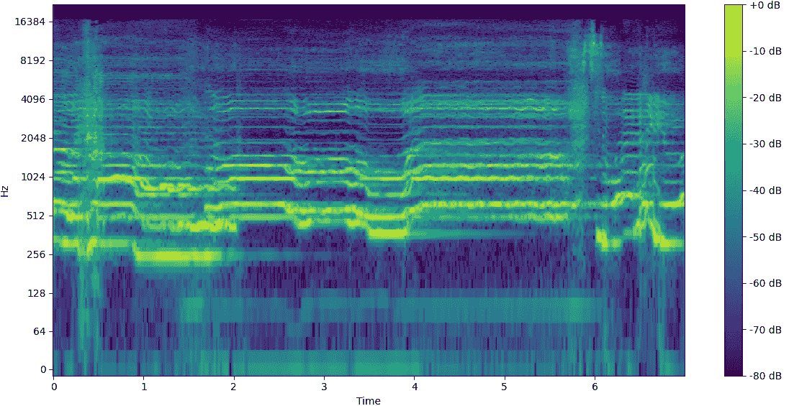

# *Tiny Audio Diffusion：无需云计算的波形扩散*

> 原文：[`towardsdatascience.com/tiny-audio-diffusion-ddc19e90af9b?source=collection_archive---------3-----------------------#2023-06-29`](https://towardsdatascience.com/tiny-audio-diffusion-ddc19e90af9b?source=collection_archive---------3-----------------------#2023-06-29)

由 Stable Diffusion 生成

## 探索如何在消费者级笔记本电脑和 VRAM 小于 2GB 的 GPU 上训练模型并生成声音，通过音频波形扩散实现。

 [Christopher Landschoot](https://medium.com/@crlandschoot?source=post_page-----ddc19e90af9b--------------------------------)

·

[关注](https://medium.com/m/signin?actionUrl=https%3A%2F%2Fmedium.com%2F_%2Fsubscribe%2Fuser%2Fb64548f914a5&operation=register&redirect=https%3A%2F%2Ftowardsdatascience.com%2Ftiny-audio-diffusion-ddc19e90af9b&user=Christopher+Landschoot&userId=b64548f914a5&source=post_page-b64548f914a5----ddc19e90af9b---------------------post_header-----------) 发表在 [Towards Data Science](https://towardsdatascience.com/?source=post_page-----ddc19e90af9b--------------------------------) · 11 分钟阅读 · 2023 年 6 月 29 日 

--

# 背景

扩散模型目前非常流行，特别是自从 [Stable Diffusion](https://stability.ai/blog/stable-diffusion-public-release) 在这个夏天掀起热潮之后。此后，已经发布了无数种扩散模型的变体和新模型，涵盖了各种不同的背景。虽然令人惊叹的视觉效果抢占了风头，但在生成音频方面也有了显著的进展。

在扩散和其他方法的推动下，生成音乐取得了许多最近的胜利，因为新的模型不断发布。OpenAI 在 2020 年发布的[Jukebox](https://openai.com/research/jukebox)让世界惊叹不已。然而，当 Google 在今年年初推出了卓越的[MusicLM](https://google-research.github.io/seanet/musiclm/examples/)时，却让人们惊呼“让我来展示我的模型”。Meta 也紧随其后，上个月发布并开源了[MusicGen](https://ai.honu.io/papers/musicgen/)。但大型机构并不是唯一参与者，独立研究者如[Riffusion](https://www.riffusion.com/)（Forsgren & Martiros）和[Moûsai](https://arxiv.org/abs/2301.11757)（Schneider 等）也做出了非常有趣的贡献。除此之外，过去几年还发布了许多其他模型，每个模型都有其优缺点。

扩散模型由于其非凡的创造力吸引了众多关注；这是许多其他机器学习（ML）领域所缺乏的。大多数 ML 模型被训练来执行特定任务，其成功可以通过正确与错误来衡量。但当我们进入艺术和音乐的领域时，如何优化模型以达到可能被认为是最佳的效果？当然，它可以学习重现著名的艺术作品或音乐，但没有新颖性是没有意义的。那么如何解决这个问题——将创造力注入到只懂得 1 和 0 的机器中呢？扩散是一种为这个难题提供优雅解决方案的方法。

## 扩散 — 从 10,000 英尺的视角

从本质上讲，ML 中的扩散只是从信号中添加或移除噪声的过程（想象一下旧电视的静态噪声）。*正向扩散*向信号添加噪声，而*反向扩散*则移除噪声。我们最熟悉的过程是反向扩散过程，在这个过程中，模型接收噪声，然后将其“去噪”成人类能够识别的东西（艺术、音乐、语音等）。这个过程可以通过多种方式进行操作，以服务于不同的目的。

扩散中的“创造力”来自于启动去噪过程的随机噪声。如果你每次都为模型提供不同的起点，以去噪成某种形式的艺术或音乐，这就模拟了创造力，因为输出结果总是独一无二的。

使用稳定扩散生成的图像

教授模型执行这种去噪过程的方法从最初的想法来看可能有点反直觉。模型实际上通过做完全相反的事情来学习去噪——不断地将噪声添加到干净的信号中，直到只剩下噪声。其思路是，如果模型能够学习如何预测每一步中添加的噪声，那么它也可以预测每一步中去除的噪声以进行反向过程。使这一切成为可能的关键因素是，添加/去除的噪声需要具有定义好的概率分布（通常是高斯分布），以便去噪/去噪步骤是可预测和可重复的。

这个过程涉及的细节远不止这些，但这应该能提供一个关于背后发生了什么的合理概念。如果你有兴趣了解更多关于扩散模型（数学公式、调度、潜在空间等）的内容，我建议阅读[AssemblyAI 的这篇博客文章](https://www.assemblyai.com/blog/diffusion-models-for-machine-learning-introduction/)以及这些论文（[DDPM](https://arxiv.org/abs/2006.11239)，[Improving DDPM](https://arxiv.org/abs/2102.09672)，[DDIM](https://arxiv.org/abs/2010.02502)，[Stable Diffusion](https://arxiv.org/abs/2112.10752)）。

# 微小音频扩散

## 理解音频以进行机器学习

我对扩散的兴趣源于它在生成音频方面展示的潜力。传统上，为了训练机器学习算法，音频会被转换成频谱图，这基本上是声音能量随时间变化的热图。这是因为频谱图表示与图像相似，计算机在处理图像方面表现出色，而且与原始波形相比，数据大小大大减少。

声乐的示例频谱图

然而，这种转换带来了一些权衡，包括分辨率的降低和*相位*信息的丧失。音频信号的相位表示多个波形彼此之间的位置。这可以通过正弦函数和余弦函数之间的差异来展示。它们在幅度上表示完全相同的信号，唯一的区别是两者之间有一个 90°（π/2 弧度）的相位偏移。有关相位的更深入解释，请查看这个[视频](https://www.youtube.com/watch?v=0XdJTipTnjM&t=318s)由[Akash Murthy](https://www.youtube.com/@akashmurthy)提供。

*sin*与 cos 之间的 90°相位偏移

相位是一个始终具有挑战性的概念，即使对于从事音频工作的人也是如此，但它在创造声音的音色特质中发挥着关键作用。可以说，它不应该被如此轻易地丢弃。相位信息也可以像幅度一样在频谱图中表示（变换的复杂部分）。然而，结果是噪声较多，视觉上显得随机，使得模型很难从中学习到有用的信息。由于这一缺陷，最近有兴趣避免将音频转换为频谱图，而是将其保留为原始波形以训练模型。虽然这带来了自己的一系列挑战，但波形信号中包含了幅度和相位信息，为模型提供了一个更全面的声音学习视角。

主唱的波形示例

这是我对波形扩散兴趣的一个关键点，它在生成音频方面显示出了良好的前景。然而，波形是非常密集的信号，需要大量数据来表示人类可以听到的频率范围。例如，音乐行业标准采样率为 44.1kHz，这意味着需要 44,100 个样本来表示 1 秒钟的单声道音频。现在双倍考虑立体声播放。因此，大多数波形扩散模型（那些不利用潜在扩散或其他压缩方法的）需要高性能的 GPU（通常至少需要 16GB+ VRAM）来存储所有信息并进行训练。

## 动机

许多人没有高性能、大容量的 GPU，或者不愿意为个人项目支付租用云 GPU 的费用。发现自己处于这种情况，但仍然希望探索波形扩散模型，我决定开发一个可以在我微不足道的本地硬件上运行的波形扩散系统。

## 硬件设置

我使用的是 2017 年的 HP Spectre 笔记本电脑，配备了第 8 代 i7 处理器和 2GB VRAM 的 GeForce MX150 显卡——这并不算是训练机器学习模型的强大设备。我的目标是能够在这个系统上创建一个能够训练并生成高质量（44.1kHz）立体声输出的模型。

# 模型架构

我利用了 Archinet 的[audio-diffusion-pytorch](https://github.com/archinetai/audio-diffusion-pytorch)库来构建这个模型——感谢[Flavio Schneider](https://github.com/flavioschneider)在处理这个他大部分构建的库时的帮助。

## 注意力 U-Net

基础模型架构由一个带有注意力块的 U-Net 组成，这在现代扩散模型中是标准配置。U-Net 是一个最初为图像（2D）分割开发的神经网络，但已经被改编为用于波形扩散的音频（1D）。U-Net 架构因其 U 形设计而得名。

U-Net（来源：[*U-Net: Convolutional Networks for Biomedical Image Segmentation (Ronneberger, et. al)*](https://arxiv.org/abs/1505.04597v1)）*

与自编码器非常相似，U-Net 由编码器和解码器组成，还包含每一层的跳跃连接。这些跳跃连接是编码器和解码器对应层之间的直接连接，有助于将细粒度的细节从编码器传递到解码器。编码器负责捕捉输入信号的重要特征，而解码器负责生成新的音频样本。编码器逐渐减少输入音频的分辨率，在不同抽象层次上提取特征。然后解码器利用这些特征进行上采样，逐渐提高分辨率，以生成最终的音频样本。

注意力 U-Net（来源：[注意力 U-Net: 学习如何查看胰腺](https://arxiv.org/abs/1804.03999v3)（[Oktay, et al.](https://arxiv.org/search/cs?searchtype=author&query=Oktay%2C+O)））

这个 U-Net 还在较低层次包含自注意力块，这有助于保持输出的时间一致性。音频需要充分降采样，以维持在扩散过程中的采样效率，同时避免过载注意力块。模型利用了[V-Diffusion](https://arxiv.org/abs/2202.00512)，这是一种受到[DDIM](https://arxiv.org/abs/2010.02502v4)采样启发的扩散技术。

为了避免 GPU VRAM 耗尽，基础模型的训练数据长度需要较短。因此，我决定训练一次性鼓样本，因为它们的上下文长度固有地较短。经过多次迭代，确定基础模型长度为 32,768 个样本 @ 44.1kHz 立体声，相当于约 0.75 秒。这可能看起来特别短，但对于大多数鼓样本来说已经足够了。

## 变换

为了将音频降采样到足够适合注意力模块的程度，尝试了几种预处理变换。希望如果在训练模型之前能够在不丢失重要信息的情况下降采样音频数据，那么可以在不增加 GPU 内存负担的情况下最大化节点（神经元）和层数。

第一个尝试的变换是“补丁”版本。最初是为[图像](https://arxiv.org/abs/2207.04316v1)提出的，这一过程被调整为适用于我们的音频处理。输入音频样本按时间步长分组为块，然后转置为通道。该过程可以在 U-Net 的输出端逆转，将音频块恢复到其完整长度。然而，解块过程产生了别名问题，导致生成的音频中出现了不希望有的高频伪影。

第二种尝试的变换，由[Schneider](https://arxiv.org/abs/2301.13267)提出，被称为“学习变换”，它由单个卷积块组成，具有较大的卷积核尺寸和步幅，位于 U-Net 的开始和结束处。尝试了多种卷积核尺寸和步幅（16、32、64），并配合相应的模型变体来适当地降采样音频。然而，这仍然导致了生成音频中的混叠问题，尽管比打补丁变换少一些。

因此，我决定需要调整模型架构，以适应未经预处理变换的原始音频，从而产生足够质量的输出。

这需要扩展 U-Net 中的层数，以避免过快地降采样并丢失重要特征。在多次迭代后，最佳的架构仅在每层降采样 2 次。虽然这要求每层节点数量减少，但最终产生了最佳的结果。有关 U-Net 的确切层级、层数、节点、注意力特征等的详细信息，可以在 GitHub 上的[tiny-audio-diffusion](https://github.com/crlandsc/tiny-audio-diffusion)库中的[配置文件](https://github.com/crlandsc/tiny-audio-diffusion/blob/main/exp/drum_diffusion.yaml)中找到。

# **结论**

## 预训练模型

我训练了 4 个独立的无条件模型，以生成踢鼓、军鼓、踩镲和打击乐（所有鼓声）。用于训练的数据集是我为音乐制作工作流程收集的小型免费单次样本（均为开源）。更大、更具多样性的数据集将提高每个模型生成输出的质量和多样性。这些模型根据每个数据集的大小进行了不同数量的步骤和周期训练。

预训练模型可以在[Hugging Face](https://huggingface.co/crlandsc)上下载。请查看在[Weights & Biases](https://wandb.ai/crlandsc/unconditional-drum-diffusion?workspace=user-crlandsc)上记录的训练进度和输出样本。

## 结果

总体而言，尽管模型的规模较小，但输出质量仍然很高。然而，仍然存在一些轻微的高频“嘶嘶声”，这可能是由于模型的规模有限。这可以从下面波形中残留的少量噪音中看到。大多数生成的样本都很清晰，保持了瞬态和宽带音色特征。有时模型在样本的末尾添加额外的噪音，这可能是模型层数和节点数量限制的代价。

可以[在这里](https://github.com/crlandsc/tiny-audio-diffusion/tree/main/samples)收听来自模型的一些输出样本。每个模型的示例输出如下。

## 讨论

除了在本地硬件上探索波形扩散模型外，这个项目的重要目标之一是能够将这一机会分享给其他人。我希望为那些资源有限但希望尝试音频波形扩散的人提供一个简单的入口。因此，我将项目库结构化，提供了如何训练或微调自己的模型以及如何从[Inference.ipynb](https://github.com/crlandsc/tiny-audio-diffusion/blob/main/Inference.ipynb)笔记本生成新样本的逐步说明。

此外，我录制了一个[Tutorial Video](https://youtu.be/m6Eh2srtTro)，展示了如何设置 Anaconda 环境，并演示了使用预训练模型生成独特样本的方法。

这是生成音频特别是扩散领域的激动人心的时刻。我在构建这个项目的过程中学到了很多，也进一步扩展了我对音频 AI 未来的乐观态度。我希望这个项目能对那些想探索音频 AI 世界的人有所帮助。

*所有图片，除非另有说明，均由作者提供。*

**tiny-audio-diffusion 代码可以在这里找到：** [**https://github.com/crlandsc/tiny-audio-diffusion**](https://github.com/crlandsc/tiny-audio-diffusion)

设置环境以使用 tiny-audio-diffusion 生成样本的教程视频：[`youtu.be/m6Eh2srtTro`](https://youtu.be/m6Eh2srtTro)

我是一名专注于 AI/ML 和空间音频的音频科学家，同时也是一名终身音乐家。如果你对更多音频 AI 应用感兴趣，请参阅我最近的文章：[音乐去混响](https://medium.com/rock-nheavy/the-music-demixing-ai-revolution-9d1528c6ef7c)。

在[LinkedIn](https://www.linkedin.com/in/christopher-landschoot/)和[GitHub](https://github.com/crlandsc)上找到我，并通过这里的[www.chrislandschoot.com](https://www.chrislandschoot.com/)跟进我当前的工作和研究。

在[Spotify](https://open.spotify.com/artist/2i6noWJnJQPXPsudoiJuMS?si=fvLOxUPqTAWKB894WXMz5Q)、[Apple Music](https://music.apple.com/us/artist/after-august/259370281)、[YouTube](https://www.youtube.com/AfterAugust)、[SoundCloud](https://soundcloud.com/after-august)以及其他流媒体平台上以[After August](https://www.instagram.com/the_after_august/)的名字找到我的音乐。
