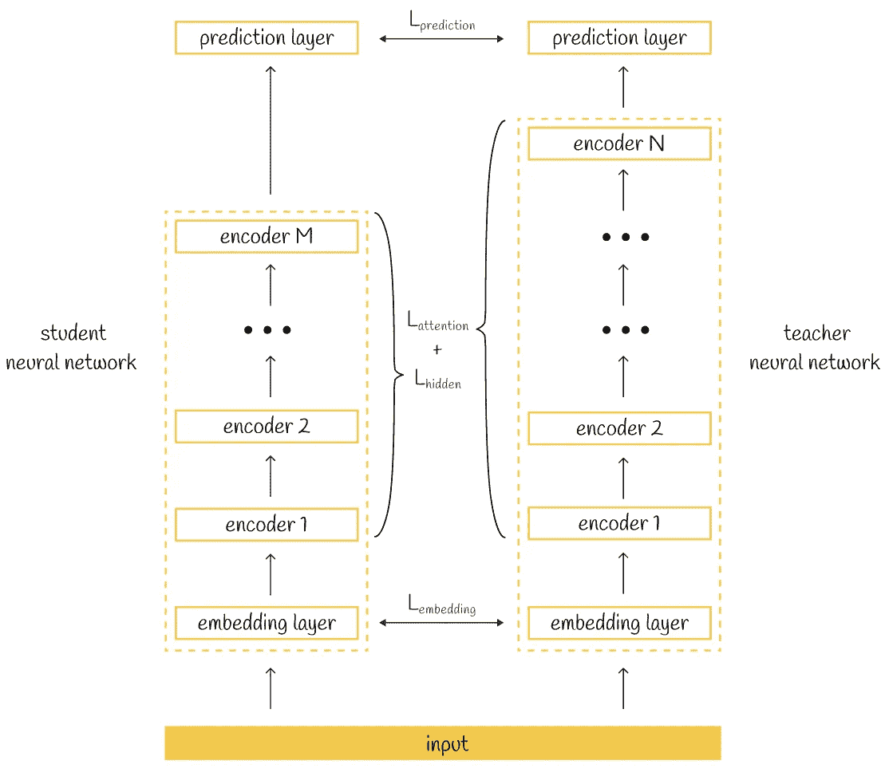
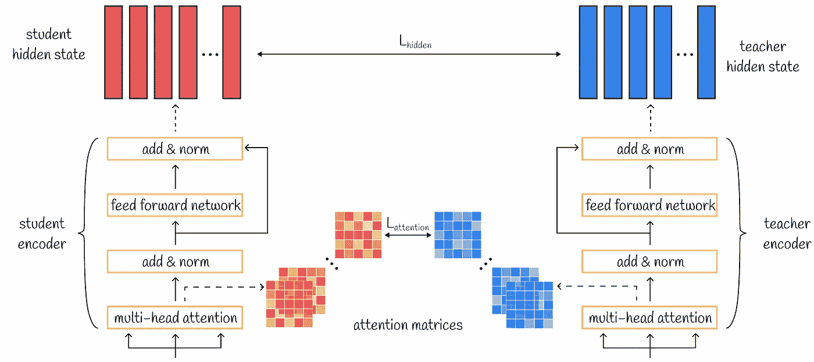
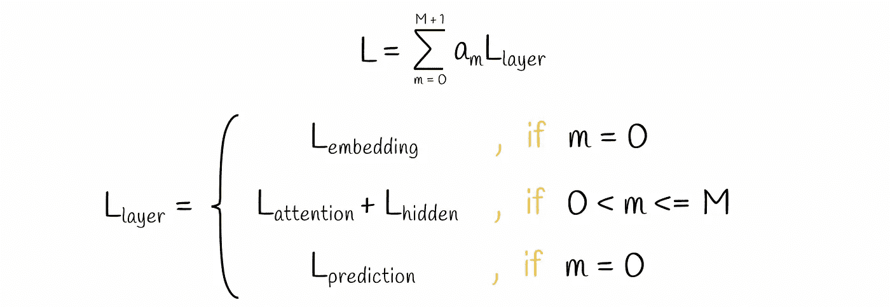
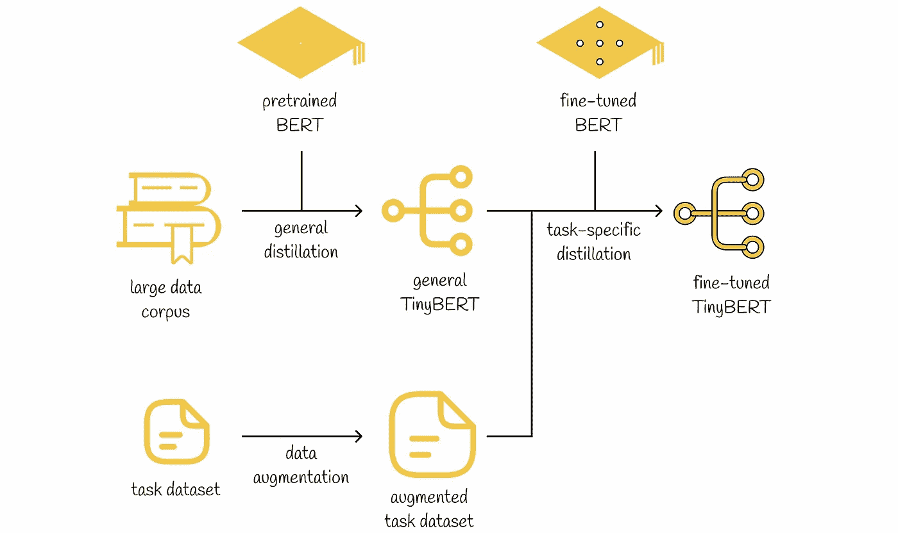
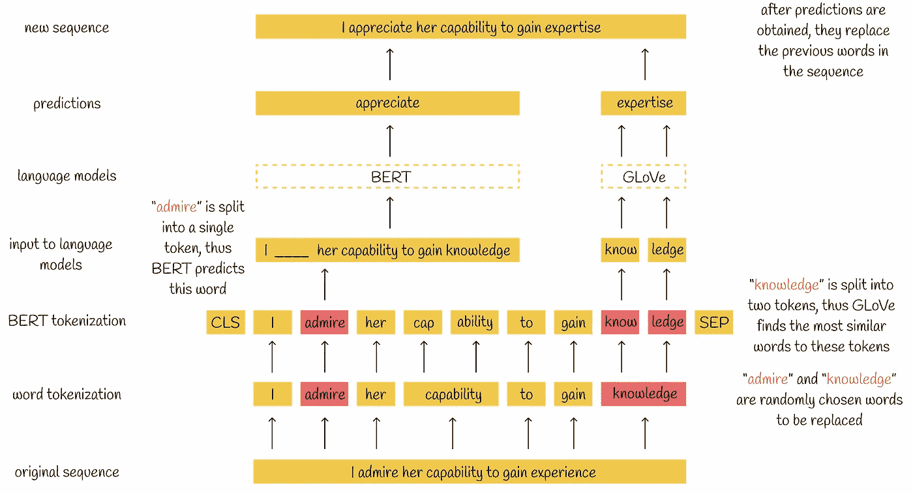
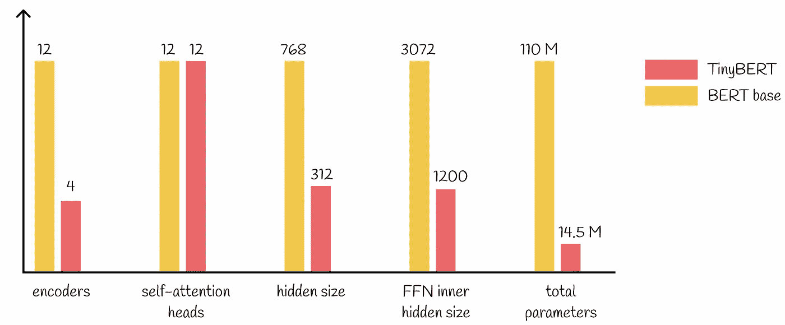
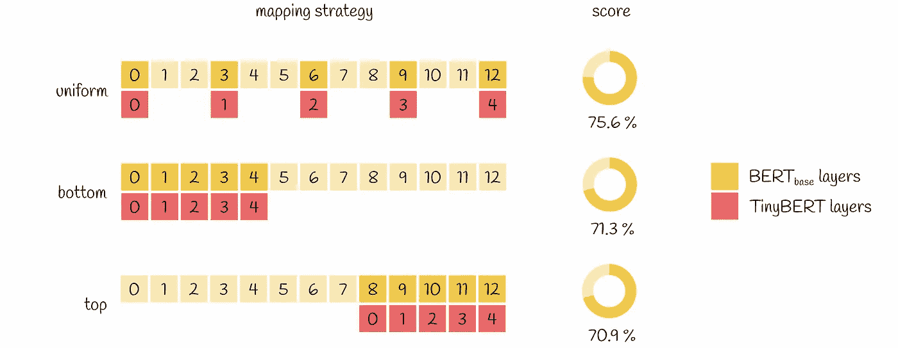

# 大型语言模型：TinyBERT — 为 NLP 蒸馏 BERT

> 原文：[`towardsdatascience.com/tinybert-1a928ba3082b?source=collection_archive---------1-----------------------#2023-10-21`](https://towardsdatascience.com/tinybert-1a928ba3082b?source=collection_archive---------1-----------------------#2023-10-21)

## 解锁在 LLMs 中变换器蒸馏的力量

 [Vyacheslav Efimov](https://medium.com/@slavahead?source=post_page-----1a928ba3082b--------------------------------)

·

[关注](https://medium.com/m/signin?actionUrl=https%3A%2F%2Fmedium.com%2F_%2Fsubscribe%2Fuser%2Fc8a0ca9d85d8&operation=register&redirect=https%3A%2F%2Ftowardsdatascience.com%2Ftinybert-1a928ba3082b&user=Vyacheslav+Efimov&userId=c8a0ca9d85d8&source=post_page-c8a0ca9d85d8----1a928ba3082b---------------------post_header-----------) 发布于 [Towards Data Science](https://towardsdatascience.com/?source=post_page-----1a928ba3082b--------------------------------) ·8 分钟阅读·2023 年 10 月 21 日

--

# 介绍

最近几年，大型语言模型的演变迅速发展。BERT 成为最受欢迎且高效的模型之一，能够以高准确率解决广泛的 NLP 任务。BERT 之后，许多其他模型也相继出现，展示了同样出色的结果。

一个显而易见的趋势是，**随着时间的推移，大型语言模型（LLMs）倾向于通过指数级增加其参数和训练数据的数量而变得更加复杂**。深度学习研究表明，这种技术通常会带来更好的结果。不幸的是，机器学习领域已经遇到了一些关于 LLMs 的问题，而可扩展性已成为有效训练、存储和使用它们的主要障碍。

针对这个问题，专门制定了压缩 LLM 的方法。在本文中，我们将重点讨论 **Transformer 提炼**，这导致了一个名为 TinyBERT 的小型 BERT 版本的开发。此外，我们将了解 TinyBERT 的学习过程以及使 TinyBERT 如此强大的若干细节。本文基于官方的 [TinyBERT 论文](https://arxiv.org/pdf/1909.10351.pdf)。

# 主要观点

最近，我们已经讨论了 DistilBERT 中提炼的工作原理：简而言之，损失函数目标经过修改，以使学生和教师的预测相似。在 DistilBERT 中，损失函数比较了学生和教师的输出分布，并且还考虑了两个模型的输出嵌入（用于相似性损失）。

## 大型语言模型：DistilBERT — 更小、更快、更便宜、更轻量

### 解锁 BERT 压缩的秘密：最大效率的师生框架

[towardsdatascience.com

从表面上看，TinyBERT 中的提炼框架与 DistilBERT 没有太大变化：损失函数再次被修改，以使学生模仿教师。然而，在 TinyBERT 的情况下，它更进一步：**损失函数不仅考虑了两个模型产生了什么，还考虑了预测是如何获得的**。根据论文，TinyBERT 的损失函数由三个组成部分构成，涵盖了两个模型的不同方面：

1.  嵌入层的输出

1.  从 Transformer 层衍生的隐藏状态和注意力矩阵

3\. 预测层输出的 logits

Transformer 提炼损失

> **比较两个模型的隐藏状态有什么意义？** 包括隐藏状态和注意力的输出矩阵，使学生能够学习教师的隐藏层，从而构建类似于教师的层。这样，提炼出的模型不仅模仿原始模型的输出，还模仿其内部行为。
> 
> **为什么复制教师的行为很重要？** 研究人员声称，BERT 学到的注意力权重对于捕捉语言结构是有益的。因此，将其提炼到另一个模型中也为学生提供了更多获得语言知识的机会。

# 层映射

作为较小的 BERT 版本，TinyBERT 拥有更少的编码器层。我们定义 BERT 层的数量为 N，TinyBERT 的数量为 M。鉴于层数不同，计算提炼损失的方式并不明显。

为此，引入了一个特殊函数 *n = g(m)* 来定义哪个 BERT 层 n 用于将其知识蒸馏到 TinyBERT 的对应层 m。然后，选定的 BERT 层用于训练过程中的损失计算。

引入的函数 *n = g(m)* 有两个推理约束：

+   ***g(0) = 0***。这意味着 BERT 中的嵌入层直接映射到 TinyBERT 中的嵌入层，这是有意义的。

+   ***g(M + 1) = N + 1***。该方程表明 BERT 中的预测层映射到 TinyBERT 中的预测层。

对于所有其他 TinyBERT 层 *1 ≤ m ≤ M*，需要映射 *n = g(m)* 的对应函数值。现在，假设这种函数已定义。TinyBERT 的设置将在本文后续部分讨论。

# Transformer 蒸馏

## 1\. 嵌入层蒸馏

在原始输入传递到模型之前，它首先会被分词，然后映射到学习到的嵌入。这些嵌入被用作模型的第一层。所有可能的嵌入可以用矩阵的形式表示。为了比较学生和教师嵌入的差异，可以使用应用于它们各自嵌入矩阵 *E* 的标准回归度量。例如，transformer 蒸馏使用 MSE 作为回归度量。

> 由于学生和教师的嵌入矩阵大小不同，不能通过 MSE 元素级别地比较它们。这就是为什么学生嵌入矩阵要乘以一个可学习的权重矩阵 W，使得结果矩阵与教师嵌入矩阵具有相同的形状。

嵌入层蒸馏损失

> 由于学生和教师的嵌入空间不同，矩阵 W 在将学生的嵌入空间线性转换为教师的嵌入空间中也发挥着重要作用。

## 2\. Transformer 层蒸馏

Transformer 层蒸馏损失可视化

**2A. 注意力层蒸馏**

从本质上讲，Transformer 中的多头注意力机制产生了包含丰富语言知识的多个注意力矩阵。通过从教师那里转移注意力权重，学生也可以理解重要的语言概念。为了实现这个想法，损失函数用于计算学生和教师注意力权重之间的差异。

在 TinyBERT 中，所有注意力层都被考虑，且每层的最终损失值等于所有头部的学生和教师注意力矩阵之间 MSE 值的总和。

注意力层蒸馏损失

> 用于注意力层蒸馏的注意力矩阵 A 是未经归一化的，而不是它们的 softmax 输出 softmax(A)。根据研究人员的说法，这种细微差别导致了更快的收敛和更好的性能。

**2B. 隐藏层蒸馏**

遵循捕捉丰富语言知识的思想，蒸馏也应用于变换器层的输出。

隐藏层蒸馏损失

权重矩阵 W 扮演着与嵌入层蒸馏中描述的相同角色。

## 3\. 预测层蒸馏

最后，为了使学生能够再现教师的输出，考虑预测层损失。它包括计算两个模型预测的 logits 向量之间的交叉熵。

预测层蒸馏损失

有时，logits 被温度参数 T 除以，T 控制输出分布的平滑度。在 TinyBERT 中，温度 T 设置为 1。

## 损失方程

在 TinyBERT 中，根据其类型，每一层都有自己的损失函数。为了赋予某些层更多或更少的重要性，相应的损失值会乘以一个常数 *a*。最终损失函数等于所有 TinyBERT 层损失值的加权总和。

TinyBERT 中的损失函数

> 在众多实验中，结果显示，三种损失组件中，变换器层蒸馏损失对模型性能的影响最大。

# 训练

重要的是要注意，大多数 NLP 模型（包括 BERT）都是分两个阶段开发的：

1.  模型在大规模数据集上**预训练**以获得语言结构的一般知识。

1.  模型在另一个数据集上**微调**以解决特定的下游任务。

按照相同的范式，研究人员开发了一个框架，其中 TinyBERT 的学习过程也包括两个阶段。**在这两个训练阶段中，Transformer 蒸馏用于将 BERT 知识转移到 TinyBERT 上。**

1.  **通用蒸馏**。TinyBERT 从预训练的 BERT（未微调）中获得丰富的一般语言结构知识，BERT 充当教师。通过使用较少的层和参数，经过此阶段后，TinyBERT 的表现通常不如 BERT。

1.  **任务特定蒸馏**。这一次，经过微调的 BERT 充当教师角色。为了进一步提升性能，研究人员提出在训练数据集上应用数据增强方法。结果显示，在任务特定蒸馏后，TinyBERT 在性能上达到了与 BERT 相当的水平。

训练过程

## 数据增强

为任务特定蒸馏制定了一种特殊的数据增强技术。该技术包括从给定数据集中提取序列，并用两种方式之一替换一定比例的词：

+   如果词被标记化为相同的词，那么这个词将由 BERT 模型预测，预测的词将替换序列中的原始词。

+   如果单词被分割成几个子词，则这些子词将被替换为最相似的 GloVe 嵌入。

尽管模型大小大幅减少，但所描述的数据增强机制对 TinyBERT 的性能产生了很大影响，使其能够学习更多样化的例子。

增强示例

# 模型设置

**TinyBERT 仅有 14.5M 参数，约为 BERT base 的 7.5 倍更小**。其详细比较见下图：

BERT base 与 TinyBERT 比较

对于层映射，作者提出了**一种** **统一策略，根据该策略，层映射函数将每个 TinyBERT 层映射到每个第三个 BERT 层：*g(m) = 3 * m***。也研究了其他策略（如采用所有底层或顶层 BERT 层），但统一策略显示出最佳结果，这似乎是合乎逻辑的，因为它允许从不同的抽象层转移知识，使得转移的信息更加多样化。

不同的层映射策略。性能结果显示在 GLUE 数据集上。

说到训练过程，TinyBERT 在英语维基百科（2500M 词）上进行训练，并且大多数超参数与 BERT base 相同。

# 结论

Transformer 精简是自然语言处理中的一大步。考虑到基于 Transformer 的模型目前是机器学习中最强大的模型之一，我们可以通过应用 Transformer 精简来进一步珍惜它们。最好的例子之一是 TinyBERT，它是从 BERT base 压缩了 7.5 倍。

尽管参数减少如此之多，实验表明 TinyBERT 的性能与 BERT base 相当：TinyBERT 在 GLUE 基准测试中获得了 77.0% 的分数，与 BERT 的 79.5% 分数相差不远。显然，这是一个惊人的成就！最后，像量化或剪枝等其他流行的压缩技术也可以应用于 TinyBERT，使其变得更小。

# 资源

+   [TinyBERT: 精简 BERT 用于自然语言理解](https://arxiv.org/pdf/1909.10351.pdf)

*除非另有说明，否则所有图片均由作者提供*
