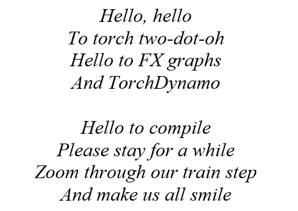
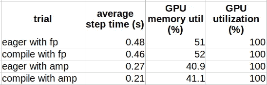
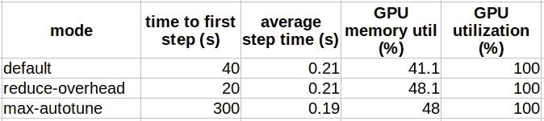
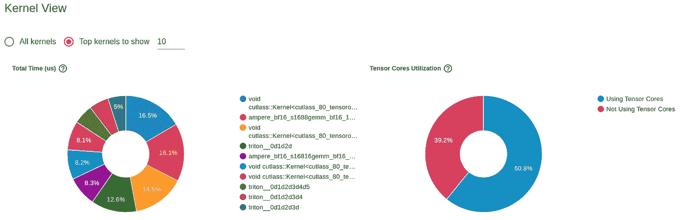

# 升级到 PyTorch 2.0 的技巧和窍门

> 原文：[`towardsdatascience.com/tips-and-tricks-for-upgrading-to-pytorch-2-3127db1d1f3d?source=collection_archive---------3-----------------------#2023-05-21`](https://towardsdatascience.com/tips-and-tricks-for-upgrading-to-pytorch-2-3127db1d1f3d?source=collection_archive---------3-----------------------#2023-05-21)

## 迁移到全新 “*编译模式*” 时需要注意的事项

[](https://chaimrand.medium.com/?source=post_page-----3127db1d1f3d--------------------------------)[](https://towardsdatascience.com/?source=post_page-----3127db1d1f3d--------------------------------) [Chaim Rand](https://chaimrand.medium.com/?source=post_page-----3127db1d1f3d--------------------------------)

·

[关注](https://medium.com/m/signin?actionUrl=https%3A%2F%2Fmedium.com%2F_%2Fsubscribe%2Fuser%2F9440b37e27fe&operation=register&redirect=https%3A%2F%2Ftowardsdatascience.com%2Ftips-and-tricks-for-upgrading-to-pytorch-2-3127db1d1f3d&user=Chaim+Rand&userId=9440b37e27fe&source=post_page-9440b37e27fe----3127db1d1f3d---------------------post_header-----------) 发表在 [Towards Data Science](https://towardsdatascience.com/?source=post_page-----3127db1d1f3d--------------------------------) · 19 分钟阅读 · 2023 年 5 月 21 日 [](https://medium.com/m/signin?actionUrl=https%3A%2F%2Fmedium.com%2F_%2Fvote%2Ftowards-data-science%2F3127db1d1f3d&operation=register&redirect=https%3A%2F%2Ftowardsdatascience.com%2Ftips-and-tricks-for-upgrading-to-pytorch-2-3127db1d1f3d&user=Chaim+Rand&userId=9440b37e27fe&source=-----3127db1d1f3d---------------------clap_footer-----------)

--

[](https://medium.com/m/signin?actionUrl=https%3A%2F%2Fmedium.com%2F_%2Fbookmark%2Fp%2F3127db1d1f3d&operation=register&redirect=https%3A%2F%2Ftowardsdatascience.com%2Ftips-and-tricks-for-upgrading-to-pytorch-2-3127db1d1f3d&source=-----3127db1d1f3d---------------------bookmark_footer-----------)

图片由 [Mohamed Nohassi](https://unsplash.com/@coopery?utm_source=medium&utm_medium=referral) 提供，刊登在 [Unsplash](https://unsplash.com/?utm_source=medium&utm_medium=referral)



作者

任何新的 AI 开发框架、AI 加速器或 AI 计算平台的发布，都可能带来运行时优化和成本降低，从而改善我们的 AI 开发生命周期。最近发布的 PyTorch 2.0 也不例外。PyTorch 2.x 的亮点之一是引入了[torch.compile](https://pytorch.org/tutorials/intermediate/torch_compile_tutorial.html)，据报道，PyTorch 2.x 可以[显著加速](https://pytorch.org/get-started/pytorch-2.0/)训练和推理过程。与我们熟悉的 PyTorch 逐步执行模式不同，在该模式下每个 PyTorch 操作都是“急切地”运行，[compile](https://pytorch.org/docs/stable/generated/torch.compile.html) API 将你的模型转换为中间计算图（FX 图），然后将其编译成适合底层训练加速器的低级计算内核，使用如 *内核融合* 和 *乱序执行* 等技术（有关更多详细信息，请参见[这里](https://pytorch.org/docs/stable/torch.compiler_faq.html#how-are-you-speeding-up-my-code)）。

在这篇文章中，我们将展示这一令人兴奋的新特性及使用过程中可能遇到的一些问题和行为。你可能已经看到一些帖子，突出了使用 torch 编译的便捷性或性能提升效果。或者（像我一样），你可能在过去的两周里一直在与新 API 作斗争，试图让其在你的模型上良好运作。实际上，对于许多公共模型，只需用 torch.compile 调用包裹它们即可（如[这里](https://pytorch.org/docs/stable/generated/torch.compile.html)所报道）。然而，正如我们将看到的那样，有许多因素可能干扰图的编译和/或达成期望的性能改进。调整你的模型和/或成功达到最佳性能可能需要你重新设计项目或修改一些编码习惯。

在开始之前，我们应该提到几件事。我们在这篇文章中的意图是分享一些我们在适应 torch.compile API 过程中遇到的问题示例。这些示例绝非全面。你可能会遇到本文未提及的问题。还要记住，torch.compile 仍在积极开发中。我们所写的内容可能在你阅读时已经不再适用。务必保持最新，关注最新的发布和文档。

在 torch 编译中，存在许多创新技术，包括[TorchDynamo](https://github.com/pytorch/torchdynamo/tree/0b8aaf340dad4777a080ef24bf09623f1aa6f3dd)、[FX Graph](https://pytorch.org/docs/stable/fx.html)、[TorchInductor](https://dev-discuss.pytorch.org/t/torchinductor-a-pytorch-native-compiler-with-define-by-run-ir-and-symbolic-shapes/747)、[Triton](https://github.com/openai/triton)等。虽然我们在此不会深入探讨这些不同的组件，但我们鼓励你从[PyTorch 文档](https://pytorch.org/get-started/pytorch-2.0/#technology-overview)、[2022 年 PyTorch 大会](https://www.youtube.com/watch?v=vbtGZL7IrAw&ab_channel=PyTorch)或这篇有用的 TDS 帖子中了解它们。通常，对幕后发生的事情有一个好的理解可以帮助你弄清楚为什么模型没有编译成功以及如何解决这个问题。

本文绝不应被视为官方 PyTorch 文档的替代品（例如，[这里](https://pytorch.org/get-started/pytorch-2.0/)）。本文也不应被视为对 PyTorch 相对于 TensorFlow（或其他 ML 训练框架）、编译模式相对于急切模式，或任何我们提到的工具、库或平台的认可。我发现所有框架都有其优缺点。我对任何特定框架没有强烈的偏好或热情。我的热情在于解决有趣的技术挑战——挑战越难越好——无论它们存在于何种平台或框架上。你可以说我对框架是中立的。尽管如此，请允许我对 PyTorch 和 TensorFlow 库如何随时间演变进行两个完全无关紧要的观察。可以跳过这些观察，直接回到正题。

## TensorFlow 与 PyTorch 战争的两个完全无关紧要的观察

**观察 1**：在过去，当生活很简单时，PyTorch 和 TensorFlow 之间有明显的区别。PyTorch 使用急切执行模式，TensorFlow 使用图模式，大家都很满意，因为我们都知道自己在争论什么。但后来出现了 TensorFlow 2，它将急切执行作为默认执行模式，TensorFlow 变得有点像 PyTorch。现在，PyTorch 也推出了自己的图编译解决方案，变得有点像 TensorFlow。TensorFlow 与 PyTorch 的战争依然继续，但两者之间的差异正在慢慢消失。请参见[这条推文](https://twitter.com/cHHillee/status/1601371638913638402?lang=en)，其中对 PyTorch 演变的评论我觉得很有趣。

**观察 2**：AI 开发是一项时尚的业务。与时尚行业类似，流行的 AI 模型、模型架构、学习算法、**训练框架**等都会随季节变化而变化。与时尚行业一样，AI 也有自己的出版物和会议，你可以通过这些途径跟上最新的趋势。直到几年前，我们大多数工作的模型都是用 TensorFlow 编写的。而人们对此不满。他们主要的两点抱怨是高层的 model.fit API 限制了他们的开发灵活性，以及图模式使他们无法进行调试。他们说：“我们必须转到 PyTorch”，因为“我们可以按照自己的方式构建模型并轻松调试”。几年的时间过去了，同样的人现在却在说：“我们必须适应 PyTorch Lightning（或其他高层 API），并且必须通过 torch.compile 加速训练”。要明确的是……我不是在评判。我只是想说，也许我们应该更加自我觉察。

# 回到实际内容

本文的其余部分组织成一系列关于如何开始使用 PyTorch 2 编译 API 的技巧以及你可能遇到的一些潜在问题。根据你项目的具体细节，将模型适配到 PyTorch 的图模式可能需要非同小可的努力。我们的希望是这篇文章能帮助你更好地评估这一努力，并决定采取最佳的步骤。

## 安装 PyTorch 2

从 [PyTorch 安装文档](https://pytorch.org/) 来看，安装 PyTorch 2 与安装其他版本的 PyTorch 没有什么不同。实际上，你可能会遇到一些问题。首先，PyTorch 2.0（截至本文撰写时）似乎需要 Python 3.8 或更高版本（见 [这里](https://pytorch.org/blog/pytorch-2.0-release/#deprecation-of-cuda-116-and-python-37-support-for-pytorch-20)）。希望你已经更新到最新的 Python 版本，这不会成为问题，但在不太可能（且不幸）的情况下你没有更新，这可能会成为你升级的另一个动机。此外，PyTorch 2 包含了一些之前版本中不存在的包依赖（最显著的是 [pytorch-triton](https://pypi.org/project/pytorch-triton/)），这可能引入新的冲突。更有甚者，即使你成功构建了 PyTorch 2 环境，你可能会发现调用 torch.compile 会导致严重且完全无法解释的 [段错误](https://discuss.pytorch.org/t/segmentation-fault-core-dumped-with-torch-compile/167835)。

节省麻烦的一种方法是使用一个预构建并经过验证的 PyTorch 2.0 Docker 镜像。在下面的示例中，我们将使用一个官方的 [AWS Deep Learning Container](https://github.com/aws/deep-learning-containers) 镜像，其中包含 PyTorch 2.0。具体来说，我们将使用**763104351884.dkr.ecr.us-east-1.amazonaws.com/pytorch-training:2.0.0-gpu-py310-cu118-ubuntu20.04-sagemaker** 镜像，该镜像设计用于在 [Amazon SageMaker](https://aws.amazon.com/pm/sagemaker/?trk=ps_a134p000007BxdvAAC&trkCampaign=acq_paid_search_brand&sc_channel=PS&sc_campaign=acquisition_IL&sc_publisher=Google&sc_category=Machine+Learning&sc_country=IL&sc_geo=EMEA&sc_outcome=acq&sc_detail=amazon+sagemaker&sc_content=Sagemaker_e&sc_matchtype=e&sc_segment=532435490322&sc_medium=ACQ-P%7CPS-GO%7CBrand%7CDesktop%7CSU%7CMachine+Learning%7CSagemaker%7CIL%7CEN%7CText&s_kwcid=AL%214422%213%21532435490322%21e%21%21g%21%21amazon+sagemaker&ef_id=Cj0KCQiAhMOMBhDhARIsAPVml-HxIwfeABmnxXbZ9ia_5DV_TckDGpMSH2mFhSpu8jrCgntII8hcHB4aAuhfEALw_wcB%3AG%3As) 上的 GPU 实例进行训练，使用 Python 3.10 和 PyTorch 2.0。

## 向后兼容性

PyTorch 2 的一个好处是它完全向后兼容。因此，即使你选择继续使用 eager 执行模式而不使用 torch.compile，你仍然被强烈鼓励升级到 PyTorch 2.0 并从其他 [新功能和增强](https://pytorch.org/blog/pytorch-2.0-release/#stable-features) 中受益。

## 玩具示例

让我们从一个图像分类模型的玩具示例开始。在下面的代码块中，我们使用 [timm](https://pypi.org/project/timm/) Python 包（版本 0.6.12）构建一个基本的 [Vision Transformer](https://en.wikipedia.org/wiki/Vision_transformer) (ViT) 模型，并在一个假数据集上训练 500 步。我们定义 *use_compile* 标志以控制是否进行模型编译（torch.compile），并定义 *use_amp* 以控制是否使用 [自动混合精度 (AMP)](https://pytorch.org/docs/stable/amp.html) 还是全精度 (FP)。

```py
import time, os
import torch
from torch.utils.data import Dataset
from timm.models.vision_transformer import VisionTransformer

use_amp = True # toggle to enable/disable amp
use_compile = True # toggle to use eager/graph execution mode

# use a fake dataset (random data)
class FakeDataset(Dataset):
  def __len__(self):
    return 1000000

  def __getitem__(self, index):
    rand_image = torch.randn([3, 224, 224], dtype=torch.float32)
    label = torch.tensor(data=[index % 1000], dtype=torch.int64)
    return rand_image, label

def train():
  device = torch.cuda.current_device()
  dataset = FakeDataset()
  batch_size = 64

  # define an image classification model with a ViT backbone
  model = VisionTransformer()

  if use_compile:
    model = torch.compile(model)

  model.to(device)

  optimizer = torch.optim.Adam(model.parameters())
  data_loader = torch.utils.data.DataLoader(dataset,
                          batch_size=batch_size, num_workers=4)
  loss_function = torch.nn.CrossEntropyLoss()

  t0 = time.perf_counter()
  summ = 0
  count = 0

  for idx, (inputs, target) in enumerate(data_loader, start=1):
    inputs = inputs.to(device)
    targets = torch.squeeze(target.to(device), -1)

    optimizer.zero_grad()

    with torch.cuda.amp.autocast(
      enabled=use_amp,
      dtype=torch.bfloat16
    ):
      outputs = model(inputs)
      loss = loss_function(outputs, targets)

    loss.backward()
    optimizer.step()

    batch_time = time.perf_counter() - t0

    if idx > 10:  # skip first few steps
      summ += batch_time
      count += 1
    t0 = time.perf_counter()
    if idx > 500:
      break

  print(f'average step time: {summ/count}')

if __name__ == '__main__':
  train()
```

在下表中，我们展示了在使用[*ml.g5.xlarge*](https://aws.amazon.com/ec2/instance-types/g5/)实例类型和[Amazon SageMaker](https://aws.amazon.com/pm/sagemaker/?trk=ps_a134p000007BxdvAAC&trkCampaign=acq_paid_search_brand&sc_channel=PS&sc_campaign=acquisition_IL&sc_publisher=Google&sc_category=Machine+Learning&sc_country=IL&sc_geo=EMEA&sc_outcome=acq&sc_detail=amazon+sagemaker&sc_content=Sagemaker_e&sc_matchtype=e&sc_segment=532435490322&sc_medium=ACQ-P%7CPS-GO%7CBrand%7CDesktop%7CSU%7CMachine+Learning%7CSagemaker%7CIL%7CEN%7CText&s_kwcid=AL%214422%213%21532435490322%21e%21%21g%21%21amazon+sagemaker&ef_id=Cj0KCQiAhMOMBhDhARIsAPVml-HxIwfeABmnxXbZ9ia_5DV_TckDGpMSH2mFhSpu8jrCgntII8hcHB4aAuhfEALw_wcB%3AG%3As) 上运行训练脚本时的性能比较结果。模型编译的影响会因平台而异（例如，参见[这里](https://pytorch.org/get-started/pytorch-2.0/#pytorch-2x-faster-more-pythonic-and-as-dynamic-as-ever)）。一般而言，现代服务器级 GPU 上的加速效果会更高。请记住，这些仅是您可能看到的结果类型示例。实际结果将高度依赖于项目的具体细节。



性能结果（按作者）

我们可以看到，使用[AMP](https://pytorch.org/docs/stable/amp.html)（28.6%）相较于使用 FP（4.5%），模型编译带来的性能提升显著。这是一个众所周知的差异（例如，参见[这里](https://pytorch.org/get-started/pytorch-2.0/#pytorch-2x-faster-more-pythonic-and-as-dynamic-as-ever)）。如果您尚未使用 AMP 进行训练，您可能会发现从 FP 到 AMP 的过渡可以实现最显著的性能增益。我们还可以看到，在我们的模型案例中，性能提升伴随着 GPU 内存利用的轻微增加。

请注意，由于在编译图上实现分布式训练的方式，当扩展到多个 GPU 时，性能对比可能会发生变化。有关更多详细信息，请参见[这里](https://pytorch.org/tutorials/beginner/dist_overview.html)。

## 高级编译选项

`torch.compile` API 包含多个选项，用于控制图的创建。这些选项使您能够针对您的特定模型进行精细调整编译，并可能进一步提升性能。下面的代码块包含了函数签名（来自这个[source](https://pytorch.org/docs/stable/_modules/torch.html#compile)）。

```py
def compile(model: Optional[Callable] = None, *,
            fullgraph: builtins.bool = False,
            dynamic: builtins.bool = False,
            backend: Union[str, Callable] = "inductor",
            mode: Union[str, None] = None,
            options: Optional[Dict[str, Union[str, builtins.int, builtins.bool]]] = None,
            disable: builtins.bool = False) -> Callable:
    """
    Optimizes given model/function using TorchDynamo and specified backend.

    Args:
       model (Callable): Module/function to optimize
       fullgraph (bool): Whether it is ok to break model into several subgraphs
       dynamic (bool): Use dynamic shape tracing
       backend (str or Callable): backend to be used
       mode (str): Can be either "default", "reduce-overhead" or "max-autotune"
       options (dict): A dictionary of options to pass to the backend.
       disable (bool): Turn torch.compile() into a no-op for testing
    """
```

**编译模式**：编译模式允许您选择减少编译所需开销（“reduce-overhead”）和最大化潜在性能提升（“max-autotune”）之间的权衡。有关更多详细信息，请参见[这里](https://pytorch.org/get-started/pytorch-2.0/#modes)。

在下表中，我们比较了上述 ViT 模型在不同编译模式下的编译结果。



性能结果（作者提供）

我们可以看到编译模式的表现基本符合宣传，"reduce-overhead" 在额外内存利用的代价下减少了编译时间，而 "max-autotune" 在编译时间开销高的情况下实现了最大性能。

**编译器后端**：编译 API 允许您确定使用哪个后端将中间表示（IR）计算图（[ *FX 图*](https://pytorch.org/docs/stable/fx.html#torch.fx.Graph)）转换为低级内核操作。这个选项对于[调试图编译问题](https://pytorch.org/docs/stable/dynamo/troubleshooting.html#diagnosing-runtime-errors)和更好地了解 torch.compile 的内部机制（如在[这个有趣的示例](https://pytorch.org/tutorials/intermediate/torch_compile_tutorial.html#torchdynamo-and-fx-graphs)中所示）非常有用。在大多数情况下（截至撰写本文时），默认的[ TorchInductor](https://pytorch.org/get-started/pytorch-2.0/#torchinductor-fast-codegen-using-a-define-by-run-ir) 后端似乎提供了最佳的训练性能结果。请参见[这里](https://github.com/pytorch/torchdynamo/blob/0b8aaf340dad4777a080ef24bf09623f1aa6f3dd/README.md#existing-backends)获取当前现有后端的列表，或者运行下面的代码查看您的环境中支持的后端。如果您愿意，也可以[添加自己的后端](https://github.com/pytorch/torchdynamo/blob/0b8aaf340dad4777a080ef24bf09623f1aa6f3dd/README.md#adding-backends) :).

```py
from torch import _dynamo
print(_dynamo.list_backends())
```

例如，通过修改上述代码以使用[ *nvprims-nvfuser*](https://pytorch.org/blog/introducing-nvfuser-a-deep-learning-compiler-for-pytorch/)后端，我们比急切模式获得了 13% 的性能提升（相比于默认后端的 28.6% 提升）。

**强制单一图**：*fullgraph*标志是确保您没有任何不希望的*图断裂*的极其有用的控制。有关更多信息，请参见下文。

**动态形状标志**：截至撰写本文时，对具有动态形状的张量的编译支持仍然有限。编译具有动态形状的模型的常见副作用是[过度重新编译](https://pytorch.org/docs/stable/dynamo/troubleshooting.html#excessive-recompilation)，这可能显著增加开销并大幅减慢训练速度。如果您的模型*确实*包含动态形状，将*dynamic*标志设置为*True*将会带来更好的性能，特别是减少重新编译的次数。

## 性能分析

我们已经广泛讨论了（例如，这里）对训练性能进行分析的重要性，作为加速训练速度和降低成本的一种手段。我们用来分析 PyTorch 模型性能的关键工具之一是 [PyTorch Profiler](https://pytorch.org/tutorials/recipes/recipes/profiler_recipe.html)。PyTorch Profiler 允许我们评估和分析图编译如何优化训练步骤。在下面的代码块中，我们用 [torch.profiler](https://pytorch.org/docs/stable/profiler.html) 包装了我们的训练循环，并为 [TensorBoard](http://orch.profiler.tensorboard_trace_handler) 生成了结果。我们将输出保存在 [*SM_MODEL_DIR*](https://github.com/aws/sagemaker-training-toolkit/blob/master/ENVIRONMENT_VARIABLES.md#sm_model_dir) 中，该目录会在训练任务结束时自动上传到持久存储。

```py
 out_path = os.path.join(os.environ.get('SM_MODEL_DIR','/tmp'),'profile')
  from torch.profiler import profile, ProfilerActivity
  with profile(
          activities=[ProfilerActivity.CPU, ProfilerActivity.CUDA],
          schedule=torch.profiler.schedule(
            wait=20,
            warmup=5,
            active=10,
            repeat=1),
          on_trace_ready=torch.profiler.tensorboard_trace_handler(
                                                dir_name=out_path)

  ) as p:
    for idx, (inputs, target) in enumerate(data_loader, start=1):
      inputs = inputs.to(device)
      targets = torch.squeeze(target.to(device), -1)
      optimizer.zero_grad()

      with torch.cuda.amp.autocast(
        enabled=use_amp,
        dtype=torch.bfloat16
      ):
        outputs = model(inputs)
        loss = loss_function(outputs, targets)
      loss.backward()
      optimizer.step()
      p.step()
```

下图截取自 TensorBoard PyTorch Profiler 标签的 *GPU 内核* 视图。它提供了在编译模型试验的训练步骤中，运行在 GPU 上的内核的详细信息。



TensorBoard PyTorch Profiler 标签下的内核视图截图（作者提供）

通过将这些图表与急切执行运行的图表进行比较，我们可以看到图编译增加了 GPU 的 [Tensor Cores](https://www.nvidia.com/en-us/data-center/tensor-cores/) 的使用率（从 51% 增加到 60%），并且引入了使用 [Triton](https://openai.com/research/triton) 开发的 GPU 内核。

## 诊断模型编译问题

PyTorch 编译仍在积极开发中（目前处于测试阶段），你在编译模型时遇到问题是完全有可能的。如果你运气好，你会得到一个有用的错误信息，并有一种简单（且合理）的解决办法。如果你运气不好，你可能需要更加努力地找出问题的根源，和/或得出结论：在目前的成熟度水平下，模型编译无法满足你的需求。

解决编译问题的主要资源是 [TorchDynamo 故障排除页面](https://pytorch.org/docs/stable/dynamo/troubleshooting.html)，其中包含了调试工具的列表，并提供了 [诊断错误](https://pytorch.org/docs/stable/dynamo/troubleshooting.html#diagnosing-runtime-errors) 的逐步指南。不幸的是，撰写本文时，这些工具和技术似乎更多地面向 PyTorch 开发者，而非 PyTorch 用户。它们可以帮助找出编译问题的根本原因，提供一些关于如何绕过这些问题的提示，和/或将问题报告给 PyTorch。然而，你可能会发现它们在实际解决问题上并没有帮助。

在下面的代码块中，我们展示了一个简单的[分布式](https://pytorch.org/tutorials/beginner/dist_overview.html)模型，该模型包括对[torch.distributed.all_reduce](https://pytorch.org/docs/stable/distributed.html)的调用。该模型在急切模式下按预期运行，但在图编译过程中（截至本文撰写时）失败，出现“属性错误”（*torch.classes.c10d.ProcessGroup 没有名为 ‘shape’ 的字段*）。通过将日志级别提高到*INFO*，我们发现错误发生在计算的“步骤 #3”中，即 TorchInductor。我们可以通过验证“急切”模式和“aot_eager”后端的编译成功来确认这一点。最后，我们可以创建一个最小的代码示例，使用[PyTorch Minifier](https://pytorch.org/docs/stable/dynamo/troubleshooting.html#minifying-torchinductor-errors)重现该错误。

```py
import os, logging
import torch
from torch import _dynamo

# enable debug prints
torch._dynamo.config.log_level = logging.INFO
torch._dynamo.config.verbose=True

# uncomment to run minifier
# torch._dynamo.config.repro_after="aot"

def build_model():
  import torch.nn as nn
  import torch.nn.functional as F

  class DumbNet(nn.Module):
    def __init__(self):
      super().__init__()
      self.conv1 = nn.Conv2d(3, 6, 5)
      self.pool = nn.MaxPool2d(2, 2)
      self.fc1 = nn.Linear(1176, 10)

    def forward(self, x):
      x = self.pool(F.relu(self.conv1(x)))
      x = torch.flatten(x, 1)
      x = self.fc1(x)
      with torch.no_grad():
        sum_vals = torch.sum(x,0)
        # this is the problematic line of code
        torch.distributed.all_reduce(sum_vals)
      # add noise
      x = x + 0.1*sum_vals
      return x

  net = DumbNet()
  return net

def train():
  os.environ['MASTER_ADDR'] = os.environ.get('MASTER_ADDR',
                                             'localhost')
  os.environ['MASTER_PORT'] = os.environ.get('MASTER_PORT',
                                             str(2222))
  torch.distributed.init_process_group('nccl', rank=0,
                                         world_size=1)
  torch.cuda.set_device(0)
  device = torch.cuda.current_device()

  model = build_model()

  model = torch.compile(model)

  # replace with this to verfiy that error is not in TorchDynamo
  # model = torch.compile(model, 'eager')
  # replace with this to verfiy that error is not in AOTAutograd
  # model = torch.compile(model, 'aot_eager')

  model.to(device)

  rand_image = torch.randn([4, 3, 32, 32], dtype=torch.float32).to(device)

  model(rand_image)

if __name__ == '__main__':
  train()
```

遗憾的是，在我们的示例中，运行生成的 `minifier_launcher.py` 脚本会导致一个不同的属性错误（‘Repro’ 对象没有属性 ‘_tensor_constant0’），尽管整个过程很有趣，但记录的调试步骤在解决我们演示的编译问题时并没有太大帮助。

显然，我们希望你不会遇到任何编译问题。如果你遇到了，请知道：1\. 你并不孤单 :)，2\. 尽管它们可能与这里演示的问题不同，但按照[故障排除指南](https://pytorch.org/docs/stable/dynamo/troubleshooting.html)中描述的步骤，可能会对它们的来源有所指示。

## 常见的图断裂

PyTorch 急切模式最受推崇的优势之一是能够将纯 Python 代码与 PyTorch 操作交错使用。不幸的是，（截至目前）当使用 torch.compile 时，这种自由度被显著限制。原因在于，某些 Python 操作会导致 TorchDynamo 将计算图拆分成多个组件，从而阻碍潜在的性能提升。你的目标应该是尽可能地减少[*图断裂*](https://pytorch.org/docs/stable/dynamo/troubleshooting.html#graph-breaks)。作为最佳实践，你可能会考虑在将模型迁移到 PyTorch 2 时使用[*fullgraph*](https://pytorch.org/docs/stable/generated/torch.compile.html#torch-compile)标志进行编译。这不仅会促使你移除任何导致图断裂的代码，还会教会你如何最佳地调整 PyTorch 开发习惯以适应图模式。然而，请注意，你需要禁用此标志以运行[分布式](https://pytorch.org/tutorials/beginner/dist_overview.html)代码，因为当前 GPU 之间的通信方式需要图断裂（例如，请参见[此处](https://pytorch.org/get-started/pytorch-2.0/#distributed)）。或者，你可以使用*torch._dynamo.explain* 工具来分析图断裂，详细说明请参见[这里](https://pytorch.org/docs/stable/dynamo/troubleshooting.html#identifying-the-cause-of-a-graph-break)。

以下代码块展示了一个简单的模型，在其前向传递过程中有四个潜在的图断裂（截至目前）。在一个典型的 PyTorch 模型中，看到这些操作中的任何一个都不罕见。

```py
import torch
from torch import _dynamo
import numpy as np

def build_model():
  import torch.nn as nn
  import torch.nn.functional as F

  class DumbNet(nn.Module):
    def __init__(self):
      super().__init__()
      self.conv1 = nn.Conv2d(3, 6, 5)
      self.pool = nn.MaxPool2d(2, 2)
      self.fc1 = nn.Linear(1176, 10)
      self.fc2 = nn.Linear(10, 10)
      self.fc3 = nn.Linear(10, 10)
      self.fc4 = nn.Linear(10, 10)
      self.d = {}

    def forward(self, x):
      x = self.pool(F.relu(self.conv1(x)))
      x = torch.flatten(x, 1)
      assert torch.all(x >= 0) # graph break
      x = self.fc1(x)
      self.d['fc1-out'] = x.sum().item() # graph break
      x = self.fc2(x)
      for k in np.arange(1): # graph break
        x = self.fc3(x)
      print(x)  # graph break
      x = self.fc4(x)
      return x

  net = DumbNet()
  return net

def train():
  model = build_model()
  rand_image = torch.randn([4, 3, 32, 32], dtype=torch.float32)
  explanation = torch._dynamo.explain(model, rand_image)
  print(explanation)

if __name__ == '__main__':
  train()
```

重要的是要强调，图断裂*不会*导致编译失败（除非设置了 *fullgraph* 标志）。因此，完全有可能你的模型在编译和运行时实际包含多个图断裂，这会导致性能下降。

## 训练问题排查

尽管成功编译模型是一项值得庆祝的成就，但这并不能保证训练一定成功。如上所述，运行在 GPU 上的低级内核在急切模式和图模式之间会有所不同。因此，某些高级操作可能会表现出不同的行为。特别是，你可能会发现急切模式下运行的操作在图模式下会失败（例如，我们遇到的[这个 torch.argmin 失败](https://github.com/pytorch/pytorch/issues/99879)）。或者，你可能会发现计算中的数值差异对你的训练产生影响。

更糟的是，图模式下的调试比急切模式下要困难得多。在急切模式中，每一行代码都是独立执行的，这使我们可以在代码的任何位置设置断点并评估当前张量值。另一方面，在图模式中，我们代码定义的模型在处理之前会经历多个转换，因此，您的断点可能不会被触发。

过去，我们扩展了图模式下调试的难点并提出了几种解决方法。当您遇到问题时，可以尝试以下两步方法。首先，恢复到急切模式，那里调试较少困难，并祈祷问题能够重现。如果没有，尝试在编译的计算图中评估感兴趣的中间张量，通过故意在模型中插入图断点来实现。您可以通过将模型明确地分成两个（或更多）部分并分别应用 torch.compile，或通过插入*print*和/或[Tensor.numpy](https://pytorch.org/docs/stable/generated/torch.Tensor.numpy.html)调用来生成图断点。根据您的操作方式，您甚至可能成功触发代码中的断点。然而，请记住，以这种方式拆分图形可能会修改低级操作的顺序，因此可能无法准确重现完全编译的图形执行。但它确实给您提供了更多的灵活性，以便深入探究问题。

如果您遇到编译模式和急切模式之间意外的差异，请参见[准确性调试](https://pytorch.org/docs/stable/dynamo/troubleshooting.html#accuracy-debugging)部分以及[故障排除指南](https://pytorch.org/docs/stable/dynamo/troubleshooting.html)。

## 将损失函数包含在图中

正如我们在上面的示例中所演示的，通过用 torch.compile 调用包装 PyTorch 模型（或函数）可以启用图执行模式。您可能已经观察到损失函数不在编译调用中，因此不在生成的图中。在许多情况下，包括我们展示的那些，损失函数是训练步骤中的一个相对小的部分，急切运行不会造成太多开销。然而，如果您有一个特别重的损失函数，您可以通过将其包含在编译的计算图中来进一步提升性能。例如，在下面的代码块中，我们定义了一个损失函数，用于（天真地）从一个大型 ViT 模型（具有 24 个 ViT 块）到一个较小的 ViT 模型（具有 12 个 ViT 块）进行[模型蒸馏](https://en.wikipedia.org/wiki/Knowledge_distillation)。

```py
import torch
from timm.models.vision_transformer import VisionTransformer

class ExpensiveLoss(torch.nn.Module):
  def __init__(self):
    super(ExpensiveLoss, self).__init__()
    self.expert_model = VisionTransformer(depth=24)
    if torch.cuda.is_available():
      self.expert_model.to(torch.cuda.current_device())
    self.mse_loss = torch.nn.MSELoss()

  def forward(self, input, outputs):
    expert_output = self.expert_model(input)
    return self.mse_loss(outputs, expert_output)
```

我们的实现包括一个在每个输入批次上调用大模型的损失函数。这是一个比上面提到的 [CrossEntropyLoss](https://pytorch.org/docs/stable/generated/torch.nn.CrossEntropyLoss.html) 更加计算密集的损失函数，*急切* 运行它并不理想。

我们描述了解决这个问题的两种方法。第一种方法是将损失函数简单地包装在一个 torch.compile 调用中，如下所示：

```py
loss_function = ExpensiveLoss()
compiled_loss = torch.compile(loss_function)
```

这种选项的缺点是，损失函数的编译图与模型的编译图不相交。第二种选项通过创建一个包含两者的包装模型并返回结果损失作为输出，来将模型和损失函数一起编译。此选项在下面的代码块中演示：

```py
import time, os
import torch
from torch.utils.data import Dataset
from torch import nn
from timm.models.vision_transformer import VisionTransformer

# use a fake dataset (random data)
class FakeDataset(Dataset):
  def __len__(self):
    return 1000000

  def __getitem__(self, index):
    rand_image = torch.randn([3, 224, 224], dtype=torch.float32)
    label = torch.tensor(data=[index % 1000], dtype=torch.int64)
    return rand_image, label

# create a wrapper model for the ViT model and loss
class SuperModel(torch.nn.Module):
  def __init__(self):
    super(SuperModel, self).__init__()
    self.model = VisionTransformer()
    self.expert_model = VisionTransformer(depth=24 if torch.cuda.is_available() else 2)
    self.mse_loss = torch.nn.MSELoss()

  def forward(self, inputs):
    outputs = self.model(inputs)
    with torch.no_grad():
      expert_output = self.expert_model(inputs)
    return self.mse_loss(outputs, expert_output)

# a loss that simply passes through the model output
class PassthroughLoss(nn.Module):
  def __call__(self, model_output):
    return model_output

def train():
  device = torch.cuda.current_device()
  dataset = FakeDataset()
  batch_size = 64

  # create and compile the model
  model = SuperModel()
  model = torch.compile(model)

  model.to(device)

  optimizer = torch.optim.Adam(model.parameters())
  data_loader = torch.utils.data.DataLoader(dataset,
                          batch_size=batch_size, num_workers=4)

  loss_function = PassthroughLoss()

  t0 = time.perf_counter()
  summ = 0
  count = 0

  for idx, (inputs, target) in enumerate(data_loader, start=1):
    inputs = inputs.to(device)
    targets = torch.squeeze(target.to(device), -1)

    optimizer.zero_grad()

    with torch.cuda.amp.autocast(
      enabled=True,
      dtype=torch.bfloat16
    ):
      outputs = model(inputs)
      loss = loss_function(outputs)

    loss.backward()
    optimizer.step()

    batch_time = time.perf_counter() - t0

    if idx > 10:  # skip first few steps
      summ += batch_time
      count += 1
    t0 = time.perf_counter()
    if idx > 500:
      break

  print(f'average step time: {summ/count}')

if __name__ == '__main__':
  train()
```

这种方法的缺点是，当需要以 *推理* 模式运行模型时，内部模型需要从包装模型中提取出来。

在我们的案例中，两种选项都带来了大约 8% 的性能提升，展示了这种优化的重要性。当损失函数被急切运行时，总步长时间为 0.37 秒，而当损失函数被编译时，总步长时间为 0.34 秒。

## 动态形状

根据 [文档](https://pytorch.org/get-started/pytorch-2.0/#dynamic-shapes) 的报告，动态形状模型的编译支持有限（截至本文撰写时）。根据动态性的细节，动态模型可能会带来显著的性能开销，可能会引入图断裂和/或触发过多的 [图重编译](https://pytorch.org/docs/stable/dynamo/troubleshooting.html#excessive-recompilation)。图重编译发生在原始编译期间对模型所做的假设（称为 [guards](https://github.com/pytorch/torchdynamo/tree/0b8aaf340dad4777a080ef24bf09623f1aa6f3dd#guards)）被违反时。

[torch.compile](https://pytorch.org/docs/stable/generated/torch.compile.html) API 包含 *动态* 标志，用于指示编译器优化动态形状。然而，截至本文撰写时，这种优化的效果尚不明确。如果你在编译和优化动态图时遇到问题，可能需要等到支持水平成熟后再考虑使用这一功能。

# 摘要

PyTorch 2.0 编译模式具有显著提高训练和推理速度的潜力，因此可以实现显著的成本节约。然而，实现这一潜力所需的工作量可能差异很大。许多公共模型只需更改一行代码即可完成。其他模型，尤其是包含非标准操作、动态形状和/或大量交织的 Python 代码的模型，可能需要更多的努力。然而，现在可能是开始调整你的模型的最佳时机，因为编译模式似乎会长期存在。
