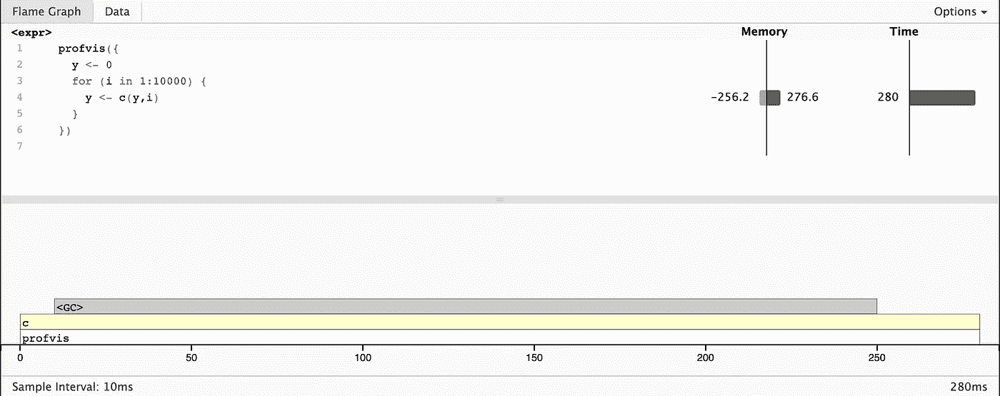
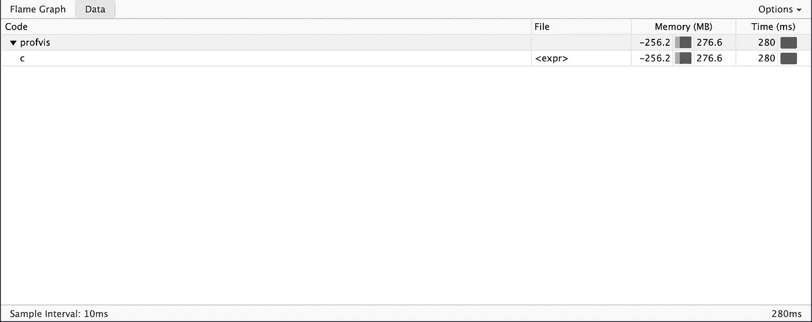

# 提高你 R 技能的技巧和窍门

> 原文：[`towardsdatascience.com/tips-and-tricks-to-improve-your-r-skills-b0f58006d0c1`](https://towardsdatascience.com/tips-and-tricks-to-improve-your-r-skills-b0f58006d0c1)

## 学习如何编写高效的 R 代码

[](https://tinztwinspro.medium.com/?source=post_page-----b0f58006d0c1--------------------------------)[](https://towardsdatascience.com/?source=post_page-----b0f58006d0c1--------------------------------) [Janik 和 Patrick Tinz](https://tinztwinspro.medium.com/?source=post_page-----b0f58006d0c1--------------------------------)

·发表于 [Towards Data Science](https://towardsdatascience.com/?source=post_page-----b0f58006d0c1--------------------------------) ·阅读时间 8 分钟·2023 年 5 月 11 日

--


1234567890-=照片来源于 [AltumCode](https://unsplash.com/es/@altumcode?utm_source=medium&utm_medium=referral) 在 [Unsplash](https://unsplash.com/?utm_source=medium&utm_medium=referral)

**R** 广泛用于商业和科学领域作为数据分析工具。该编程语言是数据驱动任务的基本工具。对于许多统计学家和数据科学家来说，R 是解决统计问题的首选。

数据科学家们通常处理大量数据和复杂的统计问题。内存和运行时间在这里扮演了重要角色。你需要编写高效的代码以实现最佳性能。在本文中，我们将介绍一些可以直接在下一个 R 项目中使用的技巧。

# 使用代码性能分析

数据科学家们经常希望优化他们的代码以提高运行速度。在某些情况下，你会依赖直觉尝试一些方法。这种方法的缺点是你可能优化了代码的错误部分，因此浪费了时间和精力。只有了解代码慢的部分，才能进行优化。解决方案是 **代码性能分析**。代码性能分析可以帮助你找到慢的代码部分！

[Rprof()](https://www.rdocumentation.org/packages/utils/versions/3.6.2/topics/Rprof) 是一个内置的代码性能分析工具。不幸的是，Rprof() 并不是很用户友好，因此我们不推荐直接使用它。我们推荐使用 [profvis](http://rstudio.github.io/profvis/) 包。Profvis 允许可视化来自 Rprof() 的代码性能数据。你可以通过 R 控制台使用以下命令来安装该包：

```py
install.packages("profvis")
```

在下一步中，我们将通过一个示例进行代码性能分析。

```py
library("profvis")

profvis({
  y <- 0
  for (i in 1:10000) {
    y <- c(y,i)
  }
})
```

如果你在 [RStudio](https://posit.co/downloads/) 中运行这段代码，你将得到以下输出。



火焰图（图片由作者提供）

在顶部，你可以看到你的 R 代码以及每行代码的内存和运行时间条形图。这种显示方式提供了代码中可能存在的问题的概览，但无法帮助你确定确切的原因。在内存列中，你可以看到每次调用分配的内存（右侧条形图）和释放的内存（左侧条形图）（以 MB 为单位）。时间列显示每行代码的运行时间（以 ms 为单位）。例如，你可以看到第 4 行的时间为 280 ms。

在底部，你可以看到带有完整调用栈的***火焰图***。该图提供了整个调用序列的概览。你可以将鼠标指针移动到单个调用上以获取更多信息。还可以注意到垃圾回收器（<GC>）消耗了大量时间。为什么呢？在内存列中，你可以看到第 4 行的内存需求增加。第 4 行分配并释放了大量内存。每次迭代都会创建 `y` 的另一个副本，导致内存使用增加。**请避免这种复制-修改的任务！**

你还可以使用***数据选项卡***。***数据选项卡***为你提供了所有调用的简洁概述，特别适合复杂的嵌套调用。



数据选项卡（图像由作者提供）

如果你想了解更多关于 provis 的信息，你可以访问 [Github](https://github.com/rstudio/profvis) 页面。

# 向量化你的代码

也许你听说过向量化。那么它是什么呢？向量化不仅仅是避免使用 `for()` 循环。它更进一步。你需要从向量而不是标量的角度来思考。向量化对于加速 R 代码非常重要。向量化的函数使用用 C 编写的循环，而不是 R。C 中的循环开销更小，使其速度更快。向量化意味着找到在 C 中实现的与任务紧密匹配的现有 R 函数。函数 `rowSums()`、`colSums()`、`rowMeans()` 和 `colMeans()` 对加速你的 R 代码非常有用。这些向量化矩阵函数总是比 `apply()` 函数更快。

为了测量运行时间，我们使用了 R 包 [microbenchmark](https://cran.r-project.org/web/packages/microbenchmark/microbenchmark.pdf)。在这个包中，所有表达式的评估都在 C 中完成，以最小化开销。作为输出，该包提供了统计指标的概述。你可以通过 R 控制台使用以下命令安装 microbenchmark 包：

```py
install.packages("microbenchmark")
```

现在，我们将 `apply()` 函数的运行时间与 `colMeans()` 函数进行比较。以下代码示例演示了这一点。

```py
install.packages("microbenchmark")
library("microbenchmark")

data.frame <- data.frame (a  = 1:10000, b = rnorm(10000))
microbenchmark(times=100, unit="ms", apply(data.frame, 2, mean), colMeans(data.frame))

# example console output:
# Unit: milliseconds
#                       expr      min        lq      mean    median        uq      max neval
# apply(data.frame, 2, mean) 0.439540 0.5171600 0.5695391 0.5310695 0.6166295 0.884585   100
#       colMeans(data.frame) 0.183741 0.1898915 0.2045514 0.1948790 0.2117390 0.287782   100
```

在这两种情况下，我们计算数据框每一列的均值。为了确保结果的可靠性，我们使用 microbenchmark 包进行了 100 次运行（`times=10`）。结果显示，`colMeans()` 函数大约快三倍。

如果你想了解更多关于向量化的知识，我们推荐在线书籍 [R Advanced](https://adv-r.hadley.nz/perf-improve.html)。

# 矩阵与数据框

矩阵与数据框有一些相似之处。矩阵是一个二维对象。此外，一些函数的工作方式相同。不同之处在于：矩阵的所有元素必须具有相同的类型。矩阵常用于统计计算。例如，函数`lm()`会将输入数据内部转换为矩阵，然后进行计算。通常，矩阵的速度比数据框快。现在，我们来比较矩阵和数据框之间的运行时间差异。

```py
library("microbenchmark")

matrix = matrix (c(1, 2, 3, 4), nrow = 2, ncol = 2, byrow = 1)
data.frame <- data.frame (a  = c(1, 3), b = c(2, 4))
microbenchmark(times=100, unit="ms", matrix[1,], data.frame[1,])

# example console output:
# Unit: milliseconds
#            expr      min        lq       mean    median       uq      max neval
#     matrix[1, ] 0.000499 0.0005750 0.00123873 0.0009255 0.001029 0.019359   100
# data.frame[1, ] 0.028408 0.0299015 0.03756505 0.0308530 0.032050 0.220701   100
```

我们使用 microbenchmark 包进行 100 次运行以获得有意义的统计评估。可以看出，矩阵访问第一行的速度比数据框快约 30 倍。**这非常令人印象深刻！** 矩阵明显更快，因此你应该优先使用矩阵而不是数据框。

# is.na() 和 anyNA

你可能知道函数`is.na()`来检查向量是否包含缺失值。还有函数`anyNA()`来检查向量是否有任何缺失值。现在我们测试哪一个函数的运行时间更快。

```py
library("microbenchmark")

x <- c(1, 2, NA, 4, 5, 6, 7) 
microbenchmark(times=100, unit="ms", anyNA(x), any(is.na(x)))
# example console output:
# Unit: milliseconds
#          expr      min       lq       mean   median       uq      max neval
#      anyNA(x) 0.000145 0.000149 0.00017247 0.000155 0.000182 0.000895   100
# any(is.na(x)) 0.000349 0.000362 0.00063562 0.000386 0.000393 0.022684   100
```

评估结果表明，`anyNA()` 的平均速度显著快于 `is.na()`。如果可能的话，你应该使用 `anyNA()`。

# if() … else() 与 ifelse()

`if() ... else()` 是标准控制流函数，而 `ifelse()` 更加用户友好。

`Ifelse()`按以下方案工作：

```py
# test: condition, if_yes: condition true, if_no: condition false
ifelse(test, if_yes, if_no)
```

从许多程序员的角度来看，`ifelse()` 比多行的替代方案更易于理解。缺点是 `ifelse()` 在计算效率上不如 `if() ... else()`。以下基准测试表明，`if() ... else()` 的运行速度比 `ifelse()` 快 20 倍以上。

```py
library("microbenchmark")

if.func <- function(x){
  for (i in 1:1000) {
    if (x < 0) {
      "negative"
    } else {
      "positive"
    }
  }
}
ifelse.func <- function(x){
  for (i in 1:1000) {
    ifelse(x < 0, "negative", "positive")
  }
}
microbenchmark(times=100, unit="ms", if.func(7), ifelse.func(7))

# example console output:
# Unit: milliseconds
#           expr      min       lq       mean   median        uq      max neval
#     if.func(7) 0.020694 0.020992 0.05181552 0.021463 0.0218635 3.000396   100
# ifelse.func(7) 1.040493 1.080493 1.27615668 1.163353 1.2308815 7.754153   100
```

在复杂循环中应避免使用 `ifelse()`，因为它会显著减慢你的程序速度。

# 并行计算

大多数计算机有多个处理器核心，可以并行处理任务。这个概念叫做并行计算。R 包 [parallel](https://stat.ethz.ch/R-manual/R-devel/library/parallel/doc/parallel.pdf) 实现了 R 应用中的并行计算。该包在基本 R 中预安装。使用以下命令，你可以加载该包并查看你的计算机有多少个核心：

```py
library("parallel")

no_of_cores = detectCores()
print(no_of_cores)

# example console output:
# [1] 8
```

并行数据处理非常适合蒙特卡罗模拟。每个核心独立地模拟模型的一个实现。最后，结果被汇总。以下示例基于在线书籍 [Efficient R Programming](https://csgillespie.github.io/efficientR/performance.html#performance-parallel)。首先，我们需要安装 [devtools](https://cran.r-project.org/web/packages/devtools/index.html) 包。借助此包，我们可以从 GitHub 下载 [efficient](https://github.com/csgillespie/efficient) 包。你必须在 RStudio 控制台中输入以下命令：

```py
install.packages("devtools")
library("devtools")

devtools::install_github("csgillespie/efficient", args = "--with-keep.source")
```

在 efficient 包中，有一个 `snakes_ladders()` 函数，它模拟了一场蛇梯棋游戏。我们将使用模拟来测量 `sapply()` 和 `parSapply()` 函数的运行时间。`parSapply()` 是 `sapply()` 的并行化变体。

```py
library("parallel")
library("microbenchmark")
library("efficient")

N = 10⁴
cl = makeCluster(4)

microbenchmark(times=100, unit="ms", sapply(1:N, snakes_ladders), parSapply(cl, 1:N, snakes_ladders))
stopCluster(cl)

# example console output:
# Unit: milliseconds
#                               expr      min       lq     mean   median       uq      max neval
#        sapply(1:N, snakes_ladders) 3610.745 3794.694 4093.691 3957.686 4253.681 6405.910   100
# parSapply(cl, 1:N, snakes_ladders)  923.875 1028.075 1149.346 1096.950 1240.657 2140.989   100
```

评估显示，`parSapply()` 的模拟计算速度平均比 `sapply()` 函数快约 3.5 倍。**哇！** 你可以快速将这个技巧融入到你现有的 R 项目中。

# R 语言与其他语言的接口

有时 R 会很慢。你使用各种技巧，但你的 R 代码仍然太慢。在这种情况下，你应该考虑用另一种编程语言重写你的代码。对于其他语言，R 提供了以 R 包形式的接口。例如，[Rcpp](https://cran.r-project.org/web/packages/Rcpp/index.html) 和 [rJava](https://cran.r-project.org/web/packages/rJava/index.html)。编写 C++ 代码很简单，特别是如果你有软件工程背景。然后你可以在 R 中使用它。

首先，你需要使用以下命令安装 Rcpp：

```py
install.packages("Rcpp")
```

以下示例展示了这种方法：

```py
library("Rcpp")

cppFunction('
  double sub_cpp(double x, double y) {
    double value = x - y;
    return value;
  }
')

result <- sub_cpp(142.7, 42.7)
print(result)

# console output:
# [1] 100
```

C++ 是一种强大的编程语言，使其最适合于代码加速。对于非常复杂的计算，我们建议使用 C++ 代码。

# 结论

在这篇文章中，我们学习了如何分析 R 代码。provis 包支持你分析你的 R 代码。你可以使用 `rowSums()`、`colSums()`、`rowMeans()` 和 `colMeans()` 等矢量化函数来加速你的程序。此外，如果可能的话，你应该优先使用矩阵而不是数据框。使用 `anyNA()` 而不是 `is.na()` 来检查向量是否有缺失值。通过使用 `if() ... else()` 而不是 `ifelse()` 来加速你的 R 代码。此外，你可以使用 parallel 包中的并行函数进行复杂的模拟。通过使用 Rcpp 包，你可以实现复杂代码段的最大性能。

有一些书籍用于学习 R。你将在以下找到我们认为非常适合学习高效 R 编程的三本书：

+   高效 R 编程：更智能编程的实用指南

+   动手编程 R：编写你自己的函数和模拟

+   R 数据科学：导入、整理、转换、可视化和建模数据

👉🏽 [**加入我们的免费每周 Magic AI 时事通讯，获取最新的 AI 更新！**](https://magicai.tinztwins.de)

👉🏽 [**你可以在我们的数字产品页面找到所有的免费资源！**](https://shop.tinztwins.de/)

[**免费订阅**](https://tinztwinspro.medium.com/subscribe) **以在我们发布新故事时获得通知：**

[](https://tinztwinspro.medium.com/subscribe?source=post_page-----b0f58006d0c1--------------------------------) [## 订阅邮件，以便在 Janik 和 Patrick Tinz 发布新内容时收到通知。

### 订阅邮件，以便在 Janik 和 Patrick Tinz 发布新内容时收到通知。如果你还没有 Medium 账户，注册时将会创建一个…

tinztwinspro.medium.com](https://tinztwinspro.medium.com/subscribe?source=post_page-----b0f58006d0c1--------------------------------)

了解更多关于我们的信息，请访问我们的[关于页面](https://medium.com/@tinztwinspro/about)。不要忘记关注我们的[X](https://twitter.com/tinztwins)。非常感谢你的阅读。如果你喜欢这篇文章，欢迎分享。**祝你一天愉快！**

通过[我们的链接](https://tinztwinspro.medium.com/membership)注册成为 Medium 会员，以阅读无限量的 Medium 故事。
