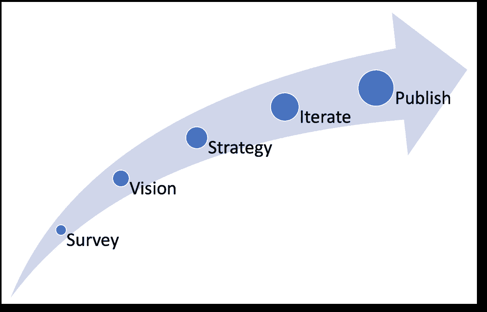
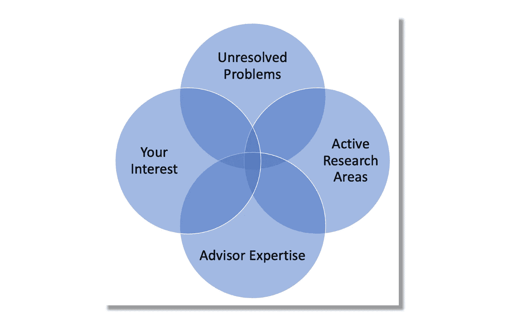
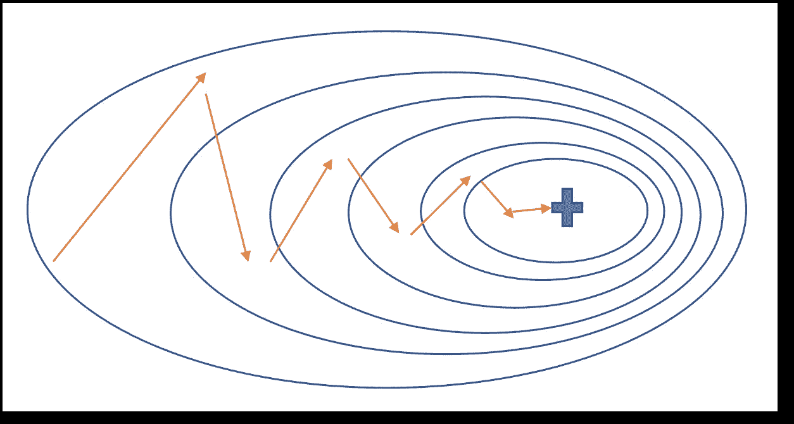
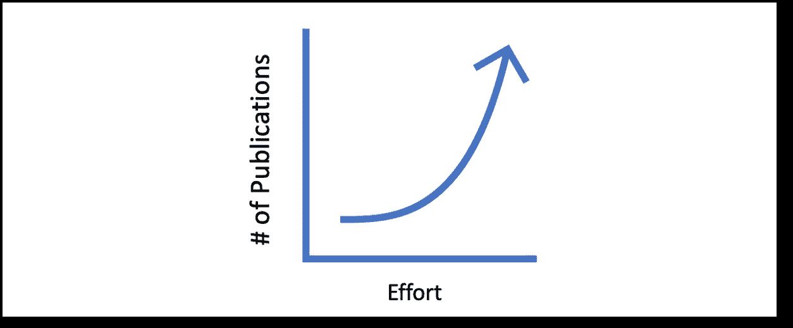

# 学术研究出版技巧

> 原文：[`towardsdatascience.com/tips-for-scholarly-research-publication-bf96b1e3ad51?source=collection_archive---------9-----------------------#2023-04-10`](https://towardsdatascience.com/tips-for-scholarly-research-publication-bf96b1e3ad51?source=collection_archive---------9-----------------------#2023-04-10)

## 如果你是一个尝试发表论文的研究生，请查看这个！

 [Ajay Shrestha](https://blog.ajayshrestha.com/?source=post_page-----bf96b1e3ad51--------------------------------)

·

[关注](https://medium.com/m/signin?actionUrl=https%3A%2F%2Fmedium.com%2F_%2Fsubscribe%2Fuser%2F658421888120&operation=register&redirect=https%3A%2F%2Ftowardsdatascience.com%2Ftips-for-scholarly-research-publication-bf96b1e3ad51&user=Ajay+Shrestha&userId=658421888120&source=post_page-658421888120----bf96b1e3ad51---------------------post_header-----------) 发布于 [Towards Data Science](https://towardsdatascience.com/?source=post_page-----bf96b1e3ad51--------------------------------) ·6 分钟阅读·2023 年 4 月 10 日

--

图片由 [Lala Azizli](https://unsplash.com/@lazizli?utm_source=medium&utm_medium=referral) 提供，来源于 [Unsplash](https://unsplash.com/?utm_source=medium&utm_medium=referral)

本文的目标是与研究生分享一些关于在期刊和会议上发表论文的指南。它基于我作为博士生的过去经验。我的一篇 AI（深度学习）论文[[1](https://ieeexplore.ieee.org/stamp/stamp.jsp?tp=&arnumber=8694781)]最近在 Google Scholar 上获得了 1000 多次引用[[2](https://scholar.google.com/citations?user=wtBCz0QAAAAJ)]。根据 Web of Science™数据库[引用影响力—[3](https://en.m.wikipedia.org/wiki/Citation_impact)]，只有约 0.026%的论文引用次数超过 1000 次。尽管看到论文发表后的影响力很高，但在论文被接受之前经历了许多反复尝试。这篇论文被多次拒绝，花了几年时间，并经历了多次修改才被接受。我尝试将我的经验提炼成一个指导过程。希望以下指南能帮助你在出版过程中。

# 问题

发布很困难，尤其是当你的学校要求提交到高影响力的期刊/会议时。大多数博士项目都有出版要求，这甚至可能成为拖延你毕业的原因。

## 目标

1.  缩短发表时间

1.  放大论文的影响力

# 指南

这里是一些我的经验，希望能帮助你减轻与出版相关的压力。举个例子，我认为启动公司和博士论文发表过程有一些共同点。两者初期都有不确定的未来，但最终都可能在各自领域产生新的贡献。就像创业一样，你的出版过程需要调查、愿景、策略、迭代和扩展。我的思路按以下顺序整理。

图 1：发表论文的 5 个里程碑 | 作者提供的图片

## 调查

阅读你尝试发表领域中的最新技术状态。记住，你是想对已有的工作进行补充。许多出版物是开放获取的，因此找到最新研究的论文不应是问题。此外，你的大学也应能提供必要的访问权限。Google Scholar 和 ResearchGate 是很好的开放资源。鉴于技术和科学研究的快速发展，我还会关注你研究领域的顶尖研究人员和公司，在 LinkedIn、Twitter 等类似网站上获取最新动态。如果适用，我还会探索统计数据和数据存储库进行探索性分析。关于调查的速度，推荐的数量从每周阅读 1 到 7 篇论文以准备文献综述，最终将 30 到 200 篇论文纳入/引用到你的综述中。

## 视野

调研后，制定你想要出版的主题愿景。一个创业公司从一个它打算解决的问题开始。创始人制定一个与他们和他们打算解决的问题相一致的愿景。为了帮助你找到匹配的方向，请从以下问题开始：

1.  在你的研究领域/专业中有哪些未解决的问题？例如，[这个](https://en.wikipedia.org/wiki/Lists_of_unsolved_problems) [4] 是一个关于各学科未解决问题的好参考列表。

1.  在调研论文中讨论了一些活跃的研究领域是什么？

1.  在你资格考试课程中，哪些课程让你最兴奋？

1.  你的导师有哪些专业领域？

图 2：帮助制定出版愿景的维恩图 | 图片作者提供

尝试从上面维恩图中至少有三个重叠的区域选择一个主题。写一个摘要并获取你导师的反馈。确保它包括你的主要目标和论文的提纲。反馈越关键，此阶段需要的调整就会越多。

## 策略

在创业公司的初期阶段，其主要目标是实验、最大化学习，并找到市场真正需要的创新产品，即找到难以捉摸的产品-市场匹配。对你来说，那就是找到一个出版物，即论文-出版匹配。两者都需要策略。

在制定策略之前，请考虑以下问题：

1.  你能投入多少时间和精力来进行出版工作？你将如何平衡其他承诺？

1.  你的导师有多少时间来指导你？尝试安排一个定期的沟通会议。

1.  你毕业所需的必要出版物的目标时间是什么？确保这一目标是现实的。

1.  你是如何管理压力的？请注意，北美约 50%的博士生在获得学位之前会中途退学 [[5](https://www.wiley.com/en-us/network/publishing/research-publishing/trending-stories/improving-phd-completion-rates-where-should-we-start)]。你将需要一些生活技巧来完成博士学业。不出所料，三分之二的创业公司也失败了，即投资回报为负 [[6](https://hbr.org/2021/05/why-start-ups-fail)]。

一旦你弄清楚这些问题并做了一些回顾，制定一个包含以下内容的出版策略：

1.  论文主题/问题

1.  论文类型、提纲和目标长度

1.  目标出版物列表：

    - 按接受难度/影响因子排名

    - 包括他们的反馈时间（审稿周期）

    - 确保出版物符合你所在机构设定的所有标准

1.  预期实现出版成功的目标日期

    - 计算*n*次迭代和修改论文的时间*n*次

## 迭代和调整

一旦你和你的导师对策略/重点达成一致，开始你的研究，并尝试达到一个你可以展示的成果（也就是在*创业*术语中的最小可行产品或 MVP）。当你有了 MVP 论文时，首先提交给那些难度较高但审稿周期较短的期刊/会议。较短的审稿周期可以让你更快地迭代和吸收反馈，并在需要时更早地调整策略。

不要因为被拒绝而灰心丧气，应该利用批评（或严厉的）反馈对你的论文和/或策略进行大胆的修改。确保你在评估、回应并纳入评审人提供的反馈/差距。带有反馈的拒绝是一个祝福，是过程中的重要部分。把它看作是训练 AI 模型的过程。人工神经网络的权重根据标记/训练数据的反馈在训练过程中进行调整。正如下面图 3 所示，这些调整最初较大，随着接近论文发表的契合度（或 AI/ML 中的全局最小值）逐渐减小。

图 3：**随机梯度下降**，一种迭代的机器学习训练算法，用于达到全局/局部最小值（用+号标记）。**论文发表契合度**遵循类似的迭代 | 作者提供的图片

选择与你论文研究相符的期刊/会议，并仔细阅读提交指南。没有什么比等待几个月的反馈更糟糕的了，结果却发现你提交的论文因为不符合期刊/会议的主题或错过了重要的提交步骤而无法被考虑。如果适用，研究你所提交期刊/会议的过去论文并引用其中相关的工作会有帮助。另外，如果你的合著者（例如导师）在某些期刊上有过成功的论文，也可以尝试那些期刊。

## 规模

经过几次迭代，你将逐渐掌握接近发表的过程，因为拒绝的原因会变得不那么严重。达到那个阶段可能需要很长时间。请注意，你的第一篇论文可能是最困难的，并且需要最长的时间。

在机器学习中，有一种叫做*迁移学习*的技术[[7](https://en.wikipedia.org/wiki/Transfer_learning)]，你可以将解决一个任务获得的知识应用到另一个相关任务中，所需的学习努力会减少。就像这样，你的第一篇论文中验证的所有学习将非常有助于加快你第二篇、第三篇以及随后的发表进程。

图 4：展示努力与发表（结果）的图表 | 作者提供的图片

更快的反馈周期和迭代是关键。利用这一点来达到必要的出版数量。坚持适合你的方法，并继续学习和调整流程，以便获得更有影响力的出版物。祝好运！

# 免责声明

这些建议基于我的学习经验，可能并不适用于每个人。

# 参考文献

1.  A. Shrestha 和 A. Mahmood，“*深度学习算法与架构综述*”，发表于 IEEE Access，卷 7，第 53040–53065 页，2019 年，doi: 10.1109/ACCESS.2019.2912200\. （pdf 下载 [链接](https://ieeexplore.ieee.org/stamp/stamp.jsp?tp=&arnumber=8694781)）

1.  [谷歌学术档案](https://scholar.google.com/citations?user=wtBCz0QAAAAJ) — A. Shrestha

1.  引用影响力: [`en.m.wikipedia.org/wiki/Citation_impact`](https://en.m.wikipedia.org/wiki/Citation_impact)

1.  未解决的问题 — [`en.wikipedia.org/wiki/Lists_of_unsolved_problems`](https://en.wikipedia.org/wiki/Lists_of_unsolved_problems)

1.  博士学位完成率讨论 — [`www.wiley.com/en-us/network/publishing/research-publishing/trending-stories/improving-phd-completion-rates-where-should-we-start`](https://www.wiley.com/en-us/network/publishing/research-publishing/trending-stories/improving-phd-completion-rates-where-should-we-start)

1.  为什么初创公司失败: [`hbr.org/2021/05/why-start-ups-fail`](https://hbr.org/2021/05/why-start-ups-fail)

1.  AI/ML 中的迁移学习 — [`en.wikipedia.org/wiki/Transfer_learning`](https://en.wikipedia.org/wiki/Transfer_learning)
