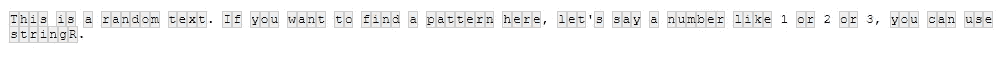
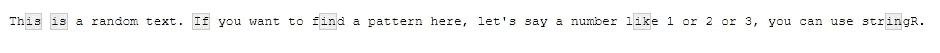
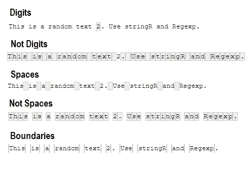
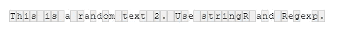
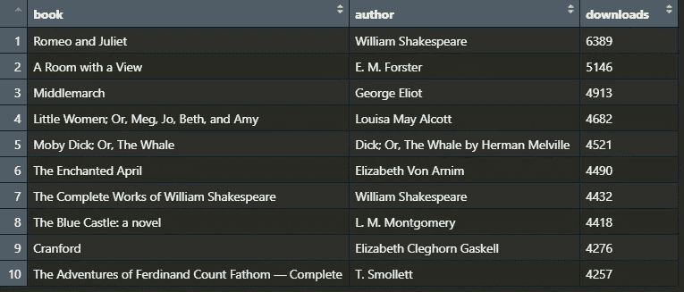

# 理解 R 中的正则表达式的提示

> 原文：[`towardsdatascience.com/tips-to-understand-regular-expressions-in-r-5d25be06f2a8`](https://towardsdatascience.com/tips-to-understand-regular-expressions-in-r-5d25be06f2a8)

## 使用 stringR 获得更多的正则表达式知识

[](https://gustavorsantos.medium.com/?source=post_page-----5d25be06f2a8--------------------------------)[](https://towardsdatascience.com/?source=post_page-----5d25be06f2a8--------------------------------) [Gustavo Santos](https://gustavorsantos.medium.com/?source=post_page-----5d25be06f2a8--------------------------------)

·发表于[Towards Data Science](https://towardsdatascience.com/?source=post_page-----5d25be06f2a8--------------------------------) ·8 分钟阅读·2023 年 1 月 18 日

--


照片由[Jason Leung](https://unsplash.com/ko/@ninjason?utm_source=unsplash&utm_medium=referral&utm_content=creditCopyText)提供，来源于[Unsplash](https://unsplash.com/photos/0sBTrm726C8?utm_source=unsplash&utm_medium=referral&utm_content=creditCopyText)

# 介绍

当一个项目涉及文本分析，比如情感分析、文本挖掘或你需要执行的其他分析任务时，通常会在某个时刻需要解析文本。这意味着需要提取文本的一部分或在文本中找到给定的模式，以便提取见解，例如。

如果我们处理的是简单的模式，比如一个单词或一个数字，那么在 R 中处理起来相对容易。

假设你有以下文本，并且你想找到单词`random`。我们可以使用许多简单的函数来执行这个任务。但首先加载`library(stringr)`。然后查看它的三个函数。

```py
text <- "This is a random text. If you want to try to find a pattern here, 
let's say the numbers 1 or 2 or 3, you can use stringR."

# Find out if the word "random" is present
str_find(text, pattern='random')
[1] TRUE

# Extract the word "random"
str_extract(text, pattern= 'random')
[1] "random"

# Find where the pattern is located in the text
str_locate(text, 'random')
     start end
[1,]    11  16
```

现在，假设我们想找另一种类型的模式，非常具体的，比如*句子中的任何数字*，甚至更具体，*字母和数字的组合*。这就是正则表达式或*regexp*非常有用的地方。

> 正则表达式是一系列字符，帮助我们在文本中查找模式。

# 正则表达式 101

要编写你的第一个*正则表达式*，首先要理解这些模式可以由哪些元素组成。此外，记住始终将你的模式包裹在引号内，无论是单引号还是双引号。

开始吧。

> 旁注：`*str_view_all*`函数展示了由给定模式捕获的所有可能值，但它不会提取任何内容。这可以通过 stringR 库中的其他函数来完成。尽管如此，它是一个出色的工具，可以查看是否获得了正确的文本。

## 一个字符：方括号

如果你想查找一个字符，`[]` 将是你最好的朋友。当你写它们时，无论你放入什么，都表示你想要查找的那个字符。让我们通过实际示例来更好地理解这一点。

如果我们想查找在我们之前的文本中是否有字母`k`，这里是要使用的模式：`[k]`。

```py
str_locate(text, pattern= '[k]')
     start end
[1,]    81  81
```

是的，我们确实有一个字母**k**。它在位置 81 上。考虑到这仅对教育目的有用，我们再往上走一步。如果我们想知道我们的文本中是否包含字母 k、w 或 b 中的任意一个，我们可以使用这个模式：`'[kwb]'`。

注意我们是这样写的：

+   我们使用`[]`来告诉程序我们想要查找一个字符

+   在方括号内，我们有我们要查找的模式，它表示**k** 或 **w** 或 **b**，哪个先出现就查找哪个。结果在第 31 个位置上是字母**w**。

```py
str_locate(text, pattern= '[kwb]')
     start end
[1,]    31  31
```

我们可以使用`[]`来表示其他许多模式。让我告诉你，这是我通常编写的*正则表达式*中最常用的模式之一。甚至还有一些预先创建的模式可以帮助我们在编写代码时。如果你[点击这个链接](https://github.com/rstudio/cheatsheets/blob/main/strings.pdf)，在 stringR 的速查表中你可以找到许多快速模式，如：

+   `[:digit:]` 用于查找句子中的所有数字。在我们的文本中：`“1” “2” “3”`

+   `[:alpha:]` 用于查找字母。



使用‘[:alpha]’在我们的文本中找到的内容。图片由作者提供。

+   `[:punct:]` 用于查找标点符号。在我们的文本中：`"." "," "'" "," "."`

我们还可以在方括号内使用值范围或区分大写或小写字母。例如，`[a-z]` 查找从 a 到 z 之间的一个小写字母，总是返回首先找到的内容。类似地，`[A-Z]` 做同样的事，但查找大写字母。

## 点号`.`意味着查找任何东西

在*正则表达式*中，点号`.`表示任何字符。因此，如果我们创建一个类似`'[Ii].'`的模式并将其应用于我们的文本变量，我们就是在说我们要找的是一个字母*I 或 i* 后面跟着任何其他字符的模式。

```py
str_view_all(text, '[Ii].')
```

这就是生成的图像。



字母 i 后面跟着任何其他字符。图片由作者提供。

## 查找某物的存在或缺失

*正则表达式*的另一个有趣部分是使用一些模式来查找空格、数字、字母的存在或缺失。通常，这会是一个双反斜杠后跟一个字母表示存在，字母的大写形式表示缺失。

+   `\\s` 表示空格，`\\d` 表示数字，`\\w` 表示单词，`\\b` 表示边界。

+   `\\S` 表示非空格，`\\D` 表示非数字，`\\W` 表示非单词。

```py
# The new text variable
text2 <- "This is a random text 2\. Use stringR and Regexp."

# View all digits
str_view_all(text2, '\\d')

# View all EXCEPT digits
str_view_all(text2, '\\D')

# View all spaces
str_view_all(text2, '\\s')

# View all EXCEPT spaces
str_view_all(text2, '\\S')

# View all boundaries
str_view_all(text2, '\\b')
```

以下是相应的结果。



正则表达式的结果。图片由作者提供。

重要的是要注意，边界可以是任何包围模式的东西。想象一下你有一个 ID 号码如`ID-3234`。在这里，如果我们想仅使用这个正则表达式`'\\b\\d+'`提取数字，`-`将被识别为边界。

## 0、1 或更多次重复

`+, * , ? , { }`是你指示字符无或多次重复的方式。

+   ***** : 使用星号表示正则表达式可以发生*零次或多次*。

+   **?** : 问号表示正则表达式发生*零次或一次*。

+   **+** : 使用加号表示正则表达式可以发生*一次或多次*。

+   **{2,4}**: 大括号用于定制重复次数。这里，从 2 次到 4 次。

```py
# Creating the text
text3 <- "This is a random text 3\. Hellooooo."

# Finds the l and one or more reps of o.
str_view(text3, '[l][o]+')
[OUT] looooo

# Finds exactly 3 reps of o.
str_view_all(text3, 'o{3}')
[OUT] ooo

# Finds exactly 2 to 5 reps of o.
str_view_all(text3, 'o{2,5}')
[OUT] ooooo

# One letter or the other: N or M?
text4 <- "nice or mice"
str_extract_all(text4, '[nm]ice')
[1] "nice" "mice"
```

## 使用除外符号^

我们可以在方括号内使用`^`作为**除外**的同义词。在我们的`text2`字符串中，我们可以随意说我们不想让模式捕获字母*a, m, d, x, e*。下面的*正则表达式*模式与`^`将移除方括号内列出的字母。

```py
# Character NOT a, m, d, x or e
str_view_all(text2, '[^amdxe]')
```

代码返回下图。



我们正则表达式中的字母没有被选择。图像由作者提供。

## 之前和之后

要提取给定模式之前或之后的内容，这里是*正则表达式*。假设我们有一个`text5 <- ‘Extract the ID 321’`，我们想提取单词 ID 之前和之后的任何内容。

```py
# Everything before ID
# . for any character
# + for one or more occurrences 
str_extract_all(text5, '.+(?=ID)')
[1] "Extract the "

# Everything after ID
str_extract(text5, '(?<=ID ).+')
[1] "321"
```

## 以…开始和结束

下一些代码是用来提取以某物开始或结束的模式。

```py
#Text
text6 <- 'ID-1234'

# starts with ID
str_extract(text6, '^ID')
[1] "ID"

# ends with numbers
# \\d = digits
# + = one or more occurrences
# $ = ends with

str_extract(text6, '\\d+$')
[1] "1234"
```

# 分步构建

在学习了*正则表达式*的基础知识后，这里有一个好的提示来开始创建你自己的：**分步构建**。查看你想要创建的模式，思考它，然后开始编写每一部分，记住本文中学到的元素。

## 实践

模式：提取字母 A 后面跟着任何数量的数字。

+   第一个元素是限定的*字母 A*。因此`[A]`将处理它。

+   下一部分是*任意数量的数字*。所以`\\d`代表数字，`+`是一个或多个重复的符号。

+   *正则表达式* = `'[A]\\d+'`

```py
text <- 'A234 B334 C434 A334 B345'
str_extract_all(text, pattern= '[A]\\d+')
[1] "A234" "A334"
```

模式：从书单中，如示例`Romeo and Juliet by William Shakespeare (6389)`，提取书名、作者名和下载次数。

+   要提取书名，我们必须获取直到单词`by`的所有内容。因此，我们使用`.+`表示任意字符出现一次或多次`(?= by)`直到*by*。

+   要提取作者名，我们必须获取单词`by`之后的所有内容。这里，`(?<=by )`是寻找*by*之后的部分，`.+`与前面的项目相同，`[^(\\d)]+`意味着^不（ ）包含数字。

+   下载次数仅为数字`\\d`，出现一次或多次`+`。

```py
text <- "Romeo and Juliet by William Shakespeare (6389)
A Room with a View by E. M. Forster (5146)
Middlemarch by George Eliot (4913)
Little Women; Or, Meg, Jo, Beth, and Amy by Louisa May Alcott (4682)
Moby Dick; Or, The Whale by Herman Melville (4521)
The Enchanted April by Elizabeth Von Arnim (4490)
The Complete Works of William Shakespeare by William Shakespeare (4432)
The Blue Castle: a novel by L. M. Montgomery (4418)
Cranford by Elizabeth Cleghorn Gaskell (4276)
The Adventures of Ferdinand Count Fathom — Complete by T. Smollett (4257)"

# Extracting the names of the books to a data.frame
books = str_extract_all(text, pattern= '.+(?= by)')
# Extracting the names of the authors to a data.frame
authors = str_extract_all(text, pattern= '(?<=by ).+ [^(\\d)]+')
# Extracting the downloads
downloads = str_extract_all(text, pattern= '\\d+')

# As dataframe
gutenberg_top10 = data.frame(book = books,
                             author= authors,
                             downloads= downloads)
# Correct columns names
colnames(gutenberg_top10) <- c('book', 'author', 'downloads')
```



从[古腾堡](https://www.gutenberg.org/browse/scores/top)提取前 10 本最下载的书籍的练习结果。图像由作者提供。

# 在你离开之前

好吧，这就是关于*正则表达式*的基础知识。我希望你能感受到它的强大。你可以使用正则表达式基本上找到任何东西。

我知道一开始可能看起来很吓人，但这只是一个练习的问题，你会开始对它更加自信。

你可以随时使用 [Regex 101 网站](https://regex101.com/) 进行练习，参考资料。

如果你喜欢这些内容，请关注我的博客以获取更多信息。

[](http://gustavorsantos.medium.com/?source=post_page-----5d25be06f2a8--------------------------------) [## Gustavo Santos - Medium

### 阅读 Gustavo Santos 在 Medium 上的文章。数据科学家。我从数据中提取见解，以帮助个人和公司…

gustavorsantos.medium.com](http://gustavorsantos.medium.com/?source=post_page-----5d25be06f2a8--------------------------------)

# 参考资料

[](https://en.wikipedia.org/wiki/Regular_expression?source=post_page-----5d25be06f2a8--------------------------------) [## 正则表达式 - 维基百科

### 正则表达式（缩写为 regex 或 regexp，有时称为有理表达式）是一系列…

en.wikipedia.org](https://en.wikipedia.org/wiki/Regular_expression?source=post_page-----5d25be06f2a8--------------------------------) [## 正则表达式

### 正则表达式是一种简洁且灵活的工具，用于描述字符串中的模式。本小册子描述了关键…

cran.r-project.org](https://cran.r-project.org/web/packages/stringr/vignettes/regular-expressions.html?source=post_page-----5d25be06f2a8--------------------------------) [](https://regex101.com/?source=post_page-----5d25be06f2a8--------------------------------) [## regex101：构建、测试和调试正则表达式

### 带有语法高亮、解释、PHP/PCRE、Python、GO、JavaScript 等的速查表的正则表达式测试器…

regex101.com](https://regex101.com/?source=post_page-----5d25be06f2a8--------------------------------) [](https://stringr.tidyverse.org/?source=post_page-----5d25be06f2a8--------------------------------) [## 简单、一致的常用字符串操作包装器

### 一套一致、简单且易于使用的封装在出色的 stringi 包周围的包装器。所有函数和参数…

stringr.tidyverse.org](https://stringr.tidyverse.org/?source=post_page-----5d25be06f2a8--------------------------------)

[`github.com/rstudio/cheatsheets/blob/main/strings.pdf`](https://github.com/rstudio/cheatsheets/blob/main/strings.pdf)
