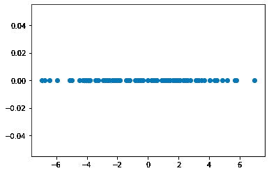

# 特征过多？让我们来看看主成分分析

> 原文：[`towardsdatascience.com/too-many-features-lets-look-at-principal-component-analysis-62504b791ae9?source=collection_archive---------4-----------------------#2023-06-24`](https://towardsdatascience.com/too-many-features-lets-look-at-principal-component-analysis-62504b791ae9?source=collection_archive---------4-----------------------#2023-06-24)

## 自制机器学习模型系列

[](https://hectormrejia.medium.com/?source=post_page-----62504b791ae9--------------------------------)[](https://towardsdatascience.com/?source=post_page-----62504b791ae9--------------------------------) [Hector Andres Mejia Vallejo](https://hectormrejia.medium.com/?source=post_page-----62504b791ae9--------------------------------)

·

[关注](https://medium.com/m/signin?actionUrl=https%3A%2F%2Fmedium.com%2F_%2Fsubscribe%2Fuser%2F4f706205679a&operation=register&redirect=https%3A%2F%2Ftowardsdatascience.com%2Ftoo-many-features-lets-look-at-principal-component-analysis-62504b791ae9&user=Hector+Andres+Mejia+Vallejo&userId=4f706205679a&source=post_page-4f706205679a----62504b791ae9---------------------post_header-----------) 发表在 [Towards Data Science](https://towardsdatascience.com/?source=post_page-----62504b791ae9--------------------------------) · 13 分钟阅读 · 2023 年 6 月 24 日 [](https://medium.com/m/signin?actionUrl=https%3A%2F%2Fmedium.com%2F_%2Fvote%2Ftowards-data-science%2F62504b791ae9&operation=register&redirect=https%3A%2F%2Ftowardsdatascience.com%2Ftoo-many-features-lets-look-at-principal-component-analysis-62504b791ae9&user=Hector+Andres+Mejia+Vallejo&userId=4f706205679a&source=-----62504b791ae9---------------------clap_footer-----------)

--

[](https://medium.com/m/signin?actionUrl=https%3A%2F%2Fmedium.com%2F_%2Fbookmark%2Fp%2F62504b791ae9&operation=register&redirect=https%3A%2F%2Ftowardsdatascience.com%2Ftoo-many-features-lets-look-at-principal-component-analysis-62504b791ae9&source=-----62504b791ae9---------------------bookmark_footer-----------)

*该配套仓库可在* [*这里*](https://github.com/hector6298/medium_posts/tree/main/pca)*获取*！

维度诅咒是机器学习中的一个主要问题。随着特征数量的增加，模型的复杂性也随之增加。此外，如果训练数据不足，会导致过拟合。

在这篇文章中，将介绍主成分分析（PCA）。首先，我将解释为什么特征过多是个问题。接着，讲解 PCA 背后的数学原理及其为何有效。此外，将对 PCA 进行逐步解析，并附上视觉示例和代码片段。最后，将总结 PCA 的优缺点，并将这些步骤封装在一个 Python 类中以备后用。


将一个向量投影到一个低维空间就像现实生活中的投影一样。PCA 找到这些投影的方向。照片由 [inbal marilli](https://unsplash.com/@inbalmarilli?utm_source=medium&utm_medium=referral) 提供，来源于 [Unsplash](https://unsplash.com/?utm_source=medium&utm_medium=referral)

**读者注意：** 如果你对数学解释不感兴趣，只想查看实际示例以及 PCA 的工作原理，请跳至 **“****PCA 的实践****”** 部分。如果你只对 Python 类感兴趣，请前往 **“****自制 PCA 实现****”** 部分。

# 特征过多的问题？

查看图 1 中的特征空间。这里的示例较少，因此该数据的模型可能无法很好地推广到新的、未见过的示例。


图 1\. 二维特征空间的示例。由我创作，灵感来源于 [1]。

如果我们添加另一个特征会发生什么？让我们查看图 2 中的新特征空间。你会发现这里比之前的例子有更多的空白区域。随着特征数量的增加，模型将过拟合当前数据。这就是为什么需要减少数据维度以缓解此问题的技术。[1]


同样的例子，加上一个额外的特征。由我创作，灵感来源于 [1]。

# PCA 的目标是什么？

简而言之，PCA 的目的是提取新的、不相关的低维特征，这些特征最大化保留原始数据中的信息。在这种情况下，信息的衡量标准是方差。让我们看看为什么：

该技术基于这样的假设：我们的 d 维数据点***x***可以通过[正交基](https://en.wikipedia.org/wiki/Orthonormal_basis) [1]的向量的线性组合来表示。


不用担心，我会稍后解释我们如何获得所述基的向量。此外，我们可以从这***d***个向量中提取一个表示***x̂***，使用***m***（***m < d***）：


当然，由于特征较少，我们无法获得精确的表示，但至少我们尽量减少信息的丢失。我们定义原始示例***x***与近似值***x̂***之间的均方误差（MSE）：


由于求和使用了具有不同截止点的相同变量，因此差异仅是偏移量：


我们从最初的假设知道***x***是正交归一向量的和。因此，这些向量的点积为零，它们的欧几里得范数为一。因此：


求解重要性值***yi:***


将结果代入其期望值：


我们可以看到，如果***xi***被中心化（均值为零），那么期望值将变成整个数据的协方差矩阵，**这个结果只是原始空间中的方差**。通过选择能够最大化方差的正确向量***vi***，我们将有效地最小化表示误差。

# 这个正交归一基是从哪里来的？

如前所述，我们希望获得***m***个最大化方差的向量：


如果我们考虑整个数据矩阵，可以看出***vi***是一个投影方向。数据将会被投影到一个低维空间中。

如果我们使用谱分解对协方差矩阵Σ进行对角化，我们得到：


其中***U***是一个包含Σ的归一化特征向量的矩阵，Λ是一个包含Σ特征值按降序排列的对角矩阵。这是可能的，因为Σ是一个实对称矩阵。

此外，由于Λ仅在对角线上包含非零值，我们可以将上述方程重写为：


使用：


注意***U***中的向量和向量***v***都是归一化的***。*** 因此，当对每个 v 与 a 进行平方点积时，我们得到的值介于***[0,1]***之间，因此***w***也必须是一个归一化向量：


从这里，出现了一些有趣的性质。

## 第一个主成分

回顾优化问题。由于特征值是有序的且***w***必须是一个归一化向量，我们的最佳选择是得到第一个特征向量，其中***w = (1,0,0,…)***。因此，上界在以下情况下达成：


最大化方差的投影方向恰好是与**最大特征值**相关联的**特征向量**！

## 其余的成分

一旦设定了第一个主成分，就会增加一个新的优化问题限制：


这意味着新的成分***v2***必须与先前的成分特征向量***u1***正交，以避免信息冗余。可以证明，所有的 d 个成分对应于Σ中与特征值相关的 d 个归一化特征向量，按降序排列。请查看[这些笔记](https://verso.mat.uam.es/~joser.berrendero/blog/Componentes_principales.pdf)以获取正式证明[2]。

# 实践中的 PCA

从上述理论描述中，可以描述获取数据集主成分所需的步骤。假设初始数据集是以下二维正态分布的随机样本：


```py
from scipy import stats
mean = [3,3]
var = [[6, 3],
       [3, 3.5]]
n = 100
data_raw = np.random.multivariate_normal(mean, var, 100)
```


图 3\. 原始点云。非居中。作者原创。

## 1\. 数据居中

第一步是将数据点移动到坐标系的原点，使数据具有零均值。此步骤通过从数据集中的每个点中减去样本均值来完成。


```py
import numpy as np
data_centered = data_raw - np.mean(data_raw, axis=0)
```


图 4\. 居中点云。作者原创。

## **2\. 计算协方差矩阵**

上述定义的方差是总体协方差矩阵Σ。在实践中，我们没有这些信息，因为我们只有一个样本。因此，我们可以使用样本协方差***S***来近似该参数。


请记住，数据已经被居中。因此：


我们可以使用矩阵乘法将其简洁地表示。这也可以帮助我们向量化计算：


```py
cov_mat = np.matmul(data_centered.T, data_centered)/(len(data_centered) - 1)
# > array([[5.62390186, 2.47275007],
# >       [2.47275007, 3.19395349]])
```

代码中将转置矩阵作为第一个参数传递的原因是，在数据矩阵的数学公式中，特征在行中，主题在列中。在实现中，情况正好相反，因为在几乎每个系统中，事件、主题、日志等都是以行的形式存储的。

## 3\. 执行协方差矩阵的特征分解

特征值和特征向量是使用来自[scipy](https://docs.scipy.org/doc/scipy/reference/generated/scipy.linalg.eig.html)的`eig()`计算的：

```py
from scipy.linalg import eigh
eigvals, eigvecs = eigh(cov_mat)

# Sorting the eigenvalues and eigenvectors
indices = eigvals.argsort()[::-1]
eigvals, eigvecs = eigvals[indices], eigvecs[:,indices]

eigvecs
# > array([[-0.82348021,  0.56734499],
# >        [-0.56734499, -0.82348021]])
```

正如前面所解释的，特征值表示主成分的方差，而特征向量是投影方向：


图 5\. 投影方向和点云的图示。作者原创。

你可以看到，使用主成分的方向创建了一个新的坐标系统。此外，必须存储特征值和特征向量，以便在之后转换新数据。

## 4\. 强制确定性

特征向量的系数总是相同的，只是其符号不同。PCA 可以有多个有效的方向。因此，我们需要通过取特征向量矩阵并对每一列应用该列内最大绝对值的符号来强制确定结果。

```py
max_abs_cols = np.argmax(np.abs(eigvecs), axis=0)
signs = np.sign(eigvecs[max_abs_cols, range(eigvecs.shape[1])])
eigvecs = eigvecs*signs
eigvecs
# > array([[ 0.82348021, -0.56734499],
# >      [ 0.56734499,  0.82348021]])
```

## **5\. 提取新特征**

每个新特征（主成分）是通过计算原始特征空间中每个点与特征向量之间的点积来提取的：


```py
new_features = np.dot(data_centered, eigvecs)
```

对于这个特定示例，在计算主成分后，空间中的新点表示如下：


图 6\. 使用主成分中的特征绘制的不相关点云图。注意这只是原始点云的旋转。出自我自己的创作。

注意，这个结果基本上是将原始点云旋转，使得属性不相关。

## 6\. 降维

到目前为止，主成分已经完全计算出来以进行视觉上的理解。剩下的任务是选择需要多少个主成分。我们利用特征值来完成这项任务，因为它们代表了每个主成分的方差。

成分***i***所持方差的比例为：


选择 m 个主成分所保留的方差比例为：


如果我们可视化我们示例中每个成分的方差，我们会得到以下结果：

```py
# Variance of each individual component as bars
plt.bar(
    [f"PC_{i}" for i in range(1,len(eigvals)+1)],
    eigvals/sum(eigvals)
)

# Percentage held by m components as the line
plt.plot(
    [f"PC_{i}" for i in range(1,len(eigvals)+1)],
    np.cumsum(eigvals)/sum(eigvals),
    color='red'
)
plt.scatter(
    [f"PC_{i}" for i in range(1,len(eigvals)+1)],
    np.cumsum(eigvals)/sum(eigvals),
    color='red'
)
```


图 7\. 每个主成分解释的方差。出自我自己的创作。

在这种情况下，PC1 代表了原始数据方差的 80%，剩余的 20% 归属于 PC2。此外，我们可以选择仅使用第一个主成分，此时数据将如下所示：



图 8\. 数据在第一个特征向量方向上的投影。出自我自己的创作。

这是数据在第一个特征向量方向上的投影。现在看起来不是很有用。**如果我们选择属于三类的数据会怎样？PCA 会是什么样的？**

# 多类数据上的 PCA

让我们创建一个具有三类且可以线性分开的数据集：

```py
from sklearn.datasets import make_blobs
X, y = make_blobs()

plt.scatter(X[:,0], X[:,1],c=y)
plt.legend()
plt.show()
```


图 9\. 多类数据。出自我自己的创作。

如果我们将 PCA 应用于上述数据，这将是主成分的图示：


图 10\. 多类不相关数据。出自我自己的创作。

这将是第一个主成分的图示（数据在对应于最大特征值的特征向量方向上的投影）：


图 11\. 数据在第一个特征向量方向的投影。这就是维度减少。来自我个人的创作。

它有效！数据看起来仍然可以通过线性模型轻松分离。

# 优缺点

像科学中的一切一样，没有万能的解决方案。这里是一些优缺点的列表，你应该在使用 PCA 处理实际数据之前加以考虑。

## PCA 的优点

1.  **维度减少：** PCA 允许将高维数据减少到低维空间，同时保留大部分重要信息。这对于数据可视化、计算效率和处理维度灾难非常有用。

1.  **去相关：** PCA 将原始变量转换为一组新的不相关变量，称为主成分。这种去相关简化了分析，并可以提高假设特征独立性的下游机器学习算法的性能。

1.  **噪声减少：** 通过 PCA 获得的低维表示倾向于过滤掉噪声，关注数据中最重要的变化。这可以提高信噪比，并增强后续分析的鲁棒性。

## PCA 的缺点

1.  **线性假设：** PCA 假设数据关系是线性的。如果数据具有复杂的非线性关系，PCA 可能无法捕捉最有意义的变化，并可能提供次优结果。

1.  **可解释性：** 从 PCA 获得的主成分是原始特征的线性组合。将主成分与原始变量联系起来并理解其确切含义可能比较困难。

1.  **对尺度的敏感性：** PCA 对输入变量的尺度敏感。如果变量具有不同的尺度，那么具有更大方差的变量可能会主导分析，导致偏差结果。适当的特征缩放对于获得可靠的 PCA 结果至关重要。

1.  **异常值：** PCA 对异常值非常敏感，因为它关注数据的方差捕捉。异常值可能会显著影响主成分，并扭曲结果。

# 自制 PCA 实现

现在我们已经涵盖了主成分分析的细节，剩下的就是创建一个封装上述行为的类，以便在未来的问题中重用。

对于这个实现，将使用 scikit-learn 接口，其具有以下方法：

+   `fit()`

+   `transform()`

+   `fit_transform()`

## 构造函数

不需要复杂的逻辑。构造函数只需定义变换数据将具有的组件（特征）数量。

```py
import numpy as np
from scipy.linalg import eigh

class PCA:
    """Principal Component Analysis.
    """
    def __init__(self, n_components):
        """Constructor of the PCA class.

        Parameters:
        ===========
        n_components: int
            The number of dimensions for the transformed data.
            Must be less than or equal to n_features.
        """
        self.n_components = n_components
        self._fit_instance = False
```

## fit 方法

fit 方法将应用上一节中的步骤 1–4。

+   数据中心化

+   计算协方差矩阵

+   计算特征值、特征向量并对其进行排序

+   通过翻转特征向量的符号来强制确定性

它还将存储特征值和特征向量，以及样本均值，作为对象属性，以便稍后转换新数据。

```py
 def fit(self, X):
        """Compute eigenvectors to transform data later

        Parameters:
        ===========
        X: np.array of shape [n_examples, n_features]
            The data matrix

        Returns:
        ===========
        None
        """
        # Fit the mean of the data and center it
        self.mean = np.mean(X, axis=0)
        X_centered = X - self.mean

        # Compute covariance matrix
        cov_mat = np.matmul(X_centered.T, X_centered)/(len(X_centered) - 1)

        # Compute eigenvalues, eigenvectors and sort them
        eigenvalues, eigenvectors = eigh(cov_mat)
        self.eigenvalues, self.eigenvectors = self._sort_eigen(eigenvalues, eigenvectors)

        # Get the explained variance rations
        self.explained_variance_ratio = self.eigenvalues/np.sum(self.eigenvalues)

        # Enforce determinism by flipping the eigenvectors
        self.eigenvectors = self._flip_eigenvectors(self.eigenvectors)[:, :self.n_components]

        self._fit_instance = True
```

## 转换方法

它将应用步骤 1、5 和 6：

+   使用存储的样本均值对新数据进行中心化

+   提取新的主成分特征

+   通过选择`n_components`维度来降低维度。

```py
 def transform(self, X):
        """Project the data in the directions of the eigenvectors.

        Parameters:
        ===========
        X: np.array of shape [n_examples, n_features]
            The data matrix

        Returns:
        ===========
        pcs: np.array[n_examples, n_components]
            The new, uncorrelated features from PCA.
        """
        if not self._fit_instance:
            raise Exception("PCA must be fitted to the data first! Call fit()")

        X_centered = X - self.mean
        return np.dot(X_centered, self.eigenvectors)
```

## fit_transform 方法

为了简化实现。该方法将首先应用`fit()`函数，然后应用`transform()`。我相信你可以找到更巧妙的定义。

```py
def fit_transform(self, X):
       """Fits PCA and transforms the data.
       """
       self.fit(X)
       return self.transform(X)
```

## 辅助函数

这些方法被定义为独立的组件，而不是将所有步骤应用于`fit()`函数，以使代码更具可读性和可维护性。

```py
 def _flip_eigenvectors(self, eigenvectors):
        """Enforce determinism by changing the signs of the eigenvectors.
        """
        max_abs_cols = np.argmax(np.abs(eigenvectors), axis=0)
        signs = np.sign(eigenvectors[max_abs_cols, range(eigenvectors.shape[1])])
        return eigenvectors*signs

    def _sort_eigen(self, eigenvalues, eigenvectors):
        """Sort eigenvalues in descending order and their corresponding eigenvectors.
        """
        indices = eigenvalues.argsort()[::-1]
        return eigenvalues[indices], eigenvectors[:, indices]
```

## 测试类

让我们使用之前的示例与我们的`PCA`类：

```py
from pca import PCA

# Using our PCA implementation
pca = PCA(n_components=1)
X_transformed = pca.fit_transform(X)

# Plotting the first PC
plt.scatter(X_transformed[:,0], [0]*len(X_transformed),c=y)
plt.legend()
plt.show()
```


图 12\. 使用 PCA 类的结果。由我本人编著。

# 结论

特征过多而数据较少可能会有害，并且很可能导致过拟合。主成分分析（PCA）是一个可以帮助缓解这个问题的工具。它是一种降维技术，通过寻找数据的投影方向来尽可能多地保留原始变异性，同时使得结果特征无关。更重要的是，可以测量每个新特征或主成分解释的方差。然后，用户可以选择多少主成分和多少方差对任务足够。最后，确保首先了解你的数据，因为 PCA 适用于可以线性分离的样本，并且可能对异常值敏感。

# 参考文献

[1] Fernández, A. Dimensionality Reduction. Universidad Autónoma de Madrid. Madrid, Spain. 2022.

[2] Berrendero, J. R. Regresión lineal con datos de alta dimensión. Universidad Autónoma de Madrid. Madrid, Spain. 2022.

在[LinkedIn](https://www.linkedin.com/in/hectorandresmv/)上与我联系！
