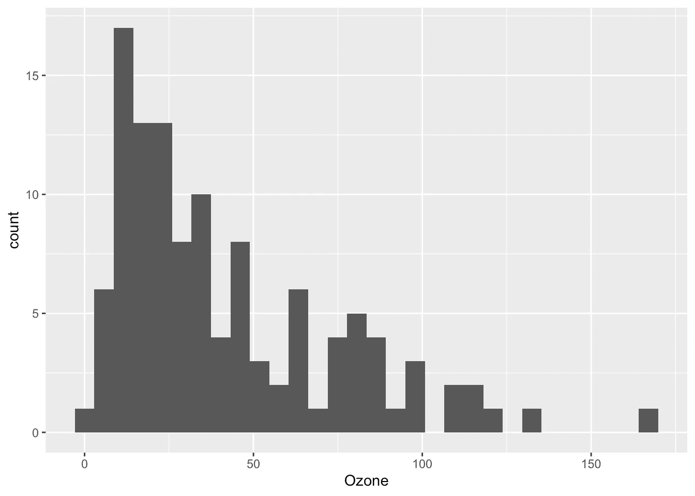

# R 语言中的前 10 个错误及其修复方法

> 原文：[`towardsdatascience.com/top-10-errors-in-r-and-how-to-fix-them-e8848718c836`](https://towardsdatascience.com/top-10-errors-in-r-and-how-to-fix-them-e8848718c836)

## 在这篇文章中，我重点介绍了 R 语言中**10 个最常见的错误及其解决方法**。我还提到了一些警告（它们与错误不同）。

[](https://antoinesoetewey.medium.com/?source=post_page-----e8848718c836--------------------------------)[](https://towardsdatascience.com/?source=post_page-----e8848718c836--------------------------------) [Antoine Soetewey](https://antoinesoetewey.medium.com/?source=post_page-----e8848718c836--------------------------------)

·发表于[Towards Data Science](https://towardsdatascience.com/?source=post_page-----e8848718c836--------------------------------) ·19 分钟阅读·2023 年 2 月 7 日

--


图片由[Kai Pilger](https://unsplash.com/@kaip?utm_source=medium&utm_medium=referral)提供

# 引言

如果你刚开始使用 R，你会经常遇到阻止代码运行的错误。我记得在刚开始使用 R 时，我的代码错误频繁到我几乎放弃学习这门编程语言。我甚至回到 Excel 几次来完成分析，因为我找不到问题的根源。

幸运的是，我强迫自己继续前进，尽管开始时困难重重。即使今天，我几乎每次写 R 代码时仍会遇到错误，但随着经验和练习，修复错误所需的时间越来越少。如果你也在刚开始时遇到困难，放心，这很正常：每个人在学习新编程语言时都会经历一些挫折（而且这不仅仅是 R 语言的情况）。

在这篇文章中，我重点介绍了**R 语言中 10 个最常见的错误及其修复方法**。当然，错误取决于你的代码和分析，因此不可能涵盖所有错误（Google 做得比我更好）。不过，我想专注于一些在学习 R 时常见的语法错误，有时这些错误需要较长时间才能解决，而解决方法就在眼前。

这个集合基于我的个人经验以及我在[教授](https://antoinesoetewey.com/teaching/)R 语言时遇到的学生错误。这个列表并不详尽，欢迎在帖子末尾评论你在使用 R 时常遇到的错误。

对于每个错误，我提供了示例和解决方案。我还在文章的最后提到了一些警告（严格来说，这些不是错误）。

# 1\. 不匹配的括号、大括号、方括号或引号

一个相当简单但仍然很常见的错误是缺少括号、大括号、方括号或引号。

这种错误适用于许多编程语言。例如在 R 中：

```py
## missing a closing parenthesis:
mean(c(1, 7, 13)

## missing a curly brace before "else":
x <- 7 
if(x > 10) {
  print("x > 10")
 else {
  print("x <= 10")
 }

## missing a square bracket:
summary(ggplot2::diamonds[, "price")
```

```py
## missing a closing quote in 2nd element:
grp <- c("Group 1", "Group 2) 
grp
```

当代码较简单时，这些错误容易检测，但在代码更复杂时，例如：[1](https://statsandr.com/blog/top-10-errors-in-r/#fn1)就会变得更加难以发现。

```py
for (i in y) {
  for (j in x) {
    p <- ggboxplot(dat,
      x = colnames(dat[j]), y = colnames(dat[i]),
      color = colnames(dat[j]),
      legend = "none",
      palette = "npg",
      add = "jitter"
    )
    print(
      p + stat_compare_means(aes(label = paste0(..method.., ", p-value = ", ..p.format..),
        method = method1, label.y = max(dat[, i], na.rm = TRUE)
      )
      + stat_compare_means(comparisons = my_comparisons, method = method2, label = "p.format")
    )
  }
```

幸运的是，如果你使用 RStudio，[2](https://statsandr.com/blog/top-10-errors-in-r/#fn2) 当你打开一个括号、大括号、方括号或引号时，RStudio 会自动写入对应的闭合符号。

请记住，在安装包时，你*必须*在包名周围使用（单引号或双引号）：

```py
## NOT correct:
install.packages(ggplot2)
```

```py
## Error in install.packages : object 'ggplot2' not found
```

相反，写下以下两个选项之一：

```py
# install.packages("ggplot2")

# install.packages('ggplot2')
```

# 解决方案

解决方案当然是确保所有的左括号、大括号、方括号和引号都与其对应的右括号匹配：

```py
mean(c(1, 7, 13))
```

```py
## [1] 7
```

```py
x <- 7
if (x > 10) {
  print("x > 10")
} else {
  print("x <= 10")
}
```

```py
## [1] "x <= 10"
```

```py
summary(ggplot2::diamonds[, "price"])
```

```py
##      price      
##  Min.   :  326  
##  1st Qu.:  950  
##  Median : 2401  
##  Mean   : 3933  
##  3rd Qu.: 5324  
##  Max.   :18823
```

```py
grp <- c("Group 1", "Group 2")
grp
```

```py
## [1] "Group 1" "Group 2"
```

同时，确保：

+   正确放置逗号：

```py
## NOT correct (misplaced comma):
c("Group 1," "Group 2")
```

```py
## Error: unexpected string constant in "c("Group 1," "Group 2""
```

```py
## also NOT correct (missing comma):
c("Group 1" "Group 2")
```

```py
## Error: unexpected string constant in "c("Group 1" "Group 2""
```

```py
## correct:
c("Group 1", "Group 2")
```

+   确保你不会对同一元素混用单引号和双引号：

```py
## NOT correct:
c("Group 1')
```

```py
## correct:
c("Group 1")## also correct:
c('Group 1')
```

注意 `c('Group 1', "Group 2")` 不会抛出错误，但为了保持一致性，不推荐在同一向量中混用单引号和双引号。

# 2\. 使用未安装或未加载的函数

如果你遇到以下错误：“Error in … : could not find function ‘…’”，例如：


作者提供的图片

这意味着你正在尝试使用一个尚未安装或加载的包中的函数。

# 解决方案

要解决这个错误，你需要安装包（如果还未安装）并使用 `install.packages()` 和 `library()` 函数分别加载它：

```py
## install package:
install.packages("ggplot2")
```

```py
## load package:
library(ggplot2)
```

如果你对这两个函数的用法不确定，可以查看有关[在 R 中安装和加载包的详细信息](https://statsandr.com/blog/an-efficient-way-to-install-and-load-r-packages/)。

# 3\. 函数、变量、数据集、对象或包名称中的拼写错误

另一个常见错误是拼写函数、变量、数据集、对象或包的名称错误，例如：

```py
## typo in function name:
maen(c(1, 7, 13))
```

```py
## Error in maen(c(1, 7, 13)) : could not find function "maen"
```

```py
## typo in variable name:
summary(ggplot2::diamonds[, "detph"])
```

```py
## Error: Column `detph` doesn't exist
```

```py
## typo in dataset name:
data <- data.frame(
  x = rnorm(10),
  y = rnorm(10)
)
summary(dta[, 2])
```

```py
## Error in summary(dta[, 2]) : object 'dta' not found
```

```py
## typo in object name:
test <- c(1, 7, 13)
mean(tset)
```

```py
## Error in mean(tset) : object 'tset' not found
```

```py
## typo in package name:
library("tydiverse")
```

```py
## Error in library("tydiverse") : there is no package called ‘tydiverse’
```

# 解决方案

确保你正确拼写所有函数、变量、数据集、对象和包的名称：

注意**R 语言区分大小写**；`mean()` 和 `Mean()` 在 R 中被认为是不同的！

```py
mean(c(1, 7, 13))
```

```py
## [1] 7
```

```py
summary(ggplot2::diamonds[, "depth"])
```

```py
##      depth      
##  Min.   :43.00  
##  1st Qu.:61.00  
##  Median :61.80  
##  Mean   :61.75  
##  3rd Qu.:62.50  
##  Max.   :79.00
```

```py
data <- data.frame(
  x = rnorm(10),
  y = rnorm(10)
)
data[, 2]
```

```py
##  [1]  1.3048697  2.2866454 -1.3888607 -0.2787888 -0.1333213  0.6359504
##  [7] -0.2842529 -2.6564554 -2.4404669  1.3201133
```

```py
test <- c(1, 7, 13)
mean(test)
```

```py
## [1] 7
```

```py
library(tidyverse)
```

```py
## ── Attaching packages ─────────────────────────────────────── tidyverse 1.3.2 ──
## ✔ ggplot2 3.4.0      ✔ purrr   0.3.5 
## ✔ tibble  3.1.8      ✔ dplyr   1.0.10
## ✔ tidyr   1.2.1      ✔ stringr 1.4.1 
## ✔ readr   2.1.3      ✔ forcats 0.5.2 
## ── Conflicts ────────────────────────────────────────── tidyverse_conflicts() ──
## ✖ dplyr::filter() masks stats::filter()
## ✖ dplyr::lag()    masks stats::lag()
```

如果你确定你正确拼写了一个对象、函数或数据集，但仍然出现“对象‘…’未找到”的错误，确保你在调用它之前*定义*了你的对象/函数/数据集！

经常发生的情况是，学生让我去他的/她的电脑前，因为他/她运行了与我完全相同的代码，却无法使其正常工作。大多数时候，如果他的/她的代码确实与我的完全相同，他/她只是没有在运行包含该对象/函数/数据集的代码之前执行该对象/函数/数据集。换句话说，他/她只是试图使用一个未定义的对象或变量。

记住，在 R 脚本中编写代码（与控制台不同）并不意味着它会被编译。你实际上必须运行它（通过点击运行按钮或使用快捷键）以便代码被执行并在之后使用。如果你仍然遇到困难，可以参见[R 和 RStudio 基础知识](https://statsandr.com/blog/how-to-install-r-and-rstudio/)。

# 4\. 函数中的缺失、不正确或拼写错误的参数

大多数 R 函数需要参数。例如，`rnorm()`函数至少需要观察数，通过参数`n`指定。

如果你没有指定必要的参数，或者错误地指定了参数，你的代码将无法运行。此外，如果你拼写错误一个参数，结果可能不会是你所期望的：

```py
## missing compulsory argument:
rnorm()
```

```py
## Error in rnorm() : argument "n" is missing, with no default
```

```py
## incorrect argument:
rnorm(n = 3, var = 1)
```

```py
## Error in rnorm(n = 3, var = 1) : unused argument (var = 1)
```

```py
## misspelled argument:
mean(c(1, 7, 13, NA), narm = TRUE)
```

```py
## [1] NA
```

最后一段代码不会抛出错误，但结果并不是我们想要的。

# 解决方案

为了解决这些错误，请确保指定**至少所有必需的参数**，并且是正确的：

+   在`rnorm()`中，除了观察数`n`之外，可以指定标准差`sd`（而不是方差`var`）。

+   删除`NA`时应使用`na.rm`（而不是`narm`）。

```py
rnorm(n = 3, sd = 1)
```

```py
## [1] -0.3066386 -1.7813084 -0.1719174
```

```py
mean(c(1, 7, 13, NA), na.rm = TRUE)
```

```py
## [1] 7
```

如果你不记得一个函数的参数，可以随时使用`?function_name`或`help(function_name)`来查看文档，例如：

```py
?rnorm()
```

```py
## or:
help(rnorm)
```

# 5\. 错误、不适当或不一致的数据类型

在 R 中有几种[数据类型](https://statsandr.com/blog/data-types-in-r/)，主要有：

+   数值型

+   字符

+   因子

+   逻辑

你知道某些操作和分析仅对某些特定类型的数据是可能和适当的。

例如，计算[均值](https://statsandr.com/blog/descriptive-statistics-in-r/#mean)时，使用因子或字符变量是不合适的：

```py
gender <- factor(c("female", "female", "male", "female", "male"))
```

```py
mean(gender)
```

```py
## Warning in mean.default(gender): argument is not numeric or logical: returning
## NA
```

```py
## [1] NA
```

同样，虽然技术上可能，但绘制[条形图](https://statsandr.com/blog/descriptive-statistics-in-r/#barplot)对于[连续定量](https://statsandr.com/blog/variable-types-and-examples/)变量意义不大，因为在大多数情况下，每个值的频率将是 1。

```py
barplot(table(rnorm(10)))
```


作者图

*(顺便说一下，如果你的数据还没有以表格形式显示，不要忘记在`*barplot()*`函数内添加`*table()*`。)*

# 解决方案

确保根据感兴趣的变量使用适当的操作和分析类型。

例如：

+   对于因子变量，更合适的方法是计算频率和/或相对频率，并绘制条形图。

+   对于定量连续变量，计算均值、中位数等，以及绘制直方图、箱线图等更为合适。

+   对于逻辑变量，均值，[3](https://statsandr.com/blog/top-10-errors-in-r/#fn3) 频率表和条形图是合适的。

+   对于字符变量，[词云](https://statsandr.com/blog/draw-a-word-cloud-with-a-shiny-app/)是最合适的（除非该变量可以被视为因子变量，因为不同水平不多）。

现在我们在 R 中说明这些示例：[4](https://statsandr.com/blog/top-10-errors-in-r/#fn4)

```py
## factor:
table(gender)
```

```py
## gender
## female   male 
##      3      2
```

```py
prop.table(table(gender))
```

```py
## gender
## female   male 
##    0.6    0.4
```

```py
barplot(table(gender))
```


作者绘图

```py
## quantitative continuous:
x <- rnorm(100)
```

```py
summary(x)
```

```py
##     Min.  1st Qu.   Median     Mean  3rd Qu.     Max. 
## -2.99309 -0.74143  0.01809 -0.08570  0.58937  2.70189
```

```py
par(mfrow = c(1, 2)) ## combine two plots
hist(x)
boxplot(x)
```


作者绘图

```py
## logical:
x <- c(TRUE, FALSE, FALSE, TRUE, TRUE)
```

```py
mean(x)
```

```py
## [1] 0.6
```

```py
table(x)
```

```py
## x
## FALSE  TRUE 
##     2     3
```

```py
barplot(table(x))
```


作者绘图

对于感兴趣的读者，可以查看[在 R 中最常见的描述性统计](https://statsandr.com/blog/descriptive-statistics-in-r/)以了解不同类型的数据。

请注意，与描述性统计一样，选择统计测试取决于变量的类型。请查看这个[流程图](https://statsandr.com/blog/what-statistical-test-should-i-do/)来帮助你选择最合适的统计测试，取决于变量的数量和类型。

与上述问题相关的一个错误是**不一致**的数据类型。请查看以下示例：

```py
x <- c(2.4, 3.7, 5.1, 9.8)
class(x)
```

```py
## [1] "numeric"
```

```py
y <- c(2.4, 3.7, 5.1, "9.8")
class(y)
```

```py
## [1] "character"
```

如你所见，向量`x`是数值型的，而向量`y`是字符型的。这是因为`y`的最后一个元素被引号包围（因此被视为字符串而非数值），所以整个向量被视为字符型。

当你[将数据集导入 R](https://statsandr.com/blog/how-to-import-an-excel-file-in-rstudio/)时，如果变量的一个或多个元素未被正确编码，可能会发生这种情况。这会导致 R 将整个变量视为字符变量。

为避免这种情况，导入数据集后，最好检查数据集的结构（使用`str()`），以确保所有变量都具有所需的格式。如果不符合，可以在初始文件中更正值或在 R 中更改格式（使用`as.numeric()`）。

# 6\. 忘记在 ggplot2 中添加+号

如果你刚学会使用[ggplot2 包](https://statsandr.com/blog/graphics-in-r-with-ggplot2/)进行可视化（我强烈推荐！），一个常见错误是忘记`+`号。

你知道使用 ggplot2 制作的可视化是通过添加多个图层构建的：

```py
## load package:
library(ggplot2)
```

```py
## first layer, the dataset:
ggplot(data = diamonds) +
  ## second layer, the aesthetics:
  aes(x = cut, y = price) +
  ## third layer, the type of plot:
  geom_boxplot() +
  ## add more layers:
  theme_minimal()
```


作者绘图

# 解决方案

对于你所有的 ggplot2 图形，请不要忘记在每一层之后添加`**+**` **符号，*除了*最后一层**。

# 7\. =和==的误解

在 R 中，赋值可以通过三种方式完成，从最常见到最少见：

1.  `<-`

1.  `=`

1.  `assign()`

第二种方法，即`=`，不应与`==`混淆。

实际上，赋值对象（使用上述任何一种方法）用于在 R 中保存某些东西。例如，如果我们想保存向量`(1, 3, 7)`并将该向量重命名为`x`，我们可以写：

```py
x <- c(1, 3, 7)
```

```py
## or:
x = c(1, 3, 7)## or:
assign("x", c(1, 3, 7))
```

执行这段代码时，你会看到大小为 3 的向量`x`出现在“Environment”标签页中（如果你使用 RStudio 的默认视图，它在右上角面板）：


作者提供的图片

从现在开始，我们可以通过调用其名称来简单使用那个向量：

```py
x
```

```py
## [1] 1 3 7
```

绝对不要用`==`来赋值对象：

```py
## NOT correct if we want to assign c(1, 3, 7) to x:
x == c(1, 3, 7)
```

所以你会问，我们什么时候需要使用`==`？实际上，当你想使用等号时，它就会被用到。

我理解这可能会在目前显得抽象和令人困惑，因此让我们假设以下两个场景作为示例（这也是使用`==`时最常见的两个情况）：

1.  我们想检查分配的对象或变量是否满足某些条件，并且

1.  我们想根据一个或多个条件对数据框进行子集化。

对于这些例子，假设有一个包含 5 个孩子的[样本](https://statsandr.com/blog/what-is-the-difference-between-population-and-sample/)：

```py
## create dataframe:
dat <- data.frame(
  Name = c("Mary", "Linda", "James", "John", "Patricia"),
  Age = c(7, 10, 3, 9, 7),
  Gender = c("Girl", "Girl", "Boy", "Boy", "Girl")
)
```

```py
## print dataframe:
dat
```

```py
##       Name Age Gender
## 1     Mary   7   Girl
## 2    Linda  10   Girl
## 3    James   3    Boy
## 4     John   9    Boy
## 5 Patricia   7   Girl
```

现在让我们为这两个场景编写不同的代码来说明它们：

+   我们想检查变量`Age`是否等于向量`(1, 2, 3, 4, 5)`：

```py
dat$Age == 1:5
```

```py
## [1] FALSE FALSE  TRUE FALSE FALSE
```

使用这段代码，我们询问变量`Age`的第一个元素是否等于 1，第二个元素是否等于 2，依此类推。答案当然是`FALSE`，`FALSE`，`TRUE`，`FALSE`和`FALSE`，因为只有第三个孩子的年龄**等于**3 岁。

+   我们想知道我们 5 个样本中的哪些是女孩：

```py
dat$Gender == "Girl"
```

```py
## [1]  TRUE  TRUE FALSE FALSE  TRUE
```

结果显示，第一、第二和第五个孩子是女孩，而第三和第四个孩子不是女孩。

如果你写下以下任意一行：

```py
## this overwrites Age and Gender:
dat$Age = 1:5
dat$Gender = "Girl"
```

你实际上是覆盖了`Age`和`Gender`变量，使得我们的 5 个孩子将有一个从 1 到 5 的年龄（第一个孩子 1 岁，到第五个孩子 5 岁），他们都是女孩。

+   现在假设我们想根据一个条件对数据框进行子集化，即，我们只提取 7 岁的小孩：

```py
subset(dat, Age == 7)
```

```py
##       Name Age Gender
## 1     Mary   7   Girl
## 5 Patricia   7   Girl
```

如果你不想使用子集函数，你也可以使用方括号：

```py
dat[dat$Age == 7, ]
```

```py
##       Name Age Gender
## 1     Mary   7   Girl
## 5 Patricia   7   Girl
```

如你在前面的例子中看到的，我们并不想赋值任何东西。相反，我们在问“这个变量或向量*是否等于*其他东西？”对此特定需求，我们使用`==`。

总结一下，出于技术原因，为了区分这两个概念，R 使用`=`进行赋值，`==`用于等号。确保理解这两者之间的区别以避免错误。

# 8\. 选择了未定义的列

如果你习惯用方括号`[]`来子集数据框，而不是`subset()`或`filter()`函数，你可能会遇到“Error in [.data.frame(…) : undefined columns selected”错误。

当 R 在子集化数据集时无法理解你想使用的列时，就会发生这种情况。

考虑之前引入的 5 个孩子的样本，以下代码将引发错误：

```py
dat[dat$Age == 7]
```

```py
## Error in `[.data.frame`(dat, dat$Age == 7) : undefined columns selected
```

因为它没有指定列的维度。

# 解决方案

请记住，R 中的数据框有两个维度：

1.  行（每个实验单位一行），以及

1.  列（每个变量一列）

并且**按照那个特定的顺序**（所以先是行，然后是列）！

由于数据框有两个维度，当你调用`dat[]`时，R 期望两个维度。

特别是，它期望先是第一个维度然后是第二个维度，**用逗号分隔**：

```py
dat[dat$Age == 7, ]
```

```py
##       Name Age Gender
## 1     Mary   7   Girl
## 5 Patricia   7   Girl
```

这段代码意味着我们正在提取所有`Age`等于 7 的行（第一个维度，即逗号前面），对于数据集的所有变量（因为我们在逗号后面没有指定任何列）。

对感兴趣的读者，请参阅[在 R 中子集和操作数据的更多方法](https://statsandr.com/blog/data-manipulation-in-r/)。

# 9. 导入或使用错误数据文件的问题

对初学者来说，在 R 中导入数据集可能非常具有挑战性，主要是由于对工作目录的误解。

在导入文件时，**R 不会在你计算机上的所有文件夹中查找文件**。相反，它只会在一个特定的文件夹中查找。如果你的数据集不在那个文件夹中，就会出现“无法打开文件‘…’：没有此类文件或目录”的错误：


图片由作者提供

要解决这个问题，你必须指定数据集所在文件夹的路径。换句话说，你需要告诉 R 你希望它在什么文件夹中工作，这就是所谓的工作目录。

可以通过`setwd()`函数或通过 RStudio 右下角面板的“文件”标签设置工作目录：


图片由作者提供

或者，你可以将数据集移动到 R 当前工作文件夹中（可以通过`getwd()`找到）。有关[将文件导入 R 和工作目录的更多细节](https://statsandr.com/blog/how-to-import-an-excel-file-in-rstudio/)。

另一个相关的问题是使用错误的文件。这种错误与之前的错误不同，因为你不会遇到错误，但你的分析结果仍然会是错误的。

这可能听起来很琐碎，但一定要确保导入和使用正确的数据文件！特别是当你有不同时间点的文件且这些文件有共同结构（例如，具有完全相同变量的每周或每月数据文件）时，这一点尤为重要。我曾经因为报告了错误的周数据而出现过这种情况（幸运的是，结果没有太大影响）。

同时，确保你实际使用了所有想要包含在分析中的行。我曾经为了测试一个模型（并避免长时间计算），从原始数据集中提取了一个随机样本，并在进行最终分析时几乎忘记了这个采样。

因此，良好的实践是，在测试代码后（以及在解释最终结果之前）提醒你删除抽样和过滤器。

# 10\. 使用 $ 操作符时的问题

对于这十大错误中的最后一个，我想关注两个相关的错误：

1.  “$ 操作符对原子向量无效”，以及

1.  “‘closure’ 类型的对象无法进行子集操作”。

我把它们放在一个单独的部分，因为它们彼此相关，涉及到 `$` 操作符。

# `$` 操作符对原子向量无效

为了理解这个错误，我们首先必须回顾一下原子向量是一个 *一维* 对象（通常使用 `c()` 创建）。这不同于数据框或矩阵，这些是 *二维* 对象（即，行构成第一维，列对应第二维）。

当我们尝试使用美元操作符（`$`）访问原子向量的一个元素时，会出现错误：“$ 操作符对原子向量无效”：

```py
## define atomic vector:
x <- c(1, 3, 7)
```

```py
## set names:
names(x) <- LETTERS[1:3]## print vector:
x
```

```py
## A B C 
## 1 3 7
```

```py
## access value of element C:
x$C
```

```py
## Error in x$C : $ operator is invalid for atomic vectors
```

# 解决方案

`$` 操作符不能用来提取原子向量中的元素。相反，我们必须使用双括号 `[[]]` 语法：

```py
x[["C"]]
```

```py
## [1] 7
```

记住 `$` 操作符可以与数据框一起使用，因此我们还可以通过首先将原子向量转换为数据框，[5](https://statsandr.com/blog/top-10-errors-in-r/#fn5)，然后用 `$` 操作符按名称访问元素来修复这个错误：

```py
## convert atomic vector to dataframe:
x <- as.data.frame(t(x))
```

```py
## print x:
x
```

```py
##   A B C
## 1 1 3 7
```

```py
## access value of element C:
x$C
```

```py
## [1] 7
```

# ‘closure’ 类型的对象无法进行子集操作

另一个错误（我必须承认，这在学习 R 时非常晦涩和令人困惑）是：“‘closure’ 类型的对象无法进行子集操作”。

当我们尝试对函数进行子集操作或访问一些元素时，会出现这个错误。下面是一个使用著名的`mean()`函数的示例：

```py
mean[1:3]
```

```py
## Error in mean[1:3] : object of type 'closure' is not subsettable
```

在 R 中，我们可以对子集列表、向量、矩阵、数据框，但不能对子集函数。因此它抛出一个错误，因为无法对“closure”类型的对象进行子集操作，而函数就是这种类型：

```py
typeof(mean)
```

```py
## [1] "closure"
```

大多数时候，当使用像 `mean()` 这样的基本函数时，你不会遇到这个错误（因为你不太可能真的想对一个函数进行子集操作……）。

确实，你最有可能在尝试对名为 `data` 的数据集进行子集操作时遇到这个错误，但这个数据集在环境中并不存在（例如，它可能没有被导入或正确创建）。

为了理解这个概念，请查看以下示例：

```py
## create dataset:
data <- data.frame(
  x = rnorm(10),
  y = rnorm(10)
)
```

```py
## print variable x:
data$x
```

```py
##  [1]  1.12288964  1.43985574 -1.09711377 -0.11731956  1.20149840 -0.46972958
##  [7] -0.05246948 -0.08610730 -0.88767902 -0.44468400
```

到目前为止，一切正常。现在假设我们在创建数据集时犯了一个错误：

```py
## create dataset (with mistake):
data <- data.frame(x = rnorm(10)
                   y = rnorm(10))
```

你会注意到在变量 `x` 和 `y` 之间缺少逗号。因此，名为 `data` 的数据集没有被创建，因此也没有定义。

因此，如果我们现在尝试从那个数据集 `data` 中访问变量 `x`，R 实际上会尝试对名为 `data` 的函数进行子集操作，而不是名为 `data` 的数据集！

```py
data$x
```

```py
## Error in data$x : object of type 'closure' is not subsettable
```

这是因为，我重复一遍，数据集 `data` 不存在，因此 R 寻找一个名为 `data` 的对象，并找到一个具有该名称的函数：

```py
class(data)
```

```py
## [1] "function"
```

# 警告

警告不同于错误，它们提醒你某些问题，但不会阻止代码运行。阅读这些警告是一个好习惯，因为它们可能提供有价值的信息。

警告太多了，无法一一列举，但我想重点关注两个常见的：

1.  “由于强制转换引入了 NAs”，以及

1.  “删除了包含非有限值的行（stat_bin()）”。

# 由于强制转换引入了 NAs

当你尝试将一个包含至少一个非数值值的向量转换为数值向量时，会出现这个警告：

```py
x <- c(1, 3, 7, "Emma")
```

```py
as.numeric(x)
```

```py
## Warning: NAs introduced by coercion
```

```py
## [1]  1  3  7 NA
```

你不需要修复它，因为这只是一个警告而不是错误。R 只是通知你，初始向量中的至少一个元素由于无法转换为数值而被转换为`NA`。

# 删除了包含非有限值的行（stat_bin()）

当你使用[ggplot2](https://statsandr.com/blog/graphics-in-r-with-ggplot2/)绘制图形时，会出现这个警告。例如：

```py
ggplot(airquality) +
  aes(x = Ozone) +
  geom_histogram()
```

```py
## `stat_bin()` using `bins = 30`. Pick better value with `binwidth`.
```

```py
## Warning: Removed 37 rows containing non-finite values (`stat_bin()`).
```



作者绘制的图

再次说明，由于这是一个警告，你不需要修复它。它只是通知你变量中存在一些缺失值（`NA`），这些缺失值被移除以构建图形。

# 结论

感谢阅读。我希望这些错误的集合帮助你避免了一些编码错误，或在调试代码时提供了帮助。

如果你仍然无法修复错误，我建议查看函数的文档（如果你对某个函数特别挣扎），或在线查找解决方案。请记住，如果你遇到错误，很可能有人在网上发布了答案（Stack Overflow 通常是一个不错的资源）。

R 的学习曲线较陡，特别是如果你不熟悉其他编程语言的话。尽管如此，通过实践和时间，你会减少编码错误，更重要的是，你会越来越熟练于在搜索引擎中输入正确的关键词，从而减少寻找解决方案的时间。

和往常一样，如果你对本文所涉及的话题有任何问题或建议，请在评论中添加，以便其他读者可以从讨论中受益。

1.  这段代码中有 2 个错误，可以尝试修复它们作为练习。[↩︎](https://statsandr.com/blog/top-10-errors-in-r/#fnref1)

1.  我强烈建议使用 RStudio 而不仅仅是 R。查看[这里](https://statsandr.com/blog/how-to-install-r-and-rstudio/)的区别。[↩︎](https://statsandr.com/blog/top-10-errors-in-r/#fnref2)

1.  请注意，`mean()`应用于逻辑变量时会给出`TRUE`的比例。[↩︎](https://statsandr.com/blog/top-10-errors-in-r/#fnref3)

1.  `par(mfrow = c(1, 2))`用于将两个图并排放置。[↩︎](https://statsandr.com/blog/top-10-errors-in-r/#fnref4)

1.  请注意，我们还需要对向量`x`进行转置，以使其变为 1 行 3 列。[↩︎](https://statsandr.com/blog/top-10-errors-in-r/#fnref5)

# 相关的文章

+   [RStudio 插件，或者说如何让你的编程生活更轻松？](https://statsandr.com/blog/rstudio-addins-or-how-to-make-your-coding-life-easier/)

+   [如何保持对最新 R 新闻的更新？](https://statsandr.com/blog/how-to-keep-up-to-date-with-the-latest-r-news/)

+   [R 中的单样本 Wilcoxon 检验](https://statsandr.com/blog/one-sample-wilcoxon-test-in-r/)

+   [手动假设检验](https://statsandr.com/blog/hypothesis-test-by-hand/)

+   [R 中的 ANOVA](https://statsandr.com/blog/anova-in-r/)

*最初发布于* [*https://statsandr.com*](https://statsandr.com/blog/top-10-errors-in-r/) *2023 年 2 月 7 日。*
