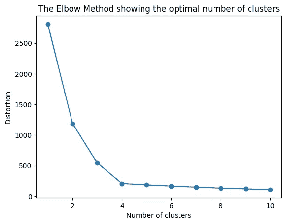
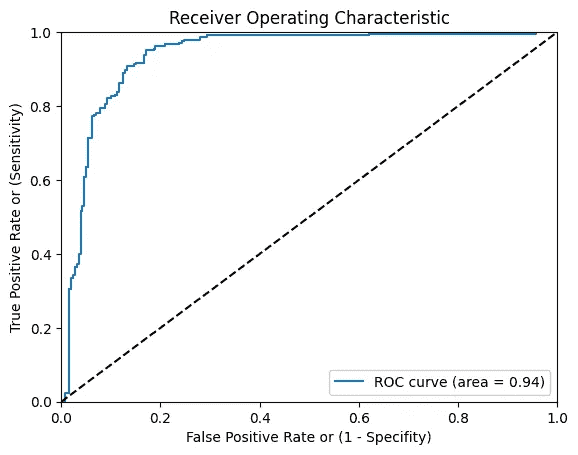
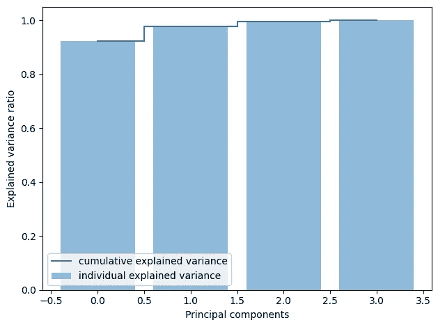
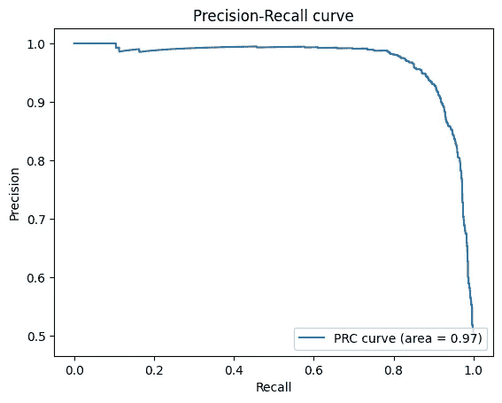

# 机器学习中的前 4 个图

> 原文：[`towardsdatascience.com/top-4-plots-in-machine-learning-b5796ba73e8d`](https://towardsdatascience.com/top-4-plots-in-machine-learning-b5796ba73e8d)

## 机器学习 | 图表 | Python

## 一份掌握机器学习所需最重要可视化的实用指南

[](https://david-farrugia.medium.com/?source=post_page-----b5796ba73e8d--------------------------------)[](https://towardsdatascience.com/?source=post_page-----b5796ba73e8d--------------------------------) [David Farrugia](https://david-farrugia.medium.com/?source=post_page-----b5796ba73e8d--------------------------------)

·发表于 [Towards Data Science](https://towardsdatascience.com/?source=post_page-----b5796ba73e8d--------------------------------) ·阅读时间 6 分钟·2023 年 6 月 16 日

--


照片由 [Firmbee.com](https://unsplash.com/@firmbee?utm_source=medium&utm_medium=referral) 提供，发表于 [Unsplash](https://unsplash.com/?utm_source=medium&utm_medium=referral)

在动态的机器学习世界中，可视化扮演着至关重要的角色。它们是数据讲述复杂故事的无声叙述者。

尤其是在机器学习的世界中，数据可视化扮演着更为重要的角色，进一步帮助我们理解模型的底层结构，并帮助我们更好地解读结果的质量。

在这篇文章中，我们将深入探讨任何机器学习爱好者必须了解的五个关键图表。

# 图 1：肘部曲线

Elbow Curve（肘部曲线）是用于确定聚类算法（如 K-Means）中最佳聚类数的极佳工具。

正如名称所示，该图通常会有一个明显的拐点（即肘部），这表示‘*甜点*’，即添加更多聚类会导致更差的聚类分离和较差的结果。

这个图表对确保我们从数据中提取有意义的聚类至关重要，而不会过拟合或欠拟合。

在需要我们指定预定聚类数的无监督算法（如 K-Means）中，肘部方法对帮助我们确定选择最佳聚类数至关重要。

这是一个生成肘部曲线的简单 Python 代码片段：

```py
from sklearn.cluster import KMeans
from sklearn.datasets import make_blobs
import matplotlib.pyplot as plt

# Generate sample data
data, _ = make_blobs(n_samples=300, centers=4, cluster_std=0.60, random_state=0)

distortions = []
for i in range(1, 11):
    km = KMeans(n_clusters=i, random_state=0)
    km.fit(data)
    distortions.append(km.inertia_)

# Plot the elbow
plt.plot(range(1, 11), distortions, marker='o')
plt.xlabel('Number of clusters')
plt.ylabel('Distortion')
plt.title('The Elbow Method showing the optimal number of clusters')
plt.show()
```



作者提供的图片

在上面的图中，我们可以看到我们正在绘制失真度与聚类数的关系。

失真是特定数据点与其聚类中心之间的欧几里得平方距离。也常使用惯性（即平方距离的总和）。

这里的目标是选择完美的权衡点。

我们希望获得低的失真/惯性值，以确保紧密的簇内相似性。同时，我们希望每个单独的簇尽可能独特。

因此，理想的情况是非常低的簇内相似性和非常高的簇间相似性。

我们通过在锐角弯折点处近似这个甜点。上述图表中，我们可以选择 3 或 4 个簇。

锐角弯折点确保我们在不饱和簇数量的情况下具有低失真值。

# 图 2：AUROC 曲线

接收者操作特征（AUROC）曲线是主要用于二分类任务的基本图表。

它衡量了整个 ROC 曲线下的二维面积，该曲线将真实正例率（灵敏度）与假正例率（1-特异性）针对不同的阈值绘制在一起。

AUROC 值的范围从 0.5（基本上是随机模型）到 1.0（完全区分模型），帮助我们量化模型性能而不依赖于阈值。

```py
from sklearn.metrics import roc_curve, auc
from sklearn.datasets import make_classification
from sklearn.model_selection import train_test_split
from sklearn.linear_model import LogisticRegression
import matplotlib.pyplot as plt

# Generate a binary classification dataset.
X, y = make_classification(n_samples=1000, n_classes=2, weights=[1,1], random_state=1)

# Split into train/test sets
X_train, X_test, y_train, y_test = train_test_split(X, y, test_size=0.5, random_state=2)

# Train a logistic regression model
model = LogisticRegression(solver='liblinear')
model.fit(X_train, y_train)

# Predict probabilities
probs = model.predict_proba(X_test)
# keep probabilities for the positive outcome only
probs = probs[:, 1]

# Compute the ROC curve
fpr, tpr, thresholds = roc_curve(y_test, probs)

# Compute the Area Under the Receiver Operating Characteristic Curve (AUROC)
roc_auc = auc(fpr, tpr)

# Plot ROC curve
plt.plot(fpr, tpr, label='ROC curve (area = %0.2f)' % roc_auc)
plt.plot([0, 1], [0, 1], 'k--')  # random predictions curve
plt.xlim([0.0, 1.0])
plt.ylim([0.0, 1.0])
plt.xlabel('False Positive Rate or (1 - Specifity)')
plt.ylabel('True Positive Rate or (Sensitivity)')
plt.title('Receiver Operating Characteristic')
plt.legend(loc="lower right")
plt.show()
```



图片来源：作者

在上面的图表中，我们看到我们的基准（黑色虚线）。

任何模型理想情况下应尽可能远离基准，并朝向图表的上半部分（即，高真实正例率但低假正例率）。

# 图 3：累积解释方差

累积解释方差图在主成分分析（PCA）中至关重要——这是一种用于降维的技术。

这个图表帮助我们确定应选择保留的主成分数量，同时保持原始方差的较大部分。

```py
from sklearn.decomposition import PCA
from sklearn.datasets import load_iris
import matplotlib.pyplot as plt
import numpy as np

# Load the data
iris = load_iris()
X = iris.data
y = iris.target

# Compute PCA
pca = PCA(n_components=4)
X_pca = pca.fit_transform(X)

# Plot the explained variances
features = range(pca.n_components_)
explained_variance = np.cumsum(pca.explained_variance_ratio_)
plt.bar(features, explained_variance, alpha=0.5,
        align='center', label='individual explained variance')
plt.step(features, explained_variance, where='mid',
         label='cumulative explained variance')
plt.ylabel('Explained variance ratio')
plt.xlabel('Principal components')
plt.legend(loc='best')
plt.tight_layout()
plt.show()
```



图片来源：作者

这里没有具体的选择值，但一个典型的经验法则是尽量保留至少 0.8 的解释方差比率。

这个过程类似于图 1 中的肘部法则。我们每次增加主成分的数量来运行各种步骤。

然后，使用解释方差图，我们可以确定保留原始方差所需的最小主成分数量。

# 图 4：精确度-召回曲线

精确度-召回曲线是另一个对二分类任务至关重要的工具，类似于 AUROC。

它说明了**精确度**（*分类器不将负样本标记为正样本的能力*）和**召回率**（*分类器找到所有正样本的能力*）之间的权衡。

这个图表在处理不平衡数据集时尤其有用。

```py
from sklearn.metrics import precision_recall_curve
from sklearn.metrics import auc
from sklearn.datasets import make_classification
from sklearn.model_selection import train_test_split
from sklearn.linear_model import LogisticRegression
import matplotlib.pyplot as plt

# Generate a binary classification dataset.
X, y = make_classification(n_samples=5000, n_classes=2, weights=[1,1], random_state=1)

# Split into train/test sets
X_train, X_test, y_train, y_test = train_test_split(X, y, test_size=0.5, random_state=2)

# Train a logistic regression model
model = LogisticRegression(solver='liblinear')
model.fit(X_train, y_train)

# Predict probabilities
probs = model.predict_proba(X_test)
# keep probabilities for the positive outcome only
probs = probs[:, 1]

# Compute the precision-recall curve
precision, recall, thresholds = precision_recall_curve(y_test, probs)
# Compute the area under the precision-recall curve
pr_auc = auc(recall, precision)

plt.plot(recall, precision, label='PRC curve (area = %0.2f)' % pr_auc)
plt.xlabel('Recall')
plt.ylabel('Precision')
plt.title('Precision-Recall curve')
plt.legend(loc="lower right")
plt.show()
```



图片来源：作者

# 总结性评述

总结来说，这四个图表是数据科学家工具箱中的强大工具。

通过明智地使用这些可视化图表，你可以从数据中提取有意义的见解，诊断模型性能，并有效地传达你的发现。

掌握这些图表不仅有助于理解手头的数据，还能在模型选择和超参数调整方面做出明智的决策。因此，保持这些可视化工具的便利，让你的机器学习故事展开。

**你喜欢这篇文章吗？每月$5，你可以成为会员，解锁 Medium 的无限访问权限。你将直接支持我和 Medium 上的所有其他喜爱作者。非常感谢！**

[](https://david-farrugia.medium.com/membership?source=post_page-----b5796ba73e8d--------------------------------) [## 使用我的推荐链接加入 Medium - David Farrugia

### 获取我所有⚡优质⚡内容的独家访问权，并在 Medium 上无限制地浏览。通过购买我一个…

[david-farrugia.medium.com](https://david-farrugia.medium.com/membership?source=post_page-----b5796ba73e8d--------------------------------)

# 想要联系我？

我很想听听你对这个话题的想法，或任何有关 AI 和数据的内容。

如需联系，请发送邮件至***davidfarrugia53@gmail.com***。

[Linkedin](https://www.linkedin.com/in/david-farrugia/)
