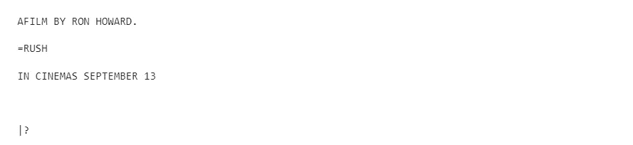
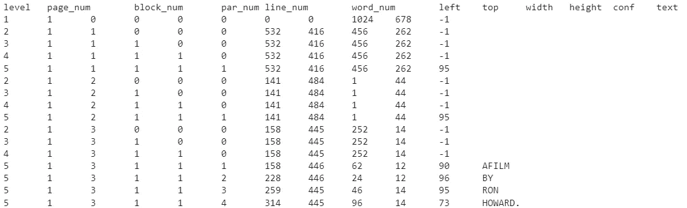
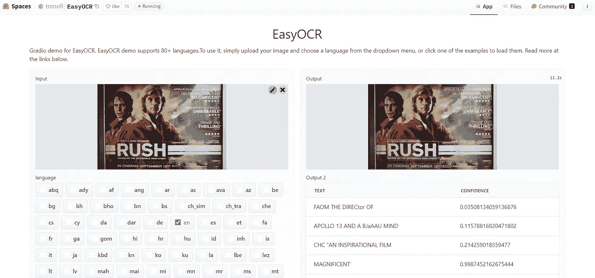
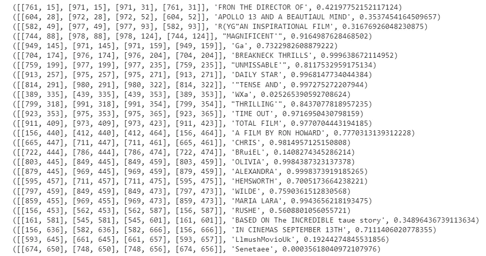
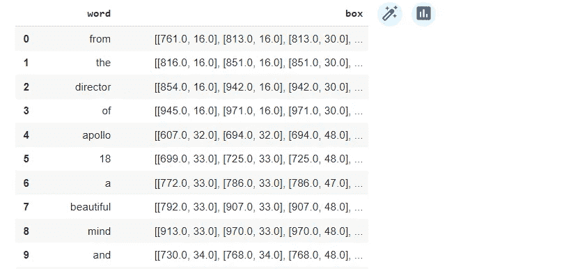
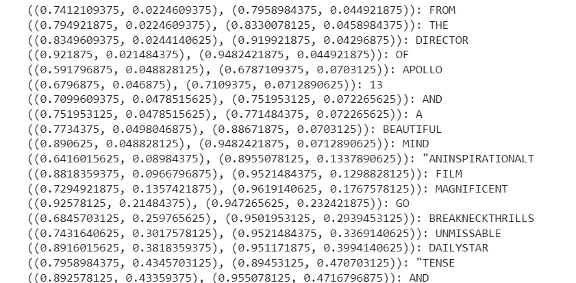

# 从图像中提取文本的前 5 个 Python 库

> 原文：[`towardsdatascience.com/top-5-python-libraries-for-extracting-text-from-images-c29863b2f3d`](https://towardsdatascience.com/top-5-python-libraries-for-extracting-text-from-images-c29863b2f3d)

## 理解和掌握 OCR 工具，用于文本定位和识别

[](https://eugenia-anello.medium.com/?source=post_page-----c29863b2f3d--------------------------------)[](https://towardsdatascience.com/?source=post_page-----c29863b2f3d--------------------------------) [Eugenia Anello](https://eugenia-anello.medium.com/?source=post_page-----c29863b2f3d--------------------------------)

·发表于 [Towards Data Science](https://towardsdatascience.com/?source=post_page-----c29863b2f3d--------------------------------) ·7 分钟阅读·2023 年 7 月 25 日

--


图片由 [Anna Sullivan](https://unsplash.com/@aesullivan2010) 提供，来源于 [Unsplash](https://unsplash.com/photos/NFS3ekDQnlg)

光学字符识别是一个古老但依然具有挑战性的问题，它涉及从非结构化数据中检测和识别文本，包括图像和 PDF 文档。它在银行业务、电子商务和社交媒体内容审查中有很酷的应用。

但是，与数据科学中的所有主题一样，学习如何解决 OCR 任务时有大量资源。这就是为什么我写这个教程，希望它能帮助你入门。

在这篇文章中，我将展示一些 Python 库，它们可以让你快速提取图像中的文本，而不会过多地挣扎。对库的解释后跟一个实际的示例。使用的数据集来自 [Kaggle](https://www.kaggle.com/datasets/robikscube/textocr-text-extraction-from-images-dataset?select=annot.csv)。为了简化概念，我只使用了一张电影《Rush》的图像。

开始吧！


图像来自 textOCR 数据集。 [来源](https://textvqa.org/textocr/download/)。

## **目录：**

1.  **pytesseract**

1.  **EasyOCR**

1.  **Keras-OCR**

1.  **TrOCR**

1.  **docTR**

## 1\. pytesseract

这是最受欢迎的 Python 光学字符识别库之一。它使用 [Google 的 Tesseract-OCR 引擎](https://github.com/tesseract-ocr/tesseract) 从图像中提取文本。支持多种语言。如果你想查看你的语言是否被支持，可以查看 [这里](https://tesseract-ocr.github.io/tessdoc/Data-Files-in-different-versions.html)。你只需要几行代码就可以将图像转换为文本：

```py
# installation
!sudo apt install tesseract-ocr
!pip install pytesseract

import pytesseract
from pytesseract import Output
from PIL import Image
import cv2

img_path1 = '00b5b88720f35a22.jpg'
text = pytesseract.image_to_string(img_path1,lang='eng')
print(text)
```

这是输出结果：



我们还可以尝试获取从图像中检测到的每个项的边界框坐标。

```py
# boxes around character
print(pytesseract.image_to_boxes(img_path1))
```

这是结果：

```py
~ 532 48 880 50 0
...
A 158 220 171 232 0
F 160 220 187 232 0
I 178 220 192 232 0
L 193 220 203 232 0
M 204 220 220 232 0
B 228 220 239 232 0
Y 240 220 252 232 0
R 259 220 273 232 0
O 274 219 289 233 0
N 291 220 305 232 0
H 314 220 328 232 0
O 329 219 345 233 0
W 346 220 365 232 0
A 364 220 379 232 0
R 380 220 394 232 0
D 395 220 410 232 0
...
```

如你所见，它估计了每个字符的边界框，而不是每个单词的边界框！如果我们想提取每个单词的边界框，可以使用另一种方法而不是 image_to_boxes：

```py
# boxes around words
print(pytesseract.image_to_data(img_path1))
```



作者插图

返回的结果并不是很完美。例如，它将“AFILM”解释为一个唯一的词。此外，它没有检测到和识别输入图像中的所有单词。

## 2\. EasyOCR



来自 [网络演示](https://huggingface.co/spaces/tomofi/EasyOCR)的截图

轮到另一个开源 Python 库：EasyOCR。与 pytesseract 类似，它支持 [80+ 种语言](https://www.jaided.ai/easyocr/)。你可以通过网络演示快速轻松地尝试，无需编写任何代码。它使用 [CRAFT](https://arxiv.org/abs/1904.01941) 算法来检测文本，使用 [CRNN](https://arxiv.org/abs/1507.05717) 作为识别模型。此外，这些模型是用 Pytorch 实现的。

如果你在 Google Colab 上工作，我建议你设置 GPU，这有助于加速这个框架。

这是利用该工具的代码行：

```py
# installation
!pip install easyocr

import easyocr

reader = easyocr.Reader(['en'])
extract_info = reader.readtext(img_path1)

for el in extract_info:
   print(el)
```



作者插图

我们轻松地使用 EasyOCR 检测和识别了文本。与 pytesseract 相比，结果要好得多。对于每个检测到的文本，我们还获得了边界框和置信度水平。

## 3\. Keras-OCR

Keras-OCR 是另一个专门用于光学字符识别的开源库。与 EasyOCR 类似，它利用 CRAFT 检测模型和 CRNN 识别模型来解决任务。与 EasyOCR 的不同之处在于，它使用 Keras 实现，而不是 Pytorch。Keras-OCR 唯一的缺点是它忽略了非英语语言。

```py
# installation
!pip install keras-ocr -q

import keras_ocr

pipeline = keras_ocr.pipeline.Pipeline()
extract_info = pipeline.recognize([img_path1])
print(extract_info[0][0])
```

这是提取的第一个单词的输出：

```py
('from',
 array([[761.,  16.],
        [813.,  16.],
        [813.,  30.],
        [761.,  30.]], dtype=float32))
```

为了可视化所有结果，我们将输出转换为 Pandas Dataframe：

```py
diz_cols = {'word':[],'box':[]}
for el in extract_info[0]:
    diz_cols['word'].append(el[0])
    diz_cols['box'].append(el[1])
kerasocr_res = pd.DataFrame.from_dict(diz_cols)
kerasocr_res
```



作者插图

神奇的是，我们可以看到结果更加清晰和准确。

## 4\. TrOCR

TrOCR 是一个基于变换器的生成图像模型，用于从图像中检测文本。它由**编码器**和**解码器**组成：TrOCR 使用预训练的图像变换器作为编码器和预训练的文本变换器作为解码器。有关更多详细信息，请查看 [论文](https://arxiv.org/abs/2109.10282)。在[Hugging Face 平台](https://huggingface.co/docs/transformers/model_doc/trocr)上也有该库的良好文档。

首先，我们加载预训练的模型：

```py
# installation
!pip install transformers

from transformers import TrOCRProcessor, VisionEncoderDecoderModel
from PIL import Image

model_version = "microsoft/trocr-base-printed"
processor = TrOCRProcessor.from_pretrained(model_version)
model = VisionEncoderDecoderModel.from_pretrained(model_version)
```

在传递图像之前，我们需要调整大小并进行标准化。一旦图像被转换，我们可以使用 `.generate()` 方法提取文本。

```py
image = Image.open(img_path1).convert("RGB")
pixel_values = processor(image, return_tensors="pt").pixel_values
generated_ids = model.generate(pixel_values)
extract_text = processor.batch_decode(generated_ids, skip_special_tokens=True)[0]
print('output: ',extract_text)
# output: 2.50
```

与之前的库不同，它返回一个无意义的数字。为什么？TrOCR 仅包括识别模型，而不包括检测模型。为了解决 OCR 任务，需要首先检测图像中的对象，然后从输入中提取文本。由于它只关注最后一步，因此性能不佳。

为了使其运行良好，最好使用边界框裁剪图像的特定部分，如下所示：

```py
crp_image = image.crop((750, 3.4, 970, 33.94))
display(crp_image)
```


作者插图

然后，我们尝试再次应用模型：

```py
pixel_values = processor(crp_image, return_tensors="pt").pixel_values
generated_ids = model.generate(pixel_values)
extract_text = processor.batch_decode(generated_ids, skip_special_tokens=True)[0]
print(extract_text)
```


作者插图

这要好得多！这个操作可以对图像中的每个单词/短语重复进行。

## 5. docTR

最后，我们介绍用于从文档中进行文本检测和识别的最后一个 Python 包：docTR。它可以将文档解释为 PDF 或图像，然后传递给两个阶段的方法。在 docTR 中，有一个文本检测模型（[DBNet](https://mindee.github.io/doctr/latest/modules/models.html#doctr-models-detection)或[LinkNet](https://mindee.github.io/doctr/latest/modules/models.html#doctr-models-detection)）然后是用于文本识别的[CRNN](https://mindee.github.io/doctr/latest//modules/models.html#doctr-models-recognition)模型。该库要求安装 Pytorch 和 Tensorflow，因为实现是用这两个深度学习框架完成的。

```py
! pip install python-doctr
# for TensorFlow
! pip install "python-doctr[tf]"
# for PyTorch
! pip install "python-doctr[torch]"
```

然后，我们导入使用 docTR 所需的相关库并加载模型，这是一种两步法。确实，我们需要指定带有 ResNet-50 骨干网的 DBNet 和带有 VGG-16 骨干网的 CRNN 用于文本检测和文本识别：

```py
from doctr.io import DocumentFile
from doctr.models import ocr_predictor
model = ocr_predictor(det_arch = 'db_resnet50',
                      reco_arch = 'crnn_vgg16_bn',
                      pretrained = True
                     )
```

然后，我们可以最终读取文件，使用预训练模型并将输出导出为嵌套字典：

```py
# read file
img = DocumentFile.from_images(img_path1)

# use pre-trained model
result = model(img)

# export the result as a nested dict
extract_info = result.export()
```

这是非常长的输出：

```py
{'pages': [{'page_idx': 0, 'dimensions': (678, 1024), 'orientation': {'value': None, 'confidence': None},...
```

为了更好地可视化，最好使用双重循环，只提取我们感兴趣的信息：

```py
for obj1 in extract_info['pages'][0]["blocks"]:
    for obj2 in obj1["lines"]:
        for obj3 in obj2["words"]:
            print("{}: {}".format(obj3["geometry"],obj3["value"]))
```



作者插图

太好了！docTR 是另一个提取图像或 PDF 中有价值信息的好选项。

## 最后的想法：

这五个 Python 库可能对你的 OCR 项目有用。这些工具各有优缺点。选择这些包的第一件事是考虑你分析的数据的语言。如果你考虑非英语语言，EasyOCR 可能是覆盖语言和性能的最佳选择。如果你有其他建议，请在这里评论。希望你觉得这篇文章对开始使用 OCR 有所帮助。如果你想查看这些 OCR 模型返回的完整输出，GitHub 代码在[这里](https://github.com/eugeniaring/Medium-Articles/blob/main/CV/OCR_libraries.ipynb)。祝你有美好的一天！

*免责声明：该数据集根据[CC 4.0](https://textvqa.org/textocr/download/)国际许可协议授权使用*

你喜欢我的文章吗？[*成为会员*](https://eugenia-anello.medium.com/membership) *即可每天无限制访问新的数据科学文章！这是一种支持我的间接方式，且不会增加你的额外成本。如果你已经是会员，* [*订阅*](https://eugenia-anello.medium.com/subscribe) *以便每当我发布新的数据科学和 Python 指南时，你都会收到邮件！*
