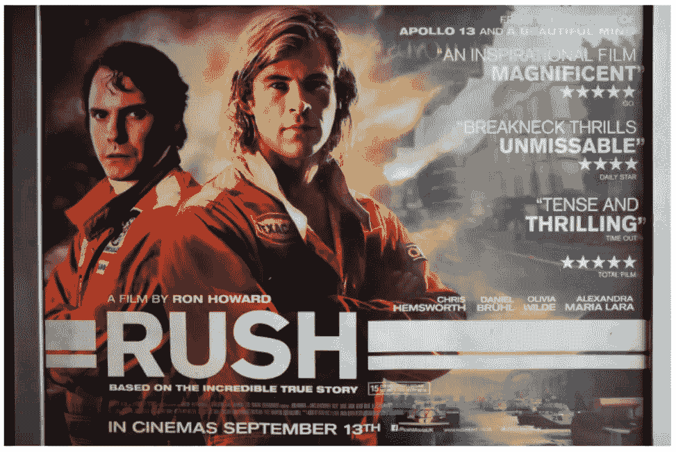

# 提取图像文本的前 5 个 Python 库

> 原文：[`towardsdatascience.com/top-5-python-libraries-for-extracting-text-from-images-c29863b2f3d?source=collection_archive---------1-----------------------#2023-07-25`](https://towardsdatascience.com/top-5-python-libraries-for-extracting-text-from-images-c29863b2f3d?source=collection_archive---------1-----------------------#2023-07-25)

## 理解和掌握用于文本定位和识别的 OCR 工具

 [尤金尼亚·安内洛](https://eugenia-anello.medium.com/?source=post_page-----c29863b2f3d--------------------------------)

·

[关注](https://medium.com/m/signin?actionUrl=https%3A%2F%2Fmedium.com%2F_%2Fsubscribe%2Fuser%2F86fdc517c278&operation=register&redirect=https%3A%2F%2Ftowardsdatascience.com%2Ftop-5-python-libraries-for-extracting-text-from-images-c29863b2f3d&user=Eugenia+Anello&userId=86fdc517c278&source=post_page-86fdc517c278----c29863b2f3d---------------------post_header-----------) 发表在 [Towards Data Science](https://towardsdatascience.com/?source=post_page-----c29863b2f3d--------------------------------) · 7 分钟阅读 · 2023 年 7 月 25 日

--

照片由 [安娜·沙利文](https://unsplash.com/@aesullivan2010) 拍摄，发布于 [Unsplash](https://unsplash.com/photos/NFS3ekDQnlg)

光学字符识别是一个古老但仍然具有挑战性的问题，涉及从非结构化数据中检测和识别文本，包括图像和 PDF 文档。它在银行、电子商务和社交媒体内容审核中有很酷的应用。

但是，与数据科学中的一切主题一样，学习如何解决 OCR 任务有大量的资源。这就是我撰写这个教程的原因，它可以帮助你入门。

在这篇文章中，我将展示一些可以快速从图像中提取文本的 Python 库，而不需要过多挣扎。库的解释后面跟着一个实际的例子。使用的数据集来自 [Kaggle](https://www.kaggle.com/datasets/robikscube/textocr-text-extraction-from-images-dataset?select=annot.csv)。为了简化概念，我仅使用了电影《Rush》的图像。

让我们开始吧！

来自 textOCR 数据集的图像。[来源](https://textvqa.org/textocr/download/)。

## **目录：**

1.  **pytesseract**

1.  **EasyOCR**

1.  **Keras-OCR**
