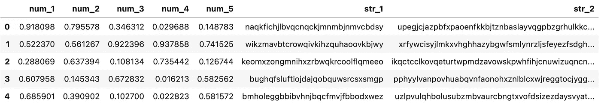
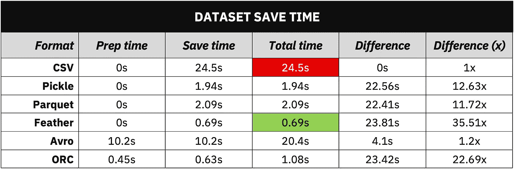
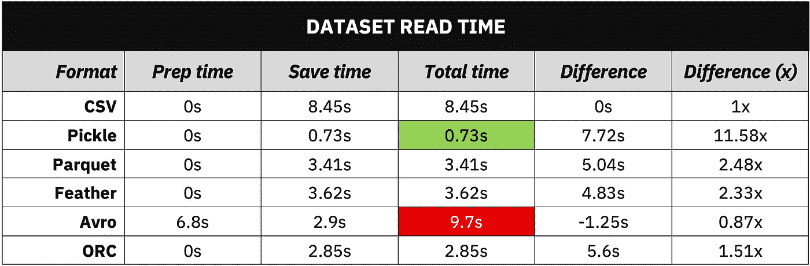
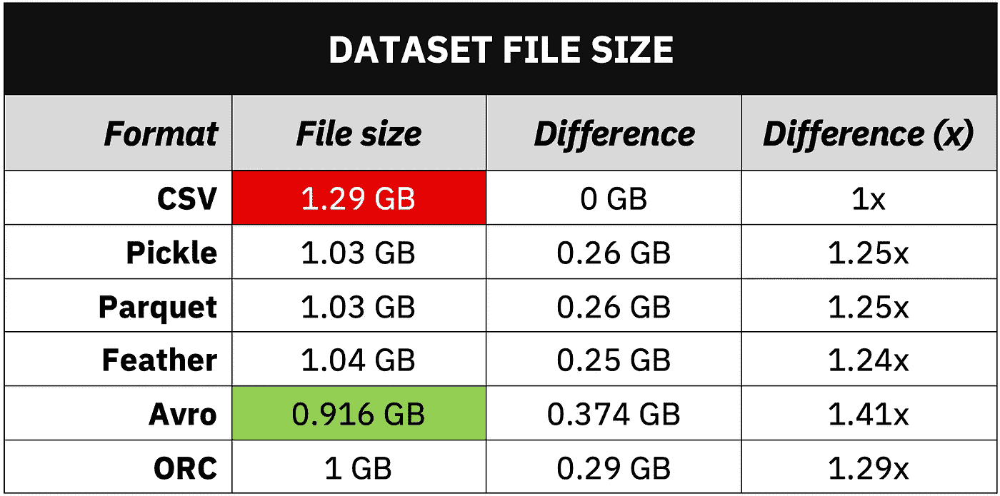

# 顶级的 5 种 CSV 替代方案

> 原文：[`towardsdatascience.com/top-5-ridiculously-better-csv-alternatives-595f70a9c936`](https://towardsdatascience.com/top-5-ridiculously-better-csv-alternatives-595f70a9c936)

## 大数据存储的 CSV 文件？再想想 — 这里有一些更好的选择。这五种格式将节省 IO 时间和磁盘空间。

[](https://medium.com/@radecicdario?source=post_page-----595f70a9c936--------------------------------)[](https://towardsdatascience.com/?source=post_page-----595f70a9c936--------------------------------) [Dario Radečić](https://medium.com/@radecicdario?source=post_page-----595f70a9c936--------------------------------)

·发表于[Towards Data Science](https://towardsdatascience.com/?source=post_page-----595f70a9c936--------------------------------) ·阅读时长 6 分钟·2023 年 1 月 5 日

--


图片由[Maximalfocus](https://unsplash.com/@maximalfocus?utm_source=medium&utm_medium=referral)提供，来源于[Unsplash](https://unsplash.com/?utm_source=medium&utm_medium=referral)

每个人都知道 CSV，但它真的适合你 100%使用吗？其实不是。它有一些明显的优点，比如直接文件编辑和易于理解，但缺点可能会让你在磁盘空间和 I/O 时间上花费上千美元。

今天我会向你展示顶级的 CSV 替代方案，提供详细的解释、代码，最重要的是 — 数字。你将准确了解替代文件格式的速度，以及何时使用它们。

# CSV 格式的问题是什么？

完全没有问题。它允许你直接编辑文件，而无需像 Python 这样的编程语言来加载它们。此外，你可以直接将其发送给非技术人员客户，他们将能够顺利打开并理解内容。

一切都是阳光明媚的，直到文件变得太大而无法分享，太大而无法在 Excel 中打开，或者大到你需要升级你的云存储计划。

对于包含数百万行的数据集，你甚至不应该考虑将它们保存为 CSV 文件格式。你不会将这样的数据集发送给非技术人员客户，也不会在 Excel 中打开它。

这时其他文件格式或 CSV 替代方案就显得重要了。接下来我们来逐一介绍它们。

# 节省时间和空间的 5 种 CSV 替代方案

当处理巨大的表格数据集时，我发现这些文件格式比 CSV 要好得多：

+   Pickle

+   Parquet

+   Feather

+   Avro

+   ORC

我将用几句话解释每种格式，并展示如何在 Python 中使用它们。

## Pickle

您可以使用 Python 的 `pickle` 库将 Python 对象序列化为紧凑的二进制表示。它允许您存储或 *pickle* 任何 Python 对象，而不仅仅是 Pandas DataFrames。它通常用于保存机器学习模型。

Pickle 最大的缺点是它是 Python 特有的，因此跨语言支持不能保证。

要将 Pandas DataFrame 转储为 pickle 文件格式，请使用：

```py
import pickle

with open('path/to/df.pkl', 'wb') as f:
    pickle.dump(df, f)
```

要读取 Pickle 文件，请使用：

```py
import pickle

with open('path/to/df.pkl', 'rb') as f:
    df = pickle.load(f)
```

## Parquet

Apache Parquet 是一种为高效设计的数据存储格式。其背后的原因是列存储架构，因为它允许您快速跳过不相关的数据。最棒的是 — Pandas 完全原生支持 Parquet。

要将 Pandas DataFrame 写入 Parquet 文件，请运行：

```py
df.to_parquet('file_name.parquet')
```

要将 Parquet 文件读取到 Pandas DataFrame 中，请运行：

```py
df = pd.read_parquet('file_name.parquet')
```

## Feather

Feather 是一种用于存储数据帧的数据格式。它设计用于尽可能高效地将数据帧进出内存。它的主要用途是实现 Python 和 R 之间的快速通信，但不仅限于此。

要将 Pandas DataFrame 转储到 Feather 文件中，请运行：

```py
import feather

feather.write_dataframe(df, 'file_name.feather')
```

要将 Feather 文件读取为 Pandas DataFrame，请运行：

```py
import feather

df = feather.read_dataframe('file_name.feather')
```

## Avro

Avro 是一个开源项目，为 Apache Hadoop 提供数据序列化和交换服务。它与数据一起存储 JSON 类似的 schema，您必须先手动编写和解析它。

要将 Pandas DataFrame 保存为 Avro 文件，请运行：

```py
from fastavro import writer, parse_schema

# 1\. Define the schema
schema = {
    'doc': 'name',
    'name': 'name',
    'namespace': 'name',
    'type': 'record',
    'fields': [
        {'name': 'a', 'type': 'float'},
        {'name': 'b', 'type': 'string'},
        ...
    ]
}
parsed_schema = parse_schema(schema)

# 2\. Convert pd.DataFrame to records - list of dictionaries
records = df.to_dict('records')

# 3\. Write to Avro file
with open('file_name.avro', 'wb') as out:
    writer(out, parsed_schema, records)
```

这非常多，尤其是当您有很多列时。读取 Avro 文件并将其转换为 Pandas DataFrame 也是一个三步过程：

```py
from fastavro import reader

# 1\. List to store the records
avro_records = []

# 2\. Read the Avro file
with open('file_name.avro', 'rb') as fo:
    avro_reader = reader(fo)
    for record in avro_reader:
        avro_records.append(record)

# 3\. Convert to pd.DataFrame
df = pd.DataFrame(avro_records)
```

## ORC

ORC 代表 *Optimized Row Columnar*。这是一个优化了 Hive 中读取和写入的数据格式。在 Python 中，您可以使用 Pandas 的 `read_orc()` 函数读取 ORC 文件。没有用于写入 ORC 文件的替代函数，因此您必须使用 PyArrow。

```py
import pyarrow as pa
import pyarrow.orc as orc 

table = pa.Table.from_pandas(df, preserve_index=False)
orc.write_table(table, 'file_name.orc')
```

读取 ORC 文件要简单得多：

```py
df = pd.read_orc('file_name.orc')
```

现在我们将设置一个 Python 基准测试脚本，并比较这些顶级 CSV 替代品在 Python 和 Pandas 中的表现。

# 前 5 个 CSV 替代品 — Python 中的基准测试

对于这个基准测试，我决定创建一个包含 5 个数值列和 2 个文本列的 5M 行 Pandas DataFrame。我使用了 M1 Pro MacBook Pro（10 核 CPU，16 GB RAM）进行基准测试，因此您的结果可能会有所不同。

如果您想重新创建它，这里是代码片段：

```py
import random
import string
import numpy as np
import pandas as pd
np.random.seed = 42

def get_random_string(length):
    letters = string.ascii_lowercase
    return ''.join(random.choice(letters) for i in range(length))

df_size = 5_000_000

df = pd.DataFrame({
    'num_1': np.random.rand(df_size),
    'num_2': np.random.rand(df_size),
    'num_3': np.random.rand(df_size),
    'num_4': np.random.rand(df_size),
    'num_5': np.random.rand(df_size),
    'str_1': [get_random_string(length=32) for x in range(df_size)],
    'str_2': [get_random_string(length=128) for x in range(df_size)]
})
```

这就是数据集的样子：



图片 1 — 合成的 5M 行数据集（图片来源：作者）

接下来，让我们看看基准测试结果 — 包括文件保存/读取和文件大小。

## 基准测试结果 — 数据集保存时间

将 5M 行数据集保存为 CSV 文件花费了最多的时间 — 24.5 秒。CSV 替代品如 Feather 仅需 0.69 秒，速度快了 35 倍：



图片 2 — 数据集保存时间比较（图片来源：作者）

你可以看到这种模式在大多数顶级 CSV 替代方案中重复出现。Avro 文件格式在保存时间上与 CSV 最接近，只是因为解析模式和将数据集转换为字典花费了一些时间（*准备时间*列）。

让我们看看读取时间的比较。

## 基准结果 — 数据集读取时间

我们没有看到数据集读取时间有显著的差异。Pandas 读取一个 5M 行的 CSV 文件花费了 8.45 秒，如果考虑到准备时间，像 Avro 这样的替代方案甚至更慢：



图 3 — 数据集读取时间比较（图片作者提供）

Pickle 文件格式在这里表现突出，但它是 Python 特定的数据格式，这也是你在多语言环境中不常见的原因。除此之外，Parquet 看起来很有前途，读取时间减少了约 2.5 倍。

## 基准结果 — 数据集文件大小

最后，让我们看看每种顶级 CSV 替代方案的文件大小：



图 4 — 数据集文件大小比较（图片作者提供）

这些差异并不大，但大多数替代方案能提供约 20%-25%的文件大小减少。Avro 在这里明显胜出，因此如果你更倾向于小文件大小且不在乎 IO 速度，可以使用这种文件格式。

# 总结数据科学中的顶级 CSV 替代方案

CSV 文件格式并不会消失。如果你需要与希望在 Excel 中查看数据的商业客户共享数据，它仍然是最常用的格式（仅次于 XLSX）。大多数商业用户不了解 Avro 或 Parquet 的含义，因此在这种情况下还是使用 CSV 吧。

如果你在支付云计算资源和存储费用，那么优化数据存储方式可以在长远中为你节省大量金钱。如果你确定只使用 Python，请使用 Pickle；如果小文件大小至关重要，请选择 Avro；或者选择 Parquet、ORC 或 Feather 等替代方案，以在文件大小和 IO 速度之间取得最佳平衡。几乎所有的选择都比 CSV 要好。

*你最喜欢哪种文件格式来存储大型数据集？* 请在下方评论区告诉我。

*喜欢这篇文章？成为* *Medium 会员* *以无限制地继续学习。如果你使用以下链接，我将获得你会员费的一部分，而你无需支付额外费用。*

[](https://medium.com/@radecicdario/membership?source=post_page-----595f70a9c936--------------------------------) [## 使用我的推荐链接加入 Medium - 达里奥·拉德齐奇

### 阅读达里奥·拉德齐奇的所有故事（以及 Medium 上的其他成千上万名作家的故事）。你的会员费将直接支持...

medium.com](https://medium.com/@radecicdario/membership?source=post_page-----595f70a9c936--------------------------------)

*最初发表于* [*https://betterdatascience.com*](https://betterdatascience.com/top-csv-alternatives/) *2023 年 1 月 5 日。*
