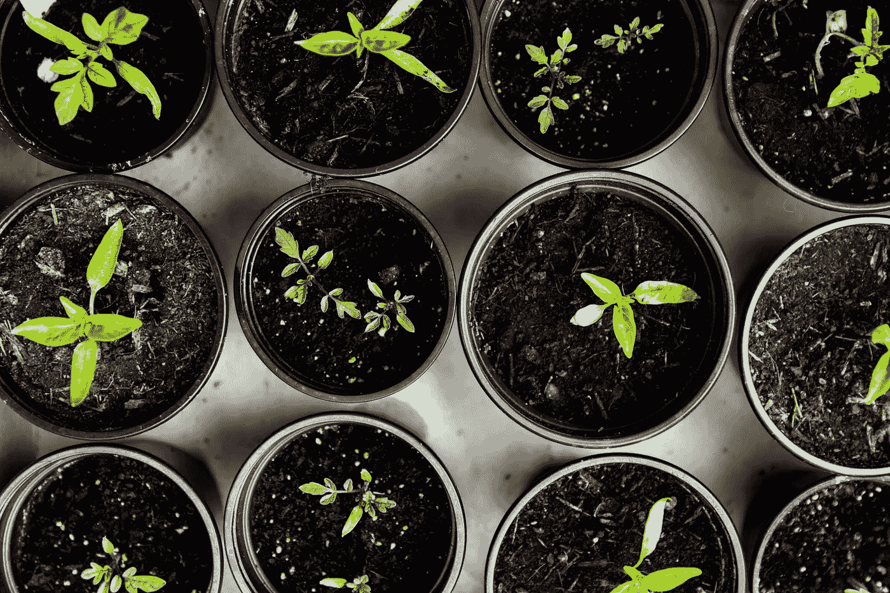

# 2023 年值得阅读的数据科学和机器学习顶级书籍

> 原文：[`towardsdatascience.com/top-data-science-and-machine-learning-books-to-read-in-2023-5a0a82876f0?source=collection_archive---------7-----------------------#2023-05-23`](https://towardsdatascience.com/top-data-science-and-machine-learning-books-to-read-in-2023-5a0a82876f0?source=collection_archive---------7-----------------------#2023-05-23)

## 跟上时代步伐：通过这些杰出的数据科学和机器学习书籍来学习和成长

 [Dan @ Overnight Oak](https://medium.com/@overnightoak?source=post_page-----5a0a82876f0--------------------------------)

·

[关注](https://medium.com/m/signin?actionUrl=https%3A%2F%2Fmedium.com%2F_%2Fsubscribe%2Fuser%2Ff0636962dd83&operation=register&redirect=https%3A%2F%2Ftowardsdatascience.com%2Ftop-data-science-and-machine-learning-books-to-read-in-2023-5a0a82876f0&user=Dan+%40+Overnight+Oak&userId=f0636962dd83&source=post_page-f0636962dd83----5a0a82876f0---------------------post_header-----------) 发布于 [Towards Data Science](https://towardsdatascience.com/?source=post_page-----5a0a82876f0--------------------------------) ·9 分钟阅读·2023 年 5 月 23 日

--

图片由 [Markus Spiske](https://unsplash.com/@markusspiske?utm_source=medium&utm_medium=referral) 提供，来源于 [Unsplash](https://unsplash.com/?utm_source=medium&utm_medium=referral)

正如最近《福布斯》杂志所强调的，持续学习是推动职业发展的最有效策略之一。

这种建议在不断发展的数据科学和机器学习领域尤为真实。

在过去的一年里，我们见证了人工智能（AI）领域的惊人进展，最显著的是 ChatGPT 的发布。这些突破不断提醒我们行业的快速发展以及持续个人发展的重要性。

由[Levart_Photographer](https://unsplash.com/@siva_photography?utm_source=medium&utm_medium=referral)拍摄，来自[Unsplash](https://unsplash.com/?utm_source=medium&utm_medium=referral)

如今，数据科学资源浩如烟海，寻找优质学习内容可能感觉像是一项无休无止的任务。

很容易被淹没在任务中，丧失动力。

我整理了一份精选书单，帮助你避免这些问题，并节省一些宝贵的时间。这些宝贵的书籍在我自己的数据科学旅程中提供了无价的见解，我相信它们也会为你带来…
