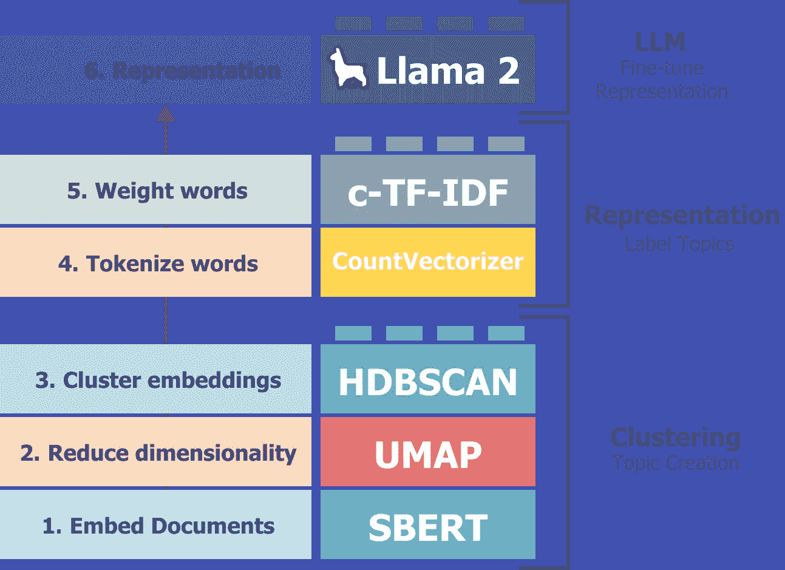
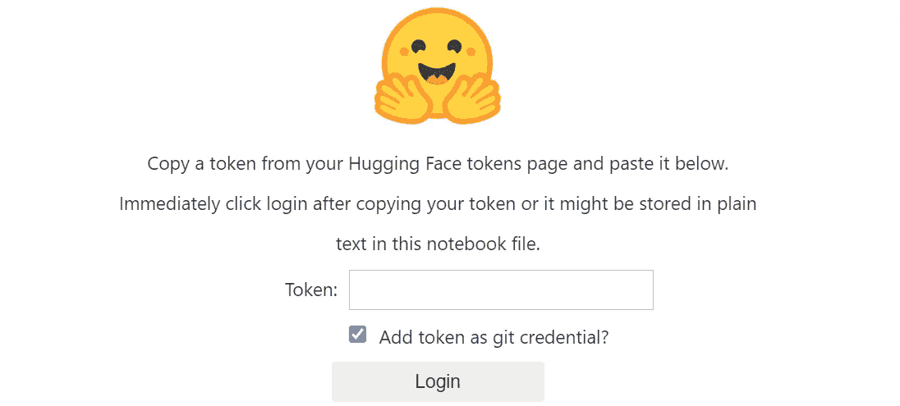
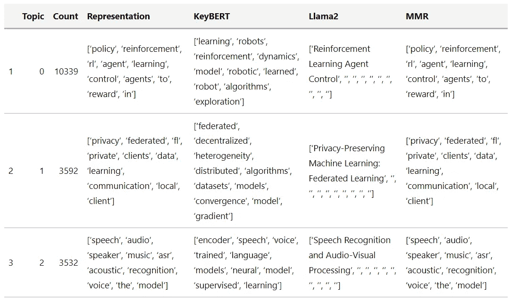
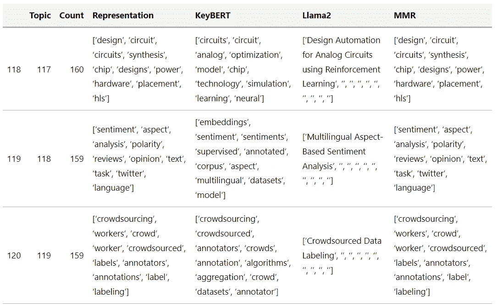
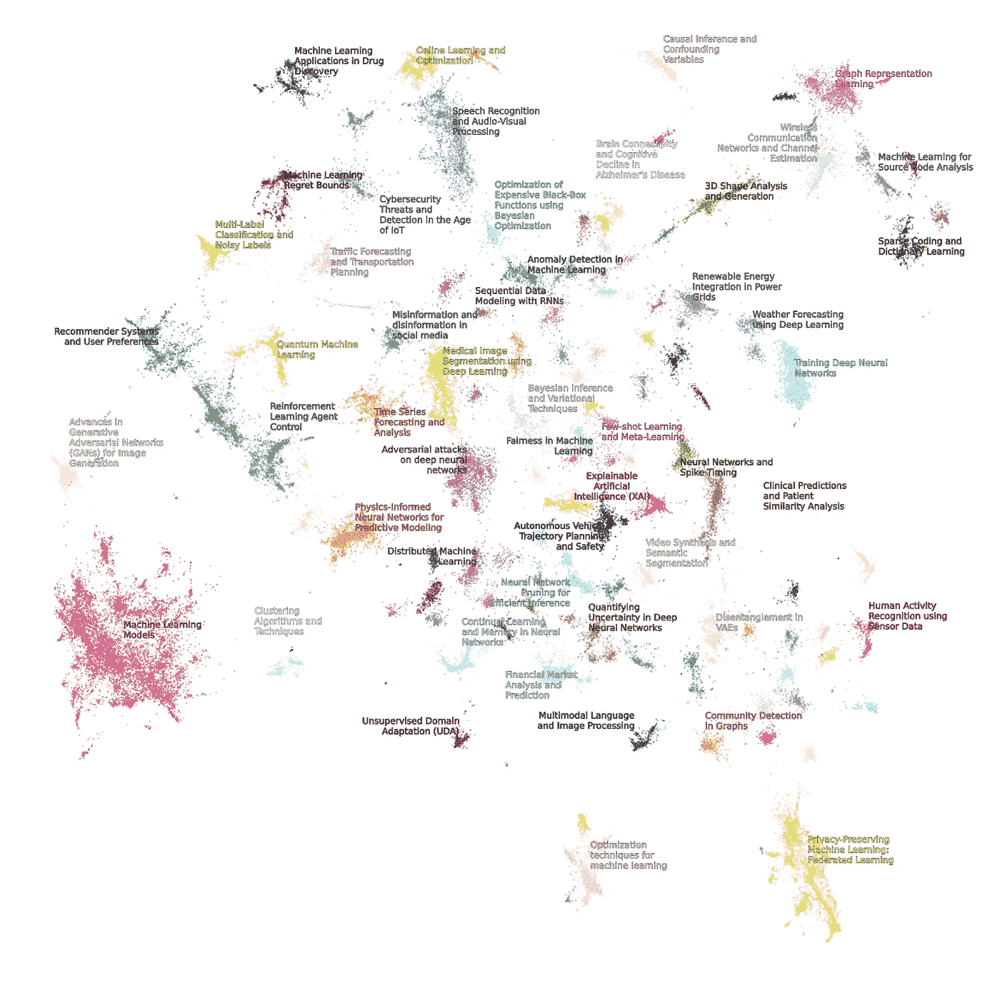

# 使用 Llama 2 进行主题建模

> 原文：[`towardsdatascience.com/topic-modeling-with-llama-2-85177d01e174`](https://towardsdatascience.com/topic-modeling-with-llama-2-85177d01e174)


## 使用大型语言模型创建易于解释的主题

[](https://medium.com/@maartengrootendorst?source=post_page-----85177d01e174--------------------------------)[](https://towardsdatascience.com/?source=post_page-----85177d01e174--------------------------------) [Maarten Grootendorst](https://medium.com/@maartengrootendorst?source=post_page-----85177d01e174--------------------------------)

·发表于[Towards Data Science](https://towardsdatascience.com/?source=post_page-----85177d01e174--------------------------------) ·12 分钟阅读·2023 年 8 月 22 日

--

随着**Llama 2**的出现，本地运行强大的 LLM 已变得越来越现实。其准确性接近 OpenAI 的 GPT-3.5，适用于许多用例。

在这篇文章中，我们将探讨如何使用 Llama2 进行主题建模，而无需将每一个文档传递给模型。相反，我们将利用[**BERTopic**](https://github.com/MaartenGr/BERTopic)，这是一种模块化的主题建模技术，可以使用任何 LLM 来微调主题表示。

BERTopic 的工作原理非常简单。它包括 5 个顺序步骤：

1.  嵌入文档

1.  降低嵌入的维度

1.  聚类减少的嵌入

1.  按聚类对文档进行分词

1.  提取每个聚类的最佳代表词


BERTopic 的 5 个主要步骤。

然而，随着**Llama 2**等 LLM 的兴起，我们可以做得比每个主题的一堆独立单词更好。直接将所有文档传递给 Llama 2 并让其分析是不切实际的。我们可以使用向量数据库进行搜索，但我们不完全确定要搜索哪些主题。

相反，我们将利用由 BERTopic 创建的聚类和主题，并让 Llama 2 对这些信息进行微调和提炼，以获得更准确的结果。

这是两全其美的最佳方案，即 BERTopic 的主题创建和 Llama 2 的主题表示。



Llama 2 使我们能够微调 BERTopic 生成的主题表示。

现在介绍部分已经完成，我们开始实际操作教程吧！

我们将开始安装我们将在整个示例中使用的几个包：

```py
pip install bertopic datasets accelerate bitsandbytes xformers adjustText
```

请注意，您至少需要一块 T4 GPU 才能运行这个示例，它可以与免费的 Google Colab 实例一起使用。

🔥 **提示**：你也可以跟随 [Google Colab Notebook](https://colab.research.google.com/drive/1QCERSMUjqGetGGujdrvv_6_EeoIcd_9M?usp=sharing) 一起操作。

# [📄](https://emojipedia.org/page-facing-up) 数据

我们将对大量 ArXiv 摘要应用主题建模。它们是进行主题建模的绝佳来源，因为它们包含各种各样的主题，并且通常写得很好。

```py
from datasets import load_dataset

dataset = load_dataset("CShorten/ML-ArXiv-Papers")["train"]

# Extract abstracts to train on and corresponding titles
abstracts = dataset["abstract"]
titles = dataset["title"]
```

为了给你一个概念，下面是一个抽象的样子：

```py
>>> # The abstract of "Attention Is All You Need"
>>> print(abstracts[13894])

"""
The dominant sequence transduction models are based on complex recurrent or
convolutional neural networks in an encoder-decoder configuration. The best
performing models also connect the encoder and decoder through an attention
mechanism. We propose a new simple network architecture, the Transformer, based
solely on attention mechanisms, dispensing with recurrence and convolutions
entirely. Experiments on two machine translation tasks show these models to be
superior in quality while being more parallelizable and requiring significantly
less time to train. Our model achieves 28.4 BLEU on the WMT 2014
English-to-German translation task, improving over the existing best results,
including ensembles by over 2 BLEU. On the WMT 2014 English-to-French
translation task, our model establishes a new single-model state-of-the-art
BLEU score of 41.8 after training for 3.5 days on eight GPUs, a small fraction
of the training costs of the best models from the literature. We show that the
Transformer generalizes well to other tasks by applying it successfully to
English constituency parsing both with large and limited training data.
"""
```

# 🤗 HuggingFace Hub 凭证

在我们可以使用一些技巧加载 Llama2 之前，我们首先需要接受 Llama2 的许可协议。步骤如下：

+   在 [这里](https://huggingface.co/) 创建一个 HuggingFace 账户

+   申请 Llama 2 访问权限 [这里](https://huggingface.co/meta-llama/Llama-2-13b-chat-hf)

+   在 [这里](https://huggingface.co/settings/tokens) 获取你的 HuggingFace 令牌

完成这些步骤后，我们可以使用我们的 HuggingFace 凭证登录，以便这个环境知道我们有权限下载我们感兴趣的 Llama 2 模型。

```py
from huggingface_hub import notebook_login
notebook_login()
```



# 🦙 Llama 2

现在进入这个教程中一个更有趣的部分——如何在 T4-GPU 上加载 Llama 2 模型！

我们将重点关注 `'meta-llama/Llama-2-13b-chat-hf'` 变体。它足够大，能够提供有趣且有用的结果，同时又足够小，可以在我们的环境中运行。

我们首先定义我们的模型并确认 GPU 是否正确选择。我们期望 `device` 的输出显示为 Cuda 设备：

```py
from torch import cuda

model_id = 'meta-llama/Llama-2-13b-chat-hf'
device = f'cuda:{cuda.current_device()}' if cuda.is_available() else 'cpu'; print(device)
```

## 优化与量化

为了加载我们 130 亿参数的模型，我们需要执行一些优化技巧。由于我们拥有的 VRAM 有限且没有 A100 GPU，我们需要对模型进行一些“压缩”，以便我们可以运行它。

我们可以使用一些技巧，但主要原则是 4 位量化。

这个过程将 64 位表示减少到仅 4 位，从而减少我们需要的 GPU 内存。这是一种最近的技术，且在高效 LLM 加载和使用方面相当优雅。你可以在 QLoRA 论文 [这里](https://arxiv.org/pdf/2305.14314.pdf) 和令人惊叹的 HuggingFace 博客 [这里](https://huggingface.co/blog/4bit-transformers-bitsandbytes) 中了解更多关于该方法的内容。

```py
from torch import bfloat16
import transformers

# Quantization to load an LLM with less GPU memory
bnb_config = transformers.BitsAndBytesConfig(
    load_in_4bit=True,  # 4-bit quantization
    bnb_4bit_quant_type='nf4',  # Normalized float 4
    bnb_4bit_use_double_quant=True,  # Second quantization after the first
    bnb_4bit_compute_dtype=bfloat16  # Computation type
)
```

我们刚刚运行的这四个参数非常重要，并将许多 LLM 应用带给消费者：

+   `**load_in_4bit**` 允许我们以 4 位精度加载模型，相比于原始的 32 位精度，这大大加快了速度并减少了内存！

+   `**bnb_4bit_quant_type**` 这是 4 位精度的类型。论文推荐使用标准化的浮点 4 位精度，所以这就是我们要使用的！

+   `**bnb_4bit_use_double_quant**` 这是一个巧妙的技巧，因为它在第一次量化后执行第二次量化，进一步减少所需的位数。

+   `**bnb_4bit_compute_dtype**` 计算过程中使用的计算类型，这进一步加速了模型。

使用这个配置，我们可以开始加载模型以及分词器：

```py
# Llama 2 Tokenizer
tokenizer = transformers.AutoTokenizer.from_pretrained(model_id)

# Llama 2 Model
model = transformers.AutoModelForCausalLM.from_pretrained(
    model_id,
    trust_remote_code=True,
    quantization_config=bnb_config,
    device_map='auto',
)
model.eval()
```

使用模型和分词器，我们将生成一个 HuggingFace transformers 管道，这样我们就可以轻松生成新文本：

```py
# Our text generator
generator = transformers.pipeline(
    model=model, tokenizer=tokenizer,
    task='text-generation',
    temperature=0.1,
    max_new_tokens=500,
    repetition_penalty=1.1
)
```

## 提示工程

为了检查我们的模型是否正确加载，让我们尝试几个提示。

```py
>>> prompt = "Could you explain to me how 4-bit quantization works as if I am 5?"
>>> res = generator(prompt)
>>> print(res[0]["generated_text"])

"""
Could you explain to me how 4-bit quantization works as if I am 5?
Sure! Imagine you have a big box of crayons. Each crayon represents a different color, like red, blue, green, and so on. Now, imagine that instead of using all the different colors, we only want to use four colors: red, blue, green, and yellow. We can do this by taking all the colors and dividing them into four groups.
Group 1: Red, Blue, Green
Group 2: Yellow
Now, when we want to draw something, we can only choose one color from each group. So, if we want to draw a red apple, we would choose the red crayon from Group 1 and the yellow crayon from Group 2\. This way, we can only use four colors, but we can still make lots of different things!
In the same way, when we use 4-bit quantization, we take all the numbers and divide them into four groups. Each group has a different number of bits, just like our crayon groups had different colors. Then, when we want to represent a number, we can only choose one number from each group. This way, we can represent lots of different numbers using only four bits!
"""
```

虽然我们可以直接提示模型，但实际上我们需要遵循一个模板。模板如下所示：

```py
"""
<s>[INST] <<SYS>>

{{ System Prompt }}
<</SYS>>
{{ User Prompt }}
 [/INST]
{{ Model Answer }}
"""
```

这个模板由两个主要组件组成，即`{{ System Prompt }}`和`{{ User Prompt }}`：

+   `{{ System Prompt }}`帮助我们在对话过程中指导模型。例如，我们可以说它是一个专门负责标记主题的有用助手。

+   `{{ User Prompt }}`是我们向它提问的地方。

你可能注意到`[INST]`标签，这些标签用于标识提示的开始和结束。我们可以使用这些标签来建模对话历史，稍后我们会更深入地了解。

接下来，让我们看看如何使用这个模板来优化 Llama 2 进行主题建模。

## 提示模板

我们将保持`system prompt`简单明了：

```py
# System prompt describes information given to all conversations
system_prompt = """
<s>[INST] <<SYS>>
You are a helpful, respectful and honest assistant for labeling topics.
<</SYS>>
"""
```

我们将告诉模型，它只是一个有用的助手，负责标记主题，因为这是我们的主要目标。

相比之下，我们的`user prompt`会稍微复杂一些。它将包含两个部分，一个**示例** **提示**和**主要提示**。

让我们从**示例提示**开始。如果你给大多数 LLM 一个示例，它们通常能更好地生成准确的响应。我们将展示一个准确的示例，说明我们期望的输出类型。

```py
# Example prompt demonstrating the output we are looking for
example_prompt = """
I have a topic that contains the following documents:
- Traditional diets in most cultures were primarily plant-based with a little meat on top, but with the rise of industrial style meat production and factory farming, meat has become a staple food.
- Meat, but especially beef, is the word food in terms of emissions.
- Eating meat doesn't make you a bad person, not eating meat doesn't make you a good one.

The topic is described by the following keywords: 'meat, beef, eat, eating, emissions, steak, food, health, processed, chicken'.

Based on the information about the topic above, please create a short label of this topic. Make sure you to only return the label and nothing more.
[/INST] Environmental impacts of eating meat
"""
```

这个例子基于一系列关键字和主要关于肉类影响的文档，帮助模型理解它应该给出什么样的输出。我们向模型展示了我们只期待标签，这样我们更容易提取。

接下来，我们将创建一个可以在 BERTopic 中使用的模板：

```py
# Our main prompt with documents ([DOCUMENTS]) and keywords ([KEYWORDS]) tags
main_prompt = """
[INST]
I have a topic that contains the following documents:
[DOCUMENTS]

The topic is described by the following keywords: '[KEYWORDS]'.

Based on the information about the topic above, please create a short label of this topic. Make sure you to only return the label and nothing more.
[/INST]
"""
```

有两个 BERTopic 特定的标签值得关注，即`[DOCUMENTS]`和`[KEYWORDS]`：

+   `[DOCUMENTS]`包含与主题最相关的前 5 个文档

+   `[KEYWORDS]`包含通过 c-TF-IDF 生成的与主题最相关的前 10 个关键字

这个模板将根据每个主题进行填写。最后，我们可以将其合并为我们的最终提示：

```py
prompt = system_prompt + example_prompt + main_prompt
```

# 🗨️ BERTopic

在开始主题建模之前，我们需要先执行两个步骤：

+   预计算嵌入

+   定义子模型

## 准备嵌入

通过为每个文档预计算嵌入，我们可以加速额外的探索步骤，并在需要时使用嵌入快速迭代 BERTopic 的超参数。

🔥 **提示**：你可以在[MTEB 排行榜](https://huggingface.co/spaces/mteb/leaderboard)上找到有关聚类的优秀嵌入概述。

```py
from sentence_transformers import SentenceTransformer

# Pre-calculate embeddings
embedding_model = SentenceTransformer("BAAI/bge-small-en")
embeddings = embedding_model.encode(abstracts, show_progress_bar=True)
```

## 子模型

接下来，我们将定义 BERTopic 中的所有子模型，并对要创建的聚类数量进行一些小的调整，如设置随机状态等。

```py
from umap import UMAP
from hdbscan import HDBSCAN

umap_model = UMAP(n_neighbors=15, n_components=5, min_dist=0.0, metric='cosine', random_state=42)
hdbscan_model = HDBSCAN(min_cluster_size=150, metric='euclidean', cluster_selection_method='eom', prediction_data=True)
```

作为一个小额外内容，我们将把之前创建的嵌入减少到 2 维，以便在创建主题时用于可视化。

```py
# Pre-reduce embeddings for visualization purposes
reduced_embeddings = UMAP(n_neighbors=15, n_components=2, min_dist=0.0, metric='cosine', random_state=42).fit_transform(embeddings)
```

## 表示模型

我们将用 Llama 2 来表示这些主题，这样可以获得一个不错的标签。不过，我们可能还希望有额外的表示，以从多个角度查看主题。

在这里，我们将使用 c-TF-IDF 作为主要表示，并将[KeyBERT](https://maartengr.github.io/BERTopic/getting_started/representation/representation.html#keybertinspired)、[MMR](https://maartengr.github.io/BERTopic/getting_started/representation/representation.html#maximalmarginalrelevance)和[Llama 2](https://maartengr.github.io/BERTopic/getting_started/representation/llm.html)作为附加表示。

```py
from bertopic.representation import KeyBERTInspired, MaximalMarginalRelevance, TextGeneration

# KeyBERT
keybert = KeyBERTInspired()

# MMR
mmr = MaximalMarginalRelevance(diversity=0.3)

# Text generation with Llama 2
llama2 = TextGeneration(generator, prompt=prompt)

# All representation models
representation_model = {
    "KeyBERT": keybert,
    "Llama2": llama2,
    "MMR": mmr,
}
```

# 🔥 训练

现在我们的模型已经准备好，我们可以开始训练我们的主题模型！我们将感兴趣的子模型提供给 BERTopic，运行`.fit_transform`，看看我们得到什么样的主题。

```py
from bertopic import BERTopic

topic_model = BERTopic(

  # Sub-models
  embedding_model=embedding_model,
  umap_model=umap_model,
  hdbscan_model=hdbscan_model,
  representation_model=representation_model,

  # Hyperparameters
  top_n_words=10,
  verbose=True
)

# Train model
topics, probs = topic_model.fit_transform(abstracts, embeddings)
```

现在我们已经完成了模型训练，来看一下生成了什么主题：

```py
# Show top 3 most frequent topics
topic_model.get_topic_info()[1:4]
```



```py
# Show top 3 least frequent topics
topic_model.get_topic_info()[-3:]
```



我们创建了超过 100 个主题，它们似乎非常多样化。我们可以使用 Llama 2 提供的标签，并将其分配给我们创建的主题。通常，默认的主题表示是 c-TF-IDF，但我们将重点关注 Llama 2 的表示。

```py
llama2_labels = [label[0][0].split("\n")[0] for label in topic_model.get_topics(full=True)["Llama2"].values()]
topic_model.set_topic_labels(llama2_labels)
```

# [📊](https://emojigraph.org/bar-chart/) 可视化

我们可以手动浏览每个主题，这会需要大量工作，或者我们可以在一个互动图表中可视化它们。

BERTopic 有一系列[可视化函数](https://maartengr.github.io/BERTopic/getting_started/visualization/visualize_documents.html)供我们使用。目前，我们将继续可视化文档。

```py
topic_model.visualize_documents(titles, reduced_embeddings=reduced_embeddings, 
hide_annotations=True, hide_document_hover=False, custom_labels=True)
```


# [🖼️](https://emojipedia.org/framed-picture/)（额外内容）：高级可视化

虽然我们可以使用 BERTopic 的内置可视化功能，但我们也可以创建一个静态可视化，可能会提供更多的信息。

我们首先创建必要的变量，这些变量包含我们减少的嵌入和表示：

```py
import itertools
import pandas as pd

# Define colors for the visualization to iterate over
colors = itertools.cycle(['#e6194b', '#3cb44b', '#ffe119', '#4363d8', '#f58231', '#911eb4', '#46f0f0', '#f032e6', '#bcf60c', '#fabebe', '#008080', '#e6beff', '#9a6324', '#fffac8', '#800000', '#aaffc3', '#808000', '#ffd8b1', '#000075', '#808080', '#ffffff', '#000000'])
color_key = {str(topic): next(colors) for topic in set(topic_model.topics_) if topic != -1}

# Prepare dataframe and ignore outliers
df = pd.DataFrame({"x": reduced_embeddings[:, 0], "y": reduced_embeddings[:, 1], "Topic": [str(t) for t in topic_model.topics_]})
df["Length"] = [len(doc) for doc in abstracts]
df = df.loc[df.Topic != "-1"]
df = df.loc[(df.y > -10) & (df.y < 10) & (df.x < 10) & (df.x > -10), :]
df["Topic"] = df["Topic"].astype("category")

# Get centroids of clusters
mean_df = df.groupby("Topic").mean().reset_index()
mean_df.Topic = mean_df.Topic.astype(int)
mean_df = mean_df.sort_values("Topic")
```

接下来，我们将使用 Matplotlib 可视化减少后的嵌入，并以视觉上更令人愉悦的方式处理标签：

```py
import seaborn as sns
from matplotlib import pyplot as plt
from adjustText import adjust_text
import matplotlib.patheffects as pe
import textwrap

fig = plt.figure(figsize=(20, 20))
sns.scatterplot(data=df, x='x', y='y', c=df['Topic'].map(color_key), alpha=0.4, sizes=(0.4, 10), size="Length")

# Annotate top 50 topics
texts, xs, ys = [], [], []
for row in mean_df.iterrows():
  topic = row[1]["Topic"]
  name = textwrap.fill(topic_model.custom_labels_[int(topic)], 20)
  if int(topic) <= 50:
    xs.append(row[1]["x"])
    ys.append(row[1]["y"])
    texts.append(plt.text(row[1]["x"], row[1]["y"], name, size=10, ha="center", color=color_key[str(int(topic))],
                          path_effects=[pe.withStroke(linewidth=0.5, foreground="black")]
                          ))

# Adjust annotations such that they do not overlap
adjust_text(texts, x=xs, y=ys, time_lim=1, force_text=(0.01, 0.02), force_static=(0.01, 0.02), force_pull=(0.5, 0.5))
plt.axis('off')
plt.legend('', frameon=False)
plt.show()
```



**更新**：我上传了一个视频版本到 YouTube，详细介绍了如何使用 BERTopic 与 Llama 2：

# 感谢你的阅读！

如果你像我一样，对 AI 和/或心理学充满热情，请随时在[**LinkedIn**](https://www.linkedin.com/in/mgrootendorst/)上加我为好友，在[**Twitter**](https://twitter.com/MaartenGr)上关注我，或订阅我的[**Newsletter**](http://maartengrootendorst.substack.com/)。你也可以在我的[**个人网站**](https://maartengrootendorst.com/)上找到一些我的内容。

*所有没有来源说明的图像均由作者创作*
